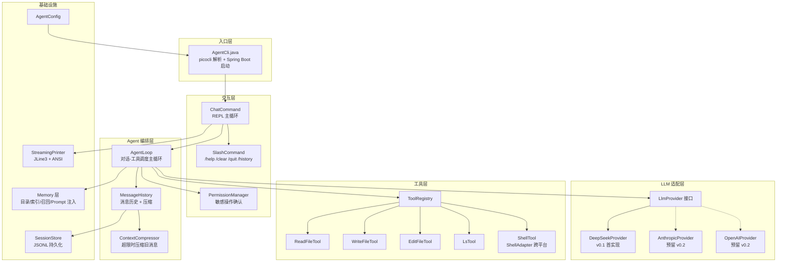
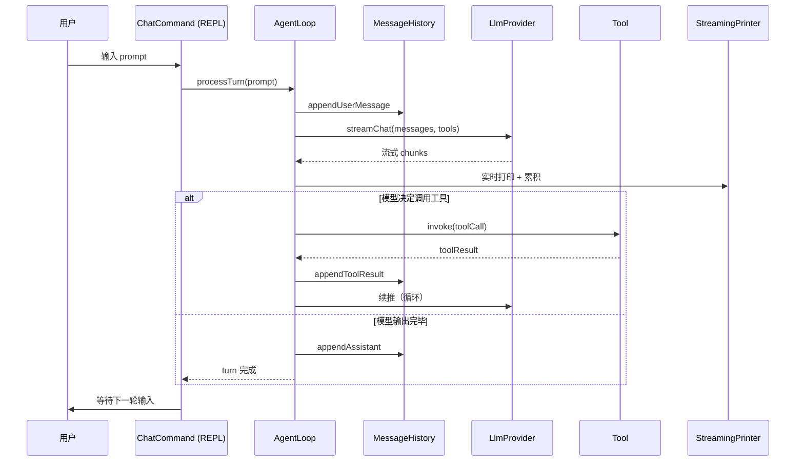

# agent-demo

> Java 编写的 Claude Code 风格 Agent CLI。第一阶段独立调 LLM API（DeepSeek），后续可扩展多 Provider。

---

## 1. 项目定位

在终端里与 LLM 协作：流式对话、调用本地工具（读文件、执行命令）、多步自主完成任务、会话持久化到本地。

| 维度 | 设计取向 |
|------|----------|
| 集成方式 | 独立调 LLM API（不依赖 dsh / Claude Code 进程） |
| 目标用户 | 习惯终端、追求可控与可观测的开发者 |
| 模型支持 | 多 Provider 抽象层，v0.1 首实现 DeepSeek（OpenAI 兼容协议） |
| 能力范围 | Claude Code 核心能力集：流式对话、工具调用、权限确认、会话持久化、Memory |

> 与 Claude Code 的关系：本项目独立实现，借鉴其成熟的工程模式（Tool 协议对象、append-only JSONL 会话、compact 熔断、`MEMORY.md` 索引）。**不依赖 Claude Code 运行时**，不调用其 API。

---

## 2. 核心特性（v0.1）

- ✅ REPL 交互：连续多轮对话、流式输出（边生成边打印）
- ✅ 工具调用：`ReadFile` / `WriteFile` / `EditFile` / `Ls` / `Shell`，自动执行并回流结果
- ✅ 权限确认：写文件与命令执行需要用户交互确认（默认 allow-read, ask-write）
- ✅ 会话持久化：JSONL append-only 格式保存到 `~/.agent-demo/sessions/`（v0.1 仅保存，v0.2 支持 resume）
- ✅ Slash 命令：`/help` `/clear` `/quit` `/history` `/resume` `/model`
- ✅ Memory 记忆：长期记忆写入 `~/.agent-demo/memory/`，下次会话按相关度自动召回
- ✅ 上下文压缩：128K 上限前自动触发 compact，失败熔断防止死循环
- ✅ 错误重试：网络 / 5xx / 429 自动重试；401 立即停止，REPL 打印友好提示（key 未设 / 失效 / 网络 / 限流）后继续等待输入而非退出进程
- ✅ Ctrl+C 中断：第一次优雅取消当前生成、第二次（500ms 内）强制退出
- ✅ 跨平台：Windows / Linux / macOS；中文编码三重防御（GBK↔UTF-8 回退）
- ✅ 成本可见：每轮 token 累计，`/history` 显示估算费用，达到阈值告警 / 停止

---

## 3. 技术栈

| 类别 | 选型 | 版本 | 理由 |
|------|------|------|------|
| JDK | OpenJDK | 17 | 与 `rocketmq-demo` 保持一致 |
| 框架 | Spring Boot | 3.2.x | 同上 |
| HTTP | Spring WebFlux `WebClient` | 6.1.x | 原生支持 SSE 流式响应 |
| CLI | picocli | 4.7.x | 注解式，子命令 / 选项齐全 |
| JSON | Jackson | 2.15.x | Spring Boot 默认 |
| 终端 | JLine3 | 3.25.x | raw mode、历史、自动补全 |
| 构建 | Maven | 3.9.x | 与现有项目一致 |

> **不引入 Lombok、spring-boot-starter-web、数据库**——CLI 不需要 servlet 容器，v0.1 JSON 文件存会话足够。

---

## 4. 快速开始

### 4.1 构建

```bash
mvn clean package -DskipTests
```

产物：`target/agent-cli.jar`（fat jar，约 15 MB，可直接执行）。

### 4.2 初始化配置

```bash
java -jar target/agent-cli.jar init
```

在 `~/.agent-demo/config.yaml` 生成默认配置：

```yaml
provider:
  type: deepseek
  apiKey: REPLACE_ME       # 改为你的 DeepSeek API key
  baseUrl: https://api.deepseek.com
  model: deepseek-chat
```

> 推荐用环境变量覆盖 API key：`export DEEPSEEK_API_KEY=sk-...`
>
> 优先级：环境变量 > `~/.agent-demo/config.yaml` > `application.yml` 内置默认值。
>
> **401/网络错误**：单次 LLM 调用失败 REPL 不退出进程，会打印友好提示（"key 未设或失效 / baseUrl 错 / 限流 / 网络问题"）后继续等待输入。`/clear` 可清空历史重试。

### 4.3 启动交互

```bash
# 类 Unix
java -jar target/agent-cli.jar chat

# 或用 launcher 脚本（推荐，自动设置 UTF-8）
./bin/agent chat
```

Windows CMD：

```bat
bin\agent.bat chat
```

启动后进入 REPL：

```text
> 你好
模型：你好！有什么我可以帮你的？
> /history
会话 #1 | 模型: deepseek-chat | 累计 token: 124 in / 89 out | 估算费用: ¥0.0006
> /quit
```

### 4.4 命令行参数

```bash
agent chat --model deepseek-reasoner
agent chat --system-prompt "你是一名资深 Java 工程师"
agent chat --api-key sk-...               # 仅本次覆盖
agent chat --input "读 ./README.md"      # E2E 测试：一次性注入输入
agent chat --auto-approve-write          # E2E 测试：跳过写权限确认
```

### 4.5 Slash 命令

| 命令 | 行为 | 输出示例 |
|------|------|----------|
| `/help` | 列出可用命令 | `可用命令: /help /clear /quit /history /resume /model` |
| `/clear` | 清空当前会话历史（保留 session 文件） | `[已清空会话历史]` |
| `/quit` | 退出 REPL（exit code 0） | （无输出） |
| `/history` | 显示累计 token + 估算费用 | `消息数: 12 \| 累计 token: 345 in / 678 out \| 估算费用: ¥0.0061` |
| `/resume` | 从 `~/.agent-demo/sessions/` 加载最近 session（按 mtime），整体替换当前 history | `[/resume] 已恢复 N 条消息` / `[/resume] 当前无可恢复会话` |
| `/model` | 列出当前 model + 支持的 model 列表（无参数） | `当前 model: deepseek-chat`<br/>`支持: deepseek-chat, deepseek-reasoner` |
| `/model <name>` | 运行时切换 model（下一轮 LLM 调用生效）| `[/model] 切换到 deepseek-reasoner` |
| 其他 `/xxx` | 未知命令 | `[未知命令] 输入 /help 查看可用命令` |

> **/resume 注意**：
> - 按文件 mtime 排序选最新（不是文件名），更鲁棒
> - 找不到任何 session 文件 → 静默提示 "无历史会话"，不报错
> - 替换（不是合并）history，避免双 session 数据混淆

> **费用估算**：v0.1 硬编码 DeepSeek-chat 定价（输入 2 元/M tokens、输出 8 元/M tokens）。
> v0.2 改为读 `~/.agent-demo/config.yaml` 的 `cost.prices.{model_id}` 配置。

---

## 5. 权限与危险操作

默认策略：

| 操作 | 默认决策 | 提示样式 |
|------|---------|----------|
| 读文件 / 列目录 | allow | 不提示 |
| 写文件 / 编辑文件 | ask | 显示路径与变更预览，`y/n/a`（a = 始终允许本次会话） |
| 执行命令 | ask | 显示完整命令 + 危险等级评估 |

跨平台危险命令黑名单（无论权限策略都会二次确认）：

- 类 Unix：`rm -rf /`、`mkfs`、`dd if=...of=/dev/...`、`chmod -R 777 /`、`shutdown`、`reboot`
- Windows：`format`、`rd /s /q C:\`、`del /f /s /q C:\*`、`diskpart`、`bcdedit`、`reg delete HKLM`

> 实际匹配语义与完整黑名单见 [`docs/design/design.md` §6.6](./docs/design/design.md)。

---

## 6. 配置文件速览

`~/.agent-demo/` 目录结构：

```text
~/.agent-demo/
├── config.yaml          # 主配置（API key、模型、token 上限、权限策略、成本阈值）
├── memory/              # 长期记忆
│   ├── MEMORY.md        # 索引文件（≤200 行 / 25 KB）
│   └── *.md             # 单条记忆文件
├── sessions/            # 会话历史（JSONL append-only）
│   └── 2026-08-26T10-23-45-{uuid}.jsonl
├── cache/               # 临时缓存
└── logs/                # agent.log
```

详细配置项（含 provider 切换、cost 限额、shell 黑名单）见 [`docs/design/design.md` §9](./docs/design/design.md)。

---

## 7. 架构概览



**一次提问的数据流**：



---

## 8. v0.1 范围与边界

### 8.1 做什么

见上文 §2 核心特性 + §14 验收清单（14 项）。

### 8.2 不做什么（v0.1 边界）

- ❌ 不依赖 dsh / Claude Code 进程
- ❌ 不做 Web UI
- ❌ 不做 Subagent / Hooks / Skills 系统（v0.3+）
- ❌ 不做插件市场、远程协作
- ❌ 不做 Team Memory / Memory Snapshot（v0.2+）
- ❌ 不做 Session Memory Compaction hook（v0.2）
- ❌ 不做动态 provider 切换（v0.2+）

---

## 9. 里程碑（v0.1）

| 里程碑 | 周期 | 交付物 |
|--------|------|--------|
| M0 脚手架 | 1 天 | Maven + Spring Boot + picocli |
| M1 Provider | 1 天 | `DeepSeekProvider` + SSE + `stream_options.include_usage` + JTokkit |
| M2 Agent 核心 | 2 天 | `AgentLoop` + `MessageHistory` + 流式打印 + Ctrl+C |
| M3 工具层 | 2 天 | 5 个基础工具 + `ToolRegistry` + 权限确认（含跨平台黑名单） |
| M4 上下文压缩 | 2 天 | `ContextCompressor` + summary prompt + 熔断 |
| M5 Memory | 1.5 天 | `MemoryDir` + `MemoryIndex` + `MemoryRecall` |
| M6 会话存储 | 1 天 | JSONL 持久化 + 关键节点 sync flush |
| M7 错误处理 | 0.5 天 | `LlmRetry` 重写 + 超时控制 |
| M8 Slash 命令 | 0.5 天 | `/help` `/clear` `/quit` `/history` |
| M9 配置与启动 | 0.5 天 | config 加载 + `init` 子命令 + launcher + README |
| M10 E2E 测试 | 1 天 | 验收清单 #1–#14 全部通过 |
| **总计** | **~12 天** | 可用 v0.1 |

---

## 10. 后续版本预览

| 版本 | 重点 |
|------|------|
| **v0.2** | `/resume` `/model` 切换、Lite reader、Memory 自动提取、3 scope 完整、Session Memory Compaction、`deepseek-reasoner` 思维链渲染 |
| **v0.3** | MCP 客户端、Skills 系统、Subagent、Resume 链路修复、Memory Snapshot、Relevant Recall 升级 sideQuery |
| **v1.0** | Team Memory、远程同步、Worktree 模式、Plugin 系统、Prompt Cache 复用 |

---

## 11. 详细设计文档

完整设计（含模块拆分、数据契约、错误处理重试边界、Context 压缩机制、Memory 设计、Windows 编码三重防御、Ctrl+C 信号处理等）见 [`docs/design/design.md`](./docs/design/design.md)。

参考的 Claude Code 源码解析：

- `AI-Agent/开源项目/Claude Code源码解析/analysis/04f-context-management.md` — 上下文管理与 Auto-Compact
- `AI-Agent/开源项目/Claude Code源码解析/analysis/04b-tool-call-implementation.md` — Tool 调用机制
- `AI-Agent/开源项目/Claude Code源码解析/analysis/04-agent-memory.md` — Memory 体系
- `AI-Agent/开源项目/Claude Code源码解析/analysis/04i-session-storage-resume.md` — 会话存储

---

## 12. 参与开发

```bash
# 克隆
git clone <repo> agent-demo
cd agent-demo

# IDE 导入（IntelliJ IDEA / VS Code + Extension Pack for Java）

# 本地测试（不需要真实 API key）
mvn test -Dtest=DeepSeekProviderTest   # 用 WebTestClient 模拟 SSE

# 调试
mvn spring-boot:run -Dspring-boot.run.arguments="chat --model deepseek-chat"

# 查看完整日志
tail -f ~/.agent-demo/logs/agent.log
```

---

> **License**：MIT
> **状态**：设计阶段（M0 之后进入编码）

## 13. Web UI (v0.1)

agent-demo v0.1 含 React 18 + Vite 6 Web UI, 与 CLI 并存.

启动:

```
# 终端 A: 后端 (web profile)
mvn -pl agent-core spring-boot:run -Dspring-boot.run.profiles=web

# 终端 B: 前端
cd agent-web/frontend
npm run dev
```

打开 http://localhost:5173/ 看 UI. vite.config.ts 的 proxy 配置把 `/api/*` 转发到 :18080.

生产一体化构建 (前端 dist 嵌入 jar):

```
mvn -pl agent-web clean package
java -jar agent-web/target/agent-web.jar
```

默认绑 127.0.0.1:18080 (loopback). 改 application-web.yml 暴露到 LAN, 或加 `--agent.web.trusted-hosts=192.168.1.0/24`.

SSE 事件流: 后端用 7 种事件 (`message_start / message_delta / tool_call_start / tool_call_end / permission_request / message_stop / error`) 推模型输出, 工具调用, 权限请求. 完整 schema 见 `docs/design/web-ui-design.md`.

v0.1 限制: SessionStore / currentSession 端点占位, /resume / /history 静态文本. v0.2 才上正式 permission UI (modal 模态框) + session 历史 + settings.
