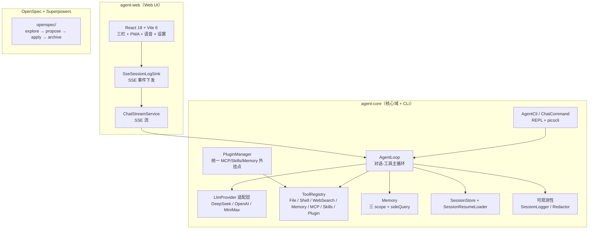
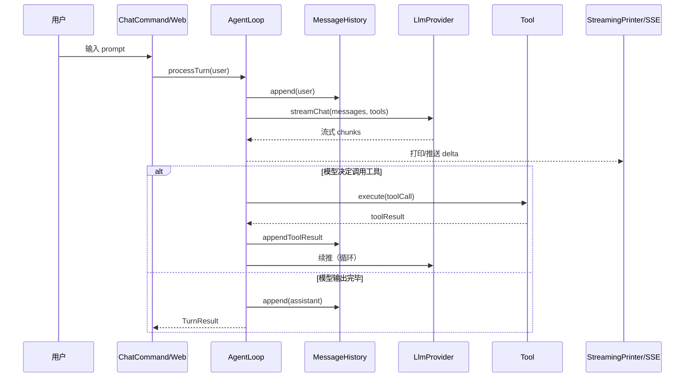
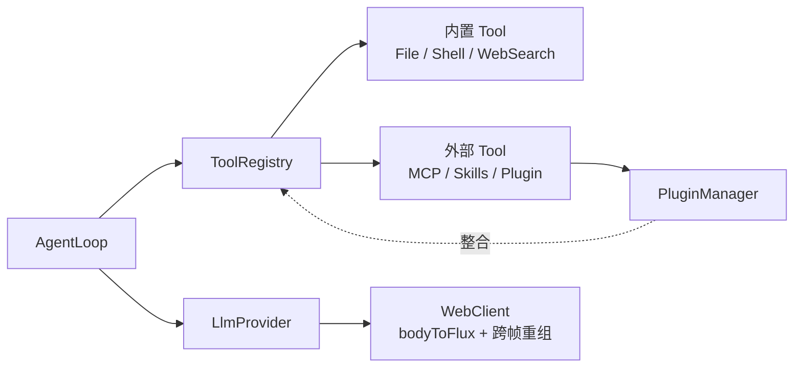
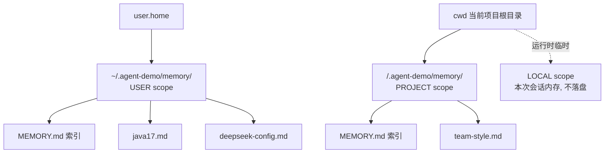
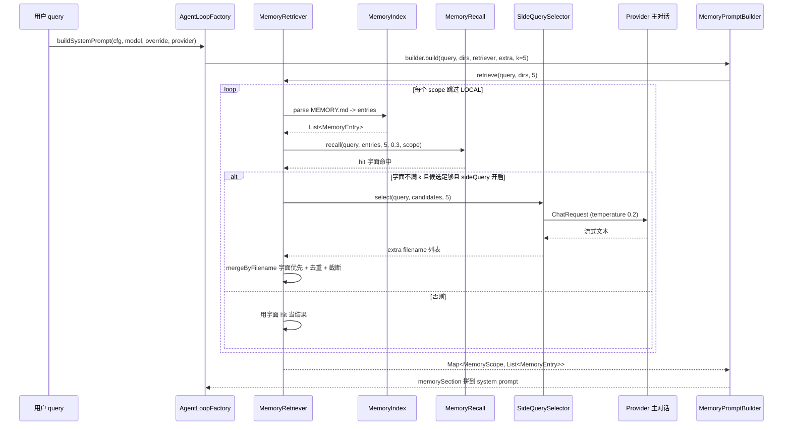
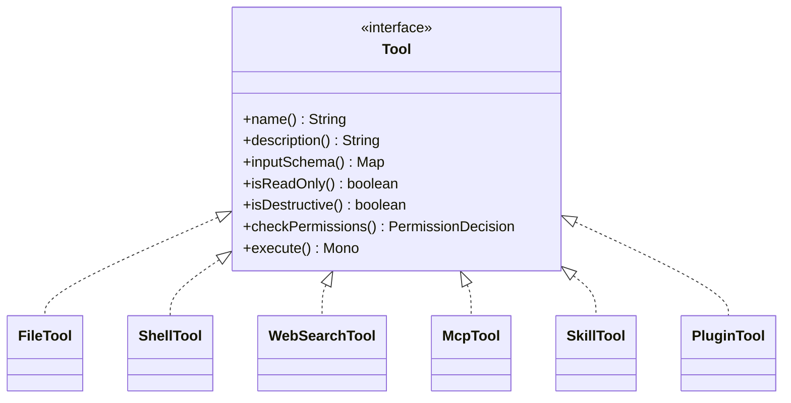
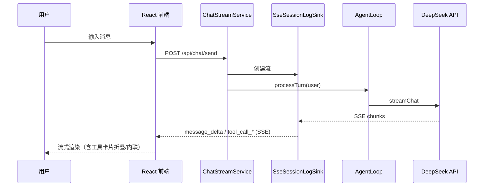
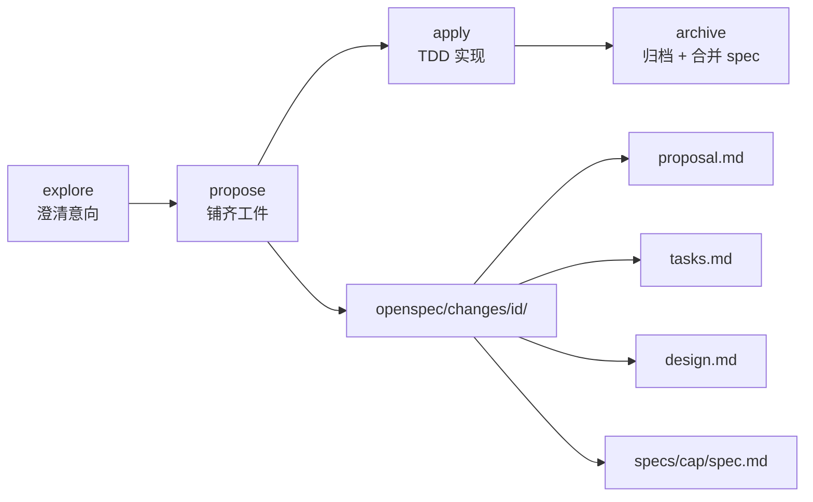

# agent-demo

> Java 编写的 Claude Code 风格 Agent CLI + Web UI。阶段迭代：v0.1（CLI REPL）→ v0.2（resume / model 切换）→ v0.3（Web UI + 可观测）→ v0.4（MCP / Skills / Worktree / Memory 三 scope / sideQuery）→ v1.0（Plugin 框架 + 多工作区 + 工具调用 UI）→ v1.1（流式 + 渲染 + PWA + 语音加固 + 可观测加固 + 设置）。

- 设计：`docs/design/design.md`（技术设计）
- 架构详解：`docs/guides/architecture.md`（Mermaid 图）
- 流式架构：`docs/streaming-architecture.md`（真流式改造）
- 语音架构：`docs/voice-architecture.md`（三层回声 + partial 状态机）
- PWA 架构：`docs/pwa-architecture.md`
- 推理过程：`docs/reasoning-thinking.md`
- 模型下拉：`docs/model-and-effort-dropdown.md`
- 测试文档：`docs/test-agent-demo/`（每批四件套 + test-guide 登记）
- 实施计划：`docs/superpowers/plans/2026-08-26-agent-cli-v0.1.md`
- 迭代流程：**OpenSpec**（`openspec/`，见 `AGENTS.md` §2.5）—— 默认所有功能改动走四阶段（explore → propose → apply → archive）；详细执行纪律见 `docs/process/open-spec-superpowers-bridge.md`

---

## 1. 项目定位

在终端或 Web 里与 LLM 协作：流式对话、调用本地工具（读文件、执行命令、网络搜索、记忆、MCP 工具、技能、插件扩展）、多步自主完成任务、会话持久化到本地。也可通过 Web UI（`agent-web` 模块）获得 DeepSeek Harness 风格的三栏交互界面。

| 维度 | 设计取向 |
|------|----------|
| 集成方式 | 独立调 LLM API（不依赖 dsh / Claude Code 进程） |
| 目标用户 | 习惯终端 + Web 的开发者；要求可控、可观测、可测试 |
| 模型支持 | 多 Provider：DeepSeek（默认）/ OpenAI 兼容 / MiniMax（中国版 OpenAI 兼容） |
| 能力范围 | 流式对话 / 工具调用 / 权限确认 / 会话持久化 / Memory / 网络搜索 / MCP / Skills / Plugin / Web UI / 可观测 / 日志脱敏 / PWA / 语音输入输出 / Mermaid / 富 Markdown / 多工作区 |
| 迭代 | OpenSpec 四阶段（默认所有功能改动走 explore → propose → apply → archive）+ Superpowers 微任务纪律 |

> 与 Claude Code 的关系：本项目独立实现，借鉴其成熟的工程模式（Tool 协议对象、append-only JSONL 会话、compact 熔断、`MEMORY.md` 索引）。**不依赖 Claude Code 运行时**，不调用其 API。

---

## 2. 总体架构

多模块 Maven：`agent-core`（核心域 + CLI）+ `agent-web`（Web UI）。



### 2.1 一次对话的数据流



### 2.2 核心依赖关系



> PluginManager 是 v1.0 引入的**统一外挂点**，把 MCP / Skills / Memory 三类外挂点收敛为可插拔 Plugin（add-plugin-system）。详见 §3.12。

---

## 3. 核心特性

按用户可感知的能力分 12 个主题。

### 3.1 CLI REPL（agent-core / picocli）

- ✅ **REPL 交互**：连续多轮对话、流式输出（边生成边打印；`OpenAiCompatibleProvider.bodyToFlux` + `SseLineBuffer` 跨 TCP 帧重组 — 真流式见 §10.1）
- ✅ **工具调用**：`ReadFile` / `WriteFile` / `EditFile` / `Ls` / `Shell` / `web_search`（DeepSeek 原生 + Tavily 双 provider 自动选择）；自动执行并回流结果；事件推送顺序已修为「工具先于文本」因果正确
- ✅ **工具扩展**：MCP 客户端工具、Skills 系统（USER + PROJECT 双级 `SKILL.md` frontmatter）、Plugin 插件框架（统一 MCP/Skills/Memory 外挂点）
- ✅ **权限确认**：写文件与命令执行需用户交互确认（默认 allow-read / ask-write）；敏感路径 / 危险命令强制 ask / 二次确认（黑名单归一化 basename + 短参数簇展开）
- ✅ **会话持久化**：JSONL append-only 写到 `~/.agent-demo/sessions/`；`/resume` 加载最近 session（含 snip 裁剪 + `assistant.tool_calls` / `tool_call_id` 完整保留）
- ✅ **Slash 命令**：`/help` `/clear` `/quit` `/history` `/resume` `/model` `/model <name>` `/effort <low|medium|high>`
- ✅ **Memory**：三 scope（USER / PROJECT / LOCAL）+ sideQuery 语义召回（替代字面重叠）
- ✅ **上下文压缩**：128K 上限前自动 compact，失败熔断防死循环
- ✅ **错误重试**：网络 / 5xx / 429 自动重试；401 / 404 / 限流 / 网络错友好提示并继续 REPL
- ✅ **错误边界**：`throwIfFatal` 误判 / `CancelledError` / `StreamCorruptedException` 兜底
- ✅ **Ctrl+C 中断**：第一次优雅取消、第二次（500ms 内）强制退出
- ✅ **跨平台**：Windows / Linux / macOS；中文编码三重防御（GBK↔UTF-8 回退）
- ✅ **成本可见**：每轮 token 累计，`/history` 显示估算费用（按 model 从 `AgentConfig.cost()` 读），阈值告警 / 停止
- ✅ **WebClient 显式超时**：`responseTimeout=60s` / `connectTimeout=10s`（修 DeepSeek hang 卡住）

### 3.2 Web UI 基础（agent-web）

- ✅ **三栏布局**对齐 DeepSeek Harness（侧栏 + 主对话 + 顶栏）
- ✅ **SSE 流式**：7 种事件类型（`message_start` / `message_delta` / `tool_call_start` / `tool_call_end` / `permission_request` / `message_stop` / `error`）
- ✅ **真流式**：HTTP 层 `bodyToFlux(DataBuffer)` + `SseLineBuffer` 跨 TCP 帧重组 + `SseSessionLogSink` 逐 token 透传；TTFT 从 837ms 降至 <100ms（WireMock 800ms 延迟实测）
- ✅ **侧栏真实会话列表 + 点击切换加载历史**
- ✅ **会话重进恢复**：落盘 `~/.agent-demo/workspaces/<name>/sessions/` + 刷新/重启后回填
- ✅ **多工作区 + 会话重命名**：每个工作区是真实运行目录，会话在独立目录落盘；重命名写 `<id>.meta.json` 侧车
- ✅ **会话管理**：前 5 条 + 展开其余 + 软删除（归档）/ 恢复
- ✅ **会话统计状态栏**：轮数 · 步数 | LLM 耗时 · 工具耗时 | 首 token 平均 · tok/s | 缓存命中 | 输入输出 token；SSE `turn_stats` 实时刷新，首屏/resume 用 `GET /api/sessions/{id}/stats` 回填

### 3.3 工具调用展示

- ✅ **事件顺序**：工具先于文本推送（`SseSessionLogSink.onAssistant` 固定先发 `tool_call_*` 再发 `message_delta`），UI 因果正确
- ✅ **内联排布**：工具调用按发生位置插入 assistant 时间线（不是堆末尾）；同一次调用只渲染一张卡（与 `mapHistoryToItems` 历史重建一致）
- ✅ **卡片折叠**：默认收起，点击展开/收起
- ✅ **dangling tool_calls 修复**：`assistant.tool_calls` 必须紧跟 `tool` 消息（DeepSeek 400 修复）

### 3.4 渲染能力

- ✅ **真流式文本 + reasoning 折叠**：`deepseek-reasoner` / OpenAI o1 / Anthropic Claude thinking 实时推流，前端可折叠区块显示推理内心独白
- ✅ **富 Markdown**：GFM 表格 / 删除线 / 任务列表、KaTeX 公式（双美元块）、`rehype-highlight` 代码高亮、远程与本地图片（新增 `GET /api/fs/raw`，中文文件名 RFC 5987 + CSP `sandbox` 头）、原始 HTML 安全基线、`useDeferredValue` 流式时序
- ✅ **Mermaid 围栏渲染成图**：rehype 改写把 `language-mermaid` 围栏换 `<mermaid-block>` 自定义标签 + 运行时按需懒加载 + `securityLevel: 'strict'` + 恒定深色 + 闭合判定 + 失败兜底 + PWA 预缓存白名单收敛（避免随库膨胀）
- ✅ **模型下拉 + 思考强度**：UI 下拉切换 model + 思考强度（low/medium/high）跨会话持久化（localStorage），reasoning 模型自动注入；CLI 配套 `/effort` 命令
- ✅ **权限模式 4 档 dsh 命名**：Plan / Ask / Danger Full / Don't Ask，会话内生效无持久化（默认 Plan）；与后端 `SandboxMode` 4 档对齐（旧 `read_only` / `workspace_write` / `full_access` 启动时自动 normalize + INFO 日志 + 写回 settings.yaml）

### 3.5 PWA & 离线

- ✅ **完整 PWA**：manifest 注册（192x192 + 512x512 + maskable icon）+ Workbox SW（`/assets/*` CacheFirst + `/index.html` NetworkFirst + `/api/**` NetworkOnly）+ 离线 UI（Snackbar + Composer 禁用 + 路由级 fallback）+ 新版本检测（auto skipWaiting + 立即刷新）+ HTTPS 自签证书支持
- ✅ **预缓存白名单**：Vite 按需 chunk（mermaid / katex / elk 等）按 `globPatterns` 白名单收敛，避免安装体积随依赖膨胀
- ✅ **前端产物不入库**：`static/` 是构建产物（chore），每次 `npm run build` 按内容 hash 重写文件名；`mvn verify` 通过 `frontend-maven-plugin` 自动同步到 `target/classes/static/`

### 3.6 语音（Vosk 离线 + 浏览器 TTS）

- ✅ **语音输入 / 播放 / 自由语音对话**：Vosk `vosk-model-small-cn` 离线 WASM STT（无需网络）+ 浏览器原生 TTS；完全离线、零后端改动、永久免费
- ✅ **三层回声防护**：时序 `ECHO_GUARD_MS=1500`（Vosk final 在 TTS 结束后 1.5s 才接受）+ 状态 `isSpeaking()` + 内容字符重合 `ECHO_OVERLAP_THRESHOLD=0.75`（高阈值减漏判）
- ✅ **TTS 朗读改进**：流式聚合韵律（不再一字一字念）+ emoji / markdown 标记清洗（emoji 不被念成名称，**加粗** / `code` / URL 不被消费）
- ✅ **partial 状态机**：Vosk partial result 暴露给 UI；连续 3 次相同 / 2s 超时触发提交 + Vosk final 去重（`submittedRef` 防重复）
- ✅ **后端 DeepSeek 纠错端点**：`POST /api/chat/voice-correction`，1500ms 超时 + 5min SHA-256 缓存 + sessionId 令牌桶（5 req/s → 429）+ 启动门禁（`voice.postProcess.enabled=true` 但 DeepSeek key 缺失 → 启动失败）
- ✅ **Composer partial UI**：输入框正上方半透明灰色斜体小字显示 Vosk 实时识别；纠错中显示「纠错中...」占位

### 3.7 工作区选择器（6 个 change 迭代）

- ✅ **浏览器内文件树**（add-workspace-picker-modal）：左侧导航树 + 右侧文件列表
- ✅ **DSH 风格 modal**（polish-workspace-picker-dsh-style）：顶部 ←/→/↑ + 面包屑 + 列头排序 + 底部路径框
- ✅ **OS native 选择**（native-folder-picker）：调起 PowerShell `FolderBrowserDialog` / `osascript` / `zenity`
- ✅ **async 化**（picker-async）：task_id 轮询 + reveal 备选 + Esc abort
- ✅ **DSH Menu + Flow Slot**（picker-dsh-flow）：点 + 弹菜单 → 选 "Add workspace..." → 关闭菜单 + 打开 native chooser
- ✅ **纯路径输入**（picker-reveal-only）：取消 OS dialog，纯路径输入 + reveal 复制
- ✅ **picking 提示**（fix-picker-hint）：picking >3s 显示「检查任务栏 / 手动输入」提示

### 3.8 设置面板

- ✅ **设置基础设施**：REST（`/api/settings/*`）+ SSE 热重载（`/api/settings/events` 跨标签同步）+ `useSettingsStore` + localStorage 持久化
- ✅ **通用设置项**（4 项）：外观（主题）/ 权限（默认模式）/ 语言（提示语言）/ Enter 行为（Enter 发送 vs 换行） + 「在文件管理器中显示」按钮
- ✅ **设置菜单占位**（4 项）：通用 / 模型 / 插件 / Agent 预设
- ✅ **主题切换**：TopBar 单图标按钮（Sun / Moon 动态切换）+ Popover 三卡片（浅色 / 深色 / 跟随系统）

### 3.9 网络搜索

- ✅ **双 provider 自动选择**：`DeepSeekWebSearchProvider`（Anthropic Messages API 兼容 + `web_search_20250305` 服务器工具 + 严格模式响应）+ `TavilyWebSearchProvider`；按 `cfg.search().provider()` 显式优先，未配置按模型推断（`type=deepseek` 或模型名 `deepseek*` → deepseek，否则 → tavily）
- ✅ **不阻塞 event loop**：`Schedulers.boundedElastic()` 隔离（修 `block() are not supported in thread reactor-http-nio-9`）
- ✅ **key 优先级与主对话一致**：`DEEPSEEK_API_KEY` env > `agent.provider.api-key` yaml > `cfg.provider().apiKey()`（web 场景下用 env-merged key 注入）

### 3.10 可观测 & 测试隔离

- ✅ **全链路日志**：上下文 / 重试 / 权限 / 压缩等系统级动作（session.jsonl + chat.log + thinking.log + tools.log）
- ✅ **故障可观测**：cause 链路完整保留 + 关键上下文（会话 ID / 操作类型 / 配置快照）
- ✅ **测试数据隔离**：集成测试写到 `target/test-agent-demo-tmp/`，跑完自动清理；不污染用户 `~/.agent-demo/`
- ✅ **工具错误边界**：`throwIfFatal` 误判 / `CancelledError` / `StreamCorruptedException` 兜底

### 3.11 超期会话自动归档

- ✅ **自动归档**：最后活动（mtime）> 保留期（默认 7 天）的会话自动移入 `.archive/`（软删除、可恢复）
- ✅ **调度**：应用启动后立即整理一次 + 之后每 6h 一次；正在对话的会话跳过
- ✅ **时间分档**：归档视图按相对天数分档 — 最近归档（<7 天）/ 上周（7-14）/ 本月（14-30）/ 更早（30+），后端按天数计算与保留期阈值同源

### 3.12 Plugin 插件框架

- ✅ **统一外挂点**（add-plugin-system）：把 MCP / Skills / Memory 三类外挂点收敛为可插拔 Plugin（`PluginManager.init()` 串行 init，关闭反序 close）
- ✅ **Plugin 生命周期**：`Plugin.init(PluginContext)` → `close()`；`ExtensionPoints` 提供 `Memory` / `Skills` / `Mcp` 等接入点
- ✅ **配置驱动**：`AgentConfig.plugins[]` 在 `~/.agent-demo/config.yaml` 的 `plugins` 段声明，每条 `className + config` 自描述

### 3.13 Memory 三 scope + 语义召回

- ✅ **三 scope 隔离**：USER（`~/.agent-demo/memory/`，跨项目共享）/ PROJECT（`<cwd>/.agent-demo/memory/`，随仓库）/ LOCAL（本次会话临时，不落盘、不参与跨会话召回）
- ✅ **MEMORY.md 索引**：每行 `- [标题](文件名) — 描述`，只存 title+filename+一行描述；正文在 `.md` 单文件里，由模型按需用文件工具读取
- ✅ **两阶段混合召回**：字面 token 重叠（永远）+ LLM 二次筛选（sideQuery，可选）
- ✅ **失败静默降级**：sideQuery 任一环节异常都退化为纯字面，**绝不**让记忆层故障影响主对话
- ✅ **v0.1 升级路径**：v0.3 计划切到 embedding 粗排 + LLM 精排的 hybrid retrieval（见 §3.13.5）

#### 3.13.1 三 scope 目录布局



#### 3.13.2 一次召回的数据流



#### 3.13.3 评分公式与 sideQuery 触发条件

字面召回：`score = |query tokens ∩ entry tokens| / |entry tokens|`，阈值 0.3，按分数降序取 top k。**分母是 entry token 数**，让短 query + 长 description 的 entry 容易命中。

sideQuery 触发（**三个条件全部满足**才发 LLM 调用）：

| 条件 | 默认 | 作用 |
|------|------|------|
| `hit.size() < k` | k = 5 | 字面没召回满，**值得再花一次 LLM 调用** |
| `entries.size() >= minCandidates` | minCandidates = 3 | 候选池太少时 LLM 没得挑 |
| `sideQuery.enabled()` | true | 配置开关 |

#### 3.13.4 失败降级链（5 个降级点都不阻塞主对话）

| # | 降级点 | 触发 | 降级动作 |
|---|--------|------|---------|
| 1 | `provider == null` | `buildSystemPrompt` 没传 provider | 跳过 sideQuery，纯字面 |
| 2 | `sideQuery == null` 或 `enabled = false` | 配置缺失 / 关闭 | 跳过 sideQuery，纯字面 |
| 3 | `hit.size() >= k` | 字面已召回满 | 跳过 sideQuery |
| 4 | `entries.size() < minCandidates` | 候选太少 | 跳过 sideQuery |
| 5 | LLM 调用 / 解析异常 | 网络错 / 超时 / 格式错 | `catch (Exception)` 返回空列表 |

#### 3.13.5 关键设计决策与升级路径

| 维度 | v0.1 现方案 | v0.3 计划（hybrid retrieval）|
|------|------------|------------------------------|
| 字面召回 | token 重叠（永远） | 保留做兜底 |
| 语义召回 | LLM 二次筛选（一次小调用） | embedding 粗排 top N + LLM 精排 |
| 额外成本 | 每次 1 次小 LLM 调用（~500 token） | embedding 计算（本地）+ 1 次小 LLM |
| 离线可跑 | 是 | 是（需本地嵌入模型） |
| 失败行为 | 静默降级 | 静默降级 |

**为什么不用 embedding 向量召回**：embedding 路线需要本地模型（BGE-small ~100MB）或远程 API；当前用 chat 模型当 reranker，零依赖、可解释、与主对话模型一致。`MemoryRecall.java` 的 JavaDoc 已写明「embedding 见 design.md v0.3 升级路径」。

**为什么字面优先不替换**：避免 LLM 幻觉（模型可能选"看起来相关但其实不沾边"的条目）覆盖字面真正命中的；字面信号是硬命中，LLM 只填空。

#### 3.13.6 配置项

`~/.agent-demo/config.yaml`：

```yaml
memory:
  sideQuery:
    enabled: true        # 是否启用 LLM 二次筛选
    maxCandidates: 8     # sideQuery 时送给 LLM 的候选上限
    minCandidates: 3     # 候选池至少几条才启用 sideQuery
  recallMinScore: 0.3    # 字面评分阈值
```

源码入口：`AgentLoopFactory.buildSystemPrompt(cfg, model, override, provider)`（`core/AgentLoopFactory.java:161`）；详细设计见 `docs/design/memory-design.md`。

---

## 4. 工具扩展体系

工具统一走 `Tool` 协议（Fail-Closed 默认）。三类扩展点：MCP 客户端、Skills、Plugin 插件。



> Mermaid 8.x classDiagram 泛型支持有限，`Tool` 泛型参数此处省略；完整契约见源码 `Tool.java`。

| 扩展点 | 配置位置 | 协议 | 典型用例 |
|--------|----------|------|----------|
| **MCP** | `~/.agent-demo/config.yaml` `agent.mcp.servers[]` | MCP（Model Context Protocol）| 数据库 / 浏览器 / 第三方 API |
| **Skills** | `~/.agent-demo/skills/<name>/SKILL.md` + `cwd/.agent-demo/skills/` | frontmatter + Markdown 指令卡 | 可复用的指令 / 流程卡片 |
| **Plugin** | `agent.plugins[]` | Java SPI | Team Memory 远程同步 / Prompt Cache |

---

## 5. 技术栈

| 类别 | 选型 | 版本 | 理由 |
|------|------|------|------|
| JDK | OpenJDK | 17 | |
| 框架 | Spring Boot | 3.2.5 | |
| HTTP | Spring WebFlux `WebClient` | 6.1.x | 原生支持 SSE |
| CLI | picocli | 4.7.6 | |
| 终端 | JLine3 | 3.25.1 | raw mode + 历史 |
| Token | JTokkit | 0.6.1 | |
| 构建 | Maven | 3.9 | 多模块 |
| 测试 | JUnit 5 + Mockito + WireMock + Reactor Test | — | |
| 前端 | React 18 + Vite 6 + TypeScript | — | agent-web/frontend |
| 前端-渲染 | Mermaid 11 + KaTeX + react-markdown + rehype-highlight + DOMPurify | — | |
| 后端-语音 | Vosk `vosk-model-small-cn`（本地化到 `agent-web/frontend/public/vosk/`）| — | 离线 WASM STT |
| 日志 | SLF4J + Logback + 自研 Redactor | — | 敏感字段脱敏 |

> **不引入 Lombok、spring-boot-starter-web、数据库**——CLI 端 JSON 文件存会话；agent-web 端 WebFlux + 文件/内存。

---

## 6. 项目结构（多 module）

```text
agent-demo/
├── pom.xml                          # 多 module 聚合（agent-core + agent-web）
├── AGENTS.md                        # 项目级规则（含 OpenSpec 流程 §2.5 + 合并门禁 §2.7.5 + 外部源码参考 §2.8）
├── agent-core/                      # 核心域 + CLI
│   ├── pom.xml                      # finalName=agent-cli；exec classifier 打可执行 fat jar
│   └── src/main/java/com/example/agent/
│       ├── AgentCli.java            # picocli 路由 + Spring Boot 启动
│       ├── core/                    # AgentLoop / MessageHistory / ContextCompressor / TurnResult / exception
│       ├── cli/                     # ChatCommand + SlashCommand + InitCommand + Completion
│       ├── llm/                     # LlmProvider / StreamChunk / ChatRequest / LlmRetry / TokenEstimator
│       ├── provider/                # deepseek / openai / minimax
│       ├── tools/                   # Tool + ToolRegistry + AbstractFileTool
│       │   ├── file/                # ReadFile / WriteFile / EditFile / Ls
│       │   ├── shell/               # ShellTool + Adapters + DenylistMatcher
│       │   └── websearch/           # WebSearchTool + DeepSeek/Tavily + ProviderFactory + TaskStore
│       ├── mcp/                     # McpClient / McpTool
│       ├── skill/                   # Skill / SkillCatalog / SkillTool
│       ├── plugin/                  # PluginManager / PluginContext / ExtensionPoints + {mcp,skill,memory}
│       ├── worktree/                # WorktreeManager
│       ├── permission/              # PermissionManager + PermissionPathMatcher + PermissionPolicy
│       ├── memory/                  # MemoryDir / MemoryIndex / MemoryRecall / MemoryPromptBuilder
│       ├── session/                 # SessionStore + SessionEntry + SessionResumeLoader + SessionArchiveService
│       ├── config/                  # ConfigLoader + AgentConfig（mcp/worktree/plugins/search/voice） + EnvKeys
│       ├── render/ prompt/ signal/ util/ log/
├── agent-web/                       # Web UI（独立 Spring Boot，端口 18080）
│   ├── pom.xml                      # finalName=agent-web；frontend-maven-plugin 打前端
│   ├── src/main/java/               # WebApplication + SessionController + ChatStreamService + SSELogSink
│   │                               # + LogController + WorkspaceController + WorkspacePickerController
│   │                               # + PickerTaskStore + VoiceCorrectionController + VoiceCorrectionService
│   │                               # + ModelsController + ModelCatalog + ProviderCatalogService
│   │                               # + SettingsController + WebRuntimeConfig
│   ├── src/main/resources/          # application-web.yml（agent.voice.post-process.enabled 等）
│   └── frontend/                    # React 18 + Vite 6（三栏 + SSE + 会话切换 + 渲染 + 语音 + PWA + 设置）
│       ├── src/
│       │   ├── components/          # ChatPanel / Composer / Sidebar / TopBar / WorkspacePickerModal
│       │   │                       # + SettingsModal / MermaidBlock / ThinkingCollapse / MessageBubble
│       │   │                       # + ReasoningEffortSelect / ModelSelect 等 22+ 测试覆盖
│       │   ├── lib/                 # useVoiceChat / voice.ts / voicePostProcess / VoiceApi / stt
│       │   │                       # + theme / session-restore 等
│       │   ├── api/                 # chat / workspace / fs / voice / settings 等
│       │   └── hooks/               # useSettingsStore
├── docs/                            # 设计 / 测试 / 架构文档
│   ├── design/                    # design.md / memory-design.md / logging-design.md / web-ui-design.md
│   ├── guides/                    # architecture.md / plugins.md / dsh-plugin-development.md
│   ├── streaming-architecture.md  # 真流式改造细节
│   ├── voice-architecture.md      # 三层回声 + partial 状态机
│   ├── pwa-architecture.md        # PWA 完整方案
│   ├── reasoning-thinking.md       # 推理过程流式
│   ├── model-and-effort-dropdown.md # 模型下拉
│   ├── process/open-spec-superpowers-bridge.md
│   ├── deploy.md
│   ├── superpowers/plans/
│   └── test-agent-demo/           # 每批四件套 + test-guide
├── openspec/                        # 迭代流程（change / specs / config.yaml）
├── bin/                             # launcher 脚本
└── target/                          # （gitignore）构建产物 + test-agent-demo-tmp 隔离目录
```

---

## 7. 快速开始

### 7.1 构建

```bash
mvn clean install
# agent-core/target/agent-cli.jar            （普通 jar）
# agent-core/target/agent-cli-exec.jar       （可执行 fat jar，含 Spring Boot）
# agent-web/target/agent-web.jar             （Web fat jar，含前端 dist）
```

### 7.2 配置 API key

四层优先级（详见 `docs/design/design.md` §9）：

1. CLI flag：`--api-key sk-...`
2. 环境变量：`DEEPSEEK_API_KEY` / `MINIMAX_API_KEY`
3. `~/.agent-demo/config.yaml`（`agent-demo init` 生成）
4. `application-local.yml`（gitignored，本地密钥；Spring 启动时通过 `agent.provider.api-key` 注入）

```powershell
$env:DEEPSEEK_API_KEY = "sk-your-key-here"
java -jar agent-core/target/agent-cli-exec.jar chat
```

### 7.3 启动 CLI REPL

```bash
java -jar agent-core/target/agent-cli-exec.jar chat
# 或 launcher（自动 UTF-8）
./bin/agent chat        # Windows: bin\agent.bat chat
```

### 7.4 启动 Web UI

```bash
# 后端（web profile，默认 127.0.0.1:18080）
mvn -pl agent-web clean package
java -jar agent-web/target/agent-web.jar

# 前端（开发模式）
cd agent-web/frontend && npm run dev   # http://localhost:5173
```

> 生产一体化：`mvn -pl agent-web clean package` 后 `java -jar agent-web/target/agent-web.jar`（前端 dist 已嵌入）。

---

## 8. REPL 命令

| 命令 | 行为 | 输出示例 |
|------|------|----------|
| `/help` | 列出可用命令 | `可用命令: /help /clear /quit /history /resume /model /effort` |
| `/clear` | 清空当前会话历史 | `[已清空会话历史]` |
| `/quit` | 退出 REPL | （无输出） |
| `/history` | 显示累计 token + 估算费用（按 model 读 config） | `消息数: 12 \| 累计 token: 345 in / 678 out \| 估算费用: ¥0.0061` |
| `/resume` | 加载最近 session（含 snip + tool_calls 保留） | `[/resume] 已恢复 N 条消息` |
| `/model` | 列出当前 + 支持 model | `当前 model: deepseek-v4-flash` |
| `/model <名>` | 运行时切换 model | `[/model] 切换到 deepseek-reasoner` |
| `/effort <low\|medium\|high>` | 切换思考强度（OpenAI o1 系列） | `[/effort] 切换到 medium` |
| 其他 `/xxx` | 未知命令 | `[未知命令]` |

---

## 9. 权限与危险操作

| 操作 | 默认决策 | 提示样式 |
|------|---------|----------|
| 读文件 / 列目录 | allow | 不提示 |
| 写 / 编辑文件 | ask | 路径 + 变更预览，`y/n/a` |
| 执行命令 | ask | 完整命令 + 危险等级评估 |

跨平台危险命令黑名单（强制二次确认）：类 Unix（`rm -rf /`、`mkfs`、`dd`、`shutdown` 等）；Windows（`format`、`diskpart`、`bcdedit` 等）。匹配语义（归一化 basename + 短参数簇展开）见 `docs/design/design.md` §6.6。

### 9.1 权限模式与 Sandbox Policy（rewrite-permission-mode-dsh；dsh 4 档对齐）

Web UI 输入区右下角有**权限模式下拉** + **设置面板**（持久化到 `general.permission.mode`），用于按会话或全局设定权限基准。**缺省 `plan`，仅会话内切换不写回 settings**：

| 模式 (dsh) | wire value | 读文件/列目录 | 写/编辑（工作目录内）| 写/编辑（工作目录外）| 执行命令 / 其它工具 | 敏感路径（`~/.ssh/**` 等）|
|------|---|:---:|:---:|:---:|:---:|:---:|
| **Plan** | `plan` | 放行 | 询问 | 询问 | 询问 | 询问 |
| **Ask** | `ask` | 放行 | 放行 | 询问 | 询问 | 询问 |
| **Danger Full** | `danger-full` | 放行 | 放行 | 放行 | 放行 | 放行 |
| **Don't Ask** | `dontAsk` | 放行 | 放行（自动） | 拒绝（仅 `writableRoots` 派生根：workspace + `/tmp` + `tmpdir`）| 放行 | 放行 |

**核心概念（对齐 dsh `SandboxPolicy`）**：

- **`SandboxPolicyService`** 单例（agent-core `permission` 包），每个 tool call 通过 `resolve(ctx, Capability)` 解析完整 `SandboxPolicy { mode, workspaceRoot, tempRoots, capability }`（per-call 解析粒度，mode 变化无需重建 AgentLoop）。
- **`writableRoots(policy)`** 单一派生函数：PLAN/ASK/DANGER_FULL 返回空列表（不 fence / 仅 workspace 内）；DONT_ASK 返回 `[workspaceRoot, /tmp, tmpdir]` 经 `Path.toRealPath()` canonicalize 去重（dsh one-home 原则：fs / bash / terminal 三能力共享，不会 drift）。
- **`FsDenialKind`** 5 种拒绝原因分类（READ_OUT_OF_BOUNDS / WRITE_OUT_OF_BOUNDS / SENSITIVE_PATH / TOOL_DENY / MODE_REJECTED），每种携带推荐 `suggestedMode`（WRITE_OUT_OF_BOUNDS → danger-full）。
- **TOCTOU 防护**：写之前 `Path.toRealPath()` re-canonicalize，捕获自工具解析以来发生的 symlink swap；`AbstractFileTool.writeWithCas` 用 tmp 文件 + `Files.move(ATOMIC_MOVE)` + 冲突 1 次 retry 实现乐观 CAS。
- **结构化拒绝反馈**：`PathResult.denied(kind, currentMode, suggestedMode, marker)`，前端渲染 `[sandbox: <kind> under <mode> mode]` marker + 同回合 escalate 升级按钮（点击调 `POST /api/chat/{id}/permission {mode, escalate:true}`，turn 结束自动恢复）。

**端点契约**：

- `POST /api/chat/send` 接受 `permission_mode` 字段（4 档 dsh 或 3 档旧命名均接受；旧值自动 normalize + 响应含 `effective_mode`）。
- `POST /api/chat/{stream_id}/permission` 接受 `mode` + `escalate: bool`；escalate=true 时临时升级、turn 结束自动恢复，响应含 `effective_mode`。
- 模式变更广播 SSE `sandbox/mode` 事件（`{ stream_id, from_mode, to_mode, reason, ts }`，reason 取 `initial` / `user_set` / `escalate` / `turn_end_restore`），同时落盘 session.jsonl 供审计。
- `SessionOwnerRegistry`（Q2 多用户防护）：send 时注册 `stream_id → owner_ip`，permission 切换时校验同 IP（异 IP 403 `ip_mismatch`）；`unknown` / 空 IP mock 兼容。

**旧 wire value 兼容**：`read_only` → `plan` / `workspace_write` → `ask` / `full_access` → `danger-full` 启动时自动 migrate + INFO 日志 + 写回 settings.yaml（`SettingsService.read()` 触发）。

- 工具级 `DENY`（危险命令黑名单 / `isDestructive`）始终是终态兜底，`DANGER_FULL` 也不绕过。
- **不实现** bash 内核隔离（Seatbelt / bwrap / Landlock / Windows ACL），Shell 仍依赖 denylist + 询问；详见 §"Known Limitations"。

### 9.2 Known Limitations（rewrite-permission-mode-dsh 已知限制）

- **bash 内核隔离未实现**：当前 Shell 工具仍依赖 `DefaultDenylistMatcher`（命令名 + 短参数簇 + flag 包含语义）+ `PermissionManager` 询问兜底；DANGER_FULL 模式**不**提供 Linux Landlock / macOS Seatbelt / Windows SACL 类内核级系统调用隔离，恶意 shell 命令在 agent 进程权限内可绕过 denylist。dsh web 通过 `bash-sandbox` + `sandbox-local` + `windows-acl` 三个 provider 实现真内核隔离（参见 [sandbox README](https://github.com/deepseek-ai/dsh/blob/main/packages/sandbox/sandbox/README.md)）；agent-demo 留 follow-up，预期工作量 ~15d（跨平台 JNI + Landlock API + macOS `sandbox_init` + Windows ACL）。
- **multi-tenant 防护有限**：`SessionOwnerRegistry` 仅校验 IP（`X-Forwarded-For` 或 remote address），进程内 `ConcurrentHashMap` 存储；进程重启即丢。单机个人使用 OK，**不适合**多用户/公网部署（多租户 follow-up）。
- **TOCTOU 残余**：`AbstractFileTool.writeWithCas` 通过写之前 `Path.toRealPath()` 收窄窗口，但与 `Files.move` 之间仍有 race；dsh web 用 `openat2` 类原语进一步收紧，agent-demo 不引入 native 依赖。
- **embedding 语义召回未启用**（spec v0.3 升级路径）：当前 `MemoryRetriever` 用字面 token 重叠 + LLM 二次筛选（`SideQuerySelector`），未引入本地 embedding（与 dsh `sandbox/mode` 设计路径一致，详见 §3.13）。

---

## 10. Web UI



SSE 7 种事件：`message_start` / `message_delta` / `tool_call_start` / `tool_call_end` / `permission_request` / `message_stop` / `error`。完整 schema 见 `docs/design/web-ui-design.md`。

### 10.1 流式与渲染

- **真流式文本**（add-true-streaming）：HTTP bodyToFlux + SseLineBuffer 跨 TCP 帧重组 + `SseSessionLogSink` 逐 token 透传；详见 `docs/streaming-architecture.md`
- **推理过程折叠**（add-reasoning-thinking-streaming）：`deepseek-reasoner` / OpenAI o1 / Anthropic Claude thinking 实时推流，前端可折叠区块；详见 `docs/reasoning-thinking.md`
- **富 Markdown**（add-rich-markdown-rendering）：GFM 表格 / 删除线 / 任务列表、KaTeX 公式、`rehype-highlight` 代码高亮、远程与本地图片（含新增 `GET /api/fs/raw`，中文文件名 RFC 5987 + CSP `sandbox` 头）、原始 HTML 安全基线
- **Mermaid 围栏**（add-mermaid-diagrams）：rehype 改写把 `language-mermaid` 围栏换 `<mermaid-block>` 自定义标签 + 运行时按需懒加载 + `securityLevel: 'strict'` + 闭合判定 + 失败兜底 + PWA 预缓存白名单收敛（避免随库膨胀）；详见 `docs/guides/architecture.md`
- **模型下拉 + 思考强度**（add-models-dropdown-v0）：UI 下拉切换 model + 思考强度（low/medium/high）跨会话持久化（localStorage）；详见 `docs/model-and-effort-dropdown.md`

### 10.2 工具调用 UI

- **事件顺序**（fix-tool-call-timing）：工具先于文本推送（`SseSessionLogSink.onAssistant` 固定先发 `tool_call_*` 再发 `message_delta`），UI 因果正确
- **内联排布**（fix-tool-call-inline-order）：按调用发生位置插入 assistant 时间线（不是堆末尾）；同一次调用只渲染一张卡（与 `mapHistoryToItems` 历史重建一致）
- **卡片折叠**（polish-tool-call-display）：默认收起，点击展开/收起
- **dangling tool_calls 修复**（repair-dangling-tool-calls）：`assistant.tool_calls` 必须紧跟 `tool` 消息（DeepSeek 400 修复）

### 10.3 工作区与会话管理

- **真实工作区列表**：侧栏顶部「+」新建工作区（弹 picker modal 选目录）；每条工作区是真实运行目录，会话在 `workspaces/<name>/sessions/` 落盘
- **会话重命名**：`...` 菜单 → 重命名（写 `<id>.meta.json` 侧车，永久覆盖首条消息自动标题）
- **会话管理**（add-session-management）：前 5 条 + 展开其余 + 删除（软删除/归档，可恢复）
- **超期会话归档**（auto-archive-stale-sessions）：7 天保留期 + 6h 调度；归档按相对天数分档 — 最近归档（<7 天）/ 上周（7-14）/ 本月（14-30）/ 更早（30+）

```yaml
agent:
  session:
    auto-archive:
      enabled: true        # 关闭后启动与定时都不动作
      after-days: 7        # 保留期（天）
      interval-ms: 21600000 # 调度间隔（毫秒），默认 6 小时
```

### 10.4 语音 UI

- **麦克风按钮**：单点切换录音；Vosk partial result 实时显示（输入框上方半透明灰色斜体小字）
- **自由语音模式**：永远 listening → 识别 → 提交 → 助手回复 → TTS 朗读 → 再 listening 循环
- **纠错中占位**：partial result 显示「纠错中...」（后端 DeepSeek 语义纠错异步进行中）
- **三层回声防护** UI 可见：partial 在 TTS 结束 1.5s 内不显示（避免误把朗读当输入）
- **picking 提示**：WorkspacePickerModal 点「选择文件夹...」后 3s 仍 picking，显示「检查任务栏 / 手动输入」提示

### 10.5 设置面板

- **4 个菜单**：通用（外观 / 权限 / 语言 / Enter 行为）/ 模型（占位）/ 插件（占位）/ Agent 预设（占位）
- **「在文件管理器中显示」按钮**：调 `/api/settings/reveal`
- **主题切换**：TopBar 单图标按钮（Sun / Moon 动态切换）+ Popover 三卡片（浅色 / 深色 / 跟随系统）
- **SSE 热重载**：跨浏览器标签同步设置项

### 10.6 PWA 安装

- **Chrome / Edge 地址栏「安装」图标**：一键安装到桌面 / 开始菜单
- **离线 UI**：Snackbar 提示 + Composer 禁用 + 路由级 fallback
- **新版本检测**：auto skipWaiting + 立即刷新（避免 Service Worker 缓存陈旧 bundle）

### 10.7 权限模式

Web UI 输入区右下角下拉（详见 §9.1）：
- **Read Only**（缺省）
- **Workspace Write**（写工作目录内放行）
- **Full access**（全部放行，敏感路径除外）

切换即调 `POST /api/chat/{stream_id}/permission`；非放行类别仍走 `permission_request` 弹窗确认。

### 10.8 会话统计状态栏

输入框下方显示会话累计统计：`N 轮 · M 步 | LLM Xs · 工具调用 Ys | 首 token 平均 Zs · P tok/s | 缓存命中 Q% | 输入 R tok · 输出 S tok`。每轮结束经 SSE `turn_stats` 实时刷新；首屏/resume 用 `GET /api/sessions/{id}/stats` 回填；不可用指标显示 `N/A`（如 provider 不返回缓存字段）。吞吐分母为纯生成耗时（不含首 token 延迟）。

---

## 11. 功能速查表

> 用户视角的「我想用 agent-demo 做什么」快速对照。

| 我想... | 怎么做 |
|---------|--------|
| 在终端跟 LLM 对话 | `java -jar agent-cli-exec.jar chat` |
| 在浏览器用 DeepSeek Harness 风格界面 | `java -jar agent-web.jar` 访问 `http://127.0.0.1:18080` |
| 装成 PWA 桌面应用 | Chrome 访问 → 地址栏「安装」图标 → 桌面独立窗口 |
| 切换 model | `/model <name>` 或 Web UI TopBar 下拉 |
| 切换思考强度（OpenAI o1 / Claude）| `/effort low\|medium\|high` 或 Web UI 模型下拉 |
| 离线中文语音输入 | Web UI 麦克风按钮 → Vosk `vosk-model-small-cn`（已本地化） |
| 语音自动对话（听→说循环）| Web UI 自由语音模式（永远 listening） |
| 让模型查网络 | 模型自动调 `web_search` 工具（DeepSeek 原生 / Tavily 自动选） |
| 接入外部 MCP server | `~/.agent-demo/config.yaml` 加 `agent.mcp.servers[]` |
| 添加 Skill 指令卡 | 在 `~/.agent-demo/skills/<name>/SKILL.md` 写 frontmatter |
| 多工作区并行 | Web UI 左下角「+」→ picker modal 选目录 → 每个工作区独立运行目录 |
| 删除历史会话（可恢复）| 侧栏会话 `...` 菜单 → 归档 |
| 锁定权限模式 | Web UI 输入区右下角下拉（Plan / Ask / Danger Full / Don't Ask 4 档 dsh 命名）|
| 看 token 消耗 + 吞吐 + 缓存命中 | Web UI 底部状态栏；`/history`（CLI） |
| 用 Mermaid 画图 | 直接在对话里写 ```` ```mermaid ```` 围栏 |
| 用 GFM 表格 / KaTeX 公式 / 代码高亮 | 直接在对话里写 Markdown / `$$formula$$` / ` ```code``` ` |
| 看「思考过程」（reasoning 模型）| 对话区可折叠区块（自动出现）|
| 改前端 UI 后强制刷新 | `mvn -pl agent-web frontend:npm` 重 build static |
| 离线使用（断网）| PWA 装好后 + 已访问过 → Service Worker 缓存可用 |
| 调试 LLM 调用 | `/api/logs` + `~/.agent-demo/logs/`（Redactor 脱敏后日志） |
| 跨工程找参考源码（agent / Claude Code / DeepSeek 等）| `E:\claude-projects\`（详见 AGENTS.md §2.8）|

---

## 12. 验证

```bash
mvn test                 # 单元/集成测试
mvn verify               # 同上 + jacoco 覆盖率门禁（LINE ≥ 80%，BRANCH ≥ 70%）
mvn -pl agent-web verify # agent-web 模块（注意用 -DskipNpm=true 可跳过前端 build）
```

> 测试文档见 `docs/test-agent-demo/`（按批次，每批四件套 + test-guide 登记）。前端 `vitest` 在 `agent-web/frontend` 下 `npx vitest run`。

**前端产物不入库**：`agent-web/src/main/resources/static/` 整个目录由 Vite 拥有（`vite.config.ts` 的 `outDir` 指向此处且 `emptyOutDir: true`），每次构建都会按内容 hash 重写文件名，因此该目录已在 `.gitignore` 中。产物由 Maven 的 `generate-resources` 阶段（`frontend-maven-plugin` 跑 `npm ci` + `npm run build`）自动生成，早于 `compile` 与 `test`，所以常规 `mvn test` / `verify` / `package` 无需额外步骤。

> `-DskipNpm=true` 只适用于纯后端迭代：此时不会生成前端产物，打出的 jar 不含界面，依赖产物的测试（如 SPA 回落）会被跳过而非失败。

**⚠️ 改了前端必须重新构建，否则浏览器加载的仍是旧代码。** 这一条踩过坑：`static/` 是构建产物，源码改动不会自动进入被服务的 bundle，而 PWA 的 Service Worker 又把旧 assets 缓存了 30 天，表现就是「代码明明改了、行为一点没变」，排查方向极易被带偏。

```bash
cd agent-web/frontend && npm run build        # 重建产物到 src/main/resources/static/
mvn -o -q -pl agent-web process-resources -DskipNpm=true   # 同步到 target/classes（从那里启动时用）
```

自查被服务的 bundle 里有没有你的改动（压缩后函数名会变，用**字符串字面量**当标记）：

```bash
grep -l "waitUntilIdle" agent-web/target/classes/static/assets/index-*.js   # 语音回声防护
grep -l "最近归档"      agent-web/target/classes/static/assets/index-*.js   # 归档时间分档
```

> 从 `target/classes` 启动的长驻进程会**懒加载类与静态资源**，因此构建前最好先停掉应用（或改用拷贝出来的 jar 启动），否则可能在「下一次用到某个未加载的类/资源」时出错。

---

## 13. 阶段与已归档变更（51 changes）

### 13.1 主阶段

| 阶段 | 状态 | 关键交付 |
|------|------|----------|
| **v0.1** | ✅ | CLI REPL + 工具 + Memory + JSONL + Slash 命令（M0-M10）|
| **v0.2** | ✅ | `/resume` / `/model` / Session Memory Compaction / 显式超时 |
| **v0.3** | ✅ | agent-web Web UI + 可观测性 + MiniMax provider |
| **v0.4** | ✅ | MCP / Skills / Worktree / Memory 三 scope / sideQuery |
| **v1.0** | ✅ | Plugin 插件框架 + web-search-tool + web 会话恢复/切换 + 工具调用 UI + 渲染能力 + 语音 + Picker + 设置 |
| **v1.1** | ✅ | 流式 + reasoning + Markdown + Mermaid + PWA + 模型下拉 + 可观测加固 + 测试隔离 + 自动归档 + 语音加固 + websearch 修复 + 超能力桥接 |
| v2.0 | 📋 | Team Memory 远程同步 / Prompt Cache 复用（未开始）|

### 13.2 完整归档清单（51 changes）

#### A. CLI REPL & 核心（5）
- `add-resume-command`（v0.1）— `/resume` 加载最近 session
- `add-model-switch-command`（v0.2）— `/model` 运行时切换
- `history-cost-read-config`（v0.2）— `/history` 读 config
- `webclient-explicit-timeouts`（v0.2）— WebClient 显式超时
- `fix-resume-link`（v0.2）— `/resume` 保留 tool_calls

#### B. Memory / Context（2）
- `add-memory-three-scope`（v0.4）— USER / PROJECT / LOCAL
- `add-memory-sidequery`（v0.4）— 语义召回

#### C. 可观测 / 错误处理 / 数据隔离（5）
- `add-observability-testability`（v0.3）— 全链路日志 + 红绿可测
- `improve-failure-observability`（v1.1）— cause 链路完整保留
- `isolate-test-data-dir`（v1.1）— 测试写 `target/test-agent-demo-tmp/`
- `auto-archive-stale-sessions`（v1.1）— 超期自动归档 + 时间分档
- `harden-tool-error-boundary`（v1.1）— throwIfFatal 误判兜底

#### D. Skills / Plugin / MCP / Worktree（4）
- `add-mcp-client`（v0.4）— MCP 客户端
- `add-skills-system`（v0.4）— Skills 系统（SKILL.md frontmatter）
- `add-worktree-mode`（v0.4）— Worktree 模式
- `add-plugin-system`（v1.0）— Plugin 插件框架（统一 MCP/Skills/Memory 外挂点）

#### E. Web UI 基础（12）
- `add-web-ui-v0-1`（v0.3）/ `polish-web-ui-frontend`（v0.3）— 三栏布局
- `add-web-session-restore`（v0.3）/ `add-session-switch`（v0.3）
- `add-permission-mode-dropdown`（v1.0）/ `add-session-management`（v1.0）
- `add-workspaces-and-rename`（v1.0）
- `fix-tool-call-timing`（v1.0）/ `polish-tool-call-display`（v1.0）
- `fix-tool-call-inline-order`（v1.0）/ `add-session-stats-bar`（v1.0）
- `repair-dangling-tool-calls`（v1.1）

#### F. 前端能力 / 渲染（7）
- `add-true-streaming`（v1.1）/ `add-reasoning-thinking-streaming`（v1.1）
- `add-rich-markdown-rendering`（v1.1）/ `add-mermaid-diagrams`（v1.1）
- `add-pwa-support`（v1.1）/ `add-models-dropdown-v0`（v1.1）
- `stop-tracking-web-build-output`（v1.1，chore）

#### G. 网络搜索（3）
- `add-web-search-tool`（v1.0）— 双 provider 自动选择
- `fix-web-search-blocking-call`（v1.1）— 不阻塞 event loop
- `fix-websearch-key-priority`（v1.1）— key 优先级与主对话一致

#### H. 语音（4）
- `add-voice-interaction`（v1.0）— Vosk 离线 + 浏览器 TTS
- `harden-voice-echo-and-rate`（v1.1）— 三层回声防护
- `improve-voice-readout`（v1.1）— TTS 朗读改进
- `improve-voice-accuracy`（v1.1）— partial 状态机 + 后端纠错端点

#### I. 工作区选择器（6）
- `add-workspace-picker-modal`（v1.0）/ `polish-workspace-picker-dsh-style`（v1.0）
- `native-folder-picker`（v1.0）/ `picker-async`（v1.1）
- `picker-dsh-flow`（v1.1）/ `picker-reveal-only`（v1.1）+ `fix-picker-hint`（hotfix）

#### J. 设置 / 主题（4）
- `add-settings-foundation`（v1.1）— REST + SSE 热重载
- `add-settings-general-items`（v1.1）— 通用设置项
- `add-settings-menu-placeholders`（v1.1）— 设置菜单占位
- `polish-theme-toggle`（v1.1）— 主题切换 TopBar 单图标 + Popover

#### K. 流程（1）
- `add-superpowers-bridge-doc`（v1.1）— OpenSpec + Superpowers 双流桥接

详见 `openspec/changes/archive/` 与 `openspec/specs/<capability>/spec.md` 主 spec 累积。

---

## 14. OpenSpec 迭代流程



| 阶段 | Skill | 产出 |
|------|-------|------|
| 1. 探索 | `openspec-explore` | 设计方向（不进 git） |
| 2. 提案 | `openspec-propose` | `openspec/changes/<id>/{proposal, tasks, design, specs/*/spec}.md` |
| 3. 实施 | `openspec-apply-change` | 按 tasks.md 逐项实现（TDD + commit 即 push）+ Superpowers 微任务 + worktree 隔离（§2.7） |
| 4. 归档 | `openspec-archive-change` | delta spec 合并到 `openspec/specs/`，change 标记 completed |

> 文档补充 / typo / CI 调整 / 测试用例补全等小改动可直接 commit（§2.5.5 豁免清单）。
> 详细合并门禁与回退策略见 `AGENTS.md` §2.7.5；OpenSpec + Superpowers 双流协作见 `docs/process/open-spec-superpowers-bridge.md`。

---

## 15. 文档索引

| 路径 | 用途 |
|------|------|
| `docs/design/design.md` | 技术设计（背景/架构/技术栈/模块/数据契约/Agent 主循环/压缩/配置/会话/错误/测试/打包/验收/版本） |
| `docs/design/memory-design.md` | Memory 系统设计（三 scope + sideQuery） |
| `docs/design/logging-design.md` | 可观测性 / 日志脱敏 / 保留策略 |
| `docs/design/web-ui-design.md` | agent-web 三栏布局 + SSE 协议 |
| `docs/streaming-architecture.md` | 真流式改造（HTTP bodyToFlux + SseLineBuffer 跨帧重组）|
| `docs/voice-architecture.md` | 语音三层回声防护 + partial 状态机 + 后端纠错 |
| `docs/pwa-architecture.md` | PWA 完整方案（manifest + Workbox + 离线 UI + HTTPS 自签证书）|
| `docs/reasoning-thinking.md` | 推理过程流式（deepseek-reasoner / o1 / Claude thinking）|
| `docs/model-and-effort-dropdown.md` | 模型下拉 + 思考强度（OpenAI o1 effort） |
| `docs/guides/architecture.md` | 架构详解（Mermaid 图） |
| `docs/guides/plugins.md` | Plugin 插件系统指南 |
| `docs/process/open-spec-superpowers-bridge.md` | OpenSpec + Superpowers 双流协作桥接 |
| `docs/test-agent-demo/` | 测试文档（批次四件套 + test-guide 登记） |
| `openspec/` | 当前进行中的 OpenSpec changes；已归档在 `openspec/changes/archive/` |
| `AGENTS.md` | 项目级规则（含 OpenSpec §2.5 + 合并门禁 §2.7.5 + 外部源码参考 §2.8）|

---

> **License**：MIT
> **状态**：v0.1→v1.1 全部完成（51 个 OpenSpec change 已归档）；v2.0 Team Memory 远程同步 / Prompt Cache 复用计划中。