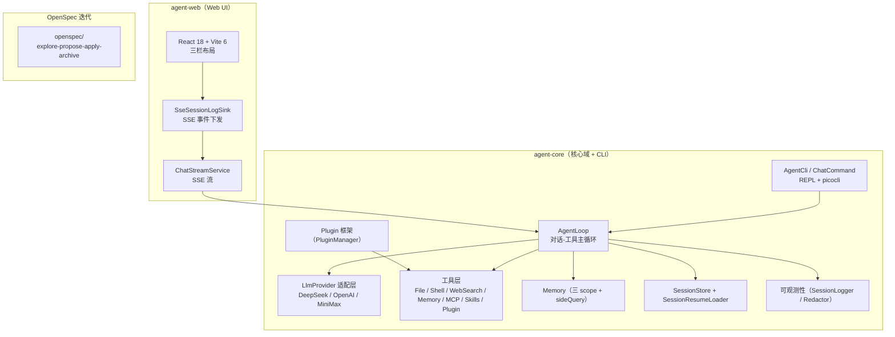
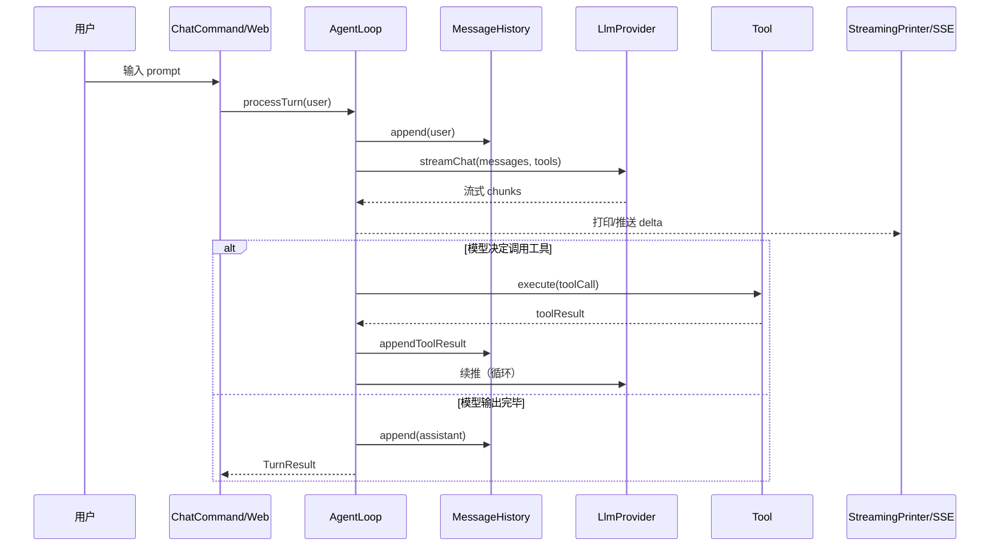
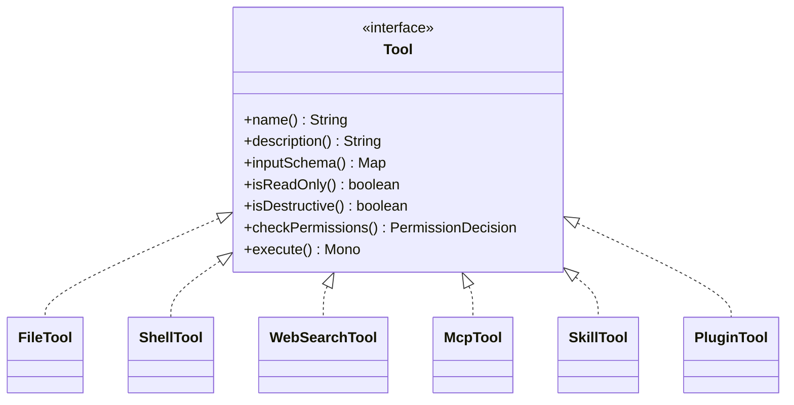
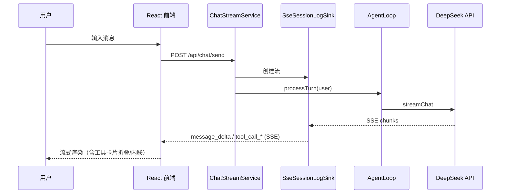
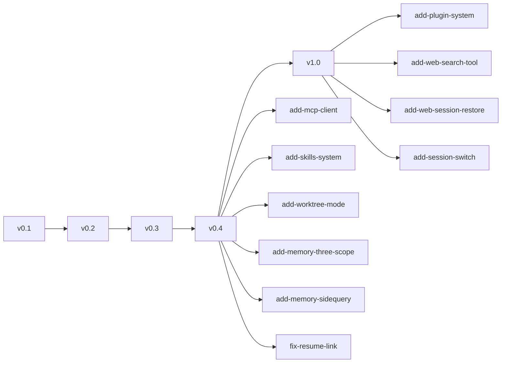
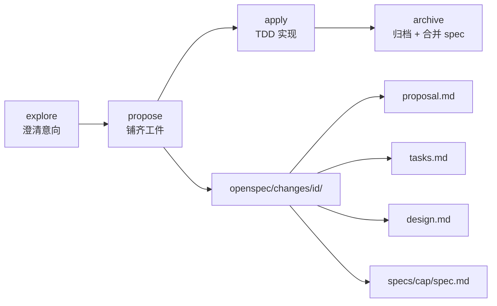

# agent-demo

> Java 编写的 Claude Code 风格 Agent CLI + Web UI。阶段迭代：v0.1（CLI REPL）→ v0.2/v0.3（CLI + Web + OpenSpec 迭代 + 可观测性）→ v0.4（MCP / Skills / Worktree / Memory 三 scope / 语义召回）→ v1.0（Plugin 插件框架 + 多工具扩展）。

- 设计：`docs/design/design.md`（技术设计）
- 测试设计：`docs/test-agent-demo/test-design.md`
- 测试报告：`docs/test-agent-demo/test-report.md`
- 架构详解：`docs/guides/architecture.md`（Mermaid 图）
- 实施计划：`docs/superpowers/plans/2026-08-26-agent-cli-v0.1.md`
- 迭代流程：**OpenSpec**（`openspec/`，见 `AGENTS.md` §2.5）—— 默认所有功能改动走四阶段（explore → propose → apply → archive）

---

## 1. 项目定位

在终端或 Web 里与 LLM 协作：流式对话、调用本地工具（读文件、执行命令、网络搜索、记忆、MCP 工具、技能、插件扩展）、多步自主完成任务、会话持久化到本地。也可通过 Web UI（`agent-web` 模块）获得 DeepSeek Harness 风格的三栏交互界面。

| 维度 | 设计取向 |
|------|----------|
| 集成方式 | 独立调 LLM API（不依赖 dsh / Claude Code 进程） |
| 目标用户 | 习惯终端 + Web 的开发者；要求可控、可观测、可测试 |
| 模型支持 | 多 Provider：DeepSeek（默认）/ OpenAI 兼容 / MiniMax（中国版 OpenAI 兼容） |
| 能力范围 | 流式对话 / 工具调用 / 权限确认 / 会话持久化 / Memory / 网络搜索 / MCP / Skills / Plugin / Web UI / 可观测性 / 日志脱敏 |
| 迭代 | OpenSpec 四阶段，默认所有功能改动走 explore → propose → apply → archive |

> 与 Claude Code 的关系：本项目独立实现，借鉴其成熟的工程模式（Tool 协议对象、append-only JSONL 会话、compact 熔断、`MEMORY.md` 索引）。**不依赖 Claude Code 运行时**，不调用其 API。

---

## 2. 总体架构

多模块 Maven：`agent-core`（核心域 + CLI）+ `agent-web`（Web UI）。



### 2.1 一次对话的数据流



---

## 3. 核心特性

### 3.1 CLI REPL

- ✅ REPL 交互：连续多轮对话、流式输出（边生成边打印）
- ✅ 工具调用：`ReadFile` / `WriteFile` / `EditFile` / `Ls` / `Shell` / `web_search`（DeepSeek 原生 / Tavily，双 Provider 自动选择），自动执行并回流结果
- ✅ 工具扩展：MCP 客户端工具（`add-mcp-client`）、Skills（`add-skills-system`）、Plugin 插件（`add-plugin-system`）
- ✅ 权限确认：写文件与命令执行需要用户交互确认（默认 allow-read, ask-write）；敏感路径 / 危险命令强制 ask / 二次确认
- ✅ 会话持久化：JSONL append-only 保存到 `~/.agent-demo/sessions/`；`/resume` 加载最近会话（含 snip 裁剪 + 并行孤儿修复）
- ✅ Slash 命令：`/help` `/clear` `/quit` `/history` `/resume` `/model`
- ✅ Memory：三 scope（USER / PROJECT / LOCAL）+ sideQuery 语义召回补充字面重叠
- ✅ 上下文压缩：128K 上限前自动 compact，失败熔断防死循环
- ✅ 错误重试：网络 / 5xx / 429 自动重试；401 / 404 / 限流 / 网络错友好提示并继续 REPL
- ✅ Ctrl+C 中断：第一次优雅取消、第二次（500ms 内）强制退出
- ✅ 跨平台：Windows / Linux / macOS；中文编码三重防御（GBK↔UTF-8 回退）
- ✅ 成本可见：每轮 token 累计，`/history` 显示估算费用，阈值告警 / 停止

### 3.2 Web UI（agent-web 模块）

- ✅ React 18 + Vite 6 前端（DeepSeek Harness 风格三栏布局）
- ✅ Server-Sent Events 流式输出（7 种事件类型）
- ✅ 侧边栏**真实会话列表 + 点击切换加载历史**（`add-session-switch`）
- ✅ 会话重进恢复（刷新 / 重启后回填历史，`add-web-session-restore`）
- ✅ 工具调用卡片折叠 + 内联（`polish-tool-call-display` / `fix-tool-call-timing`）

---

## 4. 工具扩展体系

工具统一走 `Tool` 协议（Fail-Closed 默认）。三类扩展点：MCP 客户端、Skills、Plugin 插件。



> Mermaid 8.x classDiagram 泛型支持有限，`Tool` 泛型参数此处省略；完整契约见源码 `Tool.java`。

---

## 5. 技术栈

| 类别 | 选型 | 版本 | 理由 |
|------|------|------|------|
| JDK | OpenJDK | 17 | |
| 框架 | Spring Boot | 3.2.5 | |
| HTTP | Spring WebFlux `WebClient` | 6.1.x | 原生支持 SSE |
| CLI | picocli | 4.7.6 | |
| 终端 | JLine3 | 3.25.1 | raw mode + 历史 |
| Token | JTokkit | 0.6.1 | |
| 构建 | Maven | 3.9 | 多模块 |
| 测试 | JUnit 5 + Mockito + WireMock + Reactor Test | — | |
| 前端 | React 18 + Vite 6 | — | agent-web/frontend |
| 日志 | SLF4J + Logback + 自研 Redactor | — | 敏感字段脱敏 |

> **不引入 Lombok、spring-boot-starter-web、数据库**——CLI 端 JSON 文件存会话；agent-web 端 WebFlux + 文件/内存。

---

## 6. 项目结构（多 module）

```text
agent-demo/
├── pom.xml                     # 多 module 聚合（agent-core + agent-web）
├── agent-core/                 # 核心域 + CLI
│   ├── pom.xml                 # finalName=agent-cli；exec classifier 打可执行 fat jar
│   └── src/main/java/com/example/agent/
│       ├── AgentCli.java       # picocli 路由 + Spring Boot 启动
│       ├── core/               # AgentLoop / MessageHistory / ContextCompressor / TurnResult / exception
│       ├── cli/                # ChatCommand + SlashCommand + InitCommand + Completion
│       ├── llm/                # LlmProvider / StreamChunk / ChatRequest / LlmRetry / TokenEstimator
│       ├── provider/           # deepseek / openai / minimax
│       ├── tools/              # Tool + ToolRegistry + AbstractFileTool
│       │   ├── file/           # ReadFile / WriteFile / EditFile / Ls
│       │   ├── shell/          # ShellTool + Adapters + DenylistMatcher
│       │   └── websearch/      # WebSearchTool + DeepSeek/Tavily
│       ├── mcp/                # McpClient / McpTool（MCP 客户端集成）
│       ├── skill/              # Skill / SkillCatalog / SkillTool（Skills 系统）
│       ├── plugin/             # Plugin 框架：PluginManager / PluginContext / ExtensionPoints + {mcp,skill,memory}
│       ├── worktree/           # WorktreeManager（git worktree 隔离）
│       ├── permission/         # PermissionManager + PermissionPathMatcher + PermissionPolicy
│       ├── memory/             # MemoryDir / MemoryIndex / MemoryRecall / MemoryPromptBuilder / MemoryRetriever
│       ├── session/            # SessionStore + SessionEntry + SessionResumeLoader
│       ├── config/             # ConfigLoader + AgentConfig（含 mcp/worktree/plugins/search 等）+ EnvKeys
│       ├── render/ prompt/ signal/ util/ log/
├── agent-web/                  # Web UI（独立 Spring Boot，端口 18080）
│   ├── pom.xml                 # finalName=agent-web；frontend-maven-plugin 打前端
│   ├── src/main/java/          # WebApplication + SessionController + ChatStreamService + SSELogSink + LogController
│   └── frontend/               # React 18 + Vite 6（三栏 + SSE + 会话切换）
├── docs/                       # 设计 / 测试 / 架构文档
├── openspec/                   # 迭代流程（change / specs / config.yaml）
├── bin/                        # launcher 脚本
└── AGENTS.md                   # 项目级规则（含 OpenSpec 流程 §2.5）
```

---

## 7. 快速开始

### 7.1 构建

```bash
mvn clean install
# agent-core/target/agent-cli.jar            （普通 jar）
# agent-core/target/agent-cli-exec.jar       （可执行 fat jar，含 Spring Boot）
# agent-web/target/agent-web.jar             （Web fat jar，含前端 dist）
```

### 7.2 配置 API key

三层优先级（详见 `docs/design/design.md` §9）：

1. CLI flag：`--api-key sk-...`
2. 环境变量：`DEEPSEEK_API_KEY` / `MINIMAX_API_KEY`
3. `~/.agent-demo/config.yaml`（`agent-demo init` 生成）
4. `application-local.yml`（gitignored，本地密钥）

```powershell
$env:DEEPSEEK_API_KEY = "sk-your-key-here"
java -jar agent-core/target/agent-cli-exec.jar chat
```

### 7.3 启动 CLI REPL

```bash
java -jar agent-core/target/agent-cli-exec.jar chat
# 或 launcher（自动 UTF-8）
./bin/agent chat        # Windows: bin\agent.bat chat
```

### 7.4 启动 Web UI

```bash
# 后端（web profile，默认 127.0.0.1:18080）
mvn -pl agent-web clean package
java -jar agent-web/target/agent-web.jar

# 前端（开发模式）
cd agent-web/frontend && npm run dev   # http://localhost:5173
```

> 生产一体化：`mvn -pl agent-web clean package` 后 `java -jar agent-web/target/agent-web.jar`（前端 dist 已嵌入）。

---

## 8. REPL 命令

| 命令 | 行为 | 输出示例 |
|------|------|----------|
| `/help` | 列出可用命令 | `可用命令: /help /clear /quit /history /resume /model` |
| `/clear` | 清空当前会话历史 | `[已清空会话历史]` |
| `/quit` | 退出 REPL | （无输出） |
| `/history` | 显示累计 token + 估算费用 | `消息数: 12 \| 累计 token: 345 in / 678 out \| 估算费用: ¥0.0061` |
| `/resume` | 加载最近 session（按 mtime，含 snip 裁剪） | `[/resume] 已恢复 N 条消息` |
| `/model` | 列出当前 + 支持 model | `当前 model: deepseek-chat` |
| `/model <名>` | 运行时切换 model | `[/model] 切换到 deepseek-reasoner` |
| 其他 `/xxx` | 未知命令 | `[未知命令]` |

---

## 9. 权限与危险操作

| 操作 | 默认决策 | 提示样式 |
|------|---------|----------|
| 读文件 / 列目录 | allow | 不提示 |
| 写 / 编辑文件 | ask | 路径 + 变更预览，`y/n/a` |
| 执行命令 | ask | 完整命令 + 危险等级评估 |

跨平台危险命令黑名单（强制二次确认）：类 Unix（`rm -rf /`、`mkfs`、`dd`、`shutdown` 等）；Windows（`format`、`diskpart`、`bcdedit` 等）。匹配语义（归一化 basename + 短参数簇展开）见 `docs/design/design.md` §6.6。

---

## 10. Web UI



SSE 7 种事件：`message_start` / `message_delta` / `tool_call_start` / `tool_call_end` / `permission_request` / `message_stop` / `error`。完整 schema 见 `docs/design/web-ui-design.md`。

---

## 11. 验证

```bash
mvn test                 # 单元/集成测试
mvn verify               # 同上 + jacoco 覆盖率门禁（LINE ≥ 80%，BRANCH ≥ 70%）
mvn -pl agent-web verify # agent-web 模块（注意用 -DskipNpm=true 可跳过前端 build）
```

> 测试文档见 `docs/test-agent-demo/`（按批次，每批四件套 + test-guide 登记）。前端 `vitest` 在 `agent-web/frontend` 下 `npx vitest run`。

---

## 12. 阶段与已归档变更

| 阶段 | 状态 | 关键交付 |
|------|------|----------|
| **v0.1** | ✅ 已完成 | CLI REPL + 工具 + Memory + JSONL + Slash 命令（M0-M10） |
| **v0.2** | ✅ 已完成 | `/resume` / `/model` / Session Memory Compaction |
| **v0.3** | ✅ 已完成 | agent-web Web UI + 可观测性 + 可测试性 + MiniMax provider |
| **v0.4** | ✅ 已完成 | MCP 客户端 / Skills 系统 / Worktree 模式 / Memory 三 scope / sideQuery 语义召回 |
| **v1.0** | ✅ 已落地 | Plugin 插件框架（可插拔 MCP / Skills / Memory）+ web-search-tool + web 会话恢复/切换 + 工具调用 UI 优化；Team Memory / 远程同步 / Prompt Cache 计划中 |

已归档 change（`openspec/changes/archive/`）：



详见 `openspec/` 目录。

---

## 13. OpenSpec 迭代流程



| 阶段 | Skill | 产出 |
|------|-------|------|
| 1. 探索 | `openspec-explore` | 设计方向（不进 git） |
| 2. 提案 | `openspec-propose` | `openspec/changes/<id>/{proposal, tasks, design, specs/*/spec}.md` |
| 3. 实施 | `openspec-apply-change` | 按 tasks.md 逐项实现（TDD + commit 即 push） |
| 4. 归档 | `openspec-archive-change` | delta spec 合并到 `openspec/specs/`，change 标记 completed |

> 文档补充 / typo / CI 调整 / 测试用例补全等小改动可直接 commit（§2.5.5 豁免清单）。

---

## 14. 文档索引

| 路径 | 用途 |
|------|------|
| `docs/design/design.md` | 技术设计（背景/架构/技术栈/模块/数据契约/Agent 主循环/压缩/配置/会话/错误/测试/打包/验收/版本） |
| `docs/design/memory-design.md` | Memory 系统设计（三 scope + sideQuery） |
| `docs/design/logging-design.md` | 可观测性 / 日志脱敏 / 保留策略 |
| `docs/design/web-ui-design.md` | agent-web 三栏布局 + SSE 协议 |
| `docs/guides/architecture.md` | 架构详解（Mermaid 图） |
| `docs/guides/plugins.md` | Plugin 插件系统指南 |
| `docs/test-agent-demo/` | 测试文档（批次四件套 + test-guide 登记） |
| `openspec/` | 当前进行中的 OpenSpec changes |
| `AGENTS.md` | 项目级规则（含 OpenSpec 流程 §2.5） |

---

> **License**：MIT
> **状态**：v0.1→v0.4 已完成（CLI + Web + OpenSpec + 可观测性 + MCP/Skills/Worktree + Memory 三 scope + sideQuery）；v1.0 Plugin 插件框架 / web-search-tool / web 会话恢复切换 / 工具调用 UI 优化已落地；Team Memory / 远程同步 / Prompt Cache 计划中。
