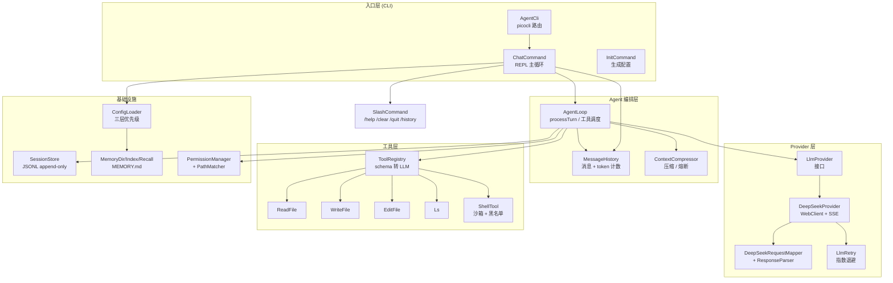
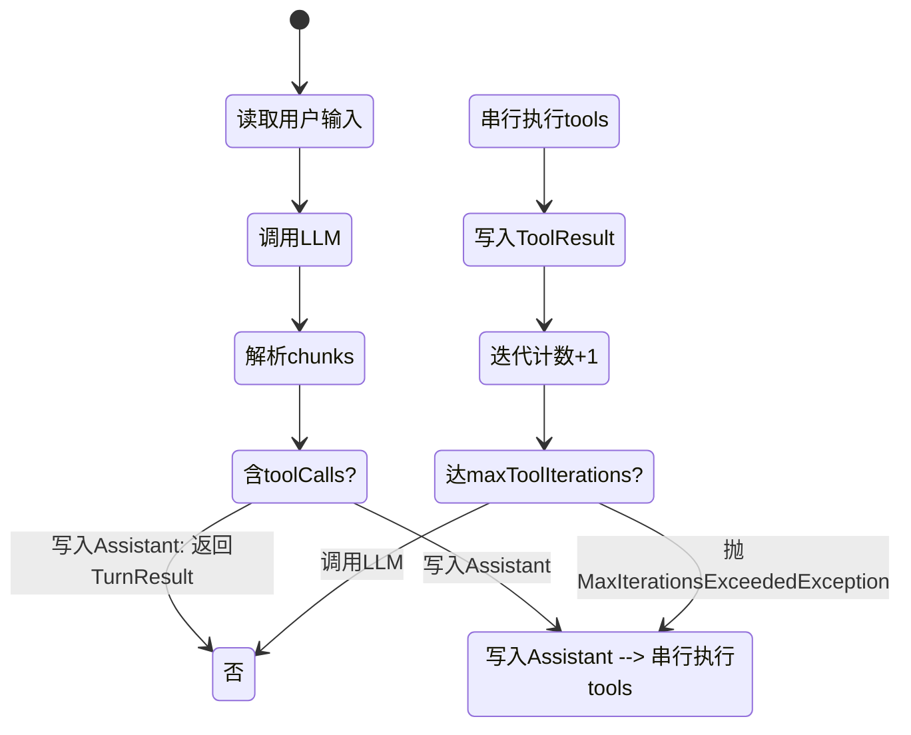
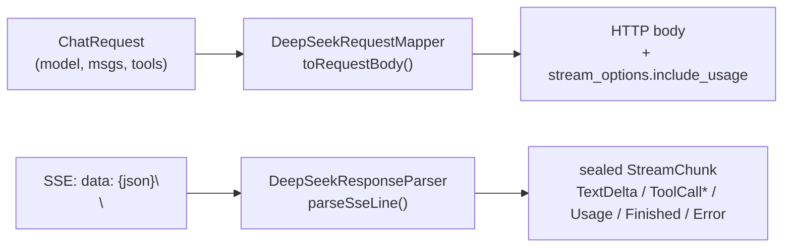
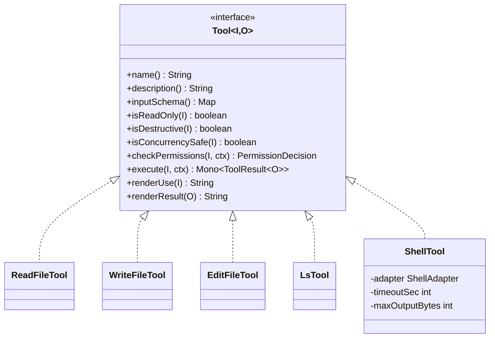
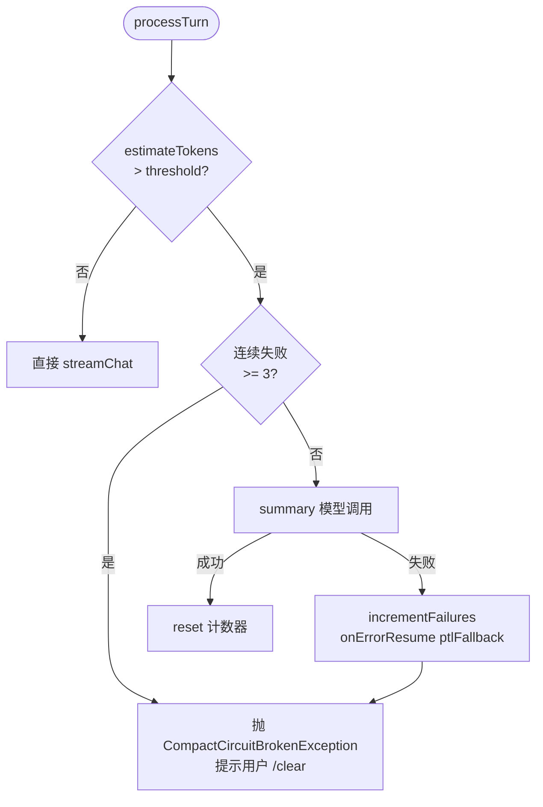
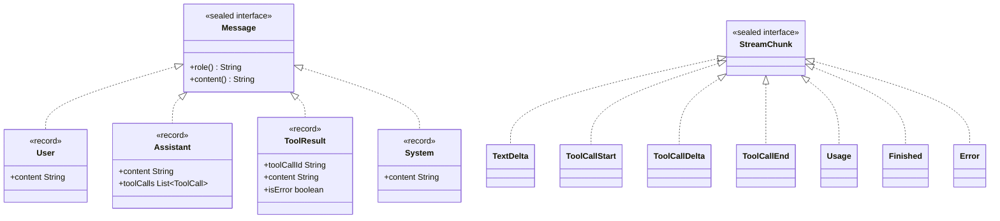

# agent-demo 架构详解

> v0.1 实现完成（`a597f36`，94 测试全绿，jacoco 门禁通过）。
> 配套文档：`docs/design.md`（技术设计）/ `docs/test-design.md`（测试设计）/ `docs/superpowers/plans/2026-08-26-agent-cli-v0.1.md`（实施计划）。

---

## 1. 项目概览

agent-demo 是一个 Claude Code 风格的 Java Agent CLI：用户在终端与 LLM 多轮对话，LLM 可调用本地工具（读文件 / 执行命令 / 写文件 / 编辑文件 / 列目录），会话可持久化、可压缩、可挂记忆。

### 1.1 架构四层视图



### 1.2 关键数据

| 维度 | 数值 |
|------|------|
| Java 源文件 | 56 个（main）+ 34 个（test）|
| 累计代码行 | ~5500 行（含 JavaDoc）|
| 测试 | 94 个，全绿 |
| jacoco 覆盖率 | LINE ≥ 80%，BRANCH ≥ 70%（6 个核心包门禁通过）|
| 已完成 milestone | M0-M10（共 50 个 Task）|
| 后续路线 | v0.2 / v0.3（plan §15 列表）|

### 1.3 技术栈

| 类别 | 选型 | 版本 |
|------|------|------|
| JDK | OpenJDK | 17 |
| 框架 | Spring Boot | 3.2.5 |
| HTTP | WebFlux WebClient | 6.1.x |
| CLI | picocli | 4.7.6 |
| 终端 | JLine3 | 3.25.1 |
| Token | JTokkit CL100K_BASE | 0.6.1 |
| 构建 | Maven | 3.9 |
| 测试 | JUnit 5 + Mockito + WireMock + Reactor Test | — |
| 日志 | SLF4J + Logback | — |
| JSON | Jackson + jackson-dataformat-yaml | — |

---

## 2. 一次对话的完整流程

```mermaid
sequenceDiagram
    actor U as 用户
    participant REPL as ChatCommand (REPL)
    participant Loop as AgentLoop
    participant Hist as MessageHistory
    participant Compressor as ContextCompressor
    participant LLM as DeepSeekProvider
    participant Map as DeepSeekMapper
    participant API as DeepSeek API (HTTPS/SSE)

    U->>REPL: 输入 prompt
    REPL->>Loop: processTurn(userMsg)
    Loop->>Hist: append(User)
    Loop->>Compressor: compactIfNeeded (如超阈值)
    Compressor-->>Loop: history (可能已坍缩)
    Loop->>Map: toRequestBody
    Map-->>Loop: {model, messages, tools, stream_options}
    Loop->>LLM: streamChat(req)
    LLM->>API: POST /v1/chat/completions
    API-->>LLM: SSE chunks
    LLM-->>Loop: Flux[StreamChunk]
    Loop->>Hist: append(Assistant)
    alt 含 tool_calls
        Loop->>Loop: executeTools() 串行调用
        Loop->>Hist: append(ToolResult)
        Loop->>Loop: streamUntilStable(iteration+1)
    end
    Loop-->>REPL: TurnResult
    REPL-->>U: 流式打印
```

要点：
- REPL 串行读取 stdin 一行行；每行要么走 SlashCommand，要么走 AgentLoop
- AgentLoop 是递归的（流式 + 工具续推），最终 emit 一个 TurnResult
- Compressor 只在 token 超阈值时被触发；v0.1 实测 deepseek-chat 128K 窗口内基本不触发

---

## 3. Agent 主循环

### 3.1 工具调度迭代



熔断：单轮工具调用 ≤ 25 次（与 Claude Code 对齐；plan §7 + config 可改）。每次成功响应后增量 append，失败立即抛错由 REPL 捕获提示用户 `/clear`。

### 3.2 关键字段

| 字段 | 类型 | 用途 |
|------|------|------|
| `provider` | `LlmProvider` | 抽象 DeepSeek，可换 OpenAI / Anthropic |
| `tools` | `ToolRegistry` | 按 name 索引的 5 工具 |
| `toolContext` | `Tool.ToolContext` | 共享给所有 execute（workingDir / permissions / abort） |
| `history` | `MessageHistory`（volatile） | 消息列表 + token 估算 + 压缩熔断计数 |
| `model` | `String` | 可切换（`deepseek-chat` / `deepseek-reasoner`） |

---

## 4. Provider 层

### 4.1 请求-响应映射



### 4.2 stream_options.include_usage 为什么必带

DeepSeek（OpenAI 兼容）默认 SSE 流**只在最后一个 chunk 返回 usage**，且 `prompt_tokens` 默认 null。`include_usage=true` 强制透传 `prompt_tokens`，否则 `MessageHistory.estimateTokens()` 长期低估，压缩触发器失灵。plan §7.1 把这条列为强约束。

### 4.3 LlmRetry 状态机

```mermaid
stateDiagram-v2
    [*] --> 发起请求
    发起请求 --> 成功: 返回结果
    发起请求 --> 失败: 捕获异常
    失败 --> 判断类型
    判断类型 --> 瞬时(IO/5xx): 退避后重试
    判断类型 --> 429: 按Retry-After退避
    判断类型 --> 4xx_非429: 直接抛错
    退避后重试 --> 达上限?: 抛错
    达上限? --> 否: 发起请求
    达上限? --> 是: 抛错
    按Retry-After退避 --> 达上限?
```

注意：Reactor 3.4+ 才有 `Retry` 工具类，Spring Boot 3.2 自带 Reactor 3.2.x，**手写递归实现**（详见 `LlmRetry.java`）。

---

## 5. 工具层

### 5.1 类图



### 5.2 5 个工具一览

| 工具 | isReadOnly | isDestructive | 关键约束 |
|------|:----------:|:--------------:|----------|
| ReadFile | ✅ | ❌ | UTF-8/GBK 回退；路径越界 deny |
| WriteFile | ❌ | ✅ | 父目录自动建；权限 ask |
| EditFile | ❌ | ✅ | 原子写（tmp + rename）；oldText 必须唯一 |
| Ls | ✅ | ❌ | 路径越界 deny |
| Shell | ❌ | ✅ | 超时 120s / 输出 1MB / env 清理 / 进程树回收 |

Fail-Closed 默认：所有工具 `isConcurrencySafe / isReadOnly / isDestructive / checkPermissions` 全部默认 false / ask，**新工具不显式重写就保持最严**（plan §6.2）。

---

## 6. ShellTool 沙箱

```mermaid
sequenceDiagram
    participant LLM as 模型
    participant Loop as AgentLoop
    participant Shell as ShellTool
    participant Adapter as ShellAdapter (Bash/Cmd/PowerShell)
    participant OS as 操作系统

    LLM->>Loop: streamChat 返回 tool_call
    Loop->>Shell: execute(command, ctx)
    Shell->>Shell: 黑名单匹配? (isDenylisted)
    alt 命中黑名单
        Shell-->>Loop: isError=true
    else 未命中
        Shell->>Adapter: commandLine(command)
        Adapter-->>Shell: ["/bin/bash","-c",cmd]
        Shell->>Shell: sanitizeEnv(env) 移除 *KEY*/*TOKEN*/*SECRET*
        Shell->>OS: ProcessBuilder.start()
        Shell->>Shell: 创建线程池读 stdout(4096 字节块)
        OS-->>Shell: 流式 stdout
        alt 累计 > maxOutputBytes
            Shell->>OS: killProcessTree 杀进程
            Shell-->>Loop: 截断 + [truncated] 标记
        else 超时 timeoutSec
            Shell->>OS: killProcessTree 杀进程
            Shell-->>Loop: [TIMEOUT after Xs] 错误
        else 正常退出
            Shell-->>Loop: output + toolCallId
        end
    end
    Loop->>Loop: appendToolResult
```

四道防线：黑名单匹配 → env 清理 → 资源限制（超时 + 输出上限） → 进程树回收（Unix descendants / Windows taskkill）。

---

## 7. 权限裁决

| 顺序 | 规则 | 返回 |
|------|------|------|
| 1 | **敏感路径匹配**（`PermissionPathMatcher`，glob 跨段）| 命中 → ask |
| 2 | **工具默认策略**（read / write / shell）| 按 policy.defaultRead/Write/Shell |
| 3 | **工具级裁决**（`Tool.checkPermissions`）| deny 是终态 |

权限策略在 `~/.agent-demo/config.yaml` 的 `permission.sensitivePathPatterns`，默认含 `.ssh/**`, `.env*`, `*credentials*`, `*.pem`。

---

## 8. 上下文压缩



阈值 = `contextWindow - maxOutput - buffer`（DeepSeek = 128000 - 8192 - 8000 = 111808 tokens）。熔断计数器挂在 `MessageHistory` 实例上，**每会话独立**，避免一个会话失败污染所有会话（plan §8 + code review 修复点 C4）。

---

## 9. 会话存储

```mermaid
sequenceDiagram
    participant Loop as AgentLoop
    participant Store as SessionStore
    participant Queue as BlockingQueue
    participant Sched as 后台线程
    participant File as .jsonl 文件
    participant Channel as FileChannel

    Loop->>Store: append(User entry)
    Store->>Queue: offer(entry)
    Note over Store,Queue: 队列满 flushBatchSize=50<br/>或距上次 flush>200ms<br/>触发 flushAsync()
    Queue->>Sched: schedule
    Sched->>Store: flushAsync()
    Store->>Queue: drainTo(drained)
    Store->>Channel: write(drained, force)
    Channel-->>File: 追加 JSONL

    Note over Loop,Store: 关键节点（用户提交 / Finished / 工具完成）触发 syncFlush
    Loop->>Store: syncFlush()
    Store->>Queue: drainTo(drained)
    Store->>Channel: synchronized 写 + force
    Channel-->>File: 追加 JSONL
```

双路径都用 `synchronized (writeLock)` 保护 `channel.write + force`，避免并发写交叉或丢失（code review 修复点 C2）。失败时把 entry 重入队列头部下次重试。

---

## 10. 记忆系统

```mermaid
flowchart LR
    subgraph write["写入路径"]
        Agent[Agent] --> ReadTool[ReadFileTool]
        ReadTool -->|读到 memory 文件| File[/memory/topic.md]
        WriteTool[WriteFileTool] -->|写入新 memory| File
        EditFileTool[EditFileTool] -->|更新 MEMORY.md 索引| Index[MEMORY.md<br/>标题 + 一行描述]
    end

    subgraph read["召回路径 (每轮对话)"]
        PromptBuilder[MemoryPromptBuilder] --> Index
        Recall[MemoryRecall] -->|token 重叠评分 ≥ 0.3| File
        PromptBuilder --> System[system prompt]
    end

    Index -.-> PromptBuilder
    File -.-> Recall
```

写路径：Agent 通过 ReadFile/WriteFile/EditFile 直接操作 `~/.agent-demo/memory/`。
读路径：每轮对话前，`MemoryPromptBuilder` 把 `MEMORY.md` 索引注入 system prompt；`MemoryRecall` 按 token 重叠评分召回前 N 个文件级内容（v0.1 简化：仅索引注入）。

---

## 11. 数据契约



设计要点：
- `sealed` 强制子类型有限（避免外部乱继承破坏 sealed 模式匹配）
- `record` 自动 equals/hashCode/toString（plan §2.5 POJO 规范）
- sealed interface 的抽象方法（`role` / `content`）必须在 record 中显式实现（Java 17 编译器强制）

---

## 12. 测试架构

| 层级 | 工具 | 数量 | 覆盖重点 |
|------|------|-----:|----------|
| 单元 | JUnit 5 + Mockito | ~70 | 算法 / 边界 / 错误路径 |
| 集成 | WireMock + Reactor Test | ~15 | Provider / SessionStore / Tool |
| E2E | WireMock + picocli.testing | ~5 | 验收清单 #1 #2 #11 |
| 烟雾 | 真实 API 一次 | 手动 | 灌满 128K 压缩 |

覆盖率门禁（jacoco）：LINE ≥ 80% / BRANCH ≥ 70%（6 个核心包）。`mvn verify` 在 CI 中跑（`.github/workflows/ci.yml`），本地 `mvn test` 不强制。

---

## 13. 设计原则体现

| 原则 | 在本项目体现 |
|------|-------------|
| **单一职责** | `DeepSeekMapper` 拆 RequestMapper + ResponseParser；`PermissionManager` 拆 PermissionPathMatcher |
| **开闭原则** | `LlmProvider` 接口 + `DeepSeekProvider` 实现，新增 provider 不改旧代码 |
| **里氏替换** | `Message` sealed 子类型可在所有用 Message 的地方透明替换 |
| **接口隔离** | `Tool` 接口最小化（8 方法），无 `fly()` 这种大而全 |
| **依赖倒置** | `AgentLoop` 依赖 `LlmProvider` 接口，不依赖 `DeepSeekProvider` |
| **Fail-Closed** | `Tool` 所有安全属性默认 false / ask；新工具不显式声明就最严 |
| **防御式编程** | catch 块必 log + 堆栈；Path 越界一律 deny；env 敏感变量剥离 |
| **组合优于继承** | `Tool.ToolContext` 用 record 组合而非继承 |
| **Convention over Config** | Spring Boot 默认；Maven 标准 layout |

---

## 14. 后续演进

| 版本 | 候选任务（plan §15） | 优先级 |
|------|----------------------|:------:|
| v0.2 | `/resume` slash 命令（SessionStore 加 load） | ⭐ |
| v0.2 | `/model` 切换 provider（热插拔） | ⭐ |
| v0.2 | Ctrl+C 中断（JLine3 + InterruptController） | ⭐ |
| v0.2 | `deepseek-reasoner` 思维链渲染（折叠区） | ⭐ |
| v0.2 | StreamingToolExecutor 状态机并发（v0.1 串行） | 🟡 |
| v0.3 | MCP 客户端集成 | ⭐ |
| v0.3 | Memory 三 scope（user / project / local） | 🟡 |
| v0.3 | Resume 链路修复（snip / parallel tool_result） | 🟡 |
| v0.3 | SideQuery 召回（替代 token 重叠） | 🟡 |
| v0.4 | Team Memory 跨仓库同步 | 🟢 |
| v1.0 | Web UI（TUI + REST 双形态） | 🟢 |

OpenSpec 集成后（plan 中 todo）：所有 v0.2+ 变更通过 `/opsx:propose` 启动，写 delta spec → apply → archive 进 `openspec/specs/`。

---

## 15. 关键文件索引

| 路径 | 职责 | 行数 |
|------|------|------|
| `AgentCli.java` | 入口 + picocli 路由 | 30 |
| `cli/ChatCommand.java` | REPL 主循环（readLine → slash / agent） | 137 |
| `cli/SlashCommand.java` | `/help /clear /quit /history` | 53 |
| `cli/InitCommand.java` | `~/.agent-demo/` 初始化 | 86 |
| `agent/AgentLoop.java` | 主循环 + maxToolIterations 熔断 | 167 |
| `agent/Message.java` | sealed Message（User/Assistant/ToolResult/System） | 39 |
| `agent/MessageHistory.java` | 消息容器 + token 估算 + Post-Compact 文件重注入 | 95 |
| `agent/ContextCompressor.java` | summary + 坍缩 + 熔断 + PTL fallback | 134 |
| `provider/ChatRequest.java` | 请求 DTO（model/messages/tools/temperature） | 16 |
| `provider/StreamChunk.java` | sealed chunk（TextDelta/ToolCall*/Usage/Finished/Error） | 40 |
| `provider/LlmRetry.java` | 手写指数退避（兼容 Reactor 3.2） | 73 |
| `provider/deepseek/DeepSeekProvider.java` | WebClient + bodyToMono + SSE 解析 | 49 |
| `provider/deepseek/DeepSeekRequestMapper.java` | ChatRequest → DeepSeek body | 87 |
| `provider/deepseek/DeepSeekResponseParser.java` | SSE line → StreamChunk | 91 |
| `tools/Tool.java` | Tool 协议接口（Fail-Closed） | 41 |
| `tools/ReadFileTool.java` | UTF-8 / GBK 双编码 | 60 |
| `tools/WriteFileTool.java` | 写（父目录自动建） | 51 |
| `tools/EditFileTool.java` | 原子写（tmp + rename） | 74 |
| `tools/LsTool.java` | 列目录 | 59 |
| `tools/ShellTool.java` | Shell 沙箱（超时 + 输出 + env + 进程树） | 190 |
| `tools/ShellAdapter.java` | 跨平台 shell + 黑名单匹配 | 65 |
| `tools/ToolRegistry.java` | 工具注册表 + schema 转换 | 41 |
| `permission/PermissionManager.java` | 3 层裁决 | 79 |
| `permission/PermissionPathMatcher.java` | Ant glob → 正则（独立可测试） | 55 |
| `session/SessionStore.java` | JSONL + 双路径 flush | 122 |
| `memory/MemoryDir.java` / `MemoryIndex.java` / `MemoryRecall.java` / `MemoryPromptBuilder.java` | 记忆 4 件套 | 各 40~60 |
| `config/ConfigLoader.java` | 三层优先级（env > yaml > defaults） | 74 |
| `config/AgentConfig.java` | 配置 record | 36 |
