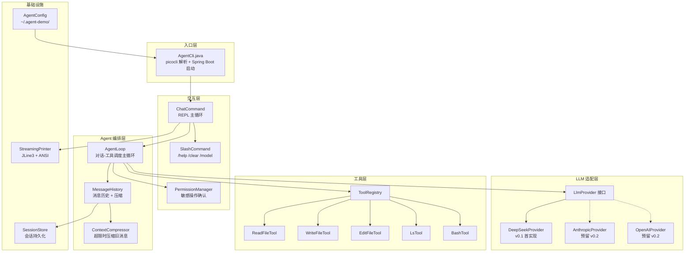
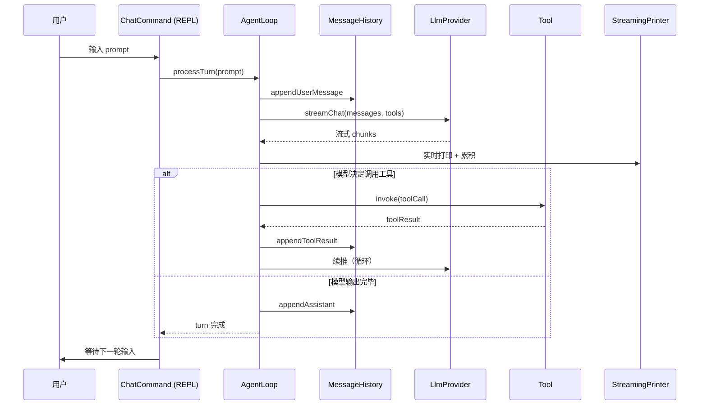

# agent-demo 设计文档

> Java 编写的 Claude Code 风格 Agent CLI。第一阶段独立调 LLM API（DeepSeek），后续可扩展多 Provider。
>
> **状态**：草稿 v0.1，每节确认后追加更新

---

## 1. 背景与目标

### 1.1 用户场景

希望在本机终端里使用类似 Claude Code 的 agent 体验：

- 在命令行输入 prompt，流式看到模型回复
- 模型能调用本地工具（读写文件、执行 bash），自主完成多步任务
- 会话历史持久化，下次可继续
- 支持 slash 命令（`/help` `/clear` `/model` `/resume` 等）
- 危险操作（写文件、执行 bash）有交互式确认

### 1.2 不做什么（v0.1 边界）

- 不依赖 dsh（独立调 LLM API）
- 不做 Web UI（CLI 优先）
- 不做 Subagent / Hooks / Skills 系统（v0.3+ 再考虑）
- 不做插件市场、远程协作等

### 1.3 验收标准

| # | 验收项 |
|:---:|------|
| 1 | 在 `agent-demo chat` 进入 REPL，可连续多轮对话 |
| 2 | 模型返回 tool_call 时自动调用本地工具，结果反馈给模型 |
| 3 | 流式输出（边生成边打），不卡顿 |
| 4 | 会话可保存到 `~/.agent-demo/sessions/` 并 resume |
| 5 | 写文件 / bash 命令需用户确认（默认 allow-read, ask-write） |
| 6 | 命令行参数支持 `--model`、`--api-key`、`--system-prompt` 等 |

---

## 2. 总体架构

### 2.1 模块视图



### 2.2 一次提问的数据流



### 2.3 模块职责

| 模块 | 职责 | 关键 API |
|------|------|---------|
| `AgentCli` | picocli 入口，Spring Boot 启动 | `main()` |
| `ChatCommand` | REPL 主循环，读输入、调 AgentLoop、显示输出 | `run()` |
| `SlashCommand` | 解析 `/xxx` 内置命令 | `dispatch(token)` |
| `PermissionManager` | 工具调用前的权限校验与确认 | `confirm(toolCall, ctx): Decision` |
| `AgentLoop` | 单轮对话：构建请求 → 流式响应 → 工具调度 → 续推 | `processTurn(userMsg): AssistantMsg` |
| `MessageHistory` | 消息列表 + token 计数 + 压缩触发 | `append()`, `totalTokens()` |
| `ContextCompressor` | 超 token 上限时压缩旧消息（保留 system + 最近 N 轮） | `compress(history)` |
| `LlmProvider` | 抽象接口，屏蔽不同 LLM API 差异 | `streamChat(req): Flux<Chunk>` |
| `DeepSeekProvider` | DeepSeek API（OpenAI 兼容协议）实现 | implements `LlmProvider` |
| `ToolRegistry` | 注册/查找工具，把 `ToolSpec` 转成 provider 需要的 schema | `list()`, `get(name)` |
| `Tool` | 单个工具的接口 | `execute(args): Result` |
| `SessionStore` | 会话持久化（JSON 文件） | `save()`, `load(id)` |
| `AgentConfig` | 配置加载（API key、模型、token 上限等） | `load()` |
| `StreamingPrinter` | 流式输出到终端（支持 markdown、代码块、tool_call 高亮） | `printChunk()`, `flush()` |

---

## 3. 技术栈

| 类别 | 选型 | 版本 | 理由 |
|------|------|------|------|
| JDK | OpenJDK | 17 | 与 `rocketmq-demo` 保持一致 |
| 框架 | Spring Boot | 3.2.x | 同上 |
| HTTP | Spring WebFlux `WebClient` | 6.1.x | 原生支持 SSE 流式响应 |
| CLI | picocli | 4.7.x | 注解式，子命令/选项齐全 |
| JSON | Jackson | 2.15.x | Spring Boot 默认 |
| 终端 | JLine3 | 3.25.x | raw mode、历史、自动补全 |
| 构建 | Maven | 3.9.x | 与现有项目一致 |

**不引入**：

- Lombok（增加心智负担，IDE 插件依赖）
- spring-boot-starter-web（CLI 不需要 servlet 容器）
- 数据库（v0.1 用 JSON 文件存会话足够）

---

## 4. 模块结构（Maven 标准布局）

```
agent-demo/
├── pom.xml
├── README.md
├── docs/
│   └── design.md
└── src/
    ├── main/java/com/example/agent/
    │   ├── AgentCli.java
    │   ├── cli/
    │   │   ├── ChatCommand.java
    │   │   ├── SlashCommand.java
    │   │   └── Completion.java
    │   ├── agent/
    │   │   ├── AgentLoop.java
    │   │   ├── MessageHistory.java
    │   │   ├── ContextCompressor.java
    │   │   └── TurnResult.java
    │   ├── provider/
    │   │   ├── LlmProvider.java
    │   │   ├── ChatRequest.java
    │   │   ├── ChatResponse.java
    │   │   ├── StreamChunk.java
    │   │   ├── ToolSpec.java
    │   │   ├── ToolCall.java
    │   │   ├── FinishReason.java
    │   │   └── deepseek/
    │   │       ├── DeepSeekProvider.java
    │   │       ├── DeepSeekMapper.java
    │   │       └── DeepSeekDtos.java
    │   ├── tools/
    │   │   ├── Tool.java
    │   │   ├── ToolRegistry.java
    │   │   ├── ToolResult.java
    │   │   ├── ReadFileTool.java
    │   │   ├── WriteFileTool.java
    │   │   ├── EditFileTool.java
    │   │   ├── LsTool.java
    │   │   └── BashTool.java
    │   ├── session/
    │   │   ├── Session.java
    │   │   ├── SessionStore.java
    │   │   └── SessionSerializer.java
    │   ├── permission/
    │   │   ├── PermissionManager.java
    │   │   ├── PermissionPolicy.java
    │   │   └── Decision.java
    │   ├── render/
    │   │   ├── StreamingPrinter.java
    │   │   ├── MarkdownRenderer.java
    │   │   └── AnsiCode.java
    │   └── config/
    │       ├── AgentConfig.java
    │       ├── ConfigLoader.java
    │       └── EnvKeys.java
    ├── main/resources/
    │   ├── application.yml
    │   ├── logback.xml
    │   └── banner.txt
    └── test/java/com/example/agent/
        ├── provider/deepseek/DeepSeekProviderTest.java
        ├── agent/AgentLoopTest.java
        ├── tools/ReadFileToolTest.java
        └── ...
```

---

## 5. Claude Code 借鉴整合

设计过程中参考了 Claude Code 源码解析（E:\md-main\AI-Agent\开源项目\Claude Code源码解析）。整合项分为三档：

### 5.1 v0.1 必须整合

| # | 来源 | 整合点 | 实现位置 |
|:---:|------|--------|---------|
| 1 | 04b §2 | Tool 协议对象含 `isConcurrencySafe/isReadOnly/isDestructive/renderUse/renderResult` | `Tool.java` |
| 2 | 04b §2.2 | Fail-Closed 默认：所有新工具默认 `isConcurrencySafe=false/isReadOnly=false` | `Tool.java` 默认方法 |
| 3 | 04b §4 | `partitionToolCalls()` 按并发安全分批 | `AgentLoop.java` |
| 4 | 04b §6 | 执行管线：schema 校验 → 权限 → 执行 → 标准化 tool_result | `AgentLoop.processToolCall()` |
| 5 | 04i §2-3 | Append-only JSONL 会话存储，目录权限 0600/0700 | `SessionStore.java` |
| 6 | 04i §3.1 | 异步批量 flush 写盘 | `SessionStore.append()` |
| 7 | 04f §2 | Capped max_tokens 默认 8000（slot 预约优化） | `AgentConfig.java` |
| 8 | 04f §2.1 | 预留 20k 给 summary API | `ContextCompressor.java` |
| 9 | 04f §3 | Auto-Compact 熔断器（连续 3 次失败后停） | `ContextCompressor.java` |
| 10 | 04f §4 | Strip images before summarize | `ContextCompressor.stripImages()` |
| 11 | 04f §4.3 | PTL fallback：剥 20% 旧消息重试 | `ContextCompressor.retryWithShrink()` |
| 12 | 04f §4.4 | Post-Compact 状态重注入（刚打开的文件、激活的工具） | `ContextCompressor.reinjectState()` |

### 5.2 v0.2+ 再考虑（v0.1 留扩展点）

- 多入口 fast-path 分流（cli.tsx 模式）
- MCP 工具池融合 `assembleToolPool()`
- Lite reader（头尾 64KB 快速列出会话）
- Resume 链路修复（snip / parallel tool_result 孤儿处理）
- Forked Agent 借主对话 Prompt Cache
- Streaming Tool Executor 状态机（v0.1 简化为串行）

### 5.3 v0.1 明确不做

- Subagent / sidechain transcript
- Skills 系统
- Plan attachment
- Memory 系统（MEMORY.md / memdir）
- Hooks / 插件市场
- Bridge / Remote mode
- Headless / SDK 模式

---

## 6. 核心数据契约

### 6.1 LLM Provider 抽象

```java
public interface LlmProvider {
    String name();
    Flux<StreamChunk> streamChat(ChatRequest request);
    int estimateTokens(ChatRequest request);
}
```

### 6.2 Tool 协议对象（借鉴 Claude Code）

```java
public interface Tool<I, O> {
    String name();
    String description();
    Map<String, Object> inputSchema();    // LLM 看的 JSON Schema

    // 安全属性（默认 fail-closed）
    default boolean isConcurrencySafe(I input) { return false; }
    default boolean isReadOnly(I input) { return false; }
    default boolean isDestructive(I input) { return false; }
    default PermissionDecision checkPermissions(I input, ToolContext ctx) {
        return PermissionDecision.ask();
    }

    // 渲染
    String renderUse(I input);
    String renderResult(O output);

    // 执行
    ToolResult<O> execute(I input, ToolContext ctx);
}
```

### 6.3 ToolContext（执行时上下文总线）

```java
public record ToolContext(
    Path workingDirectory,
    PermissionManager permissions,
    SessionStore sessionStore,    // 工具可读刚 append 的消息
    AbortSignal abortSignal      // 中断信号
) {}
```

### 6.4 Message / StreamChunk（sealed interface）

```java
public sealed interface Message {
    String role();
    record User(String content) implements Message {}
    record Assistant(String content, List<ToolCall> toolCalls) implements Message {}
    record ToolResult(String toolCallId, String content, boolean isError) implements Message {}
    record System(String content) implements Message {}
}

public sealed interface StreamChunk {
    record TextDelta(String text) implements StreamChunk {}
    record ToolCallStart(String id, String name) implements StreamChunk {}
    record ToolCallDelta(String id, String argumentsDelta) implements StreamChunk {}
    record ToolCallEnd(String id, String name, String arguments) implements StreamChunk {}
    record Usage(int promptTokens, int completionTokens) implements StreamChunk {}
    record Finished(FinishReason reason, Usage usage) implements StreamChunk {}
    record Error(String message, int httpStatus, Throwable cause) implements StreamChunk {}
}
```

---

## 7. Agent 主循环（借鉴 Claude Code query.ts）

```java
public Mono<TurnResult> processTurn(UserMessage userMsg) {
    history.append(userMsg);
    return Mono.defer(() -> streamUntilStable(history))
        .doOnNext(this::printToUser)
        .doOnNext(chunk -> history.appendFromChunk(chunk))
        .collectList()
        .map(this::extractAssistantAndToolCalls)
        .flatMap(this::maybeRunToolsAndContinue)
        .flatMap(this::maybeCompact)
        .map(this::buildTurnResult);
}

private Flux<StreamEvent> streamUntilStable(MessageHistory history) {
    return Mono.just(history)
        .flatMapMany(h -> llm.streamChat(toRequest(h)))  // 流式
        .collectList()
        .flatMapMany(chunks -> {
            // 提取 tool_uses
            var toolCalls = extractToolCalls(chunks);
            if (toolCalls.isEmpty()) {
                return Flux.fromIterable(chunks);  // 无工具调用，结束本轮
            }
            // 有工具调用 → partition → 执行 → 续推
            return executeTools(toolCalls)
                .flatMap(results -> {
                    history.appendToolResults(results);
                    return streamUntilStable(history);  // 递归续推
                });
        });
}
```

---

## 8. 上下文压缩（借鉴 04f）

```java
public class ContextCompressor {
    private static final int CONTEXT_WINDOW_DEFAULT = 200_000;
    private static final int MAX_OUTPUT_TOKENS = 8_000;          // capped default
    private static final int MAX_OUTPUT_FOR_SUMMARY = 20_000;    // 预留 summary 空间
    private static final int AUTOCOMPACT_BUFFER = 13_000;        // 提前触发
    private static final int MAX_CONSECUTIVE_FAILURES = 3;       // 熔断阈值

    public Mono<MessageHistory> compactIfNeeded(MessageHistory hist) {
        int effective = CONTEXT_WINDOW_DEFAULT - MAX_OUTPUT_FOR_SUMMARY;
        int threshold = effective - AUTOCOMPACT_BUFFER;

        if (hist.estimateTokens() < threshold) return Mono.just(hist);

        return compact(hist)
            .retryWhen(Retry.backoff(2, Duration.ofSeconds(2))
                .filter(this::isPtlError))
            .onErrorResume(e -> shrinkAndRetry(hist, 0.2))  // PTL fallback
            .map(this::reinjectState);                     // 重注入刚打开的文件
    }
}
```

---

## 9. 会话存储（借鉴 04i §2-3）

```
~/.agent-demo/
├── config.yaml
├── sessions/
│   ├── 2026-08-26T10-23-45-{uuid}.jsonl    # 主 transcript
│   └── ...
└── cache/                                   # 临时缓存
```

**JSONL schema**（每行一个 entry）：

```typescript
{type: "user",       uuid, parentUuid, content, timestamp}
{type: "assistant",  uuid, parentUuid, content, toolCalls?, timestamp}
{type: "tool_result",uuid, parentUuid, toolCallId, content, isError, timestamp}
{type: "system",     uuid, parentUuid, content, timestamp}
{type: "meta",       uuid, parentUuid, key, value, timestamp}   // title / model / tags
```

**写盘策略**：
- 每条 entry 进入内存 queue
- 每 200ms 或 queue 满 50 条时批量 flush
- 文件权限 0600，目录权限 0700
- 追加失败重试（mkdir 后重写）

---

## 10. 待确认的设计点

- [ ] §11 错误处理（401 重试、超时、断网恢复）
- [ ] §12 测试策略（mock provider、命令输出快照测试）
- [ ] §13 打包/分发（fat jar、jlink 镜像、安装脚本）
- [ ] §14 v0.1 验收清单与里程碑