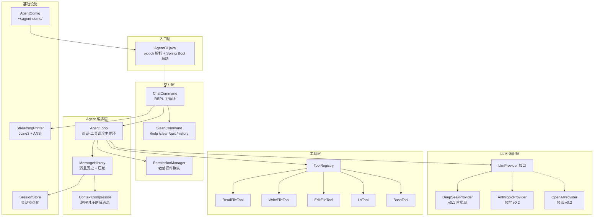
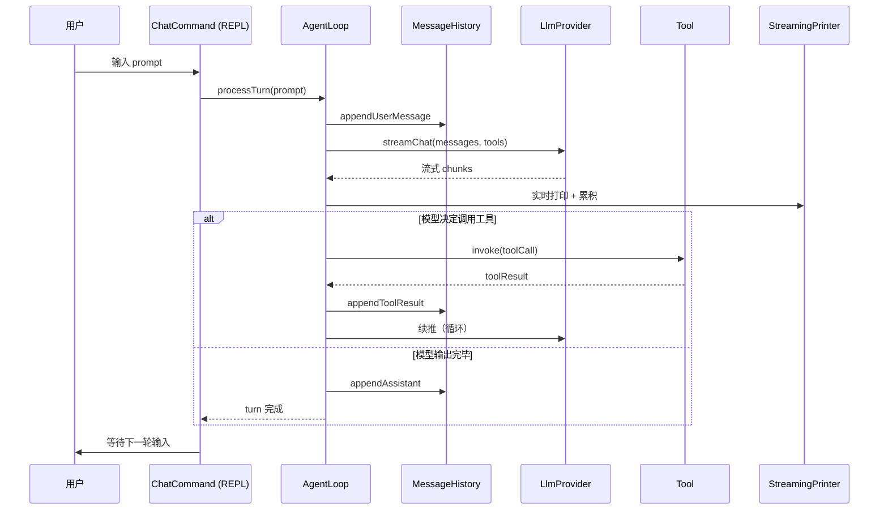

# agent-demo 设计文档

> Java 编写的 Claude Code 风格 Agent CLI。第一阶段独立调 LLM API（DeepSeek），后续可扩展多 Provider。
>
> **状态**：草稿 v0.1，每节确认后追加更新

---

## 1. 背景与目标

### 1.1 用户场景

希望在本机终端里使用类似 Claude Code 的 agent 体验：

- 在命令行输入 prompt，流式看到模型回复
- 模型能调用本地工具（读写文件、执行 bash），自主完成多步任务
- **会话历史持久化**到本地（v0.1 保存，**v0.2 再加 resume**）
- 支持 slash 命令：v0.1 仅 `/help /clear /quit /history`，`/model /resume` v0.2 再加
- 危险操作（写文件、执行 bash）有交互式确认

### 1.2 不做什么（v0.1 边界）

- 不依赖 dsh（独立调 LLM API）
- 不做 Web UI（CLI 优先）
- 不做 Subagent / Hooks / Skills 系统（v0.3+ 再考虑）
- 不做插件市场、远程协作等
- 不做 Team Memory / Memory Snapshot（v0.2+ 再加）
- 不做 Session Memory Compaction hook（v0.2 再加）

### 1.3 验收标准

| # | 验收项 |
|:---:|------|
| 1 | 在 `agent-demo chat` 进入 REPL，可连续多轮对话 |
| 2 | 模型返回 tool_call 时自动调用本地工具，结果反馈给模型 |
| 3 | 流式输出（边生成边打），不卡顿 |
| 4 | 会话可保存到 `~/.agent-demo/sessions/`（v0.1 不支持 resume，v0.2 加） |
| 5 | 写文件 / bash 命令需用户确认（默认 allow-read, ask-write） |
| 6 | 命令行参数支持 `--model`、`--api-key`、`--system-prompt` 等 |

---

## 2. 总体架构

### 2.1 模块视图



### 2.2 一次提问的数据流



### 2.3 模块职责

| 模块 | 职责 | 关键 API |
|------|------|---------|
| `AgentCli` | picocli 入口，Spring Boot 启动 | `main()` |
| `ChatCommand` | REPL 主循环，读输入、调 AgentLoop、显示输出 | `run()` |
| `SlashCommand` | 解析 `/xxx` 内置命令 | `dispatch(token)` |
| `PermissionManager` | 工具调用前的权限校验与确认 | `confirm(toolCall, ctx): Decision` |
| `AgentLoop` | 单轮对话：构建请求 → 流式响应 → 工具调度 → 续推 | `processTurn(userMsg): AssistantMsg` |
| `MessageHistory` | 消息列表 + token 计数 + 压缩触发 | `append()`, `totalTokens()` |
| `ContextCompressor` | 超 token 上限时压缩旧消息（保留 system + 最近 N 轮） | `compress(history)` |
| `LlmProvider` | 抽象接口，屏蔽不同 LLM API 差异 | `streamChat(req): Flux<Chunk>` |
| `DeepSeekProvider` | DeepSeek API（OpenAI 兼容协议）实现 | implements `LlmProvider` |
| `ToolRegistry` | 注册/查找工具，把 `ToolSpec` 转成 provider 需要的 schema | `list()`, `get(name)` |
| `Tool` | 单个工具的接口 | `execute(args): Result` |
| `SessionStore` | 会话持久化（JSON 文件） | `save()`, `load(id)` |
| `AgentConfig` | 配置加载（API key、模型、token 上限等） | `load()` |
| `StreamingPrinter` | 流式输出到终端（支持 markdown、代码块、tool_call 高亮） | `printChunk()`, `flush()` |

---

## 3. 技术栈

| 类别 | 选型 | 版本 | 理由 |
|------|------|------|------|
| JDK | OpenJDK | 17 | 与 `rocketmq-demo` 保持一致 |
| 框架 | Spring Boot | 3.2.x | 同上 |
| HTTP | Spring WebFlux `WebClient` | 6.1.x | 原生支持 SSE 流式响应 |
| CLI | picocli | 4.7.x | 注解式，子命令/选项齐全 |
| JSON | Jackson | 2.15.x | Spring Boot 默认 |
| 终端 | JLine3 | 3.25.x | raw mode、历史、自动补全 |
| 构建 | Maven | 3.9.x | 与现有项目一致 |

**不引入**：

- Lombok（增加心智负担，IDE 插件依赖）
- spring-boot-starter-web（CLI 不需要 servlet 容器）
- 数据库（v0.1 用 JSON 文件存会话足够）

---

## 4. 模块结构（Maven 标准布局）

```
agent-demo/
├── pom.xml
├── README.md
├── docs/
│   └── design.md
└── src/
    ├── main/java/com/example/agent/
    │   ├── AgentCli.java
    │   ├── cli/
    │   │   ├── ChatCommand.java
    │   │   ├── SlashCommand.java
    │   │   └── Completion.java
    │   ├── agent/
    │   │   ├── AgentLoop.java
    │   │   ├── MessageHistory.java
    │   │   ├── ContextCompressor.java
    │   │   └── TurnResult.java
    │   ├── provider/
    │   │   ├── LlmProvider.java
    │   │   ├── ChatRequest.java
    │   │   ├── ChatResponse.java
    │   │   ├── StreamChunk.java
    │   │   ├── ToolSpec.java
    │   │   ├── ToolCall.java
    │   │   ├── FinishReason.java
    │   │   └── deepseek/
    │   │       ├── DeepSeekProvider.java
    │   │       ├── DeepSeekMapper.java
    │   │       └── DeepSeekDtos.java
    │   ├── tools/
    │   │   ├── Tool.java
    │   │   ├── ToolRegistry.java
    │   │   ├── ToolResult.java
    │   │   ├── ReadFileTool.java
    │   │   ├── WriteFileTool.java
    │   │   ├── EditFileTool.java
    │   │   ├── LsTool.java
    │   │   └── BashTool.java
    │   ├── session/
    │   │   ├── Session.java
    │   │   ├── SessionStore.java
    │   │   └── SessionSerializer.java
    │   ├── memory/
    │   │   ├── MemoryDir.java          # memory 目录管理（路径/权限）
    │   │   ├── MemoryEntry.java        # 单条记忆（标题/描述/正文）
    │   │   ├── MemoryIndex.java        # MEMORY.md 索引解析/序列化
    │   │   ├── MemoryPromptBuilder.java # 把 memory 拼到 system prompt
    │   │   ├── MemoryRecall.java       # 相关记忆召回（关键词匹配）
    │   │   └── MemoryScope.java        # scope 枚举（v0.1 仅 USER）
    │   ├── permission/
    │   │   ├── PermissionManager.java
    │   │   ├── PermissionPolicy.java
    │   │   └── Decision.java
    │   ├── render/
    │   │   ├── StreamingPrinter.java
    │   │   ├── MarkdownRenderer.java
    │   │   └── AnsiCode.java
    │   └── config/
    │       ├── AgentConfig.java
    │       ├── ConfigLoader.java
    │       └── EnvKeys.java
    ├── main/resources/
    │   ├── application.yml
    │   ├── logback.xml
    │   └── banner.txt
    └── test/java/com/example/agent/
        ├── provider/deepseek/DeepSeekProviderTest.java
        ├── agent/AgentLoopTest.java
        ├── tools/ReadFileToolTest.java
        └── ...
```

---

## 5. Claude Code 借鉴整合

设计过程中参考了 Claude Code 源码解析（E:\md-main\AI-Agent\开源项目\Claude Code源码解析）。整合项分为三档：

### 5.1 v0.1 必须整合

| # | 来源 | 整合点 | 实现位置 |
|:---:|------|--------|---------|
| 1 | 04b §2 | Tool 协议对象含 `isConcurrencySafe/isReadOnly/isDestructive/renderUse/renderResult` | `Tool.java` |
| 2 | 04b §2.2 | Fail-Closed 默认：所有新工具默认 `isConcurrencySafe=false/isReadOnly=false` | `Tool.java` 默认方法 |
| 3 | 04b §4 | `partitionToolCalls()` 按并发安全分批 | `AgentLoop.java` |
| 4 | 04b §6 | 执行管线：schema 校验 → 权限 → 执行 → 标准化 tool_result | `AgentLoop.processToolCall()` |
| 5 | 04i §2-3 | Append-only JSONL 会话存储，目录权限 0600/0700 | `SessionStore.java` |
| 6 | 04i §3.1 | 异步批量 flush 写盘 | `SessionStore.append()` |
| 7 | 04f §2 | Capped max_tokens 默认 8000（slot 预约优化） | `AgentConfig.java` |
| 8 | 04f §2.1 | 预留 20k 给 summary API | `ContextCompressor.java` |
| 9 | 04f §3 | Auto-Compact 熔断器（连续 3 次失败后停） | `ContextCompressor.java` |
| 10 | 04f §4 | Strip images before summarize | `ContextCompressor.stripImages()` |
| 11 | 04f §4.3 | PTL fallback：剥 20% 旧消息重试 | `ContextCompressor.retryWithShrink()` |
| 12 | 04f §4.4 | Post-Compact 状态重注入（刚打开的文件、激活的工具） | `ContextCompressor.reinjectState()` |
| 13 | 04 §3 | Memory 目录 + `MEMORY.md` 入口文件 + 硬截断（200 行 / 25KB） | `memory/MemoryDir.java` |
| 14 | 04 §3.3 | `buildMemoryPrompt()` 把 MEMORY.md 内容注入 system prompt | `memory/MemoryPromptBuilder.java` |
| 15 | 04 §5 | Relevant Memory Recall：每轮召回 ≤5 个最相关记忆文件 | `memory/MemoryRecall.java` |
| 16 | 04 §7.10 | Agent 自动获得 FileRead/FileWrite/FileEdit 来操作 memory | `ToolRegistry` 自动注入 |

### 5.2 v0.2+ 再考虑（v0.1 留扩展点）

- 多入口 fast-path 分流（cli.tsx 模式）
- MCP 工具池融合 `assembleToolPool()`
- Lite reader（头尾 64KB 快速列出会话）
- Resume 链路修复（snip / parallel tool_result 孤儿处理）
- Forked Agent 借主对话 Prompt Cache
- Streaming Tool Executor 状态机（v0.1 简化为串行）

### 5.3 v0.1 明确不做

- Subagent / sidechain transcript
- Skills 系统
- Plan attachment
- Memory Snapshot（snapshot.json / .snapshot-synced.json）
- Team Memory（带同步、checksum）
- Auto Memory 后台提取（v0.1 手动写，v0.2 加自动提取）
- Memory 三 scope 中的 project / local（v0.1 仅 user scope）
- Hooks / 插件市场
- Bridge / Remote mode
- Headless / SDK 模式

---

## 6. 核心数据契约

### 6.1 LLM Provider 抽象

```java
public interface LlmProvider {
    String name();
    Flux<StreamChunk> streamChat(ChatRequest request);
    int estimateTokens(ChatRequest request);
}
```

### 6.2 Tool 协议对象（借鉴 Claude Code）

```java
public interface Tool<I, O> {
    String name();
    String description();
    Map<String, Object> inputSchema();    // LLM 看的 JSON Schema

    // 安全属性（默认 fail-closed）
    default boolean isConcurrencySafe(I input) { return false; }
    default boolean isReadOnly(I input) { return false; }
    default boolean isDestructive(I input) { return false; }
    default PermissionDecision checkPermissions(I input, ToolContext ctx) {
        return PermissionDecision.ask();
    }

    // 渲染
    String renderUse(I input);
    String renderResult(O output);

    // 执行
    ToolResult<O> execute(I input, ToolContext ctx);
}
```

### 6.3 ToolContext（执行时上下文总线）

```java
public record ToolContext(
    Path workingDirectory,
    PermissionManager permissions,
    SessionStore sessionStore,    // 工具可读刚 append 的消息
    AbortSignal abortSignal      // 中断信号
) {}
```

### 6.4 Message / StreamChunk（sealed interface）

```java
public sealed interface Message permits Message.User, Message.Assistant, Message.ToolResult, Message.System {
    String role();
    record User(String content) implements Message {
        public String role() { return "user"; }
    }
    record Assistant(String content, List<ToolCall> toolCalls) implements Message {
        public String role() { return "assistant"; }
    }
    record ToolResult(String toolCallId, String content, boolean isError) implements Message {
        public String role() { return "tool"; }
    }
    record System(String content) implements Message {
        public String role() { return "system"; }
    }
}

public sealed interface StreamChunk
        permits StreamChunk.TextDelta, StreamChunk.ToolCallStart,
                StreamChunk.ToolCallDelta, StreamChunk.ToolCallEnd,
                StreamChunk.Usage, StreamChunk.Finished, StreamChunk.Error {
    record TextDelta(String text) implements StreamChunk {}
    record ToolCallStart(String id, String name) implements StreamChunk {}
    record ToolCallDelta(String id, String argumentsDelta) implements StreamChunk {}
    record ToolCallEnd(String id, String name, String arguments) implements StreamChunk {}
    record Usage(int promptTokens, int completionTokens) implements StreamChunk {}
    record Finished(FinishReason reason, Usage usage) implements StreamChunk {}
    record Error(String message, int httpStatus, Throwable cause) implements StreamChunk {}
}
```

> **注意**：sealed interface 的 record 实现类必须显式重写接口的默认方法（即使 record 自动合成）。

---

## 7. Agent 主循环（借鉴 Claude Code query.ts）

```java
public Mono<TurnResult> processTurn(UserMessage userMsg) {
    history.append(userMsg);
    return Mono.defer(() -> streamUntilStable(history))
        .doOnNext(this::printToUser)
        .doOnNext(chunk -> history.appendFromChunk(chunk))
        .collectList()
        .map(this::extractAssistantAndToolCalls)
        .flatMap(this::maybeRunToolsAndContinue)
        .flatMap(this::maybeCompact)
        .map(this::buildTurnResult);
}

private Flux<StreamEvent> streamUntilStable(MessageHistory history) {
    return Mono.just(history)
        .flatMapMany(h -> llm.streamChat(toRequest(h)))  // 流式
        .collectList()
        .flatMapMany(chunks -> {
            // 提取 tool_uses
            var toolCalls = extractToolCalls(chunks);
            if (toolCalls.isEmpty()) {
                return Flux.fromIterable(chunks);  // 无工具调用，结束本轮
            }
            // 有工具调用 → partition → 执行 → 续推
            return executeTools(toolCalls)
                .flatMap(results -> {
                    history.appendToolResults(results);
                    return streamUntilStable(history);  // 递归续推
                });
        });
}
```

---

## 8. 上下文压缩（借鉴 04f）

```java
public class ContextCompressor {
    private static final int CONTEXT_WINDOW_DEFAULT = 200_000;
    private static final int MAX_OUTPUT_TOKENS = 8_000;          // capped default
    private static final int MAX_OUTPUT_FOR_SUMMARY = 20_000;    // 预留 summary 空间
    private static final int AUTOCOMPACT_BUFFER = 13_000;        // 提前触发
    private static final int MAX_CONSECUTIVE_FAILURES = 3;       // 熔断阈值

    public Mono<MessageHistory> compactIfNeeded(MessageHistory hist) {
        int effective = CONTEXT_WINDOW_DEFAULT - MAX_OUTPUT_FOR_SUMMARY;
        int threshold = effective - AUTOCOMPACT_BUFFER;

        if (hist.estimateTokens() < threshold) return Mono.just(hist);

        return compact(hist)
            .retryWhen(Retry.backoff(2, Duration.ofSeconds(2))
                .filter(this::isPtlError))
            .onErrorResume(e -> shrinkAndRetry(hist, 0.2))  // PTL fallback
            .map(this::reinjectState);                     // 重注入刚打开的文件
    }
}
```

---

## 8.5 默认配置文件示例

`~/.agent-demo/config.yaml`：

```yaml
# LLM Provider 配置（v0.1 仅 deepseek）
provider:
  name: deepseek              # 默认 provider
  model: deepseek-chat         # 默认模型
  baseUrl: https://api.deepseek.com
  apiKey: ${DEEPSEEK_API_KEY}  # 优先从环境变量读；config 中明文仅作 fallback
  maxOutputTokens: 8000        # capped default（参考 04f §2）

# 上下文管理（参考 04f）
context:
  contextWindow: 200000        # 模型上下文窗口
  reservedForSummary: 20000    # 预留 summary API 空间
  autoCompactBuffer: 13000     # 提前 13k 触发压缩
  maxConsecutiveCompactFailures: 3  # 熔断阈值

# 权限策略（默认 ask-write，allow-read）
permission:
  defaultRead: allow
  defaultWrite: ask
  defaultBash: ask
  destructiveCommands:
    - rm -rf
    - format
    - mkfs

# 会话存储
session:
  dir: ~/.agent-demo/sessions/
  flushIntervalMs: 200
  flushBatchSize: 50

# REPL 行为
repl:
  prompt: '> '
  historyFile: ~/.agent-demo/.history
  maxLines: 1000    # 单次输入超过此行数自动提交
```

**API key 优先级**：

1. 环境变量 `DEEPSEEK_API_KEY`（最高优先）
2. `~/.agent-demo/config.yaml` 中 `provider.apiKey` 字段（明文，文件权限 0600）
3. 都没有 → 启动失败并提示运行 `agent-demo init`

```
~/.agent-demo/
├── config.yaml
├── sessions/
│   ├── 2026-08-26T10-23-45-{uuid}.jsonl    # 主 transcript
│   └── ...
└── cache/                                   # 临时缓存
```

**JSONL schema**（每行一个 entry，JSON）：

```json
{"type":"user",        "uuid":"...", "parentUuid":"...", "content":"...", "timestamp":"2026-08-26T10:23:45Z"}
{"type":"assistant",   "uuid":"...", "parentUuid":"...", "content":"...", "toolCalls":[], "timestamp":"..."}
{"type":"tool_result", "uuid":"...", "parentUuid":"...", "toolCallId":"...", "content":"...", "isError":false, "timestamp":"..."}
{"type":"system",      "uuid":"...", "parentUuid":"...", "content":"...", "timestamp":"..."}
{"type":"meta",        "uuid":"...", "parentUuid":"...", "key":"title|model|tags", "value":"...", "timestamp":"..."}
```

**写盘策略**：
- 每条 entry 进入内存 queue
- 每 200ms 或 queue 满 50 条时批量 flush
- 文件权限 0600，目录权限 0700
- 追加失败重试（mkdir 后重写）

**v0.1 resume 不做**：session 文件仅追加，不读取。v0.2 加 `/resume` 从最新文件加载。

---

## 10. 待确认的设计点

- [x] §11 错误处理 → Fail-Loud + 自动重试（指数退避 3 次）
- [x] §12 测试策略 → JUnit 5 + Mockito + WebTestClient（SSE mock）
- [x] §13 打包/分发 → Maven fat jar（`java -jar agent-cli.jar`）
- [x] §14 v0.1 验收清单与里程碑

---

## 11. 错误处理策略

### 11.1 分级

| 错误类型 | 触发场景 | 处理策略 | 处理层 |
|---------|---------|---------|--------|
| 网络错误 | `IOException` / 超时 / 连接拒绝 | 自动重试 3 次，指数退避（1s → 2s → 4s） | `LlmRetry` |
| 401 / 403 | API key 错误 / 余额不足 | 立即停止，提示用户检查 `~/.agent-demo/config.yaml` | `LlmRetry` |
| 429 | 速率限制 | 自动重试 5 次（按 Retry-After header 退避） | `LlmRetry` |
| 500 / 502 / 503 | 服务端错误 | 自动重试 3 次 | `LlmRetry` |
| 400 / context_too_long | 消息超出模型上下文 | 抛出 `ContextOverflowException` 给上层；`AgentLoop` 捕获后调 `ContextCompressor` 压缩再重试一次；仍失败则提示用户 `/clear` | `AgentLoop` |
| 工具执行错误 | `tool.call()` 抛异常 | 捕获并返回 `tool_result { isError: true }` 让模型自己处理（与 Claude Code 一致） | `AgentLoop` |
| Schema 校验失败 | 工具参数不符合 schema | 返回错误给模型重试，不向用户报错 | `AgentLoop` |
| 权限拒绝 | 用户拒绝工具调用 | 返回 `tool_result { isError: 'permission_denied' }` 给模型 | `PermissionManager` |

> **层级关系**：`LlmRetry` 处理"网络/服务端/认证"类瞬时错误；`ContextCompressor` 处理"上下文超限"这种业务级错误；工具类错误由 `AgentLoop` 直接包装。互不交叉。

### 11.2 实现

```java
public class LlmRetry {
    public static <T> Mono<T> retryOnTransient(Flux<T> source) {
        return source.retryWhen(Retry.backoff(3, Duration.ofSeconds(1))
            .maxBackoff(Duration.ofSeconds(10))
            .filter(LlmRetry::isTransientError)
            .doBeforeRetry(signal -> log.warn("retrying after error", signal.failure())));
    }

    private static boolean isTransientError(Throwable e) {
        return e instanceof WebClientResponseException wcre
            && (wcre.getStatusCode().value() == 429
                || wcre.getStatusCode().is5xxServerError()
                || e instanceof IOException);
    }
}
```

---

## 12. 测试策略

| 层 | 测试类型 | 工具 |
|----|---------|------|
| Provider 层 | WebTestClient 模拟 SSE 流 | JUnit 5 + Spring WebFlux Test |
| AgentLoop 层 | 用 fake provider（`FakeLlmProvider`）模拟工具调用链 | JUnit 5 + Mockito |
| Tool 层 | 真实文件系统操作（用 JUnit `@TempDir`） | JUnit 5 |
| SessionStore | 临时目录 + JSONL 读写 | JUnit 5 |
| ContextCompressor | 给定固定 token 数 → 验证压缩结果 | JUnit 5 |
| CLI 端到端 | 用 `picocli.testing` + stdout 快照 | Snapshot testing |

**覆盖率目标**：核心模块（provider、agent、tools）≥ 80%。

---

## 13. 打包与分发

### 13.1 Maven 配置

```xml
<build>
    <finalName>agent-cli</finalName>
    <plugins>
        <plugin>
            <groupId>org.springframework.boot</groupId>
            <artifactId>spring-boot-maven-plugin</artifactId>
            <configuration>
                <mainClass>com.example.agent.AgentCli</mainClass>
                <excludes>
                    <exclude>
                        <groupId>org.projectlombok</groupId>
                        <artifactId>lombok</artifactId>
                    </exclude>
                </excludes>
            </configuration>
        </plugin>
    </plugins>
</build>
```

### 13.2 构建产物

```
agent-demo/
├── target/
│   └── agent-cli.jar          # fat jar（~15MB），可直接执行
└── README.md
```

### 13.3 用户使用流程

```bash
# 1. 构建
mvn clean package -DskipTests

# 2. 首次运行生成默认配置
java -jar agent-cli.jar init
# 创建 ~/.agent-demo/config.yaml

# 3. 编辑 config.yaml 填入 API key
vim ~/.agent-demo/config.yaml

# 4. 进入交互模式
java -jar agent-cli.jar chat

# 5. 或用 launcher 脚本
./bin/agent chat
```

### 13.4 Windows 启动脚本

`bin/agent.bat`：
```bat
@echo off
java -jar "%~dp0..\target\agent-cli.jar" %*
```

---

## 14. v0.1 验收清单与里程碑

### 14.1 验收清单

| # | 验收项 | 通过标准 |
|:---:|------|---------|
| 1 | `agent chat` 启动 REPL | 进入交互模式，提示符显示 `> ` |
| 2 | 单轮对话 | 输入问题 → 流式输出回复 |
| 3 | 工具调用 | 让模型读文件 → 模型调用 ReadFileTool → 结果反馈给模型 → 输出基于文件内容的回复 |
| 4 | bash 工具 | 让模型运行命令 → 权限确认 → 执行 → 结果回流 |
| 5 | 会话持久化 | `/quit` 后重新启动 → 上次会话在 `~/.agent-demo/sessions/` 存在 |
| 6 | 配置生效 | 修改 `config.yaml` 后生效（无需重启 JVM） |
| 7 | 错误重试 | 临时断网后恢复 → 自动重连成功 |
| 8 | 权限确认 | 写文件 / bash 必须用户确认 |

### 14.2 里程碑

| 里程碑 | 周期 | 交付物 |
|--------|------|--------|
| M0 脚手架 | 1 天 | Maven 项目结构 + Spring Boot 启动 + picocli 空命令 |
| M1 Provider | 1 天 | `DeepSeekProvider` + 流式 SSE 解析 + 单元测试 |
| M2 Agent 核心 | 2 天 | `AgentLoop` + `MessageHistory` + 流式打印 |
| M3 工具层 | 2 天 | 5 个基础工具 + `ToolRegistry` + 权限确认 |
| M4 上下文压缩 | 1 天 | `ContextCompressor` + 熔断 + 重试 |
| M5 会话存储 | 1 天 | `SessionStore` JSONL + 异步批量 flush |
| M6 Slash 命令 | 0.5 天 | `/help /clear /quit /history` |
| M7 配置与启动 | 0.5 天 | config 加载 + `init` 子命令 + 启动脚本 |
| M8 E2E 测试 | 1 天 | 端到端验收清单全部通过 |
| **总计** | **~10 天** | 可用 v0.1 |

---

## 15. 后续版本预览

### v0.2（1-2 周）

- `/resume` 加载最近会话
- `/model` 切换模型（热插拔 provider）
- StreamingToolExecutor 状态机并发
- Lite reader 快速列出会话
- Memory 自动提取（从对话中沉淀记忆）
- Memory 三 scope 完整（user / project / local）
- Session Memory Compaction（compact 时优先用 SM）

### v0.3（2-4 周）

- MCP 客户端集成
- Skills 系统
- Subagent
- Resume 链路修复（snip / parallel tool_result）
- Memory Snapshot（snapshot.json / .snapshot-synced.json）
- Relevant Recall 升级为 sideQuery（用轻量模型做选择）

### v1.0（4+ 周）

- Team Memory（带同步、checksum）
- 远程同步（ingress 副本）
- Worktree 模式
- Plugin 系统
- Prompt Cache 复用

---

## 16. 风险与缓解

| 风险 | 影响 | 缓解 |
|------|------|------|
| DeepSeek API 协议变更 | Provider 失效 | 抽象 `LlmProvider` 接口；版本化 DTO；监控 API 公告 |
| 流式输出卡顿 | UX 差 | JLine3 + ANSI 转义；定期刷新缓冲；测试大文件输出场景 |
| 工具误调用（rm -rf） | 数据丢失 | 默认权限策略 `ask`；危险命令额外二次确认；维护危险路径黑名单 |
| 上下文膨胀 | API 调用失败 | 提前 13k 触发压缩；压缩失败熔断；连续失败提示 `/clear` |
| 第三方依赖漏洞 | 安全风险 | Maven 锁定版本；OWASP Dependency-Check 定期扫描 |
| JLine3 在 Git Bash 兼容性 | REPL 输入异常 | 在 Windows 下用 JLine3 + ANSI 测试；降级方案：原生 Console + 线程读输入 |