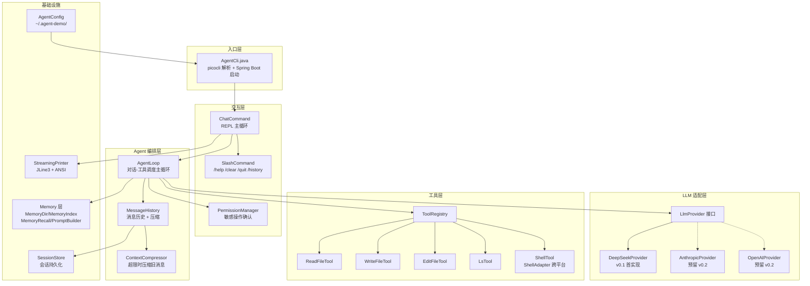
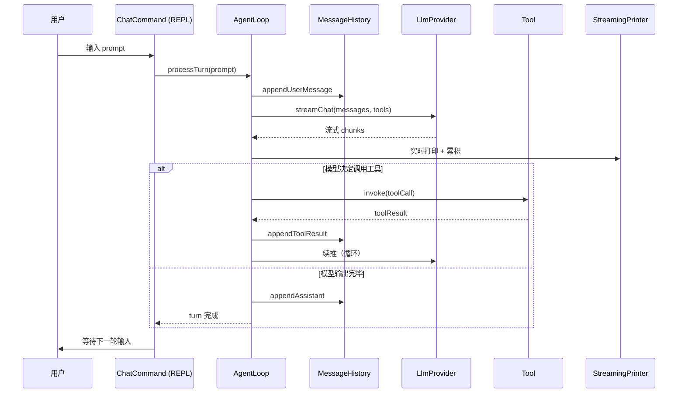
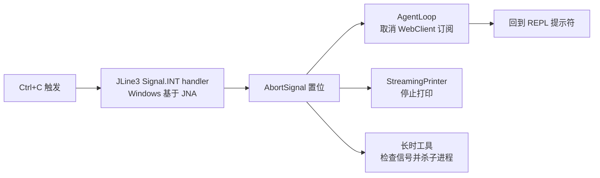

# agent-demo 设计文档

> Java 编写的 Claude Code 风格 Agent CLI。第一阶段独立调 LLM API（DeepSeek），后续可扩展多 Provider。
>
> **状态**：草稿 v0.1，每节确认后追加更新

---

## 1. 背景与目标

### 1.1 用户场景

希望在本机终端里使用类似 Claude Code 的 agent 体验：

- 在命令行输入 prompt，流式看到模型回复
- 模型能调用本地工具（读写文件、执行 bash），自主完成多步任务
- **会话历史持久化**到本地（v0.1 保存，**v0.2 再加 resume**）
- 支持 slash 命令：v0.1 仅 `/help /clear /quit /history`，`/model /resume` v0.2 再加
- 危险操作（写文件、执行命令）有交互式确认

### 1.2 不做什么（v0.1 边界）

- 不依赖 dsh（独立调 LLM API）
- 不做 Web UI（CLI 优先）
- 不做 Subagent / Hooks / Skills 系统（v0.3+ 再考虑）
- 不做插件市场、远程协作等
- 不做 Team Memory / Memory Snapshot（v0.2+ 再加）
- 不做 Session Memory Compaction hook（v0.2 再加）

### 1.3 验收标准

| # | 验收项 |
|:---:|------|
| 1 | 在 `agent-demo chat` 进入 REPL，可连续多轮对话 |
| 2 | 模型返回 tool_call 时自动调用本地工具，结果反馈给模型 |
| 3 | 流式输出（边生成边打），不卡顿 |
| 4 | 会话可保存到 `~/.agent-demo/sessions/`（v0.1 不支持 resume，v0.2 加） |
| 5 | 写文件 / 命令执行需用户确认（默认 allow-read, ask-write） |
| 6 | 命令行参数支持 `--model`、`--api-key`、`--system-prompt` 等 |

---

## 2. 总体架构

### 2.1 模块视图



### 2.2 一次提问的数据流



### 2.3 模块职责

| 模块 | 职责 | 关键 API |
|------|------|---------|
| `AgentCli` | picocli 入口，Spring Boot 启动 | `main()` |
| `ChatCommand` | REPL 主循环，读输入、调 AgentLoop、显示输出 | `run()` |
| `SlashCommand` | 解析 `/xxx` 内置命令 | `dispatch(token)` |
| `PermissionManager` | 工具调用前的权限校验与确认 | `confirm(toolCall, ctx): Decision` |
| `AgentLoop` | 单轮对话：构建请求 → 流式响应 → 工具调度 → 续推 | `processTurn(userMsg): AssistantMsg` |
| `MessageHistory` | 消息列表 + token 计数 + 压缩触发 | `append()`, `totalTokens()` |
| `ContextCompressor` | 超 token 上限时压缩旧消息（保留 system + 最近 N 轮） | `compress(history)` |
| `LlmProvider` | 抽象接口，屏蔽不同 LLM API 差异 | `streamChat(req): Flux<Chunk>` |
| `DeepSeekProvider` | DeepSeek API（OpenAI 兼容协议）实现 | implements `LlmProvider` |
| `ToolRegistry` | 注册/查找工具，把 `ToolSpec` 转成 provider 需要的 schema | `list()`, `get(name)` |
| `Tool` | 单个工具的接口 | `execute(args): Result` |
| `SessionStore` | 会话持久化（JSON 文件） | `save()` (v0.1), `load(id)` (**v0.2 resume 用**) |
| `AgentConfig` | 配置加载（API key、模型、token 上限等） | `load()` |
| Memory 层 | 长期记忆：目录管理、MEMORY.md 索引、相关召回、prompt 注入 | `MemoryDir` / `MemoryIndex` / `MemoryRecall` / `MemoryPromptBuilder` |
| `StreamingPrinter` | 流式输出到终端（代码块围栏 + tool_call 高亮；行内 markdown 粗体/斜体/表格 v0.2） | `printChunk()`, `flush()` |

> **流式渲染策略（v0.1 两态）**：`StreamingPrinter` 只维护 INLINE / CODE_FENCE 两态状态机；代码块围栏未闭合前原样输出、不解析 markdown 或 ANSI；未闭合超过 200 字符或 5s 强制 flush 并提示。完整 markdown 渲染（粗体/表格/列表，三态状态机）属 v0.2。

---

## 3. 技术栈

| 类别 | 选型 | 版本 | 理由 |
|------|------|------|------|
| JDK | OpenJDK | 17 | 与 `rocketmq-demo` 保持一致 |
| 框架 | Spring Boot | 3.2.x | 同上 |
| HTTP | Spring WebFlux `WebClient` | 6.1.x | 原生支持 SSE 流式响应 |
| CLI | picocli | 4.7.x | 注解式，子命令/选项齐全 |
| JSON | Jackson | 2.15.x | Spring Boot 默认 |
| 终端 | JLine3 | 3.25.x | raw mode、历史、自动补全 |
| 构建 | Maven | 3.9.x | 与现有项目一致 |

**不引入**：

- Lombok（增加心智负担，IDE 插件依赖）
- spring-boot-starter-web（CLI 不需要 servlet 容器）
- 数据库（v0.1 用 JSON 文件存会话足够）

---

## 4. 模块结构（Maven 标准布局）

```
agent-demo/
├── pom.xml
├── README.md
├── docs/
│   ├── design/
│   │   └── design.md
│   └── guides/
└── src/
    ├── main/java/com/example/agent/
    │   ├── AgentCli.java
    │   ├── cli/
    │   │   ├── ChatCommand.java
    │   │   ├── SlashCommand.java
    │   │   └── Completion.java
    │   ├── agent/
    │   │   ├── AgentLoop.java
    │   │   ├── MessageHistory.java
    │   │   ├── ContextCompressor.java
    │   │   └── TurnResult.java
    │   ├── provider/
    │   │   ├── LlmProvider.java
    │   │   ├── ChatRequest.java
    │   │   ├── ChatResponse.java
    │   │   ├── StreamChunk.java
    │   │   ├── ToolSpec.java
    │   │   ├── ToolCall.java
    │   │   ├── FinishReason.java
    │   │   └── deepseek/
    │   │       ├── DeepSeekProvider.java
    │   │       ├── DeepSeekMapper.java
    │   │       └── DeepSeekDtos.java
    │   ├── tools/
    │   │   ├── Tool.java
    │   │   ├── ToolRegistry.java
    │   │   ├── ToolResult.java
    │   │   ├── ReadFileTool.java
    │   │   ├── WriteFileTool.java
    │   │   ├── EditFileTool.java
    │   │   ├── LsTool.java
    │   │   ├── ShellAdapter.java
    │   │   └── ShellTool.java
    │   ├── session/
    │   │   ├── Session.java
    │   │   ├── SessionStore.java
    │   │   └── SessionSerializer.java
    │   ├── memory/
    │   │   ├── MemoryDir.java          # memory 目录管理（路径/权限）
    │   │   ├── MemoryEntry.java        # 单条记忆（标题/描述/正文）
    │   │   ├── MemoryIndex.java        # MEMORY.md 索引解析/序列化
    │   │   ├── MemoryPromptBuilder.java # 把 memory 拼到 system prompt
    │   │   ├── MemoryRecall.java       # 相关记忆召回（关键词匹配）
    │   │   └── MemoryScope.java        # scope 枚举（v0.1 仅 USER）
    │   ├── permission/
    │   │   ├── PermissionManager.java
    │   │   ├── PermissionPolicy.java
    │   │   └── Decision.java
    │   ├── render/
    │   │   ├── StreamingPrinter.java
    │   │   ├── MarkdownRenderer.java
    │   │   └── AnsiCode.java
    │   └── config/
    │       ├── AgentConfig.java
    │       ├── ConfigLoader.java
    │       └── EnvKeys.java
    ├── main/resources/
    │   ├── application.yml
    │   ├── logback.xml
    │   └── banner.txt
    └── test/java/com/example/agent/
        ├── provider/deepseek/DeepSeekProviderTest.java
        ├── agent/AgentLoopTest.java
        ├── tools/ReadFileToolTest.java
        └── ...
```

---

## 5. Claude Code 借鉴整合

设计过程中参考了 Claude Code 源码解析（E:\md-main\AI-Agent\开源项目\Claude Code源码解析）。整合项分为三档：

### 5.1 v0.1 必须整合

| # | 来源 | 整合点 | 实现位置 |
|:---:|------|--------|---------|
| 1 | 04b §2 | Tool 协议对象含 `isConcurrencySafe/isReadOnly/isDestructive/renderUse/renderResult` | `Tool.java` |
| 2 | 04b §2.2 | Fail-Closed 默认：所有新工具默认 `isConcurrencySafe=false/isReadOnly=false` | `Tool.java` 默认方法 |
| 3 | 04b §4 | `partitionToolCalls()` 按并发安全分批 | **v0.2**（v0.1 工具串行执行，无需分批） |
| 4 | 04b §6 | 执行管线：schema 校验 → 权限 → 执行 → 标准化 tool_result | `AgentLoop.processToolCall()` |
| 5 | 04i §2-3 | Append-only JSONL 会话存储，目录权限 0600/0700 | `SessionStore.java` |
| 6 | 04i §3.1 | 异步批量 flush 写盘 | `SessionStore.append()` |
| 7 | 04f §2 | Capped max_tokens 默认 8000（slot 预约优化） | `AgentConfig.java` |
| 8 | 04f §2.1 | 预留 20k 给 summary API | `ContextCompressor.java` |
| 9 | 04f §3 | Auto-Compact 熔断器（连续 3 次失败后停） | `ContextCompressor.java` |
| 10 | 04f §4 | Strip images before summarize | **no-op 占位**（v0.1 无图像输入，v0.2 支持视觉后启用） |
| 11 | 04f §4.3 | PTL fallback：剥 20% 旧消息重试 | `ContextCompressor.retryWithShrink()` |
| 12 | 04f §4.4 | Post-Compact 状态重注入（刚打开的文件、激活的工具） | `ContextCompressor.reinjectState()` |
| 13 | 04 §3 | Memory 目录 + `MEMORY.md` 入口文件 + 硬截断（200 行 / 25KB） | `memory/MemoryDir.java` |
| 14 | 04 §3.3 | `buildMemoryPrompt()` 把 MEMORY.md 内容注入 system prompt | `memory/MemoryPromptBuilder.java` |
| 15 | 04 §5 | Relevant Memory Recall：每轮召回 ≤5 个最相关记忆文件 | `memory/MemoryRecall.java`（v0.1：token 重叠评分 ≥ `recallMinScore`） |
| 16 | 04 §7.10 | Agent 自动获得 FileRead/FileWrite/FileEdit 来操作 memory | `ToolRegistry` 自动注入 |

### 5.2 v0.2+ 再考虑（v0.1 留扩展点）

> 可插拔扩展点（Plugin 框架）已由 add-plugin-system 落地，详见 `docs/guides/plugins.md`；以下为其它待定扩展点。

- 多入口 fast-path 分流（cli.tsx 模式）
- MCP 工具池融合 `assembleToolPool()`
- partitionToolCalls() 并发分批（v0.1 串行执行，不需要）
- Lite reader（头尾 64KB 快速列出会话）
- Resume 链路修复（snip / parallel tool_result 孤儿处理）
- Forked Agent 借主对话 Prompt Cache
- Streaming Tool Executor 状态机（v0.1 简化为串行）

### 5.3 v0.1 明确不做

- Subagent / sidechain transcript
- Skills 系统
- Plan attachment
- Memory Snapshot（snapshot.json / .snapshot-synced.json）
- Team Memory（带同步、checksum）
- Auto Memory 后台提取（v0.1 手动写，v0.2 加自动提取）
- Memory 三 scope 中的 project / local（v0.1 仅 user scope）
- Hooks / 插件市场
- Bridge / Remote mode
- Headless / SDK 模式

### 5.4 Memory 设计细化（v0.1 仅 user scope）

§5.1 整合项 #13-16 的实现依据，分散设计点集中于此（配置见 §9 `memory.*`）：

> 记忆系统的完整架构（写入链路 / 注入链路 / 召回算法 / 演进路线）见独立文档 [memory-design.md](./memory-design.md)。

| 项 | 设计 |
|----|------|
| 目录 | `~/.agent-demo/memory/`，权限 0700 |
| 入口文件 | `MEMORY.md`（索引：标题 + 一行摘要），硬截断 200 行 / 25KB |
| 注入 | `MemoryPromptBuilder.buildMemoryPrompt()` 每轮请求前把 MEMORY.md 内容拼进 system prompt |
| 召回 | `MemoryRecall`：v0.1 为 token 重叠评分（查询与记忆文件的字面 token 重叠率 ≥ `recallMinScore` 才召回，每轮 ≤ `maxRecallFiles` 个）；语义召回（sideQuery）v0.3 |
| 写入 | Agent 经自动注入的 ReadFile/WriteFile/EditFile 工具直接操作 memory 目录（§5.1 #16）；v0.1 手动写，v0.2 加自动提取 |
| scope | v0.1 仅 user；project / local 见 §15 v0.2 |

**与上下文压缩的关系**：memory 内容挂在 system prompt，不参与 §8.2 的消息坍缩（System 消息保留）。

---

## 6. 核心数据契约

### 6.1 LLM Provider 抽象

```java
public interface LlmProvider {
    String name();
    Flux<StreamChunk> streamChat(ChatRequest request);
    int estimateTokens(ChatRequest request);

    /** 模型上下文窗口（用于压缩阈值计算） */
    int contextWindow();

    /** 最大输出 token 数（用于压缩预算） */
    int maxOutputTokens();
}
```

**Provider 默认值表**：

| Provider | 模型 | `contextWindow()` | `maxOutputTokens()` |
|---------|------|:-----------------:|:-------------------:|
| DeepSeek | `deepseek-chat` | 128000 | 8192 |
| DeepSeek | `deepseek-reasoner` | 128000 | 8192 |
| OpenAI | `gpt-4o` | 128000 | 16384 |
| Anthropic | `claude-3-5-sonnet` | 200000 | 8192 |

> **DeepSeek 实际窗口**：V3 = 64K、V3.2 = 128K（API 文档）。文档中历史出现的 200K 是 Claude 数值，已废弃。

**`estimateTokens` 实现**：使用 [JTokkit](https://github.com/knuddelsgmbh/jtokkit) 的 `o200k_base` 编码（OpenAI o1/o3 系列所用）。DeepSeek 未公开官方 tokenizer，但 o200k 对 DeepSeek 的中英文混合输入误差通常 < 5%，可接受。引入依赖：

```xml
<dependency>
    <groupId>com.knuddels</groupId>
    <artifactId>jtokkit</artifactId>
    <version>0.6.1</version>
</dependency>
```

实现：

```java
public class TokenEstimator {
    private final Encoding encoding = Encodings.newDefaultEncodingRegistry()
        .getEncoding(EncodingType.O200K_BASE);

    public int estimate(String text) {
        return encoding.countTokens(text);
    }

    public int estimate(ChatRequest req) {
        int total = estimate(req.systemPrompt() != null ? req.systemPrompt() : "");
        for (Message m : req.messages()) {
            total += estimate(m.content());               // 只估内容，不序列化整条消息
            if (m instanceof Message.Assistant a && a.toolCalls() != null) {
                total += estimate(serializeToolCalls(a.toolCalls()));  // toolCalls JSON 单独计
            }
        }
        return total;
    }

    private String serializeToolCalls(List<ToolCall> toolCalls) {
        return MAPPER.writeValueAsString(toolCalls);      // 共享 ObjectMapper（Jackson）
    }
}
```

> **估算校准**：`stream_options.include_usage` 能拿到每次请求的真实 usage。M1 在 `DeepSeekProviderTest` 里对同一批语料做「真实 usage vs JTokkit 估算」对照，若偏差稳定 > 5%，在 `TokenEstimator` 中引入修正系数（估算值 × 系数）。

### 6.2 Tool 协议对象（借鉴 Claude Code）

```java
public interface Tool<I, O> {
    String name();
    String description();
    Map<String, Object> inputSchema();    // LLM 看的 JSON Schema

    // 安全属性（默认 fail-closed）
    default boolean isConcurrencySafe(I input) { return false; }
    default boolean isReadOnly(I input) { return false; }
    default boolean isDestructive(I input) { return false; }
    default PermissionDecision checkPermissions(I input, ToolContext ctx) {
        return PermissionDecision.ask();
    }

    // 渲染
    String renderUse(I input);
    String renderResult(O output);

    // 执行
    ToolResult<O> execute(I input, ToolContext ctx);
}
```

### 6.3 ToolContext（执行时上下文总线）

```java
public record ToolContext(
    Path workingDirectory,
    PermissionManager permissions,
    SessionStore sessionStore,    // 工具可读刚 append 的消息
    AbortSignal abortSignal      // 中断信号
) {}
```

### 6.4 Message / StreamChunk（sealed interface）

```java
public sealed interface Message permits Message.User, Message.Assistant, Message.ToolResult, Message.System {
    String role();
    record User(String content) implements Message {
        public String role() { return "user"; }
    }
    record Assistant(String content, List<ToolCall> toolCalls) implements Message {
        public String role() { return "assistant"; }
    }
    record ToolResult(String toolCallId, String content, boolean isError) implements Message {
        public String role() { return "tool"; }
    }
    record System(String content) implements Message {
        public String role() { return "system"; }
    }
}

public sealed interface StreamChunk
        permits StreamChunk.TextDelta, StreamChunk.ToolCallStart,
                StreamChunk.ToolCallDelta, StreamChunk.ToolCallEnd,
                StreamChunk.Usage, StreamChunk.Finished, StreamChunk.Error {
    record TextDelta(String text) implements StreamChunk {}
    record ToolCallStart(String id, String name) implements StreamChunk {}
    record ToolCallDelta(String id, String argumentsDelta) implements StreamChunk {}
    record ToolCallEnd(String id, String name, String arguments) implements StreamChunk {}
    record Usage(int promptTokens, int completionTokens) implements StreamChunk {}
    record Finished(FinishReason reason, Usage usage) implements StreamChunk {}
    record Error(String message, int httpStatus, Throwable cause) implements StreamChunk {}
}
```

> **注意**：sealed interface 的 record 实现类必须显式实现抽象方法（即使是 record 形式）。`role()` 是抽象方法——必须由每个 record 重写（即使 record 自动合成了 getter，接口方法不会自动生成）。`default` 方法会被 record 自动继承，无需重写。

### 6.5 工具结果截断与权限裁决顺序

**工具结果截断**：`ToolResult` 回流给模型前统一截断，默认 `tools.resultMaxBytes = 30000`（30KB），超出部分丢弃并在末尾追加 `[truncated: N bytes omitted]` 标记，防止模型读大文件瞬间吃满上下文。

**权限裁决顺序**（`AgentLoop.processToolCall()` 统一执行）：

1. `PermissionPolicy` 全局规则（危险命令黑名单、敏感路径）→ 命中即拒绝或强制 ask
2. `Tool.checkPermissions(input, ctx)` 工具级裁决 → `allow` 放行 / `deny` 拒绝
3. 结果仍是 `ask` → `PermissionManager.confirm()` 交互确认（危险命令二次确认）

> 敏感路径（`**/.ssh/**`、`**/.env*`、`**/*credentials*`、`**/*.pem` 等，见 §9 `permission.sensitivePathPatterns`）**读操作也强制 ask**，默认 allow-read 不适用。

**权限模式**（add-permission-mode-dropdown）：web 输入区有权限模式下拉（`read_only` / `workspace_write` / `full_access`，缺省 `read_only`），由 `PermissionMode` 枚举承载，决定 `PermissionManager.decide()` 的**全局允许/询问基准**（不改变工具级 `DENY` 终态兜底）：

| 模式 | READ | WRITE（工作目录内）| WRITE（工作目录外）| SHELL / OTHER | 敏感路径 |
|------|:---:|:---:|:---:|:---:|:---:|
| `read_only` | allow | ask | ask | ask | ask |
| `workspace_write` | allow | allow | ask | ask | ask |
| `full_access` | allow | allow | allow | allow | allow |

- 裁决顺序：`full_access` → 全 allow；否则命中敏感路径 → ask；否则按 `mode × category`（`workspace_write` 下 WRITE 用 `ToolContext.workingDirectory()` 判工作区边界）。
- 模式为**会话（流）级运行状态**：新会话缺省 `read_only`；`POST /api/chat/send` 的 `permission_mode` 设初始模式；`POST /api/chat/{stream_id}/permission` 实时切换（`AgentLoop.setPermissionMode`，volatile，对齐 `setModel` 范式）。不持久化，刷新/新会话重置。
- 工具级 `DENY`（`checkPermissions` / shell 黑名单 / `isDestructive`）始终是终态，任何模式都不能覆盖（§Q9）。

### 6.6 ShellTool 与 ShellAdapter（跨平台命令执行）

```java
public interface ShellAdapter {
    List<String> commandLine(String command);   // 组装 [executable, arg, command]
    List<String> defaultDenylist();             // 该 shell 对应的危险命令黑名单
}
```

**配置与组装**：`executable + arg` 成对配置（§9 `shell.*`），`commandLine(command)` = `[executable, arg, command]`：

| 平台 | 默认 executable | 默认 arg | 可选模式 |
|------|----------------|---------|---------|
| Unix | `/bin/bash` | `-c` | - |
| Windows | `cmd.exe` | `/c` | `powershell.exe` + `-Command` |

**黑名单匹配语义**（v0.1，M3 单元测试覆盖）：

- 归一化：命令名取 basename（`/bin/rm` → `rm`）；短参数簇展开为标志集合（`-rf` ≡ `-fr` ≡ `-r -f` ≡ `{r, f}`）
- 命中条件：命令名相同，且黑名单条目的标志集合 ⊆ 输入命令的标志集合
- 验证用例：`rm -rf /tmp`、`rm -fr`、`/bin/rm -r -f` 命中；`ls -rf`、`rm /tmp`、`rm -r` 不命中
- 合并：`PermissionPolicy.destructiveCommands[platform]` ∪ `ShellAdapter.defaultDenylist()`，去重后统一「强制二次确认」
- 内置条目：cmd 对应 `format`、`diskpart`、`bcdedit`、`rmdir /s /q`、`del /f /s /q`；bash 对应 `rm -rf`、`mkfs`、`dd`、`shutdown`

**进程沙箱**（M3 硬约束，配置见 §9 `shell.*`）：

| 约束 | 默认 | 说明 |
|------|------|------|
| 单次超时 | `timeoutSec = 120` | 超时杀进程树，返回 `isError: true` |
| 输出上限 | `maxOutputBytes = 1MB`（stdout+stderr 累计） | 超出截断 + 杀进程 + `[truncated]` 标记 |
| 环境清理 | `sanitizeEnv.enabled = true` | 按 glob 模式剥离敏感变量（大小写不敏感，命中即从子进程 env 移除） |
| 进程树回收 | `killProcessTree = true` | Unix `ProcessHandle.descendants()`；Windows `taskkill /T /F` |

**环境变量清理规则**：模式为 glob（AntPathMatcher 风格：`*` 匹配任意段、`**` 跨段），大小写不敏感；内置默认 `*API_KEY*`、`*TOKEN*`、`*SECRET*`、`*PASSWORD*`、`*PRIVATE_KEY*`；config 的 `shell.sanitizeEnv.patterns` 与内置**合并（追加，不覆盖）**。

**无持久 shell**：每次调用独立进程，`cd` 跨调用不生效；需要时写 `cd /path && cmd`（v0.1 不提供 persistent session）。

---

## 7. Agent 主循环（借鉴 Claude Code query.ts）

```java
public Mono<TurnResult> processTurn(Message.User userMsg) {
    history.append(userMsg);
    return streamUntilStable(history, 0)      // 打印统一在内部 doOnNext，外层不再打印（终态轮次会被重放，避免双打）
        .flatMap(this::maybeCompact)
        .map(this::buildTurnResult);
}

private Flux<StreamEvent> streamUntilStable(MessageHistory history, int iteration) {
    // 工具调用次数上限，防止模型/工具诱导无限循环
    if (iteration >= config.agent().maxToolIterations()) {
        log.warn("hit maxToolIterations={}, stopping turn", iteration);
        return Flux.error(new MaxIterationsExceededException(iteration));
    }

    return llm.streamChat(toRequest(history))
        .doOnNext(this::printToUser)                    // 流式打印文本增量
        .collectList()
        .flatMapMany(chunks -> {
            Message.Assistant assistant = extractAssistant(chunks);  // 含 toolCalls
            history.append(assistant);                   // 关键：每轮 assistant 必须先入 history
            if (assistant.toolCalls().isEmpty()) {
                return Flux.fromIterable(chunks);        // 无工具调用，结束本轮
            }
            return executeTools(assistant.toolCalls())
                .flatMap(results -> {
                    history.appendToolResults(results);  // assistant(tool_calls) 与 tool 消息成对
                    return streamUntilStable(history, iteration + 1);  // 递归 + 计数
                });
        });
}
```

> **消息顺序约束**（OpenAI 兼容协议）：续推请求中，含 tool_calls 的 assistant 消息必须位于其所有 tool 消息之前，且 tool 消息一一对应 toolCallId；缺失成对关系 DeepSeek 直接返回 400。这也是本草图把 assistant append 放在递归分支内的原因。

**配置**（`~/.agent-demo/config.yaml`）：

```yaml
agent:
  maxToolIterations: 25      # 与 Claude Code 默认对齐；超限后终止本轮并提示用户
```

### 7.1 DeepSeek Provider 请求体的 stream_options

**关键陷阱**：DeepSeek（OpenAI 兼容协议）默认 SSE 流**只在最后一个 chunk 返回 usage 字段**，但 `prompt_tokens` 字段默认**为 null**。要在最后一个 chunk 拿到完整 token 计数，请求体必须带 `stream_options: {include_usage: true}`。否则 §6.4 的 `StreamChunk.Usage.promptTokens` 永远是 0，§8 压缩触发器拿不到精确 token 数。

```java
// DeepSeekProvider 请求体构造
Map<String, Object> extra = Map.of(
    "stream_options", Map.of("include_usage", true)   // ← 必须
);

return new ChatRequest(
    req.model(),
    req.systemPrompt(),
    req.messages(),
    req.tools(),
    req.temperature(),
    req.maxTokens(),
    extra
);
```

SSE chunk 映射：

```java
// 最后一个 chunk 的 delta.usage 是完整的：
// {prompt_tokens: 1234, completion_tokens: 567, total_tokens: 1801}
StreamChunk.Usage usage = new StreamChunk.Usage(
    chunk.usage().promptTokens(),    // ← 需要 include_usage 才非 null
    chunk.usage().completionTokens()
);
```

`AgentLoop` 在收到 `Finished(reason, usage)` 时一次性写入 `MessageHistory.totalTokens`，用于 §8 压缩阈值判断。

---

## 8. 上下文压缩（借鉴 04f）

### 8.1 触发与重试策略

**所有数值由 `AgentConfig` + `LlmProvider` 联合注入，不再硬编码**：

```java
@Component
public class ContextCompressor {
    private final LlmProvider provider;
    private final AgentConfig config;

    public Mono<MessageHistory> compactIfNeeded(MessageHistory hist) {
        int contextWindow = provider.contextWindow();        // 由 provider 提供（DeepSeek=128000）
        int maxOutput     = provider.maxOutputTokens();      // DeepSeek=8192
        int buffer        = config.context().autoCompactBuffer();

        // 阈值 = 窗口 - 输出上限 - 缓冲
        int threshold = contextWindow - maxOutput - buffer;

        if (hist.estimateTokens() < threshold) return Mono.just(hist);

        // 熔断计数器挂在 MessageHistory 上：每会话独立，多 session / 多 Provider 互不污染
        if (hist.consecutiveCompactFailures() >= config.context().maxConsecutiveCompactFailures()) {
            log.warn("compact circuit-broken after {} failures", hist.consecutiveCompactFailures());
            return Mono.error(new CompactCircuitBrokenException());
        }

        return compact(hist)
            .doOnSuccess(r -> hist.resetCompactFailures())
            .doOnError(e -> hist.incrementCompactFailures())
            .onErrorResume(this::ptlFallback);
    }

    private Mono<MessageHistory> ptlFallback(Throwable e) {
        // compact 请求本身超限 → 剥 20% 旧消息重试
        if (isPtlError(e)) {
            return compactWithShrink(currentHistory, 0.2);
        }
        return Mono.error(e);
    }
}
```

**DeepSeek 校准后的数值**（`config.yaml` 默认）：

```yaml
context:
  # 上下文窗口和 maxOutput 由 provider 自动提供，不在 config 里写死
  # deepseek-chat: contextWindow=128000, maxOutputTokens=8192
  autoCompactBuffer: 8000       # 提前 8k 触发（深聊模型输出 8k 时还能留余地）
  maxConsecutiveCompactFailures: 3
  summaryModel: deepseek-chat   # 压缩专用模型（可与主模型不同）
```

DeepSeek 阈值 = 128000 − 8192 − 8000 = **111808 tokens**——压缩将在此触发。

### 8.2 压缩本体（消息如何坍缩成 summary）

**summary prompt 模板**（实现为 classpath 资源 `prompts/summarize.txt`，内容如下）：

> 你是一个对话摘要助手。请将以下对话历史压缩为结构化 markdown：
>
> 占位符 `[消息历史 JSONL]` 替换为实际历史。
>
> 输出要求：
>
> 1. 保留：用户目标、已完成的工作、关键决策、未完成的任务
> 2. 保留：当前激活的文件路径（用于 Post-Compact 重新注入）
> 3. 保留：已调用的工具及其结果摘要
> 4. 丢弃：冗余的中间思考、已不再相关的细节
> 5. 输出 ≤ 2000 tokens

**请求参数**：summary 请求显式设置 `max_tokens: 2000`（与模板第 5 条一致，硬性约束输出预算）。

**消息坍缩规则**：

| 原消息类型 | 压缩后 |
|-----------|--------|
| `System` | **保留**（注入到新 history 头部） |
| 早期 `User` | **丢弃**（保留最近 3 条） |
| 早期 `Assistant`（含 tool_call） | 坍缩成 `- **做了什么**：XXX` 一行 |
| 早期 `ToolResult` | 坍缩成 `- **结果**：XXX (成功/失败)` |
| 最近 3 轮 user/assistant/tool_result | **保留原文** |
| `meta` (title/model/tags) | **保留** |

**Post-Compact 状态重注入**：

```java
private Mono<MessageHistory> reinjectState(MessageHistory compacted) {
    return Mono.fromRunnable(() -> {
        // 1. 把刚通过 ReadFileTool 看过的文件内容（前 200 行）重新挂到 system 后
        // 2. 重新插入一条 system 边界消息说明："前面的对话已被压缩为摘要"
        // 注：工具列表/schema 无需重注入——tools 随每次请求体发送（§6.2）
        compacted.prependSystemBoundaryMessage();
        compacted.reinjectRecentFileContents(this::recentFiles, 200);
    }).thenReturn(compacted);
}
```

---

## 9. 默认配置文件示例

`~/.agent-demo/config.yaml`：

```yaml
# LLM Provider 配置（v0.1 仅 deepseek）
provider:
  name: deepseek              # 默认 provider
  model: deepseek-chat         # 默认模型
  baseUrl: https://api.deepseek.com
  apiKey: ${DEEPSEEK_API_KEY}  # 优先从环境变量读；config 中明文仅作 fallback
  maxOutputTokens: 8192        # 与 §6.1 Provider 表一致；应用层可再收紧
  requestTimeoutSec: 120       # 连接建立 + 响应头超时（§11.4）
  firstTokenTimeoutSec: 60     # 首 token（TTFT）超时（§11.4）；预留 reasoner 长思考（v0.2）
  idleTimeoutSec: 30           # 流中途空闲超时（§11.4）

# Agent 行为
agent:
  maxToolIterations: 25        # 单轮工具调用上限（§7）

# 上下文管理：窗口与输出上限由 provider 注入（§8.1），config 只留缓冲与熔断
context:
  autoCompactBuffer: 8000
  maxConsecutiveCompactFailures: 3
  summaryModel: deepseek-chat   # 压缩专用模型（可与主模型不同）

# 权限策略（裁决顺序见 §6.5）
permission:
  defaultRead: allow
  defaultWrite: ask
  defaultShell: ask
  sensitivePathPatterns:       # 读操作也强制 ask（默认 allow-read 不适用）
    - "**/.ssh/**"
    - "**/.env*"
    - "**/*credentials*"
    - "**/*.pem"
  destructiveCommands:
    # Linux/macOS 黑名单（shell: /bin/bash）
    linux:
      - rm -rf
      - mkfs
      - dd if=
      - shutdown
    # Windows 黑名单（默认 shell cmd /c；配 powershell 时换对应语法）
    windows:
      - format
      - diskpart
      - bcdedit
      - rmdir /s /q
      - del /f /s /q

# 命令执行（§6.6 ShellAdapter）
shell:
  unix:
    executable: /bin/bash
    arg: -c
  windows:
    executable: cmd.exe
    arg: /c
    # powershell 模式：executable: powershell.exe, arg: -Command
  timeoutSec: 120              # 单次命令硬超时（§6.6 进程沙箱）
  maxOutputBytes: 1048576      # stdout+stderr 累计上限（1MB）
  sanitizeEnv:
    enabled: true              # 剥离敏感环境变量（§6.6 匹配规则）
    patterns:                  # 与内置默认合并（追加）
      - "*API_KEY*"
      - "*TOKEN*"
      - "*SECRET*"
  killProcessTree: true        # 超时/中断连带回收子进程树

# 会话存储
session:
  dir: ~/.agent-demo/sessions/
  flushIntervalMs: 200
  flushBatchSize: 50

# 工具
tools:
  resultMaxBytes: 30000        # tool_result 回流截断上限（§6.5）

# REPL 行为
repl:
  prompt: '> '
  historyFile: ~/.agent-demo/.history
  maxLines: 1000    # 单次输入超过此行数自动提交
  inputLockedDuringStream: true  # v0.1 流式期间锁定输入（JLine 默认）；异步输入 v0.2

# 长期记忆（§5.1 / §5.4 / M5）
memory:
  dir: ~/.agent-demo/memory/
  entrypoint: MEMORY.md
  maxEntrypointLines: 200
  maxEntrypointBytes: 25000
  maxRecallFiles: 5
  recallMinScore: 0.3          # token 重叠评分阈值（v0.1 召回算法）

# 成本控制（§18）：按 model id 分桶，currentModel() 精确匹配 → provider 级回退 → 全局默认
cost:
  prices:
    deepseek-chat:
      inputPricePerMillion: 2.0    # 按官方定价更新
      outputPricePerMillion: 8.0
    deepseek-reasoner:             # v0.2 启用
      inputPricePerMillion: 4.0
      outputPricePerMillion: 16.0
    # openai / anthropic 条目 v0.2 随 provider 接入补
  warnAtYuan: 4                # 达到即告警，停止开启重型动作
  stopAtYuan: 5                # 达到即停止一切工作（全局成本红线）
```

**API key 优先级**：

1. 环境变量 `DEEPSEEK_API_KEY`（最高优先）
2. `~/.agent-demo/config.yaml` 中 `provider.apiKey` 字段（明文，文件权限 0600）
3. 都没有 → 启动失败并提示运行 `agent-demo init`

**双配置文件优先级**：

| 来源 | 用途 | 优先级 |
|------|------|--------|
| `src/main/resources/application.yml` | 内置默认值（兜底） | 最低 |
| 环境变量（`DEEPSEEK_API_KEY` 等） | 用户运行时覆盖 | 中 |
| `~/.agent-demo/config.yaml` | 用户持久化偏好 | 最高 |

加载顺序：先读 `application.yml` 作为 baseline → 再叠 `~/.agent-demo/config.yaml`（深合并，用户值覆盖默认） → 最后用环境变量覆盖敏感字段（API key 等）。

启动时根据 `OS.name` 自动选用对应平台的黑名单子集（不同 shell 的黑名单语法不同，见 §6.6）。

---

## 10. 会话存储（借鉴 04i §2-3）

```
~/.agent-demo/
├── config.yaml
├── memory/                                  # 长期记忆（§5.1 / §5.4 / M5）
│   ├── MEMORY.md
│   └── ...
├── sessions/
│   ├── 2026-08-26T10-23-45-{uuid}.jsonl    # 主 transcript
│   └── ...
└── cache/                                   # 临时缓存
```

**工作区与会话重命名**（add-workspaces-and-rename）：

- 工作区 = 真实运行目录。默认工作区 `agent-demo` 仍映射顶层 `sessions/`（**不迁移**既有会话）；新建工作区落到 `workspaces/<name>/{meta.json, sessions/}`，其会话 `cwd=工作区 dir`、会话存档落该工作区 `sessions/`。
- 会话重命名走侧车 `<id>.meta.json{title}`；列表摘要（`SessionController.derive`）**优先侧车标题**，否则回落首条消息派生的自动标题。归档/恢复时 `SessionStore` 连带搬移该侧车。
- 会话运行时落盘目录与运行目录按工作区路由：`WebAgentRuntime.sessionsDirFor(workspace)` / `buildLoop(..., workingDirOverride)`。

**JSONL schema**（每行一个 entry，JSON）：

```json
{"type":"user",        "uuid":"...", "parentUuid":"...", "content":"...", "timestamp":"2026-08-26T10:23:45Z"}
{"type":"assistant",   "uuid":"...", "parentUuid":"...", "content":"...", "toolCalls":[], "timestamp":"..."}
{"type":"tool_result", "uuid":"...", "parentUuid":"...", "toolCallId":"...", "content":"...", "isError":false, "timestamp":"..."}
{"type":"system",      "uuid":"...", "parentUuid":"...", "content":"...", "timestamp":"..."}
{"type":"meta",        "uuid":"...", "parentUuid":"...", "key":"title|model|tags", "value":"...", "timestamp":"..."}
```

**写盘策略**：
- 每条 entry 进入内存 queue
- 每 200ms 或 queue 满 50 条时批量 flush
- **关键节点 sync flush**：用户输入提交、`Finished`、工具调用完成时，对未落盘 entry 单条同步写入（`FileChannel.force(true)`），防 kill -9 / 断电丢失；shutdown hook（§17.1）只兜底正常退出路径
- **双路径去重**：`SessionStore` 维护 `lastSyncedOffset`（queue 已持久化的尾位置）；sync flush 只写 `[lastSyncedOffset, queueEnd)` 区间并推进 offset，批量 flush 同样按 offset 推进，同一 entry 不会被写两遍
- flush 失败写 stderr 日志，不静默丢弃
- 文件权限 0600，目录权限 0700
- 追加失败重试（mkdir 后重写）

**v0.1 resume 不做**：session 文件仅追加，不读取。v0.2 加 `/resume` 从最新文件加载。

---

## 11. 错误处理策略

### 11.1 分级

| 错误类型 | 触发场景 | 处理策略 | 处理层 |
|---------|---------|---------|--------|
| 网络错误 | `IOException` / 超时 / 连接拒绝 | 自动重试 3 次，指数退避（1s → 2s → 4s） | `LlmRetry` |
| 401 / 403 | API key 错误 / 余额不足 | 立即停止，提示用户检查 `~/.agent-demo/config.yaml` | `LlmRetry` |
| 429 | 速率限制 | 自动重试 5 次（按 Retry-After header 退避） | `LlmRetry` |
| 500 / 502 / 503 | 服务端错误 | 自动重试 3 次 | `LlmRetry` |
| 400 / context_too_long | 消息超出模型上下文 | 抛出 `ContextOverflowException` 给上层；`AgentLoop` 捕获后调 `ContextCompressor` 压缩再重试一次；仍失败则提示用户 `/clear` | `AgentLoop` |
| 工具执行错误 | `tool.call()` 抛异常 | 捕获并返回 `tool_result { isError: true }` 让模型自己处理（与 Claude Code 一致） | `AgentLoop` |
| Schema 校验失败 | 工具参数不符合 schema | 返回错误给模型重试，不向用户报错 | `AgentLoop` |
| 权限拒绝 | 用户拒绝工具调用 | 返回 `tool_result { isError: 'permission_denied' }` 给模型 | `PermissionManager` |

> **层级关系**：`LlmRetry` 处理"网络/服务端/认证"类瞬时错误；`ContextCompressor` 处理"上下文超限"这种业务级错误；工具类错误由 `AgentLoop` 直接包装。互不交叉。

### 11.2 实现

```java
public class LlmRetry {

    /** 请求建立阶段的瞬时错误：重试 3 次（1s → 2s → 4s）。流中途失败不在此重试（§11.3） */
    public static <T> Mono<T> retryOnTransient(Mono<T> source) {
        return source.retryWhen(Retry.backoff(3, Duration.ofSeconds(1))
            .maxBackoff(Duration.ofSeconds(10))
            .filter(LlmRetry::isTransientError)
            .doBeforeRetry(signal -> log.warn("retrying after {}: {}",
                signal.totalRetries(), signal.failure().toString())));
    }

    /** 429 限流：按 Retry-After 头退避，最多 5 次 */
    public static <T> Mono<T> retryOnRateLimit(Mono<T> source) {
        return source.retryWhen(Retry.from(retrySignal -> {
            Throwable e = retrySignal.failure();
            if (retrySignal.totalRetries() >= 5) return Mono.error(e);
            long retryAfterMs = parseRetryAfterOr(e, 1000L * (1 << retrySignal.totalRetries()));
            return Mono.delay(Duration.ofMillis(retryAfterMs));
        }).filter(e -> e instanceof WebClientResponseException wcre
            && wcre.getStatusCode().value() == 429));
    }

    private static boolean isTransientError(Throwable e) {
        // 网络层：连接超时/拒绝/重置
        if (e instanceof IOException) return true;
        // WebClient 请求阶段的网络错误（连接超时/重置，非 HTTP 响应）
        if (e instanceof WebClientRequestException) return true;
        // 5xx 服务端错误
        if (e instanceof WebClientResponseException wcre
            && wcre.getStatusCode().is5xxServerError()) return true;
        // 429 单独由 retryOnRateLimit 处理
        return false;
    }

    private static long parseRetryAfterOr(Throwable e, long fallback) {
        if (e instanceof WebClientResponseException wcre) {
            String header = wcre.getHeaders().getFirst("Retry-After");
            if (header != null) {
                try { return Long.parseLong(header) * 1000; }
                catch (NumberFormatException ignored) {}
            }
        }
        return fallback;
    }
}
```

### 11.3 重试边界（流式语义）

| 阶段 | 是否自动重试 | 理由 |
|------|------------|------|
| 连接建立 / 收到首个 chunk 之前（IOException、`WebClientRequestException`、429、5xx） | 是（§11.2） | 用户尚未看到任何输出，重试无副作用 |
| SSE 流中途断开（首个 chunk 之后） | 否 | 已打印内容无法回退，重试会造成重复输出；提示用户重新发起 |

**实现**：重试操作符只包在「建立连接并获取响应」的 `Mono` 上（`exchangeToMono` / `bodyToFlux` 的首个信号），不包在整个流式 `Flux` 上。`LlmRetry` 的方法签名因此统一为 `Mono<T>`。

### 11.4 超时控制（TTFT + 整体超时）

| 超时 | 默认 | 实现 | 触发后 |
|------|------|------|--------|
| 连接建立 + 响应头 | 120s | WebClient `.responseTimeout(...)` | 按 §11.3 判定是否重试 |
| 首 token（TTFT） | 60s | `Flux.timeout(firstTimeout, nextTimeout)` 的 first | 提示用户；不自动重试（模型可能仍在思考） |
| 流中途空闲 | 30s | 同一操作符的 next | 同上 |

```java
WebClient.builder()
    .responseTimeout(Duration.ofSeconds(config.provider().requestTimeoutSec()))
    .build();
// Reactor 3.5+ 双参版本：首元素用 TTFT 阈值，元素间用空闲阈值
llm.streamChat(request)
    .timeout(
        Duration.ofSeconds(config.provider().firstTokenTimeoutSec()),
        Duration.ofSeconds(config.provider().idleTimeoutSec()));
```

> 流式阶段的中断不受超时限制：Ctrl+C 经 §17.1 信号处理取消订阅，连接建立阶段同样生效。

---

## 12. 测试策略

| 层 | 测试类型 | 工具 |
|----|---------|------|
| Provider 层 | WebTestClient 模拟 SSE 流 | JUnit 5 + Spring WebFlux Test |
| AgentLoop 层 | 用 fake provider（`FakeLlmProvider`）模拟工具调用链 | JUnit 5 + Mockito |
| Tool 层 | 真实文件系统操作（用 JUnit `@TempDir`） | JUnit 5 |
| SessionStore | 临时目录 + JSONL 读写 | JUnit 5 |
| ContextCompressor | 给定固定 token 数 → 验证压缩结果 | JUnit 5 |
| CLI 端到端 | 用 `picocli.testing` + stdout 快照 | Snapshot testing |
| 系统级压测 | 1000 轮长对话（fake provider 回放）验证内存 / 耗时 / 压缩触发 | JUnit 5 + JFR |
| 安全测试 | prompt injection 诱导 `rm -rf` → 必须走权限确认；敏感路径读取被拦截 | JUnit 5 |

**覆盖率目标**：核心模块（provider、agent、tools）≥ 80%。

---

## 13. 打包与分发

### 13.1 Maven 配置

```xml
<build>
    <finalName>agent-cli</finalName>
    <plugins>
        <plugin>
            <groupId>org.springframework.boot</groupId>
            <artifactId>spring-boot-maven-plugin</artifactId>
            <configuration>
                <mainClass>com.example.agent.AgentCli</mainClass>
            </configuration>
        </plugin>
    </plugins>
</build>
```

### 13.2 构建产物

```
agent-demo/
├── target/
│   └── agent-cli.jar          # fat jar（~15MB），可直接执行
└── README.md
```

### 13.3 用户使用流程

```bash
# 1. 构建
mvn clean package -DskipTests

# 2. 首次运行生成默认配置
java -jar agent-cli.jar init
# 创建 ~/.agent-demo/config.yaml

# 3. 编辑 config.yaml 填入 API key
vim ~/.agent-demo/config.yaml

# 4. 进入交互模式
java -jar agent-cli.jar chat

# 5. 或用 launcher 脚本
./bin/agent chat
```

### 13.4 Windows 启动脚本

`bin/agent.bat`：
```bat
@echo off
java -jar "%~dp0..\target\agent-cli.jar" %*
```

---

## 14. v0.1 验收清单与里程碑

### 14.1 验收清单

| # | 验收项 | 通过标准 |
|:---:|------|---------|
| 1 | `agent chat` 启动 REPL | 进入交互模式，提示符显示 `> ` |
| 2 | 单轮对话 | 输入问题 → 流式输出回复 |
| 3 | 工具调用 | 让模型读文件 → 模型调用 ReadFileTool → 结果反馈给模型 → 输出基于文件内容的回复 |
| 4 | 命令执行工具（ShellTool） | 让模型运行命令 → 权限确认 → 执行 → 结果回流（Windows 默认 cmd.exe /c，Unix 默认 /bin/bash -c，§6.6） |
| 5 | 会话持久化 | `/quit` 后重新启动 → 上次会话在 `~/.agent-demo/sessions/` 存在 |
| 6 | 配置生效 | 修改 `config.yaml` 后重启 `agent chat` 生效（v0.1 不做热加载，v0.2 加） |
| 7 | 错误重试 | 临时断网后恢复 → 自动重连成功 |
| 8 | 权限确认 | 写文件 / 命令执行必须用户确认 |
| 9 | Memory 写入 | 让模型记住某事 → 模型写 `~/.agent-demo/memory/topic.md` → 重启后能从 MEMORY.md 索引看到 |
| 10 | Memory 召回 | 让模型写过多条记忆 → 新会话提问与记忆**字面重叠**的主题 → token 重叠评分 ≥ 0.3 → 自动注入相关记忆文件（v0.1 召回算法为字面重叠，语义召回 v0.3 sideQuery） |
| 11 | 单轮上限 | 故意构造诱导循环的 prompt → 工具调用超过 25 次后自动终止并提示用户 |
| 12 | 上下文压缩 | 灌满 128K 对话 → 自动压缩为 summary → 后续对话仍能继续（阈值逻辑用 fake provider 单测覆盖；真实 API 仅做一次冒烟，控制成本） |
| 13 | Ctrl+C 中断 | 流式输出时按 Ctrl+C → 立即停止当前生成，回到 REPL 提示符 |
| 14 | 成本可见 | 每轮结束 token 用量写入 session meta；`/history` 显示累计 token 与估算费用（§18） |

### 14.2 里程碑

| 里程碑 | 周期 | 交付物 |
|--------|------|--------|
| M0 脚手架 | 1 天 | Maven 项目结构 + Spring Boot 启动 + picocli 空命令 |
| M1 Provider | 1 天 | `DeepSeekProvider` + 流式 SSE 解析 + `stream_options.include_usage` + JTokkit 估算 + 单元测试 |
| M2 Agent 核心 | 2 天 | `AgentLoop`（含 `maxToolIterations`） + `MessageHistory` + 流式打印 + Ctrl+C 处理 |
| M3 工具层 | 2 天 | 5 个基础工具（含 Windows 编码回退） + `ToolRegistry` + 权限确认（含跨平台黑名单 + §6.6 匹配语义） + ShellTool 进程沙箱（超时/输出上限/环境清理/进程树回收） |
| M4 上下文压缩 | **2 天**（原 1 天偏乐观） | `ContextCompressor`（provider 注入窗口）+ summary prompt + 消息坍缩规则 + Post-Compact 重注入 + 熔断 |
| M5 Memory | **1.5 天** | `MemoryDir` + `MemoryIndex` (MEMORY.md 200行/25KB 截断) + `MemoryRecall`（关键词召回 ≤5）+ 自动注入文件工具 |
| M6 会话存储 | 1 天 | `SessionStore` JSONL + 异步批量 flush + 关键节点 sync flush（v0.1 仅 `save()`，`load()` v0.2） |
| M7 错误处理与重试 | 0.5 天 | `LlmRetry` 重写（IOException / `WebClientRequestException` / 5xx / 429 Retry-After）+ 401 立即停止 + 超时控制（§11.4） |
| M8 Slash 命令 | 0.5 天 | `/help /clear /quit /history`（含 token 累计显示） |
| M9 配置与启动 | 0.5 天 | config 加载（双优先级）+ `init` 子命令 + Windows launcher（chcp 65001）+ README 使用示例（`chat` / `--model` / `/history` 输出格式 / 危险命令确认样式） |
| M10 E2E 测试 | 1 天 | 端到端验收清单 #1-#14 全部通过 |
| **总计** | **~12 天** | 可用 v0.1 |

---

## 15. 后续版本预览

> **当前进度**：v0.1 → v0.2 → v0.3 已完成（175 commits）。本节列出的任务按版本标注 ✅ 已完成 / 待实现。OpenSpec change 详情见 `openspec/`。

### v0.1（CLI REPL，已完成 ✅）

- 4 层架构（入口/REPL/Agent 编排/工具/基础设施）
- 5 个 Tool（ReadFile/WriteFile/EditFile/Ls/Shell）+ 双编码回退
- Memory 系统（MEMORY.md 索引 + token 重叠召回）
- SessionStore（JSONL append-only）
- ContextCompressor（熔断 + PTL fallback）
- Slash 命令（/help /clear /quit /history）
- 100+ 单测 + jacoco 门禁

### v0.2（已完成 ✅）

- `/resume` 加载最近会话（af5ef8a 归档 OpenSpec change）
- `/model` 运行时切换 provider（`e37be9f` setModel 改 volatile）
- Ctrl+C 中断（JLine3 + InterruptController）
- `deepseek-reasoner` 思维链渲染（折叠区）
- StreamingToolExecutor 状态机并发
- Session Memory Compaction（compact 时优先用 SM）
- REPL 异常不退出（`friendlyError` 提示 401/429/网络 + 继续 REPL）

### v0.3（已完成 ✅）

- agent-web 模块：React 18 + Vite 6 三栏 UI + SSE 流
- 可观测性 T1-T8 组（日志事件链路 / 脱敏 / 日志保留 / LogController）
- 可测试性 T6 组（session 回放 + golden E2E）
- MiniMax provider（中国版 OpenAI 兼容）
- OpenSpec 迭代流程落地（AGENTS.md §2.5）

### v0.4（待实现）

- MCP 客户端集成
- Memory 三 scope（user / project / local）
- Resume 链路修复（snip / parallel tool_result）
- SideQuery 召回（替代 token 重叠）
- Skills 系统 / Subagent

### v1.0（计划）

- Team Memory / 远程同步
- Worktree 模式
- Plugin 系统（已实现，add-plugin-system）
- `web_search` 网络搜索工具（已实现；DeepSeek 原生检索 / Tavily 双 provider 自动选择，设计见 add-web-search-tool change）
- Prompt Cache 复用

迭代流程：所有 v0.2+ 变更通过 `/opsx:propose` 启动（OpenSpec），写 delta spec → `apply-change` 实现 → `archive-change` 合并进 `openspec/specs/`。详见 `AGENTS.md` §2.5。

---

## 16. 风险与缓解

| 风险 | 影响 | 缓解 |
|------|------|------|
| DeepSeek API 协议变更 | Provider 失效 | 抽象 `LlmProvider` 接口；版本化 DTO；监控 API 公告 |
| 流式输出卡顿 | UX 差 | JLine3 + ANSI 转义；定期刷新缓冲；测试大文件输出场景 |
| 工具误调用（rm -rf） | 数据丢失 | 默认权限策略 `ask`；危险命令额外二次确认；维护跨平台危险黑名单（§9） |
| 上下文膨胀 | API 调用失败 | 提前 8k 触发压缩（DeepSeek 校准）；压缩失败熔断；连续失败提示 `/clear` |
| 第三方依赖漏洞 | 安全风险 | Maven 锁定版本；OWASP Dependency-Check 定期扫描 |
| JLine3 在 Git Bash 兼容性 | REPL 输入异常 | 在 Windows 下用 JLine3 + ANSI 测试；降级方案：原生 Console + 线程读输入 |
| Windows 中文编码（GBK vs UTF-8） | 读取 GBK 文件乱码；输出中文异常 | 见 §17.2 三重防御 |
| 模型诱导无限工具调用 | Token 烧钱 | §7 的 `maxToolIterations=25` 强制终止 + §18 成本累计（4 元预警 / 5 元停止） |
| 流式输出无法中断 | 用户卡死感 | §17.1 Ctrl+C 中断 + `AbortSignal` 传播 |

---

## 17. 中断与编码兼容

### 17.1 Ctrl+C 中断设计

**触发源**：用户在 REPL 中按 `Ctrl+C`（SIGINT）。

**分阶段处理**：

| 阶段 | 机制 | 说明 |
|------|------|------|
| 输入等待阶段 | JLine3 `UserInterruptException` | 捕获后清空当前输入行，重新显示提示符 |
| 流式输出 / 工具执行阶段 | 信号处理器置位 `AbortSignal` | 立即取消当前生成，回到提示符 |

> **为什么不用 shutdown hook 做主路径**：`Runtime.addShutdownHook` 属于 JVM 退出流程，SIGINT 触发退出序列后无法恢复 REPL 循环（Windows 上更是直接进入 shutdown）。它只降级为兜底清理（flush 未落盘会话）。

**处理链路**：



**关键实现**：

```java
public class InterruptController implements AutoCloseable {
    private final Terminal terminal;
    private final AtomicBoolean aborted = new AtomicBoolean(false);
    private volatile long lastAbortAt = 0;

    public InterruptController(Terminal terminal, Runnable onAbort) {
        this.terminal = terminal;
        try {
            // JLine3 统一入口：Unix 内部走 sun.misc.Signal，Windows 走 JNA console handler
            terminal.handle(Terminal.Signal.INT, signal -> {
                if (!aborted.get()) {
                    aborted.set(true);
                    lastAbortAt = System.currentTimeMillis();
                    onAbort.run();          // 取消订阅 / 杀子进程 / 停止打印
                    return;
                }
                if (System.currentTimeMillis() - lastAbortAt < 500) {
                    System.exit(130);       // 第二次 Ctrl+C（500ms 内）：强制退出
                }
                // 超过 500ms 的再次 Ctrl+C：流退订通常在 1s 内完成；
                // 流已停止后由输入层（JLine UserInterruptException）接管 → 表现为清空当前输入行
            });
        } catch (UnsupportedOperationException e) {
            // 无信号能力的终端（如某些 mintty 组合）：shutdown hook 仅做兜底清理，
            // flush 未落盘会话，不承诺回到提示符
            Runtime.getRuntime().addShutdownHook(new Thread(this::flushPendingSessions));
        }
    }

    public boolean isAborted() { return aborted.get(); }

    /** 注入到 ToolContext，让长时工具能感知 */
    public AbortSignal asAbortSignal() {
        return () -> aborted.get();
    }

    @Override
    public void close() {
        terminal.handle(Terminal.Signal.INT, null);
    }
}
```

**各组件的响应**：

| 组件 | 响应 |
|------|------|
| `StreamingPrinter` | 立即停止打印，光标回到新行 |
| `AgentLoop` | 跳出 `streamUntilStable` 递归，不续推 |
| `LlmProvider` | 取消 WebClient SSE 订阅（`subscription.cancel()`） |
| `Tool.execute`（ShellTool 等长时工具） | 长时操作定期 check `AbortSignal`，中断时杀子进程 |
| `REPL` | 重新显示提示符 `> `，等下一轮输入 |

**多次 Ctrl+C 行为**：

- 第一次：置位 `AbortSignal`，优雅中断当前生成，回到提示符
- 第二次（500ms 内）：`System.exit(130)` 强制退出（SIGINT 约定退出码）
- 超过 500ms 的再次 Ctrl+C：若流已停止（回到提示符），由输入层接管，表现为清空当前输入行；若流仍在退订中，忽略（退订通常在 1s 内完成）

### 17.2 Windows 中文编码三重防御

Windows CMD 默认 GBK，PowerShell 默认 UTF-8，Git Bash 默认 UTF-8。三层防御确保中文不乱码：

**第 1 层：JVM 启动参数（launcher 脚本）**

`bin/agent.bat`：

```bat
@echo off
chcp 65001 >nul                          # CMD 切换到 UTF-8
java -Dfile.encoding=UTF-8 ^
     -jar "%~dp0..\target\agent-cli.jar" %*
```

`bin/agent.sh`（Git Bash）：

```bash
#!/usr/bin/env bash
export LANG=en_US.UTF-8
export LC_ALL=en_US.UTF-8
exec java -Dfile.encoding=UTF-8 -jar "$(dirname "$0")/../target/agent-cli.jar" "$@"
```

**第 2 层：JLine3 配置**

```java
Terminal terminal = TerminalBuilder.builder()
    .encoding(StandardCharsets.UTF_8)
    .build();   // 保留 JNA：Windows 下 Ctrl+C 信号处理依赖它（§17.1）
```

> Git Bash（mintty）下 JLine 的 JNA 路径有兼容风险时，按 §16 风险表降级为原生 Console + 线程读输入；该模式下信号处理同步降级为 shutdown hook 兜底清理（§17.1）。

**第 3 层：ReadFileTool 编码回退**

```java
public ToolResult<ReadOutput> execute(ReadInput input, ToolContext ctx) {
    Path path = ctx.workingDirectory().resolve(input.path());

    // 优先 UTF-8
    try {
        return ToolResult.ok(new ReadOutput(Files.readString(path, StandardCharsets.UTF_8)));
    } catch (MalformedInputException e) {
        // 回退 GBK（中文 Windows 文件常见）
        try {
            return ToolResult.ok(new ReadOutput(
                Files.readString(path, Charset.forName("GBK"))));
        } catch (IOException ex) {
            return ToolResult.error("无法读取文件（UTF-8/GBK 都失败）: " + ex.getMessage());
        }
    }
}
```

**输出编码**：JLine3 + UTF-8 输出到终端，所有 prompt / 错误信息 / 中文回复统一 UTF-8，不再出现乱码。

---

## 18. 可观测性与成本控制

| 项 | 方案 |
|----|------|
| 会话标识 | sessionId（uuid）+ turnId 贯穿日志（logback MDC），便于定位单会话问题 |
| Token 计量 | `Finished.usage` 累计写入 session meta（JSONL `meta` entry，`key=cost`），每轮更新 |
| 成本估算 | 按 §9 `cost.prices` 查表（model id 精确匹配 → provider 级回退）× 累计 token 估算；`/history` 显示累计 token 与估算费用；达到 `warnAtYuan` 告警、`stopAtYuan` 停止（对齐全局成本红线） |
| 日志分流 | 应用日志 → 主写 `~/.agent-demo/logs/agent.log`，WARN 及以上镜像到 stderr（交互期可见）；模型输出 → 纯 stdout；两者绝不混流，保证 `java -jar agent-cli.jar > out.txt` 时 stdout 是干净的对话内容 |
| 关键指标 | 每轮耗时 / TTFT / 工具调用次数 / 重试次数，debug 级日志 |