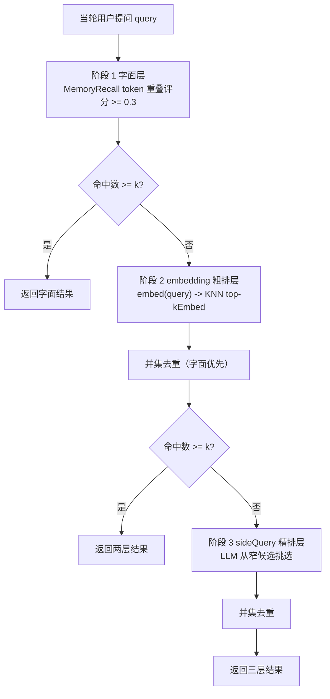
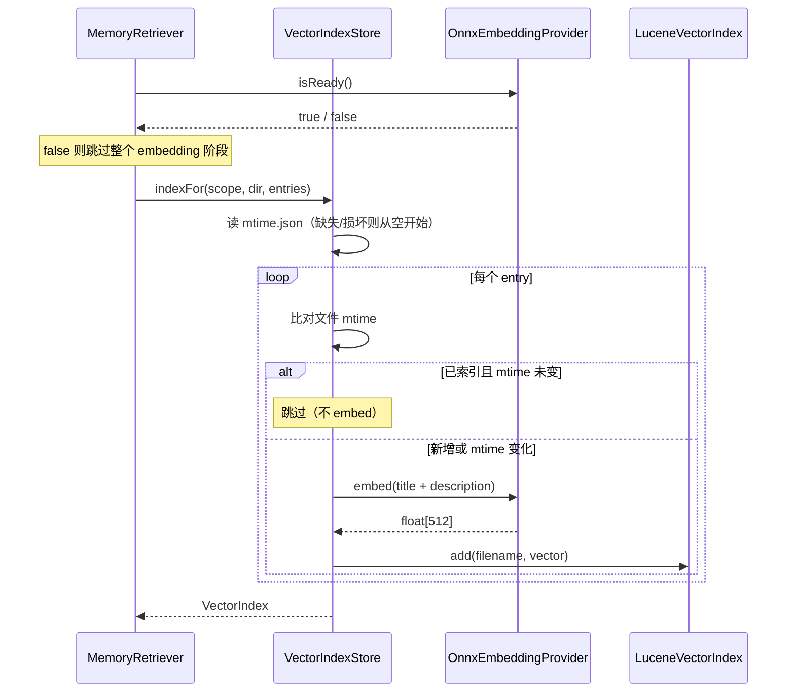
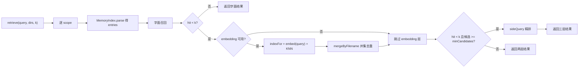

# Embedding RAG 设计 —— 本地 ONNX + Lucene HNSW 三层召回

> 本文件记录 `add-embedding-rag` change 的技术设计：Memory 召回从「字面 + sideQuery」两层升级为「字面 + embedding 粗排 + sideQuery 精排」三层。含组件划分、数据流、降级矩阵、模型准备与实测数据。
>
> 关联文档：`memory-recall-deep-dive.md`（Memory 系统全链路详解）、`openspec/specs/memory-embedding/spec.md`（能力规格）。

---

## 1. 为什么要 embedding

`fix-memory-recall-wiring`（2026-09-21 归档）让「每轮按当轮提问召回」的链路真正接通，但召回后端仍是 v0.3 的 LLM 选择式 sideQuery，有两个硬限制：

| 限制 | 说明 |
|------|------|
| 候选数被截断到 8 | `SideQuerySelector` 为控制 prompt 长度把候选截断；索引条目 > 8 且字面无命中时，相关条目进不了候选 |
| 每轮可能多一次 LLM 调用 | 触发时增加 ~1-3 秒延迟与几百 token 成本 |

embedding 粗排层解决这两点：候选数无硬限、检索是本地矩阵运算（毫秒级、无网络）。

---

## 2. 三层架构



每层可独立短路与降级。短路设计的目的：字面已召满时不 embed、不调 LLM；embedding 已补足时不调 LLM。

---

## 3. 组件划分

| 组件 | 职责 | 关键约束 |
|------|------|---------|
| `EmbeddingProvider` | 文本 → 512 维归一化向量 | `isReady()=false` 时 `embed()` 返回零向量且**调用方必须跳过该层** |
| `OnnxEmbeddingProvider` | 本地 ONNX 推理（懒加载 session） | 任何失败（含 `UnsatisfiedLinkError`）降级为 unavailable |
| `BertWordPieceTokenizer` | 文本 → token ids | 纯函数；词表缺失时 `encode` 返回仅 `[CLS][SEP]` |
| `VectorIndex` | id + 向量 的增删查 | 重复 id 覆盖；维度不匹配抛 `IllegalArgumentException` |
| `LuceneVectorIndex` | Lucene KNN + HNSW 索引 | 目录不可用 / 写锁冲突时退回内存目录 |
| `VectorIndexStore` | 按 scope 管理索引 + mtime 懒加载 | 缓存损坏自愈；provider 不可用时索引保持为空 |
| `MemoryRetriever` | 三层召回编排 | 每层独立 try/catch 降级 |

---

## 4. 数据流

### 4.1 索引构建（启动后首次召回时）



### 4.2 单轮召回



---

## 5. 降级矩阵

| 故障点 | 现象 | 降级行为 |
|--------|------|---------|
| 模型文件缺失 | `model.onnx` 不存在 | `isReady()=false` → 跳过 embedding 层（两层架构），启动期 WARN 含下载指引 |
| 外部权重缺失 | `model.onnx_data` 不存在 | 健康检查按总大小判定 → 同上 |
| 词表缺失 | `vocab.txt` 不存在 | tokenizer 不就绪 → 同上 |
| ONNX native lib 缺失 | `UnsatisfiedLinkError` | catch `Throwable` → 同上（不崩进程） |
| ONNX 推理异常 | `session.run` 抛异常 | 记 WARN + 返回零向量；调用方因 `isReady()` 仍为 true 可能收到零向量 → **故推理失败时应视为不可用**（见下方"已知限制"） |
| Lucene 目录不可写 | `FSDirectory.open` 失败 | 退回 `ByteBuffersDirectory`（内存索引），仅丧失持久化 |
| Lucene 写锁冲突 | 同进程另一实例持锁 | 退回内存索引（web 端多会话并发时的常见情形） |
| mtime 缓存损坏 | JSON 解析失败 | 记 WARN + 从空缓存开始（全量重算，自愈） |
| 向量维度异常 | `embed` 返回长度不符 | 跳过该条，不影响其余 |

**核心不变量**：`isReady()=false` 时 `MemoryRetriever` **必须**跳过 embedding 层。若在推理不可用时返回 `true`，零向量会让 KNN 任意返回 k 条（零向量与所有条目 cosine 都是 0），反而污染召回结果——这比"少一层"更糟。

---

## 6. 模型准备

### 6.1 下载

```bash
bash scripts/download-embedding-model.sh
```

默认落在 `<user.home>/.agent-demo/models/bge-small-zh-v1.5/`（与 `AgentConfig` 缺省 `modelPath` 一致）。脚本依次尝试 `huggingface.co` 与 `hf-mirror.com`。

### 6.2 为什么要下载三个文件

**这是实施期实测发现的坑**：`BAAI/bge-small-zh-v1.5` 官方仓库**只有 PyTorch 权重**，直接取 `.../resolve/main/onnx/model.onnx` 会 **404**。

正确来源是 `onnx-community/bge-small-zh-v1.5-ONNX`，且采用 **ONNX external data** 模式：

| 文件 | 大小 | 作用 |
|------|------|------|
| `model.onnx` | 41,689 字节 | 模型结构 + 对外部权重的引用 |
| `model.onnx_data` | 94,765,056 字节（~95MB） | 真实权重，**必须与 `model.onnx` 同目录同名** |
| `vocab.txt` | 109,540 字节 | BERT 词表（取自 BAAI 官方仓库，onnx-community 不含） |

**踩坑记录**：健康检查最初只看 `model.onnx` 的大小（要求 ≥ 1MB），会把 41KB 的结构文件误判为损坏而拒绝加载。现改为「`model.onnx` + `model.onnx_data` 总大小 ≥ 1MB」。

### 6.3 推理链路


L2 归一化的意义：归一化后 cosine 相似度退化为点积，Lucene KNN 与内存索引都更快，且分数范围稳定在 `[0, 1]`。

---

## 7. 实测数据

E2E 测试（真实模型 + 真实推理，4/4 通过）：

| 验证项 | 结果 |
|--------|------|
| 模型加载 + 推理 | 512 维、L2 模长 = 1.000、非零 |
| 确定性 | 同一输入两次调用向量完全一致 |
| **同义改写** | 「代码规范」vs「编码风格约定」相似度 **>** vs「今天天气真好适合出去散步」 |
| 中文同主题 | 「Java 17 的 JDK 安装与环境变量配置」vs「如何安装 JDK 并设置 JAVA_HOME」**>** vs「红烧肉的家常做法步骤」 |

同义改写那一行是 embedding 的**核心价值证明**——这两组文本没有任何 token 重叠（字面召回为 0），纯字面方案不可能把它们关联起来。

性能量级（未做严格 benchmark，仅量级参考）：

| 环节 | 量级 |
|------|------|
| 模型加载（首次） | 秒级（95MB + ONNX session 初始化） |
| 单条 `embed`（CPU） | 毫秒级 |
| Lucene KNN 检索（数十条） | 亚毫秒 |
| mtime 比对（稳态） | 亚毫秒（仅 stat 文件） |

---

## 8. 已知限制

| 限制 | 说明 | 后续方向 |
|------|------|---------|
| 手写 tokenizer 的边界覆盖 | 已覆盖 CJK 逐字、标点、小写、去重音、贪心最长匹配；但未与 HF `BertTokenizer` 做全量对拍 | 若发现分词差异，补对拍测试 |
| 模型 95MB + ONNX runtime ~30MB | 首次使用成本较高 | 可考虑量化模型（`model_quantized.onnx`） |
| 首次加载阻塞 | 首次 `embed()` 同步加载模型 | 可改为启动期异步预热 |
| 推理失败后 `isReady()` 仍为 true | `session.run` 抛异常时只对本次返回零向量，下次仍会尝试推理并可能再次失败 | 引入失败计数，连续失败 N 次后置为 unavailable |
| 多实例写锁 | web 端多会话各持一个 `VectorIndexStore`，第二个实例会退回内存索引（丧失持久化） | 改为进程级单例 store |
| 无 embedding 缓存 | 同一 query 每轮重新 embed | 加 LRU |

---

## 9. 配置

```yaml
memory:
  dynamicRetrieval: true          # 每轮按当轮提问召回（fix-memory-recall-wiring）
  sideQuery:
    enabled: true                 # 精排层开关
    maxCandidates: 8
    minCandidates: 3
  embedding:
    enabled: true                 # embedding 粗排层开关；false 则退回两层
    modelPath: ~/.agent-demo/models/bge-small-zh-v1.5/model.onnx
    hnsw:
      m: 16                       # HNSW 图节点最大连接数
      efConstruction: 200         # 构建时搜索深度
```

关闭方式（按代价从低到高）：

| 目的 | 配置 |
|------|------|
| 只关 embedding（退回两层） | `memory.embedding.enabled: false` |
| 关精排（只留字面 + embedding） | `memory.sideQuery.enabled: false` |
| 全部退回 v0.1（启动期全量索引） | `memory.dynamicRetrieval: false` |

---

## 10. 关键文件索引

| 文件 | 说明 |
|------|------|
| `agent-core/.../memory/embedding/EmbeddingProvider.java` | embedding 抽象 |
| `agent-core/.../memory/embedding/OnnxEmbeddingProvider.java` | ONNX 推理 + 懒加载 + 降级 |
| `agent-core/.../memory/embedding/BertWordPieceTokenizer.java` | BERT 中文分词 |
| `agent-core/.../memory/embedding/VectorIndex.java` | 向量索引抽象 |
| `agent-core/.../memory/embedding/LuceneVectorIndex.java` | Lucene HNSW 实现 |
| `agent-core/.../memory/embedding/InMemoryVectorIndex.java` | 内存 fallback 实现 |
| `agent-core/.../memory/embedding/VectorIndexStore.java` | 按 scope 管理 + mtime 懒加载 |
| `agent-core/.../memory/MemoryRetriever.java` | 三层召回编排 |
| `agent-core/.../core/AgentLoopFactory.java` | 装配接线 |
| `scripts/download-embedding-model.sh` | 模型下载（三文件） |
