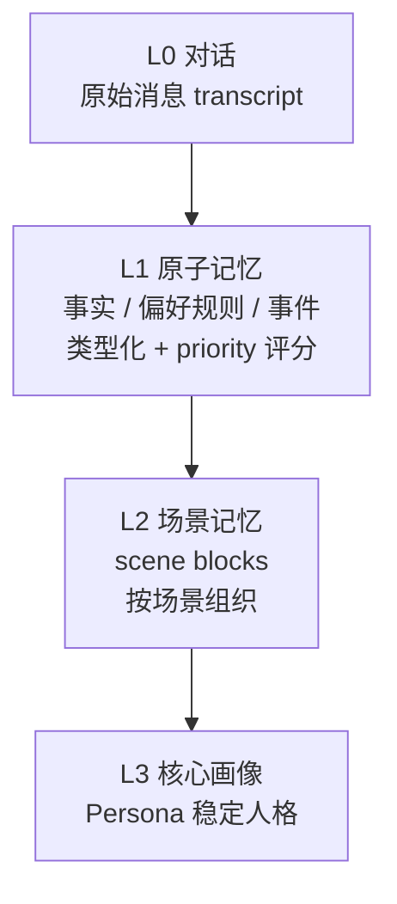
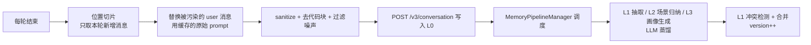
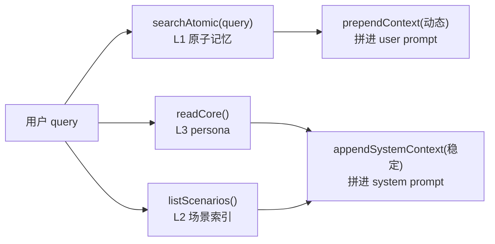

# 记忆系统对比：agent-demo vs TencentDB-Agent-Memory（MemoryCore）

> 分析日期：2026-09-03
>
> 分析对象：
> - **agent-demo**（本仓库）：Claude Code 风格 Java Agent CLI/Web，记忆系统为进程内模块。
> - **TencentDB-Agent-Memory / MemoryCore**（`E:\claude-projects\TencentDB-Agent-Memory\MemoryCore`）：独立的记忆与元数据核心服务。
>
> 目的：讲清两者各自怎么实现"长期记忆"，找出差异与值得借鉴的设计。

---

## 1. 两套系统的定位

| 项目 | 形态 | 记忆系统的角色 |
|------|------|--------------|
| agent-demo | Java 单体（CLI + Web）| 进程内模块，随 Agent 事件循环一起跑 |
| MemoryCore | Node.js 独立服务 | 独立的 HTTP Gateway（默认 `127.0.0.1:8420`），Agent 经 Adapter/SDK 接入 |

一个关键分野：**agent-demo 的记忆是"随用随取"的库；MemoryCore 是"把记忆当成一个产品级服务"来做**，因此后者在分层、隔离、自动抽取、配额审计上都做了很多。

---

## 2. MemoryCore 的原理

MemoryCore 统一提供三类数据能力：**Memory**（L0–L3）、**Knowledge 元信息**、**资产管理元信息**（User/Team/Agent/Task/Skill）。本节聚焦 Memory 部分。

### 2.1 四层记忆模型



| 层 | 内容 | 存储 |
|----|------|------|
| L0 | 原始对话消息 | JSONL + 可选向量索引 |
| L1 | 原子记忆（事实/偏好/事件）| SQLite + 向量 + FTS |
| L2 | 场景记忆索引 | 本地文件 + 索引 |
| L3 | 核心画像 / Persona | 本地文件 |

**L1 记忆是"类型化 + 带权"的**（`src/core/record/l1-writer.ts`）：

```ts
type MemoryType =
  | "persona" | "episodic" | "instruction"
  | "work_fact" | "work_task" | "work_method" | "work_artifact";

interface MemoryRecord {
  content: string;
  type: MemoryType;
  priority: number;          // 0-100；-1 = 严格全局指令
  scene_name: string;
  source_message_ids: string[];  // 溯源到对话
  metadata;
  timestamps: string[];          // 合并历史
  version?: number;              // 更新/合并自增
  sessionKey; sessionId; taskId;
}
```

### 2.2 写入链路：自动捕获 + LLM 抽取

MemoryCore **不靠模型手写**，是全自动管线。`openclaw-plugin/src/hooks/capture.ts` 在**每轮结束（agent_end）**触发：



关键设计点：

1. **防反馈循环**：召回上下文是注入到 user prompt 里的，capture 用**缓存的原始 prompt**替换该 user 消息，否则会把记忆 blob 又录回 L0 形成循环（`capture.ts` + `l0-recorder.ts`）。
2. **去重与演化**：L1 抽取后走 `l1-dedup.ts`——先向量或 FTS 候选召回，再 LLM 判定合并/更新，`version++` 记录演化。
3. **全自动但花费 LLM**：每次抽取/归纳/画像生成都要调用模型，这是它可靠性的代价。

### 2.3 召回链路：检索策略 + 两段式注入

`auto-recall.ts` 在**每轮构造 prompt 前**并行拉三样：



- **L1 检索策略可配**：`keyword / embedding / hybrid`（默认 hybrid）；无 embedding Provider 时**降级 BM25**；`maxResults`/`scoreThreshold` 默认 5/0.3；`applyRecallBudget` 做字符预算截断；5s 超时 + 优雅降级（区分"无结果" vs "召回失败"）。
- **两段式注入**（`format.ts`），为 prompt caching 优化：
  - `prependContext`（每轮变化）→ **user prompt**：`<relevant-memories>`（带类型 tag）。
  - `appendSystemContext`（稳定，可缓存）→ **system prompt**：`<user-persona>` + `Scene Navigation` 索引 + **记忆工具指南**。

### 2.4 主动检索工具化

注入的上下文不足时，Agent 可**主动调用记忆工具**：

| 工具 | 检索目标 | 说明 |
|------|---------|------|
| `tdai_memory_search` | L1 结构化记忆 | 回忆偏好/历史事件/规则 |
| `tdai_conversation_search` | L0 原始对话 | 查原文/时间线/细节 |
| `tdai_read_cos` | L2 场景 / L3 persona 文件 | 按相对路径读正文 |

> 每轮 `tdai_memory_search` 与 `tdai_conversation_search` **合计最多 3 次**。

### 2.5 多租户 / 配额 / 审计

- **多租户隔离**：v3 数据面每个请求需 `team_id / agent_id / user_id`（body 或 `x-tdai-*` header）；`session_id` 可选限定会话。
- **配额**：memory + credit 双配额（`IQuotaReporter`），上报失败吞掉不阻塞业务。
- **审计**：API trace + 敏感字段脱敏（`api-trace/`）。

---

## 3. agent-demo 的记忆系统原理

简短回顾（详见 [memory-design.md](./memory-design.md)）：

- **三作用域**：`USER`（`~/.agent-demo/memory/`）、`PROJECT`（`<cwd>/.agent-demo/memory/`）、`LOCAL`（预留，不落盘）。
- **文件即数据库**：每个 scope 下 `MEMORY.md` 索引 + 若干主题 `.md` 正文；`MemoryIndex` 解析 `- [标题](文件).md — 描述` 为 `MemoryEntry`。
- **写入是手动**：模型用注入的文件工具（ReadFile/WriteFile/EditFile）写 `memory/<topic>.md`，再自己更新 `MEMORY.md` 索引；无自动抽取。
- **注入是每轮拼 system**：`MemoryPromptBuilder` 渲染 `<memory>` 段（有 retriever 时按查询召回命中条目，否则渲染索引全文；索引 200 行/25KB 硬截断）。
- **召回是轻量**：`MemoryRecall` token 重叠评分（`|Q∩E|/|E|`，≥0.3）；命中不足时可 `SideQuerySelector` 用轻量 LLM 补，并集去重。
- **无主动检索工具、无类型、无去重演化、无配额**。

---

## 4. 差异对比

| 维度 | agent-demo | MemoryCore |
|------|-----------|-----------|
| 形态 | 进程内模块 | 独立服务（HTTP Gateway + SQLite）|
| 接入 | 代码直调 | Adapter/SDK 走 HTTP |
| 存储 | Markdown + MEMORY.md 索引 | SQLite + JSONL + 可选向量库/COS |
| 记忆层级 | 无分层（扁平主题文件）| L0/L1/L2/L3 四层 |
| 记忆类型 | 无类型 | 7 种类型 + priority 评分 |
| 写入 | 手动（模型写 md + 更新索引）| 自动（capture → L0 → LLM 蒸馏 L1/L2/L3）|
| 去重/演化 | 无 | 冲突检测 + 合并（version++）|
| 召回 | token 重叠字面评分 + 可选 sideQuery 语义补 | 关键词/Embedding/混合检索（BM25 兜底）|
| 注入 | 全拼进 system prompt | 两段式（L1→user 动态 + 稳定 persona/scene/tools→system）|
| 主动检索 | 无 | 提供 `tdai_memory_*` 工具，Agent 按需搜（每轮限 3 次）|
| 作用域 | USER / PROJECT / LOCAL | team / agent / user / session 多维隔离 |
| 配额/审计 | 无 | memory+credit 配额 + API trace/脱敏 |
| 复杂度 | 轻（约 8 类）| 大（约 836 文件：服务 + 管线 + SDK + 迁移脚本）|

---

## 5. 本质差异

> **agent-demo 把"长期记忆"做成一个"模型自觉维护的 markdown 索引库"；MemoryCore 做成"自动捕获对话 → LLM 蒸馏 → 结构化的多层级记忆服务"。**

关键取舍：

1. **写入口**：agent-demo 靠模型自律（易遗忘、不一致），MemoryCore 靠管线自动捕获+抽取（更可靠，但每次抽取都要花 LLM 调用）。
2. **可检索性**：agent-demo 只能被动注入；MemoryCore 通过记忆工具让 Agent **主动按需检索**原对话/场景正文，且拆动态/稳定两段优化 prompt caching。
3. **定位不同**：agent-demo 是单用户 CLI/Web 工具，够用即可；MemoryCore 面向**多 Agent/多租户产品**，隔离、配额、迁移、鉴权都做全了。

---

## 6. 值得借鉴的设计

针对 agent-demo 后续演进，以下点可参考：

1. **防反馈循环**：把召回上下文注入 user prompt 时，捕获侧要用缓存的原始 prompt 替换，避免记忆 blob 被回录。agent-demo 目前把记忆注入 system，天然规避了这点；但若将来做自动沉淀、且把召回上下文放进 user prompt，需注意。
2. **记录溯源**：L1 记忆带 `source_message_ids`，能回溯"这条记忆从哪句对话来"，对可信度与去重很有价值。
3. **两段式注入**：动态记忆放 user prompt、稳定 persona 放 system，能利用 prompt caching 降本。
4. **主动检索工具化**：注入不足时允许 Agent 调记忆搜索工具，而非一次性灌满，可控制上下文开销。
5. **索引截断**：agent-demo 已有 200 行/25KB 硬截断；MemoryCore 用 `applyRecallBudget` 做字符串预算截断，两者思路一致，但可考虑按 token 预算而非仅字符。

---

## 7. 结论

两套系统解决了同一问题（长期记忆），但站在不同复杂度层次：

- **agent-demo**：轻量、零外部依赖、可读可改，适合单用户工具。代价是记忆质量依赖模型自律、缺少类型/去重/主动检索。
- **MemoryCore**：产品级、自动沉淀、结构化管理、多租户隔离，适合作为 Agent 生态的持久化底座。代价是复杂度高、需要 LLM 抽取成本、需独立部署与运维。

若 agent-demo 需要更强的记忆能力，优先参考实现成本低、收益高的几点：**自动捕获 + 类型化 L1 + 两段式注入 + 主动检索工具**。
