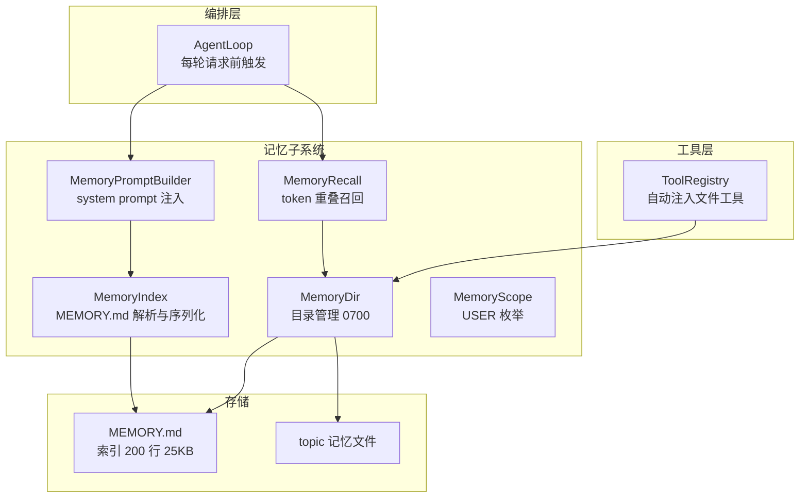
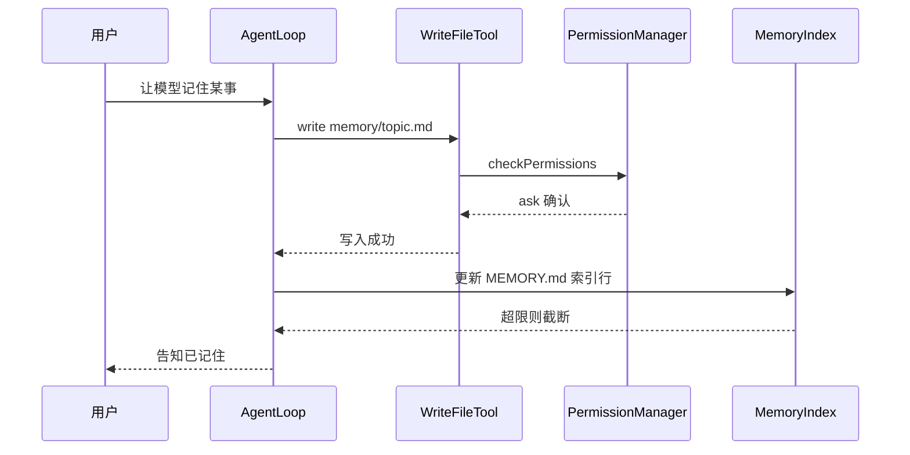
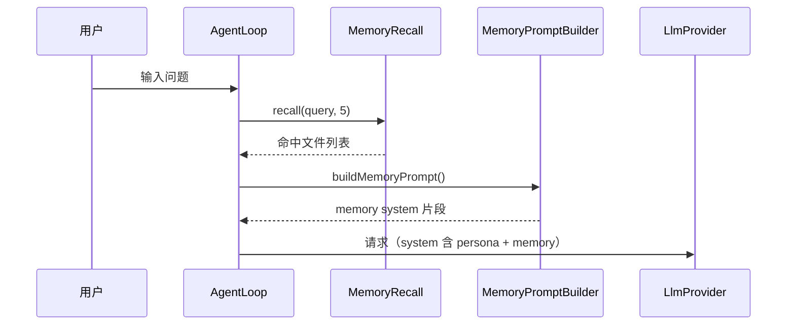

# agent-demo 记忆系统架构设计

> 版本：v0.1（草稿）
>
> 配套文档：[design.md](./design.md)（§5.1 整合项 #13-16、§5.4 Memory 设计细化、§9 memory 配置、§14.1 验收 #9/#10、§14.2 M5、§15 版本预览）
>
> 设计来源：Claude Code 源码解析（`E:\md-main\AI-Agent\开源项目\Claude Code源码解析`）04 §3 / §3.3 / §5 / §7.10，按 agent-demo 的规模裁剪

## 1. 定位与目标

### 1.1 记忆系统解决什么问题

agent-demo 有两类「记忆」，生命周期完全不同：

| 类型 | 生命周期 | 载体 | 压缩时 |
|------|---------|------|--------|
| 会话历史（session transcript） | 单次会话 | `~/.agent-demo/sessions/*.jsonl` | 被 §8.2 消息坍缩为 summary |
| 长期记忆（memory） | 跨会话、跨项目 | `~/.agent-demo/memory/` | 不参与坍缩 |

长期记忆要解决的核心矛盾：会话历史会随上下文压缩而丢失，且无法跨会话共享；用户偏好、项目约定、踩坑记录这类知识需要**跨会话沉淀、按需注入、随用随取**。

### 1.2 v0.1 范围

- 仅 **user scope**（用户级，全局生效）
- **手动写入**：Agent 通过自动注入的文件工具（ReadFile/WriteFile/EditFile）直接操作 memory 目录
- **索引注入**：`MEMORY.md` 索引每轮拼入 system prompt
- **字面召回**：token 重叠评分，每轮召回 ≤ 5 个最相关记忆文件

### 1.3 v0.1 明确不做

- Auto Memory 后台自动提取（v0.2）
- project / local scope（v0.2）
- Memory Snapshot（snapshot.json / .snapshot-synced.json）（v0.3）
- Team Memory（带同步、checksum）（v1.0）

### 1.4 设计原则

1. **文件即数据库**：markdown 文件 + `MEMORY.md` 索引，人可直接阅读和编辑，无需专用工具
2. **硬截断防膨胀**：索引文件 200 行 / 25KB 上限，杜绝无界增长
3. **字面召回优先于语义**：v0.1 不引入 embedding，token 重叠评分低成本、可解释
4. **权限复用**：memory 读写走既有工具权限链，不另开特权通道

## 2. 总体架构



### 2.1 模块职责

| 模块 | 职责 | 关键 API |
|------|------|---------|
| `MemoryDir` | 路径解析、0700 权限、记忆文件枚举 | `list()`, `resolve(name)` |
| `MemoryEntry` | 单条记忆：标题 / 摘要 / 文件路径 | record |
| `MemoryIndex` | `MEMORY.md` 解析（标题 + 一行摘要）、200 行 / 25KB 硬截断、序列化 | `parse()`, `append()`, `truncate()` |
| `MemoryPromptBuilder` | 把 MEMORY.md 内容拼进 system prompt | `buildMemoryPrompt()` |
| `MemoryRecall` | 相关记忆召回：token 重叠评分，≥ `recallMinScore` 才召回 | `recall(query, k)` |
| `MemoryScope` | scope 枚举（v0.1 仅 USER） | enum |

## 3. 核心数据模型

### 3.1 目录与文件布局

```text
~/.agent-demo/memory/          # 0700
├── MEMORY.md                  # 入口索引（200 行 / 25KB 硬截断）
├── coding-style.md            # 记忆文件：标题 + 正文
├── deepseek-api-notes.md
└── ...
```

### 3.2 MEMORY.md 索引格式

每条一行：链接 + 标题 + 一行摘要。索引只放「目录」，正文在独立文件中，保证索引轻量、正文按需加载：

```markdown
# 记忆索引

- [Java 代码审查规范](coding-style.md) - 强制/推荐/参考三级，行号+修复建议
- [DeepSeek API 踩坑](deepseek-api-notes.md) - include_usage 必须显式开启
```

### 3.3 MemoryEntry

```java
public record MemoryEntry(
    String title,       // 记忆标题
    String summary,     // 一行摘要（索引行）
    Path file,          // 正文文件路径
    int lines,          // 当前行数
    long bytes          // 当前字节数
) {}
```

### 3.4 硬截断策略

- `MEMORY.md` 写入后检查：超 200 行或 25KB 时按限额截断（保留头部索引行），并提示用户手动清理
- 单个记忆正文文件无硬上限，但受 §6.5 工具结果截断（30KB）间接约束——过大的正文被召回时也会被截断回流

## 4. 写入链路（v0.1 手动写）



要点：

1. **没有专用工具**：Agent 复用既有的 ReadFile/WriteFile/EditFile（§5.1 #16，`ToolRegistry` 自动注入），memory 目录对模型来说只是工作区下的一个普通目录
2. **权限链完整**：写 memory 同样走 §6.5 的 ask-write 确认，不存在绕过
3. **索引同步是模型责任**：写入正文后模型自行更新 `MEMORY.md`；v0.2 的自动提取会把这步产品化

## 5. 注入链路（每轮 system prompt 拼装）

`MemoryPromptBuilder.buildMemoryPrompt()` 在每轮请求前执行，产物拼入 system prompt：

1. 读取 `MEMORY.md` 索引全文（≤ 25KB，直接全量注入）
2. 拼接召回命中的记忆正文（§6，≤ 5 个文件）
3. 与 persona 基础 prompt 合并，组成最终 system 消息

```java
public String buildMemoryPrompt() {
    String index = memoryDir.readEntrypoint();        // MEMORY.md 全文
    String recalled = recall(currentQuery)            // §6 召回结果
        .stream().map(MemoryEntry::content).collect(joining("\n"));
    return """
        <memory>
        以下是用户长期记忆索引：
        %s
        以下是与当前问题相关的记忆详情：
        %s
        </memory>
        """.formatted(index, recalled);
}
```

**与上下文压缩的协作**：memory 挂在 system 侧，§8.2 的消息坍缩规则「System 保留」，因此 memory 既不随对话长度膨胀，也不随压缩丢失；压缩后的重建请求会重新走本链路拼装。

## 6. 召回链路（v0.1 token 重叠评分）

### 6.1 算法

| 步骤 | 说明 |
|------|------|
| 1. 查询 | 当前用户输入 `q` |
| 2. 候选 | memory 目录下所有记忆正文文件（不含 `MEMORY.md` 索引） |
| 3. 分词 | 复用 `TokenEstimator`（JTokkit o200k），q 与每个文件分别切为 token 集合 |
| 4. 评分 | 重叠率 = `|Q ∩ M| / |Q|`（查询 token 被文件覆盖的比例） |
| 5. 筛选 | 评分 ≥ `recallMinScore`（默认 0.3） |
| 6. 截取 | 按评分降序取前 `maxRecallFiles`（默认 5）个 |

### 6.2 复杂度与优化

- user scope 文件数量少（通常 < 50 个），逐文件 O(N) 可行，无需索引加速
- 大文件只对头部（与索引截断对齐的 25KB）参与评分，控制单轮开销

### 6.3 已知边界

- **字面重叠的局限**：同义改写（「代码规范」vs「编码风格」）会漏召回，这是 v0.1 的明确取舍
- **无命中静默降级**：召回为空时不注入详情，只注入索引，不报错
- 语义召回（sideQuery，轻量模型选择）在 v0.3 升级

### 6.4 每轮时序



## 7. 配置

`~/.agent-demo/config.yaml` 的 memory 段（与 design.md §9 一致）：

```yaml
memory:
  dir: ~/.agent-demo/memory/
  entrypoint: MEMORY.md
  maxEntrypointLines: 200
  maxEntrypointBytes: 25000
  maxRecallFiles: 5
  recallMinScore: 0.3          # token 重叠评分阈值（v0.1 召回算法）
```

## 8. 安全与权限

| 面 | 策略 |
|----|------|
| 目录权限 | 0700（仅当前用户） |
| 写入 | 走 `WriteFileTool` 权限链，默认 ask 确认（§6.5） |
| 读取 | 走 `ReadFileTool`，defaultRead=allow——memory 对模型完全可读是设计目标 |
| 敏感路径 | memory 目录不在 `sensitivePathPatterns` 内；但记忆内容可能包含敏感信息，由用户自行判断写入 |

## 9. 版本演进路线

| 版本 | 能力 | 说明 |
|------|------|------|
| v0.1 | 手动写 + 索引注入 + 字面召回 | 本文件所述 |
| v0.2 | Memory 自动提取 | 从对话中沉淀记忆，替代手动写 |
| v0.2 | 三 scope 完整 | user / project / local 分级生效 |
| v0.2 | Session Memory Compaction | compact 时优先用记忆内容做摘要 |
| v0.3 | sideQuery 语义召回 | 用轻量模型做选择，替代字面重叠 |
| v0.3 | Memory Snapshot | snapshot.json / .snapshot-synced.json |
| v1.0 | Team Memory | 带同步、checksum 的团队记忆 |

## 10. 验收与测试

### 10.1 验收项（design.md §14.1）

| # | 验收项 | 通过标准 |
|:---:|------|---------|
| 9 | Memory 写入 | 让模型记住某事 → 模型写 `~/.agent-demo/memory/topic.md` → 重启后能从 MEMORY.md 索引看到 |
| 10 | Memory 召回 | 让模型写过多条记忆 → 新会话提问与记忆**字面重叠**的主题 → token 重叠评分 ≥ 0.3 → 自动注入相关记忆文件 |

### 10.2 单元测试（M5 交付）

| 模块 | 测试点 |
|------|--------|
| `MemoryIndex` | 解析索引行、200 行 / 25KB 截断边界 |
| `MemoryRecall` | 评分阈值命中/不命中、排序、top-5 截取 |
| `MemoryPromptBuilder` | 拼装快照（索引 + 召回注入位置） |
| `MemoryDir` | 目录不存在时自动创建 0700 |

## 11. 已知局限与风险

| 风险 | 影响 | 缓解 |
|------|------|------|
| 字面召回同义失效 | 记忆命中率低 | v0.3 sideQuery；v0.1 靠索引兜底（索引全量注入） |
| 索引被模型写坏 | 注入内容异常 | 硬截断 + 解析失败时降级为不注入并提示；文件可人工修复 |
| 记忆无限增长 | 注入开销变大 | 索引 200 行 / 25KB 硬截断；正文靠用户清理 |
| 敏感信息写入 memory | 泄露风险 | 目录 0700；写需确认；建议用户自查 |
| 跨机器不共享 | 换机记忆丢失 | v1.0 远程同步（ingress 副本） |

## 12. 参考资料

- [design.md §5.4 Memory 设计细化](./design.md)
- [design.md §8.2 上下文压缩（System 保留规则）](./design.md)
- Claude Code 源码解析 04 §3 / §3.3 / §5 / §7.10（`E:\md-main\AI-Agent\开源项目\Claude Code源码解析`）
