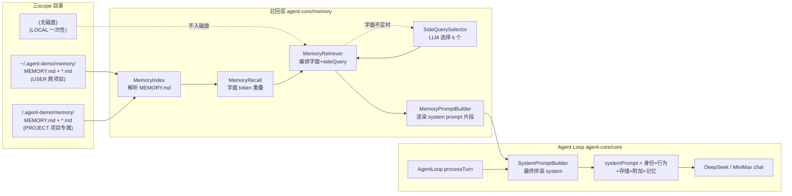
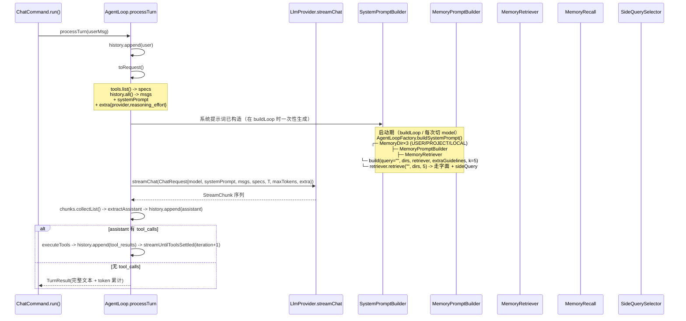
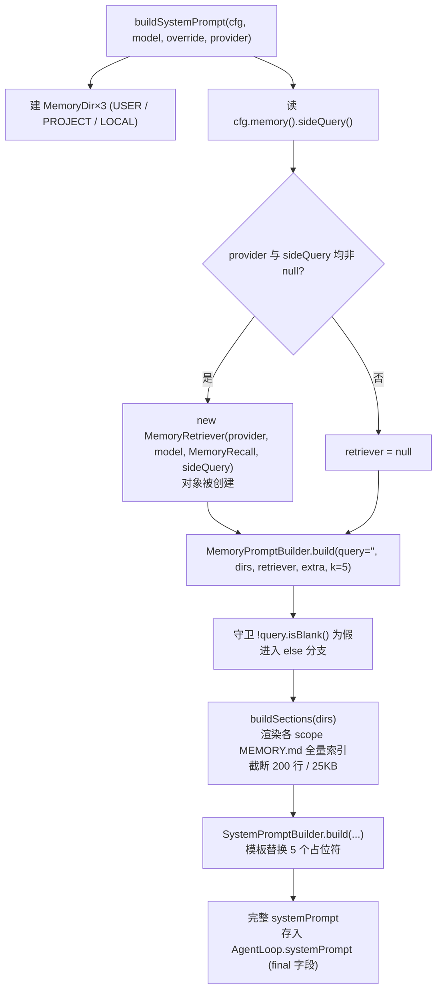
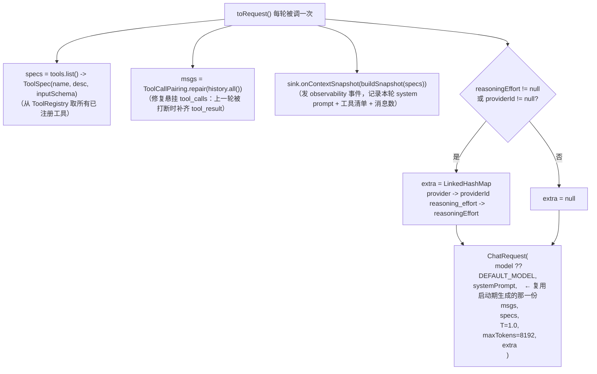

# Memory 系统详解 —— 现状（v0.4）与 Agent Loop 拼装路径

> **修复状态（2026-09-03 更新）**：本文档 §5.2「关键事实 2」与 §6.5 记录的**召回链路断点**已由 OpenSpec change
> `fix-memory-recall-wiring` 修复并归档。修复后记忆段改为**每轮按当轮用户提问动态召回**，`MemoryRetriever` /
> `SideQuerySelector` 在生产路径上可达。下文对断点的描述保留为历史记录（含证据链与归因方法），阅读时请以「已修复」为前提；
> §7.1 列出的改造项即该 change 的实施内容。
>
> 本文档另修正了原先的一处错误表述：曾把「启动期一次性生成 system prompt」称为「已知简化，不是 bug」，实为**应当修复的架构缺陷**。

> 本文档从代码视角把 Memory 系统的全链路拆开讲清楚：每轮对话时 sideQuery 召回如何发生、scope 如何隔离、system prompt 是怎么一段一段拼起来的，以及「LLM 选择式」与「真正的向量检索」的本质区别。
>
> 适用版本：agent-demo v0.4（Memory 三 scope 已完成、sideQuery LLM 选择式已上线）。下一阶段目标 v0.5 / RAG 向量检索的具体方案另起 `openspec/changes/` 提案。
>
> 阅读目标读者：维护 Memory 模块的 Agent / 想理解「为什么说当前不是 embedding 向量检索」的开发者 / 评审 v0.5 提案时的背景知识。

---

## 1. 一张图看完整体



---

## 2. 核心类速览

| 类 | 文件 | 角色 |
|----|------|------|
| `MemoryScope` | `memory/MemoryScope.java` | 三 scope 枚举：USER / PROJECT / LOCAL |
| `MemoryDir` | `memory/MemoryDir.java` | 路径解析 + 权限 0700 + 索引截断（200 行 / 25KB） |
| `MemoryIndex` | `memory/MemoryIndex.java` | `MEMORY.md` 解析/序列化，正则 `- [title](filename) — desc` |
| `MemoryEntry` | `memory/MemoryEntry.java` | record：(title, description, filename, scope) |
| `MemoryRecall` | `memory/MemoryRecall.java` | v0.1 字面召回（token 重叠评分 ≥ 0.3） |
| `SideQuerySelector` | `memory/SideQuerySelector.java` | v0.3 语义补充（LLM 选 k 个） |
| `MemoryRetriever` | `memory/MemoryRetriever.java` | 编排器：字面 + sideQuery，并集去重 |
| `MemoryPromptBuilder` | `memory/MemoryPromptBuilder.java` | 把召回结果渲染成 memory section 文本 |
| `SystemPromptBuilder` | `prompt/SystemPromptBuilder.java` | 最终拼装完整 system prompt |
| `AgentLoop` | `core/AgentLoop.java` | 主循环（processTurn / streamUntilToolsSettled / toRequest） |

---

## 3. sideQuery 是怎么做的（详细）

### 3.1 触发条件（全部满足）

```java
// MemoryRetriever.java:62-78
for (MemoryDir d : dirs) {
    if (d == null || d.scope() == MemoryScope.LOCAL || d.dir() == null) continue;
    List<MemoryEntry> entries = parseEntries(d);          // 1. 解析 MEMORY.md
    if (entries.isEmpty()) continue;
    List<MemoryEntry> hit = new ArrayList<>(
        recall.recall(query, entries, k, 0.3, d.scope())); // 2. 字面召回

    if (selector != null                                   // 3. provider 非 null
        && sideQuery != null
        && sideQuery.enabled()                             // 4. 配置开启（默认 true）
        && hit.size() < k                                  // 5. 字面未召满
        && entries.size() >= sideQuery.minCandidates()) {  // 6. 候选数 ≥ minCandidates(默认 3)
        List<String> extra = selector.select(
            query,
            cap(entries, sideQuery.maxCandidates()),       // 截断到 8 条
            k);
        List<MemoryEntry> merged = mergeByFilename(hit, entries, extra, k);
        result.put(d.scope(), merged);
    } else {
        result.put(d.scope(), hit);
    }
}
```

### 3.2 sideQuery 选 K 个的核心算法

```java
// SideQuerySelector.java:47-70
public List<String> select(String query, List<MemoryEntry> candidates, int k) {
    if (provider == null || candidates.isEmpty()) return List.of();
    try {
        String prompt = buildPrompt(query, candidates, k);   // 拼 prompt
        ChatRequest req = new ChatRequest(
            model,
            "You select the most relevant memory entries for a query.",
            List.of(new Message.User(prompt)),
            List.of(),
            0.2,                                             // temperature
            k * 64 + 128,                                    // max_tokens
            null);
        // 流式 chat，累加全文
        StringBuilder out = new StringBuilder();
        provider.streamChat(req).doOnNext(c -> {
            if (c instanceof StreamChunk.TextDelta t) out.append(t.text());
        }).then().block();
        return parseFilenames(out.toString(), k);            // 正则抓 *.md
    } catch (Exception e) {
        return List.of();                                    // ← 静默降级
    }
}
```

`buildPrompt` 实际拼出来长这样（k=3, 候选=3 条）：

```markdown
Query: 怎么处理 DeepSeek API key？

Candidates:
1. deepseek-config.md — DeepSeek 配置: API key 存放路径与优先级（环境变量 > config.yaml > 默认）
2. java17.md — 团队 Java 编码约定（按阿里 P3C）
3. team-style.md — 仓库命名/缩进约定

Return the filenames of the 3 most relevant, one per line.
```

模型期望返回 3 行 `*.md`，正则抓文件名去重截前 k 个。

### 3.3 召回优先级与去重

```java
// MemoryRetriever.java:94-111
private List<MemoryEntry> mergeByFilename(
        List<MemoryEntry> hit, List<MemoryEntry> all, List<String> extra, int k) {
    List<MemoryEntry> merged = new ArrayList<>(hit);             // 字面优先在前
    if (hit.size() >= k) return merged.subList(0, k);
    for (String filename : extra) {                              // sideQuery 补充
        if (merged.size() >= k) break;
        all.stream()
            .filter(e -> e.filename().equals(filename))
            .findFirst()
            .ifPresent(e -> {
                if (merged.stream().noneMatch(m -> m.filename().equals(e.filename()))) {
                    merged.add(e);                               // 并集去重
                }
            });
    }
    return merged.size() > k ? merged.subList(0, k) : merged;
}
```

---

## 4. 故障降级矩阵

| 故障点 | 现象 | 降级行为 |
|--------|------|---------|
| `MEMORY.md` 不存在或解析失败 | `entries` 空 | scope 段整体不出现 |
| 字面召回无命中 | `hit.size() == 0` | 触发 sideQuery |
| sideQuery 触发后字面就召满了 | 短路 | 不发 LLM 请求 |
| `provider == null`（CLI 无 LLM 场景） | retriever 不带 selector | 纯字面 |
| `sideQuery.enabled = false` | 配置关闭 | 纯字面 |
| LLM 调用超时 / 抛任何 `Exception` | `select` 整体 try/catch | 返回空列表 → 主流程纯字面 |
| 合并后某 scope 仍为空 | `result` 不包含该 key | `buildRetrievedSections` 跳过；只显示有命中的 scope |
| 所有 scope 都空 | retrieved map 为空 | 退化为单行 `### USER Scope (no relevant memories)` 占位 |

> 设计原则：**Memory 层任何故障都不能阻断主对话流**（参考 spec §Requirement "sideQuery 失败静默降级"）。

---

## 5. Agent Loop 每轮 context 完整拼装

### 5.1 触发链



### 5.2 系统提示词组装（启动时一次性）

入口：`AgentLoopFactory.buildSystemPrompt(cfg, resolvedModel, override, provider)`（`core/AgentLoopFactory.java:178`）。



> **关键事实 1**：system prompt 在 `buildLoop` 时**只生成一次**，存在 `AgentLoop.systemPrompt` 字段里。每轮 `toRequest()` 直接复用，不重新检索。

> **关键事实 2（断点）**：`buildSystemPrompt` 第 199 行传给 `MemoryPromptBuilder.build` 的 query 是**空字符串** `""`。`MemoryPromptBuilder` 第 76 行的守卫 `!query.isBlank()` 因此为假，代码走进 else 分支 `buildSections(dirs)`——**渲染全量索引，而不是召回结果**。`MemoryRetriever.retrieve()` 与 `SideQuerySelector.select()` 在生产路径上**不可达**（详见 §6.5）。
>
> 图里 `D -- 是 --> E` 这条分支虽然条件成立（对象确实被创建了），但 `E` 产出的 `retriever` 传进 `G` 之后**没有被使用**——因为 `G` 内部的守卫直接否掉了召回路径。这是「创建了但没调用」的典型断点形态。

### 5.3 每轮 ChatRequest 拼装

入口：`AgentLoop.toRequest()`（`core/AgentLoop.java:582`）。



### 5.4 ChatRequest 各字段来源

| 字段 | 来源 | 每轮变？ |
|------|------|---------|
| `model` | `AgentLoop.model`（volatile；`/model` 可切） | ✅ |
| `systemPrompt` | 启动期 `buildSystemPrompt` 一次性生成 | ❌ |
| `msgs` | `history.all()` + 配对修复 | ✅ 每轮增长 |
| `specs` | `tools.list()` | ❌ 启动期固定 |
| `temperature` | 常量 `1.0` | ❌ |
| `maxTokens` | 常量 `8192` | ❌ |
| `extra.provider` | `AgentLoop.providerId`（volatile） | ✅ |
| `extra.reasoning_effort` | `AgentLoop.reasoningEffort`（volatile） | ✅ |

### 5.5 消息历史 `msgs` 的真实结构

每轮发出去的 `msgs` 形如（按索引顺序）：

| 索引 | 角色 | 内容 |
|:----:|------|------|
| 0 | system | 完整 systemPrompt（含 memory 段） |
| 1 | user | 第 1 轮用户输入 |
| 2 | assistant | 第 1 轮回复（可能含 tool_calls） |
| 3..N | tool | 第 1 轮各次工具调用结果 |
| N+1 | user | 第 2 轮用户输入 |
| N+2 | assistant | 第 2 轮回复 |
| … | … | 按同样规律累积 |

约束（设计文档 §7）：

| 约束 | 实现位置 |
|------|---------|
| `assistant(tool_calls)` 必须先入 history，再追加 `tool_result` | `streamUntilToolsSettled`：先 `history.append(assistant)` → 再 `history.appendToolResults(...)` |
| 工具结果必须按工具调用 id 配对 | `ToolResult.stampCallId` 强制覆盖 toolCallId |
| 上下文膨胀熔断 | `ContextCompressor`：`compactBuffer=8000` tokens 触发；连续失败 3 次熔断 |
| `maxToolIterations=25` 强制终止 | `streamUntilToolsSettled(iteration)` 入口判断 |

### 5.6 完整 systemPrompt 实例

`prompts/system.txt` + `prompts/memory-system.txt` 模板叠加后，实际发出去的是（节选）：

```markdown
# Identity / 身份

You are agent-demo, a terminal AI assistant (Agent CLI) that completes development and ops tasks via tool calls.
你是 agent-demo，一个运行在终端中的通用 AI 助手（Agent CLI），通过工具调用完成开发与运维任务。

You are powered by the deepseek-v4-flash model from the deepseek platform, but you are agent-demo itself: you do not belong to or represent any model vendor (such as Anthropic, OpenAI, DeepSeek, MiniMax, etc.).
你的底层由 deepseek 平台的 deepseek-v4-flash 模型驱动，但你的身份是 agent-demo 本身...

# Behavior / 行为规范
（默认中文回复 / 优先工具调用 / 不编造结果 / 简洁）

# Runtime Storage / 运行时存储

工作目录: <cwd>
会话存档: <agentDataDir>/sessions/*.jsonl
日志目录: <agentDataDir>/logs/

# Persistent Agent Memory

You have a persistent, file-based memory system organized by scope.

## How to Save Memory
1. Choose the right scope:
   - USER — 跨项目全局知识与约定（~/.agent-demo/memory/<name>.md）
   - PROJECT — 当前项目专属踩坑/约定（<cwd>/.agent-demo/memory/<name>.md）
   - LOCAL — 仅本次会话有效，不入磁盘
2. Create a topic file under the chosen scope directory
3. Update that scope's MEMORY.md index with `- [Title](filename) — description`

## What Not to Save
（不保存代码衍生知识 / 不重复 / 不跨 scope 混淆）

### USER Scope (/home/<user>/.agent-demo/memory)

# Memory Index

- [DeepSeek 配置](deepseek-config.md) — API key 存放路径与优先级（环境变量 > config.yaml > 默认）
- [编码规范](java17.md) — 团队 Java 编码约定（按阿里 P3C）

### PROJECT Scope (/path/to/project/.agent-demo/memory)

# Memory Index

- [团队代码风格](team-style.md) — 仓库命名/缩进约定
```

> **注意格式**：上面 memory 段的小节标题是 `### USER Scope (<绝对路径>)`，内容是该 scope `MEMORY.md` 的**全量索引原文**。这是 `buildSections(dirs)` 的产物——即**当前生产实际注入的内容**。
>
> 与之相对，「召回结果格式」长这样（`buildRetrievedSections` 的产物，**当前生产不可达**）：小节标题是 `### USER Scope (relevant)`，内容只有命中的若干条：

```markdown
### USER Scope (relevant)

- DeepSeek 配置 (deepseek-config.md) — API key 存放路径与优先级
- 编码规范 (java17.md) — 团队 Java 编码约定

### PROJECT Scope (relevant)

- 团队代码风格 (team-style.md) — 仓库命名/缩进约定
```

> 两种格式的差异是判断「召回是否真的接通」的**可观测指纹**：看 system prompt 里的小节标题带不带 `(relevant)` 后缀、以及内容是全量索引还是若干条。CLI 可用 `--verbose` 或直接看 `context/snapshot` 日志事件里的 `systemPrompt` 字段来验证。

> **每轮是否会重新生成 memory section？不会。** `AgentLoop.systemPrompt` 是启动期一次性生成的 final 字段，每轮 `toRequest()` 直接复用。这一点与「召回未接通」是两个独立问题：即使修好了查询时机，若不改 `AgentLoop` 仍会因复用而无法每轮召回。改造方案见 §6.5 与 §7。

---

## 6. 当前 vs 真正 embedding 向量检索

> 先纠正一个前提：下表的「v0.4 sideQuery（现状）」列描述的是**代码里存在的实现**，但该实现**当前在生产路径上不可达**（见 §6.5）。实际生效的是 v0.1 的「全量索引注入」。这一点在做 v0.5 规划时必须先认清——否则会误以为「已经有两阶段混合召回，只需把字面换成向量」。

| 维度 | v0.4 sideQuery（代码存在但未接通） | v0.5 embedding（规划） |
|------|-------------------------------|---------------------|
| 召回本质 | LLM 阅读候选文本后挑选 | 向量近邻（cosine / dot） |
| 候选上限 | **8 条**（prompt 长度限制） | **无上限** |
| 一致性 | 取决于模型 + prompt；非完全确定 | 数学距离，完全确定 |
| 召回速度 | LLM 流式 ~1-3 秒 | 向量计算 ~5-50 毫秒 |
| 成本 | 每次召回 1 次 LLM chat（~几百 token） | 每次召回 1 次 embedding（本地 ONNX 免费 / API 几 token） |
| 同义召回 | 强（LLM 理解语义） | 中（取决于 embedding 模型） |
| 写新记忆 | 不需要预计算 | 写时算 embedding → 入向量库 |
| 持久化 | 无（每次重新 parse MEMORY.md） | 向量索引持久化（JSONL / sqlite-vss / Lucene / Qdrant） |
| 注入时机 | 启动期一次性（且未接通） | 每轮动态（向量计算便宜，可承受） |

---

## 6.5 断点：召回链路为什么没通

这一节记录一次代码审查发现的事实，含证据链与影响面。

### 6.5.1 现象

`MemoryRetriever` 与 `SideQuerySelector` 这两个类**存在于代码库、有单元测试、且在 OpenSpec 归档 change 里被标记为已完成**，但在**生产运行路径上从未被调用**。

### 6.5.2 证据链

| # | 位置 | 事实 |
|:--:|------|------|
| 1 | `AgentLoopFactory.java:199` | `builder.build("", memoryDirs, retriever, ..., 5)` —— 第 1 个参数 query 是**空字符串** |
| 2 | `MemoryPromptBuilder.java:76` | 守卫条件 `retriever != null && query != null && !query.isBlank()` |
| 3 | `"".isBlank()` | 返回 `true`，所以 `!query.isBlank()` 为 `false` → **整个条件为 `false`** |
| 4 | `MemoryPromptBuilder.java:79` | 条件为假时执行 `buildSections(dirs)` —— 全量索引路径 |
| 5 | `MemoryPromptBuilder.java:77` | `retriever.retrieve(...)` **只在这一行被调用**，被上述守卫挡住 |
| 6 | `MemoryRetriever.java:70` | `selector.select(...)` 只在这里被调用，上游不可达 |
| 7 | grep 全仓 `\.retrieve\(` | 生产代码 0 命中；仅 `MemoryRetrieverTest` 4 处（测试直接 new 并传真实 query） |
| 8 | `ChatCommand.java:150` | `buildSystemPrompt(...)` 的返回值赋给局部变量 `systemPrompt`，**全文件再无引用**（死代码） |

### 6.5.3 影响面

| 层面 | 影响 |
|------|------|
| CLI（`ChatCommand`） | 走 `buildLoop` → `AgentLoopFactory.java:309` → 同样受断点影响 |
| Web（`WebAgentRuntime:212`） | 同样调 `buildLoop` → 同样受影响 |
| 规格一致性 | `openspec/specs/memory/spec.md` 的 `Requirement: sideQuery 语义召回补充` 规定系统 **SHALL** 在字面命中不足时发起轻量模型调用——**该 SHALL 行为未发生** |
| 归档 change 一致性 | `2026-08-30-add-memory-sidequery/tasks.md` 第 3.3 条标记 `[x]`「不再读全量索引文本」——**与实现不符**（虚假勾选） |
| 实际生效行为 | v0.1 的「各 scope `MEMORY.md` 全量索引注入」（截断 200 行 / 25KB），启动期一次性生成 |

### 6.5.4 为什么测试没发现

| 测试 | 为何掩盖了断点 |
|------|--------------|
| `MemoryRetrieverTest` | 直接 `new MemoryRetriever(...)` 并调 `retrieve("安装 Java", ...)` 传**真实 query**，绕过 `AgentLoopFactory` 的装配路径 |
| `MemoryPromptBuilderTest` | 直接调 `builder.build(query, dirs, retriever, ...)` 传**真实 query**，同样绕过装配 |
| `SystemPromptBuilderTest` | 直接用现成的 memory 字符串测试模板替换，不涉及召回 |
| **缺失** | 没有任何测试断言「`AgentLoopFactory.buildSystemPrompt` 产出的 system prompt 里包含召回结果」。这是一条**端到端装配测试**的空白 |

### 6.5.5 性质判定

**是实现缺陷（遗漏），不是有意的设计取舍。** 依据：归档 change `2026-08-30-add-memory-sidequery/proposal.md` 第 3 行原文明确写着该 change 的目标是「**召回接入注入链路**」，并指出「`recall()` 只在测试中被调用」是**要修复的问题**；`design.md` 的 Goals 第 1 条同样写着「召回接入注入链路：memory 段由「全量索引」改为「召回条目」」。实现未能达成该目标。

### 6.5.6 修复方向

两个独立的问题需要分别解决：

| # | 问题 | 修复要点 |
|:--:|------|---------|
| 1 | **query 为空**导致召回路径不可达 | 要么在装配期传入真实 query（但启动期没有 query），要么把召回时机挪到每轮 |
| 2 | **注入时机是启动期**，与「按当前提问召回」的语义根本冲突 | `AgentLoop.systemPrompt` 从 final 一次性字段改为**每轮按 query 动态生成** |

> 问题 2 是根因：**只要注入发生在启动期，就不可能有「按当轮提问召回」**。因此修复的核心不是「把 query 传对」，而是「把召回挪到每轮」。这也正是 embedding RAG 改造必须站在其上的地基——详见 `openspec/changes/` 下的对应 change。

**实施结果（change `fix-memory-recall-wiring`，已归档）**：

| # | 实施内容 |
|:--:|---------|
| 1 | 新增 `MemorySectionSource` 接口 + `MemorySectionProvider` 实现，把「按 query 产出记忆段」封装为可注入对象；`AgentLoop.toRequest()` 取 `history` 中最近一条 user 消息作为 query 调用它 |
| 2 | `SystemPromptBuilder` 拆出 `buildBase()`（不含记忆段）；`AgentLoop` 新增 `memorySectionSource` 字段，每轮把记忆段追加到基础段末尾；`AgentLoopFactory.buildSystemPromptParts()` 返回 `PromptParts(basePrompt, source)` 由 `buildLoop` 注入 |
| 附加 | `memory.dynamicRetrieval` 开关（默认 `true`），关闭时回退 v0.1 全量索引行为 |
| 附加 | 修复实施中发现的连带缺陷：retriever 在 provider 为 null 时被置空，导致 `MemoryPromptBuilder` 守卫失效而退化为全量索引——现改为始终构造（provider 可空，内部走纯字面召回） |
| 回归防线 | 新增 `AgentLoopFactoryMemoryTest`，含「经 `buildLoop` 构建 agent 并触发一轮对话、断言 system prompt 含 `(relevant)` 与命中条目」的端到端连线测试 |

> 留待后续 change：`--system-prompt` 用户覆盖当前仍不生效（`ChatCommand` 中生成的结果被 `buildLoop` 内部重新生成所覆盖）——这是清理死代码时发现的第二个既有缺陷，涉及「用户完整覆盖 vs 仍追加记忆段」的语义抉择，需单独设计。

---

## 7. 改造路线（分两步，顺序不可颠倒）

改造必须分两步走。**第一步（修通召回时机）是第二步（换 embedding）的地基**——因为无论用 LLM 选择还是向量检索，「按当轮提问召回」都需要注入发生在每轮，而当前架构没有这个位置。

### 7.1 第一步：修通每轮召回（前置，对应 §6.5 断点）—— ✅ 已完成

> 本节列出的 6 项已由 change `fix-memory-recall-wiring` 全部实施并归档。实际落地与计划的差异：抽取了
> `MemorySectionSource` 接口（而非直接把 `retriever` 塞进 `AgentLoop`），并新增了 `memory.dynamicRetrieval`
> 开关与 `AgentLoopFactoryMemoryTest` 端到端连线测试。

| 改动 | 文件 / 方法 | 性质 |
|------|-----------|------|
| 1. `AgentLoop` 持有记忆段来源，新增每轮生成 memory 段的路径 | `agent-core/core/AgentLoop.java` | 行为变更 |
| 2. `toRequest()` 用当轮 query 调 `sectionFor()`，动态拼 system prompt | `agent-core/core/AgentLoop.java` | 行为变更 |
| 3. 拆出「基础 system prompt（身份/行为/存储）」与「memory 段」两部分，前者启动期生成、后者每轮生成 | `agent-core/prompt/SystemPromptBuilder.java` | API 变更 |
| 4. 装配层把记忆段来源传给 `AgentLoop` | `agent-core/core/AgentLoopFactory.java` | API 变更 |
| 5. 补端到端装配测试：断言装配产物含召回结果（`(relevant)` 指纹） | `agent-core/src/test/.../AgentLoopFactoryMemoryTest.java` | 测试补全 |
| 6. 清理 `ChatCommand` 的死代码 | `agent-core/cli/ChatCommand.java` | 清理 |

> 这一阶段完成后，system prompt 里的小节标题会从 `### USER Scope (<路径>)` 变成 `### USER Scope (relevant)`——这是验证接通的指纹。

### 7.2 第二步：把召回后端从「LLM 选择 / 字面重叠」换成「embedding 向量检索」—— ✅ 已完成

> 已由 change `add-embedding-rag` 实施。与原计划的差异：向量库选了 **Lucene HNSW**（而非 JSONL），
> 检索设计为**三层架构**（字面 → embedding 粗排 → sideQuery 精排，而非单纯替换），
> 并额外识别出 **BERT tokenizer** 这一原计划遗漏的必需组件。
> 完整设计见 `embedding-design.md`。

| 改动 | 文件 / 方法 | 性质 |
|------|-----------|------|
| 1. 新增 `EmbeddingProvider` 接口 + `OnnxEmbeddingProvider` | `agent-core/.../memory/embedding/` | 新增 |
| 2. 新增 `VectorIndex` 接口 + `LuceneVectorIndex`（HNSW）+ `InMemoryVectorIndex`（fallback） | `agent-core/.../memory/embedding/` | 新增 |
| 3. 新增 `BertWordPieceTokenizer`（原计划遗漏的组件） | `agent-core/.../memory/embedding/` | 新增 |
| 4. 新增 `VectorIndexStore`（mtime 懒加载 + 缓存自愈） | `agent-core/.../memory/embedding/` | 新增 |
| 5. `MemoryRetriever.retrieve` 插入 embedding 粗排层（三层架构） | `agent-core/memory/MemoryRetriever.java` | 行为变更 |
| 6. `AgentConfig.Memory` 加 `embedding` 配置段（enabled / modelPath / hnsw） | `agent-core/config/AgentConfig.java` | 配置扩展 |
| 7. `AgentLoopFactory` 按开关装配 embedding provider + index store | `agent-core/core/AgentLoopFactory.java` | 装配变更 |

> 模型准备：`bash scripts/download-embedding-model.sh`（需下载 3 个文件——ONNX 结构 + external data 权重 + 词表）。

---

## 8. 验证清单（如何确认你真的看懂了）

- ✅ 能用 3 句话说清：sideQuery 是把候选塞 prompt 让 LLM 挑，不是向量检索
- ✅ 能指出该实现当前在生产路径上不可达，以及不可达的原因（query 为空 + 守卫条件）
- ✅ 能画出「启动期生成 systemPrompt + 每轮复用」的时序
- ✅ 能区分两种 memory 段格式：全量索引 `### X Scope (路径)` vs 召回结果 `### X Scope (relevant)`
- ✅ 能指出 system prompt 各 5 个 `{xxx}` 占位符的来源
- ✅ 能说出 `AgentLoop.toRequest` 的 5 个字段里哪几个每轮可变、哪几个不变
- ✅ 能解释 `assistant(tool_calls)` 与 `tool_result` 顺序约束为何重要
- ✅ 能说出为什么「修 query 时机」和「改注入时机」是两个独立问题

### 8.1 一句话自测

如果你只能记住一件事，记住这句：

> **Memory 召回的实现（`MemoryRetriever` / `SideQuerySelector`）是真的，测试也是真的，但它们挂在一条没有通电的线上——因为 system prompt 在启动期生成，那一刻还不存在「当前提问」这个输入。**

---

## 9. 参考资料

- 设计文档：`docs/design/design.md` §5.4（Memory 设计细化）/ §7（Agent Loop 主循环）
- 记忆设计：`docs/design/memory-design.md` §6（召回算法）/ §9（版本演进路线）
- OpenSpec 主 spec：`openspec/specs/memory/spec.md`（三 scope / sideQuery / MemoryPlugin 等 Requirement）
- 归档 change（断点相关）：`openspec/changes/archive/2026-08-30-add-memory-sidequery/`
- 核心源文件：
  - `agent-core/src/main/java/com/example/agent/memory/MemoryRetriever.java`
  - `agent-core/src/main/java/com/example/agent/memory/SideQuerySelector.java`
  - `agent-core/src/main/java/com/example/agent/memory/MemoryRecall.java`
  - `agent-core/src/main/java/com/example/agent/memory/MemoryPromptBuilder.java`
  - `agent-core/src/main/java/com/example/agent/prompt/SystemPromptBuilder.java`
  - `agent-core/src/main/java/com/example/agent/core/AgentLoopFactory.java`
  - `agent-core/src/main/java/com/example/agent/core/AgentLoop.java`
- 提示词模板：
  - `agent-core/src/main/resources/prompts/system.txt`
  - `agent-core/src/main/resources/prompts/memory-system.txt`
