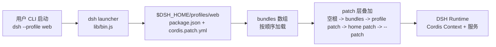
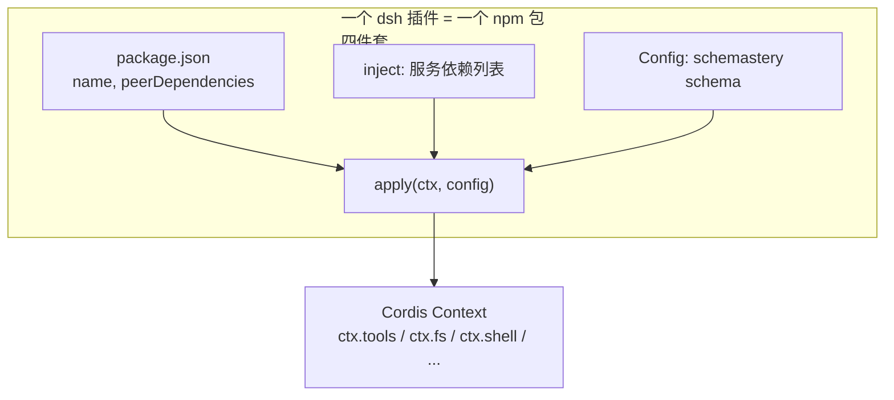
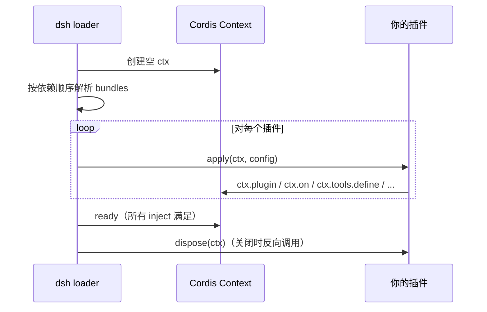
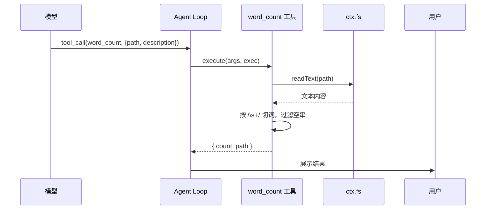
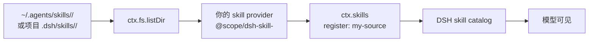
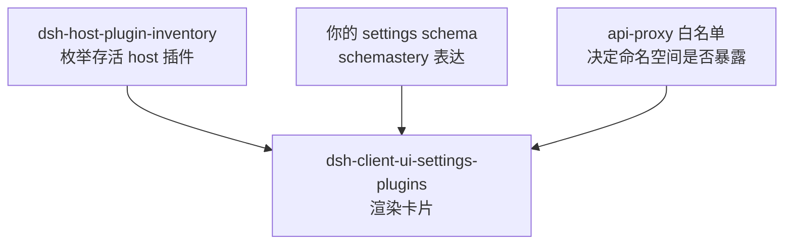
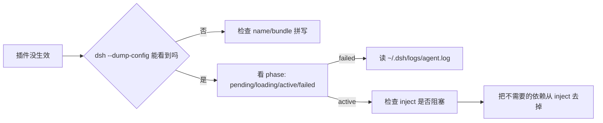

# DSH 插件开发与发布专题

> 适用版本：DSH `@deepseek-ai/dsh@0.1.0-rc.6`（基于 Cordis 4.x）  
> 读者定位：社区开源贡献者（入门）+ 内部 DSH 高级用户（进阶），两者兼顾  
> 配套示例：`@example-dsh/word-count`——本文档以一个完整的示例插件贯穿

---

## 目录

1. [DSH 插件生态速览](#1-dsh-插件生态速览)
2. [Cordis 基础：入门铺垫](#2-cordis-基础入门铺垫)
3. [DSH 插件开发实战](#3-dsh-插件开发实战)
    - 3.1 [最小 hello-world：纯 Cordis 插件](#31-最小-hello-world纯-cordis-插件)
    - 3.2 [Tool 插件：`word-count` 完整示例](#32-tool-插件word-count-完整示例)
    - 3.3 [Skill Provider 插件](#33-skill-provider-插件)
    - 3.4 [Settings &amp; UI 插件（进阶）](#34-settings--ui-插件进阶)
    - 3.5 [Typert RPC：跨 host/client 边界（进阶）](#35-typert-rpc跨-hostclient-边界进阶)
4. [工程实践](#4-工程实践)
5. [发布流程](#5-发布流程)
6. [完整示例：从代码到 npm](#6-完整示例从代码到-npm)
7. [社区协作与最佳实践](#7-社区协作与最佳实践)

---

## 1. DSH 插件生态速览

### 1.1 DSH 是什么

DSH（DeepSeek Harness）是 DeepSeek 出品的 AI 代理 CLI 与运行时，与 Claude Code 形态相似，但**完全开源、社区驱动**。它的核心抽象是 **profile**：用户在 `~/.dsh/profiles/<name>/` 下放一份 `package.json` + `cordis.patch.yml`，声明要装哪些"插件组合包（bundle）"以及自己的覆盖 patch。



### 1.2 插件是什么

在 DSH 里，"插件（plugin）"等同于 **Cordis 插件**：一个 JS/TS 模块，导出 `(name, inject, Config, apply)` 四件套。DSH 在启动时按依赖顺序解析并 `apply(ctx, config)` 每个插件；插件通过 `ctx` 注册服务、定义工具、贡献系统提示词段落、监听事件。



### 1.3 插件类型谱系

DSH 没有强制分类，但内部包按 `dsh-*` 命名拆得相当规整。新作者可按需切入对应类型：

| 类型 | 命名约定 | 典型用途 | 例子 |
|---|---|---|---|
| Tool | `@scope/dsh-tool-<x>` | 让模型调用一个新工具 | `dsh-tool-bash`, `dsh-tool-fs`, `dsh-tool-web` |
| Skill Provider | `@scope/dsh-skill-<x>` | 从某来源发现并加载 skills | `dsh-skill-filesystem` |
| UI（client） | `@scope/dsh-client-ui-<x>` | 浏览器端 UI 组件 / 设置面板 | `dsh-client-ui-mermaid` |
| Host | `@scope/dsh-host-<x>` | 服务端 HTTP / RPC 暴露 | `dsh-host-plugin-inventory` |
| Persona / Prompt | `@scope/dsh-persona-<x>` | 注入 system prompt 段落 | `dsh-persona` |
| Provider / LLM | `@scope/dsh-llm-<x>` | 接新的模型提供方 | `dsh-llm-mock-server` |
| Cordis 基础 | `@scope/cordis-plugin-<x>` | Cordis 框架级插件 | `cordis-plugin-hmr`, `cordis-plugin-loader` |
| Bundle | `@scope/dsh-base-<x>` | 把上面这些打包成 profile 的"组合包" | `dsh-base`, `dsh-web-app`, `dsh-headless` |

> **命名建议**：社区包可用 `@<your-org>/dsh-<type>-<name>`，避免和官方 `@deepseek-ai/dsh-*` 混淆。

### 1.4 解析顺序与可见性

`dsh.profile.bundles` 列出要加载的组合包。DSH 的解析顺序：

1. **DSH 安装目录内置**：`@deepseek-ai/dsh-base`, `@deepseek-ai/dsh-web-app`, `@deepseek-ai/dsh-headless` 直接来自 `dsh` 包的 `node_modules`。
2. **profile 自有 node_modules**：`pnpm` 装在 `$DSH_HOME/profiles/<name>/node_modules/` 的包按需解析。
3. **patch 层叠加**：空根 → 各 bundle patch → profile `cordis.patch.yml` → `$DSH_HOME/cordis.patch.yml` → `--patch` 覆盖。

可用两条命令检查当前解析树（无需启动）：

```bash
dsh --dump-default-config --profile web
dsh --dump-config --profile web
```

---

## 2. Cordis 基础：入门铺垫

> 如果你熟悉 Koa/Express 的中间件模型或 NestJS 的 provider 概念，30 秒读完即可跳过本节。

### 2.1 IoC 容器与 Context

DSH 启动时创建一个 **Cordis Context（ctx）**：一个 IoC 容器。`ctx` 上挂着一系列"服务（service）"，如 `ctx.tools`、`ctx.fs`、`ctx.shell`、`ctx.systemPrompt`、`ctx.approval`。插件通过 `apply(ctx, config)` 拿到 ctx，然后：

- 往 ctx 上**注册**新服务（如 `ctx.plugin("foo", ...)`）
- 通过 `ctx.get("name")` 或 `inject: ["name"]` **消费**已有服务

### 2.2 插件四件套

每个 DSH 插件导出的四件套：

| 名字 | 必填 | 含义 |
|---|---|---|
| `name` | ✅ | 插件注册名，唯一。同一 ctx 重名会抛错 |
| `inject` | ❌ | 依赖的服务数组。DSH 等到这些服务都注册好才 `apply` |
| `Config` | ❌ | schemastery schema，描述用户在 patch 里能传什么配置 |
| `apply(ctx, config)` | ✅ | 入口；把插件逻辑注册进 ctx |

### 2.3 生命周期



`apply` 可以同步也可以异步（`async function`）；通常在 `apply` 里注册 listener、定时器、子 ctx；在 `dispose` 里清理。Cordis 会在 profile 关闭、模型卸载、HMR 热替换时反向调用 `dispose`。

### 2.4 配置校验：`Config`

`Config` 用 [`@deepseek-ai/schemastery`](https://github.com/shigma/schemastery) 定义配置 schema。当用户在 `cordis.patch.yml` 里写了你的插件配置时，DSH 会用 `Config.parse(...)` 校验后才把结果传给 `apply(ctx, config)`。

```ts
import z from "@deepseek-ai/schemastery";

const Config = z.object({
    maxLength: z.number().min(1).max(1024).default(80),
    enabled: z.boolean().default(true),
});
```

---

## 3. DSH 插件开发实战

### 3.1 最小 hello-world：纯 Cordis 插件

> 目标：在 ctx 上注册一个 greeting 服务，patch 一段 system prompt，零业务依赖。

#### 项目结构

```text
@your-org/dsh-hello/
├── package.json
├── README.md
├── README.zh.md
├── README.i18n.yaml
├── LICENSE
└── lib/
    └── index.js
```

#### `package.json`

```json
{
    "name": "@your-org/dsh-hello",
    "version": "0.1.0",
    "description": "Hello-world DSH plugin: greets on startup",
    "type": "module",
    "main": "lib/index.js",
    "exports": {
        ".": "./lib/index.js"
    },
    "files": ["lib", "README.md", "README.zh.md", "LICENSE"],
    "license": "MIT",
    "peerDependencies": {
        "@deepseek-ai/dsh-system-prompt": "^0.1.0-rc.6",
        "@deepseek-ai/cordis": "^4.0.1"
    },
    "devDependencies": {
        "@deepseek-ai/dsh-system-prompt": "^0.1.0-rc.6",
        "@deepseek-ai/cordis": "^4.0.1"
    }
}
```

#### `lib/index.js`

```js
import z from "@deepseek-ai/schemastery";

const name = "hello";
const inject = ["systemPrompt"];

const Config = z.object({
    greeting: z.string().default("你好，我是 DSH 助手。"),
});

function apply(ctx, config = {}) {
    const text = config.greeting ?? "你好，我是 DSH 助手。";

    // 1) 注册一个 service（其他插件可 ctx.get("hello") 消费）
    ctx.plugin("hello", {
        greet: (who) => `${text} 你是 ${who ?? "访客"}。`,
    });

    // 2) 贡献一段 system prompt（出现在每轮请求的系统提示里）
    ctx.systemPrompt.section({
        name: "plugin:hello",
        order: 100,                       // 数字越大越靠后
        text: `在每次回答开头先说：${text}`,
    });
}

export { Config, apply, inject, name };
```

#### 在 profile 里启用

`$DSH_HOME/profiles/web/cordis.patch.yml`：

```yaml
- insert:
  - id: hello
    name: '@your-org/dsh-hello'
    config:
      greeting: '你好，准备好开工了吗？'
```

然后：

```bash
dsh plugin --profile web add @your-org/dsh-hello
dsh web
```

### 3.2 Tool 插件：`word-count` 完整示例

> 目标：让模型能调用 `word_count(path)`，统计文件词数。是入门级 tool 的最佳范例——涉及 ctx.fs、schemastery、tool schema、render、权限标记。

#### 3.2.1 设计先行



#### 3.2.2 `lib/index.js`

```js
import z from "@deepseek-ai/schemastery";
import { defineTool } from "@deepseek-ai/dsh-tools";
import { HarnessError } from "@deepseek-ai/dsh-llm";

const name = "tool-word-count";

const inject = ["tools", "fs"];

const Config = z.object({
    enabled: z.boolean().default(true),
    maxBytes: z.number().min(1024).default(1_048_576), // 1 MiB
});

function apply(ctx, config = {}) {
    if (!config.enabled) return;

    ctx.tools.define("word_count", {
        description:
            "统计指定文件的词数（按空白切分）。仅用于纯文本 UTF-8 文件，" +
            "二进制文件返回错误。适合模型快速预览文档规模。",
        parameters: {
            type: "object",
            additionalProperties: false,
            properties: {
                path: {
                    type: "string",
                    required: true,
                    description:
                        "绝对路径或相对当前会话 cwd 的路径。",
                },
                description: {
                    type: "string",
                    required: true,
                    description:
                        "用一行主动语态概述本调用（5-10 个词），仅 UI 显示用。",
                },
            },
        },
        output: {
            schema: {
                type: "object",
                additionalProperties: false,
                properties: {
                    path: { type: "string", required: true },
                    count: { type: "number", required: true },
                },
            },
        },
        render: (_args, value) => [
            { type: "text", text: `${value.path}: ${value.count} 个词` },
        ],
        // 关键：标注这个工具对模型不可见的并发与只读属性
        // Fail-Closed 默认：两者都设为 false，表示"不要并发、不要自动认定只读"
        isConcurrencySafe: false,
        isReadOnly: true,
        async execute(args, exec) {
            const text = await ctx.fs.readText(args.path, { signal: exec.signal });
            const tokens = text.split(/\s+/u).filter((s) => s.length > 0);
            return { path: args.path, count: tokens.length };
        },
    });
}

export { Config, apply, inject, name };
```

#### 3.2.3 关键 API 解释

| API | 作用 |
|---|---|
| `ctx.tools.define(name, spec)` | 注册一个工具，模型在下一轮就能看到它的 schema |
| `parameters` | 输入参数 schema（schemastery 子集；`required: true` 标必填） |
| `output.schema` | 输出 schema；模型可据此决定是否需要继续调用 |
| `render(args, value)` | 把执行结果转成模型可见的文本段。`type: "text"` 是普通文本 |
| `isConcurrencySafe` | 是否允许并发调用同一工具。文件读一般是 true；写一般是 false |
| `isReadOnly` | 是否只读。`true` 会被 agent loop 跳过用户审批 |
| `execute(args, exec)` | 真正的执行逻辑；`exec.signal` 是 abort 信号，必须传透给 IO |

> **注意**：本示例省略了权限校验和大小校验。生产插件要：
> - 把 `exec.signal` 传给 `ctx.fs.readText`（已做）
> - 用 `try/catch` 捕获 `HarnessError` 返回标准错误
> - 校验 `args.path` 落在用户配置的"允许目录"内，否则抛权限错误

#### 3.2.4 加入 profile

`$DSH_HOME/profiles/web/cordis.patch.yml`：

```yaml
- insert:
  - id: tool-word-count
    name: '@example-dsh/word-count'
    config:
      enabled: true
      maxBytes: 2097152
```

启动 web profile，模型现在能调用 `word_count` 了。

### 3.3 Skill Provider 插件

> 目标：让用户可以在某个目录（GitHub repo、本地路径）下放置 `SKILL.md`，DSH 自动发现并暴露给模型。

DSH 的 skill 注册中心是 `ctx.skills`；你写一个 `ctx.skills` provider 即可。本节不展开完整实现，但讲清边界：



官方参考实现：`@deepseek-ai/dsh-skill-filesystem`。要点：

1. **发现规则**：一级深度，`<root>/<name>/SKILL.md` 或 `<root>/<name>.md`；嵌套不识别。
2. **frontmatter**：`name`（必填，kebab-case）+ `description`（必填）；可选 `whenToUse`、`metadata`、`disable-model-invocation`、`user-invocable`。
3. **Catalog 变更检测**：Chokidar watch；`SKILL.md` 内容变更通过 hash 失效缓存。
4. **资源加载**：`SKILL.md` 同目录下的 `references/`、`scripts/`、`assets/` 是该 skill 的私有资源。

最小 provider 骨架：

```js
ctx.skills.register({
    name: "my-source",
    discover: async () => {
        const dir = ctx.fs.listDir("/path/to/skills");
        const entries = [];
        for (const name of dir.subdirs) {
            const skillFile = ctx.fs.tryReadText(`/path/to/skills/${name}/SKILL.md`);
            if (skillFile !== null) {
                entries.push({ name, source: "my-source", body: skillFile });
            }
        }
        return entries;
    },
    watch: ctx.fs.watchDir("/path/to/skills"),
});
```

### 3.4 Settings & UI 插件（进阶）

如果你想让插件配置出现在 DSH Web UI 的"插件设置"面板，需要写两层：



要点：

- **settings schema** 写在 `Config` 之外**另起一个** schema（因为 settings 是用户级，config 是部署级）。
- 在 `api-proxy` 白名单里加上你的命名空间，否则 UI 会报告 `settings-not-exposed`。
- `presentCall` / `presentResult` 控制工具调用卡的渲染。

### 3.5 Typert RPC：跨 host/client 边界（进阶）

DSH 浏览器侧与 host 侧是**两个进程**（或至少两个 Context），通过 [@deepseek-ai/typert](https://github.com/koishijs/typert) 生成类型化的 RPC。你需要：

1. 在 host 包里导出 public service（如 `pluginInventory/list`）。
2. 在 `typert` manifest 里声明 remote。
3. Client 包通过 `api-remotes` 组合消费，永远不要直接 import host 实现。

`dsh-host-plugin-inventory` 是最简单的样例：只读 plugin 树，无副作用、无状态。

---

## 4. 工程实践

### 4.1 项目结构

```text
@your-org/dsh-tool-xxx/
├── package.json
├── README.md                  # 英文
├── README.zh.md               # 中文
├── README.i18n.yaml           # i18n 元数据
├── LICENSE                    # MIT / Apache-2.0
├── lib/
│   ├── index.js               # 插件入口，导出四件套
│   ├── render.js              # 渲染逻辑（可选拆分）
│   └── types/                 # 生成的 .d.ts
├── src/                       # TypeScript 源码（如用 TS）
├── tests/
│   └── word-count.test.js     # 单元测试
└── tsconfig.json
```

### 4.2 三语 README

参考官方包的目录约定：

```text
README.md
README.zh.md
README.i18n.yaml
```

英文 README 顶部一般含一句 "English | [中文](README.zh.md)" 互链；中文 README 顶部镜像即可。每篇 README 都应包含：

- **包名 + 一句话定位**
- **这里会出现什么**（What this package contributes）
- **扩展点**（Extension points）
- **工具/服务/API 详细说明**
- **权限与升权**（如涉及）
- **模型体验**（系统提示词段落、token 影响、KV Cache 影响）
- **已知限制与暂缓事项**

### 4.3 测试

DSH 提供 `@deepseek-ai/dsh-agent-loop-testkit` 等测试工具包。最小测试：

```js
import { test } from "node:test";
import assert from "node:assert/strict";
import wordCountPlugin from "@example-dsh/word-count";

test("word_count returns count for a temp file", async () => {
    const ctx = createMockCtx({ fs: { readText: async () => "hello world\n你好 世界" } });
    await wordCountPlugin.apply(ctx, { enabled: true, maxBytes: 1024 });
    const tool = ctx.tools.get("word_count");
    const out = await tool.execute({ path: "/tmp/x.txt", description: "test" }, mockExec);
    assert.equal(out.count, 4);
});
```

### 4.4 调试技巧

```bash
# 1. 不启动 UI，只看解析后的配置树
dsh --dump-default-config --profile web

# 2. 看完整配置（含用户 patch）
dsh --dump-config --profile web

# 3. 看插件清单（哪些加载了、阶段是 loading/active/failed）
dsh plugin --profile web list

# 4. HMR：开发模式下文件改了自动重载（需要 cordis-plugin-hmr）

# 5. 日志：~/.dsh/logs/agent.log
```

如果某个插件没加载：



### 4.5 国际化

DSH 的 system prompt 段落、README、错误消息都应至少中英双语。模型侧提示词要简洁——参考官方 `dsh-tool-bash` 的做法：用一句话锁定行为，不要长篇大论。

---

## 5. 发布流程

> 现状：DSH **没有独立的"插件市场"**。社区插件的发布 = npm publish + GitHub 开源 + README 描述如何安装。安装命令 `dsh plugin --profile <name> add <pkg>` 转发给 pnpm，所以遵循 npm 生态即可。

### 5.1 命名规范

- **官方包**：`@deepseek-ai/dsh-<type>-<x>`（你不能用这个 scope）
- **社区包**：`@<your-org>/dsh-<type>-<x>`，例如 `@acme/dsh-tool-word-count`
- **无 scope**：`<your-org>-dsh-<type>-<x>`，例如 `acme-dsh-tool-word-count`

### 5.2 包结构 checklist

> `package.json` 必填字段

- name、version、description
- `type: "module"`
- `main` + `exports` 映射
- `files`（白名单要发布的文件）
- `license`
- `peerDependencies`（DSH 内部包、Cordis、schemastery 等）
- `devDependencies`（测试与本地构建用）
- `repository` 指向公开 Git 仓库
- `keywords`（包含 `dsh-plugin`、`cordis-plugin` 或 `coding-agent`）

> 仓库根文件

- `README.md` + `README.zh.md` + `README.i18n.yaml`
- `LICENSE`（MIT / Apache-2.0 推荐）
- `src` 或 `lib` 源码
- `tests`（至少一个 smoke test）
- `.npmignore` 或 `files` 字段控制发布内容

### 5.3 npm 发布步骤

```bash
# 1. 登录（一次性）
npm login

# 2. 确认包名未被占用
npm view @your-org/dsh-tool-word-count

# 3. dry-run 检查发布物
npm publish --dry-run

# 4. 发布
npm publish --access public

# 5. 打 tag（首次发布默认 latest）
git tag v0.1.0
git push --tags
```

发布前自检清单：

- `npm pack --dry-run` 看 tarball 内容
- `node -e "import('@your-org/dsh-tool-word-count').then(m => console.log(Object.keys(m)))"` 验证入口可加载
- 在干净环境 `npm i -g @your-org/dsh-tool-word-count` 试装
- `dsh --dump-config --profile web` 中确认插件被识别

### 5.4 在 DSH 中安装

```bash
# 把包加入 web profile 的 node_modules
dsh plugin --profile web add @your-org/dsh-tool-word-count

# 然后在 cordis.patch.yml 里启用
# - insert:
#     - id: tool-word-count
#       name: '@your-org/dsh-tool-word-count'

# 启动验证
dsh web
```

### 5.5 升级与废弃

- 严格遵守**语义化版本**：破坏性变更必须升 major。
- 在 CHANGELOG.md 记录用户视角的变化。
- 不再维护的包用 `npm deprecate @your-org/dsh-tool-word-count "请迁移到 @other/tool-x"`。

---

## 6. 完整示例：从代码到 npm

> 把第 3.2 节 `word-count` 走完发布全流程。

### 6.1 仓库布局

```text
example-dsh/word-count/
├── .gitignore
├── LICENSE
├── README.md
├── README.zh.md
├── README.i18n.yaml
├── package.json
├── lib/
│   └── index.js
└── tests/
    └── word-count.test.mjs
```

### 6.2 完整文件

#### `package.json`

```json
{
    "name": "@example-dsh/word-count",
    "version": "0.1.0",
    "description": "DSH tool plugin: count words in a UTF-8 text file",
    "type": "module",
    "main": "lib/index.js",
    "exports": {
        ".": "./lib/index.js"
    },
    "files": ["lib", "README.md", "README.zh.md", "LICENSE"],
    "license": "MIT",
    "repository": {
        "type": "git",
        "url": "git+https://github.com/example-dsh/word-count.git"
    },
    "bugs": {
        "url": "https://github.com/example-dsh/word-count/issues"
    },
    "keywords": ["dsh-plugin", "cordis-plugin", "tool", "word-count"],
    "peerDependencies": {
        "@deepseek-ai/dsh-tools": "^0.1.0-rc.6",
        "@deepseek-ai/dsh-fs-local": "^0.1.0-rc.6",
        "@deepseek-ai/dsh-llm": "^0.1.0-rc.6",
        "@deepseek-ai/schemastery": "^3.18.1",
        "@deepseek-ai/cordis": "^4.0.1"
    },
    "devDependencies": {
        "@deepseek-ai/dsh-tools": "^0.1.0-rc.6",
        "@deepseek-ai/cordis": "^4.0.1"
    }
}
```

#### `lib/index.js`

（见 §3.2.2，省略重复）

#### `tests/word-count.test.mjs`

```js
import { test } from "node:test";
import assert from "node:assert/strict";

const { apply, name } = await import("@example-dsh/word-count");

test("plugin registers a tool named word_count", async () => {
    const calls = [];
    const ctx = {
        tools: {
            define: (n, spec) => calls.push({ n, spec }),
        },
    };
    await apply(ctx, { enabled: true, maxBytes: 1024 });
    assert.equal(name, "tool-word-count");
    assert.equal(calls.length, 1);
    assert.equal(calls[0].n, "word_count");
    assert.equal(calls[0].spec.isReadOnly, true);
});
```

### 6.3 发布命令（按顺序）

```bash
# 在仓库根
npm login
npm publish --dry-run         # 检查包内容
npm publish --access public   # 真正发布
git tag v0.1.0
git push --tags

# 在用户机器上
dsh plugin --profile web add @example-dsh/word-count

# 在 $DSH_HOME/profiles/web/cordis.patch.yml 加：
# - insert:
#     - id: tool-word-count
#       name: '@example-dsh/word-count'
#       config:
#         enabled: true

dsh web   # 验证模型能调用 word_count
```

### 6.4 验证清单

- [ ] `dsh --dump-config --profile web` 中能看到 `tool-word-count`
- [ ] 模型能调用 `word_count` 工具
- [ ] 二进制文件抛 `HarnessError` 而非 panic
- [ ] 超大文件（> maxBytes）有保护
- [ ] abort 信号能中断 IO

---

## 7. 社区协作与最佳实践

### 7.1 Fail-Closed 默认

任何**新工具**默认 `isConcurrencySafe: false`、`isReadOnly: false`。这意味着：

- 模型调用前**必须**经过用户审批（除非用户在 settings 里 override）。
- 工具不可并发（agent loop 不会并行触发）。

除非你能证明安全，才显式打开两者。官方 `dsh-tool-bash` 即典型反例——必须审批、不可并发。

### 7.2 Token 与 KV Cache 友好

- **系统提示词段落**越短越好；按 `order` 排序，避免互相覆盖。
- **`output.schema` 稳定**：改了 schema 等于改了模型对该工具的"认知"，触发 KV cache 失效。
- **错误信息精简**：模型看不到的细节写日志，不进 `render`。

### 7.3 错误约定

DSH 内部错误有约定俗成的措辞。常用前缀：

| 场景 | 前缀 |
|---|---|
| 输入校验失败 | `invalid <field>: <detail>` |
| 权限拒绝 | `permission denied: <reason>` |
| 沙箱拒绝 | `[sandbox: ...]`（renderer 用 marker） |
| IO 失败 | 透传底层错误，加文件路径上下文 |
| 用户中止 | `tool call aborted` |

### 7.4 安全性

- 永远不要把 `exec.signal` 丢掉——所有 IO 必须支持中止。
- 永远不要执行 `args` 里直接拼出的 shell 命令；用 schemastery 强类型参数。
- 用户密钥（API token、password）经 `ctx.credentials` 注入，绝不写入日志。
- `Config` 暴露的字段不应接受路径或 URL——用 schemastery 的 `z.enum()` 限定取值。

### 7.5 维护建议

- **保持单一职责**：一个插件做一个事；不要把 `word-count + JSON 格式化 + Markdown 渲染` 全堆一起。
- **写测试**：至少一个 happy path + 一个错误 path。
- **写 changelog**：用户能感知到的不向后兼容变更都记。
- **接受 issue 与 PR**：在 `package.json` 里加 `bugs.url` 与 `repository.url`。
- **加入 community index**：当前 DSH 暂未建立官方目录，建议在 GitHub Discussions 或 README 顶部维护一份"社区插件列表"，方便发现。

### 7.6 资源

| 资源 | 链接 |
|---|---|
| DSH GitHub | https://github.com/deepseek-ai/deepseek-harness |
| Cordis | https://github.com/koishijs/cordis |
| Schemastery | https://github.com/shigma/schemastery |
| 官方 tool 样例 | `packages/shell/tool-bash/`、`packages/fs/tool-fs/` |
| 官方 skill provider | `packages/skills/skill-filesystem/` |
| 本文档配套示例 | `@example-dsh/word-count` |

---

## 附录 A：常见问题

### A.1 插件没在 UI 里出现

1. `dsh --dump-config` 能看到吗？看不到 → 检查 `bundles` 拼写。
2. `phase` 是 `failed` 吗？看 `~/.dsh/logs/agent.log`。
3. 是 UI 白名单问题吗？联系 host 维护者把命名空间加入 api-proxy。

### A.2 `inject` 该不该用

**用**：当你的插件逻辑依赖其他服务（如 `ctx.fs.readText`）。
**不用**：纯静态注入（如仅注册一个工具、不依赖其他 ctx 服务）也可省略。

滥用 `inject` 会让插件加载顺序变复杂；只声明真正依赖的服务。

### A.3 一个插件能注册多个工具吗

能。`apply` 里多次调用 `ctx.tools.define(name, ...)` 即可。注意每个工具的 `name` 必须唯一。

### A.4 TS 还是 JS

官方包是 TS 编译为 ESM JS。你写 JS 也行——只要 `package.json` 标 `"type": "module"` 并在 `exports` 里导出 ESM 入口。

### A.5 我的插件要收钱/收费

DSH 本身是开源，**DSH 生态不接受收费插件**（许可证冲突）。但你可以：

- 提供开源基础版 + 商业增强版（双包）。
- 在 GitHub Sponsors 接受赞助。
- 卖"集成服务"而非插件本身。

---

> 修订记录  
> v0.1.0（2026-08-26）：初版；覆盖 DSH 0.1.0-rc.6 插件开发与发布流程