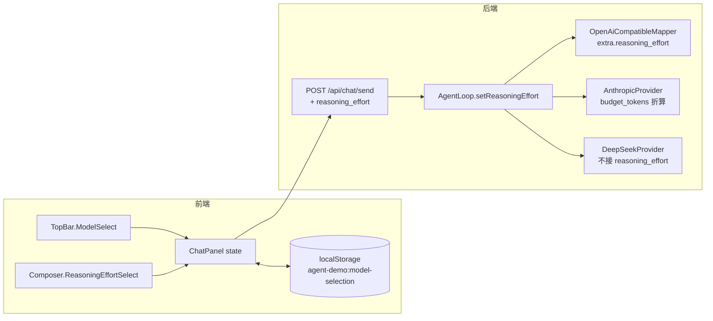
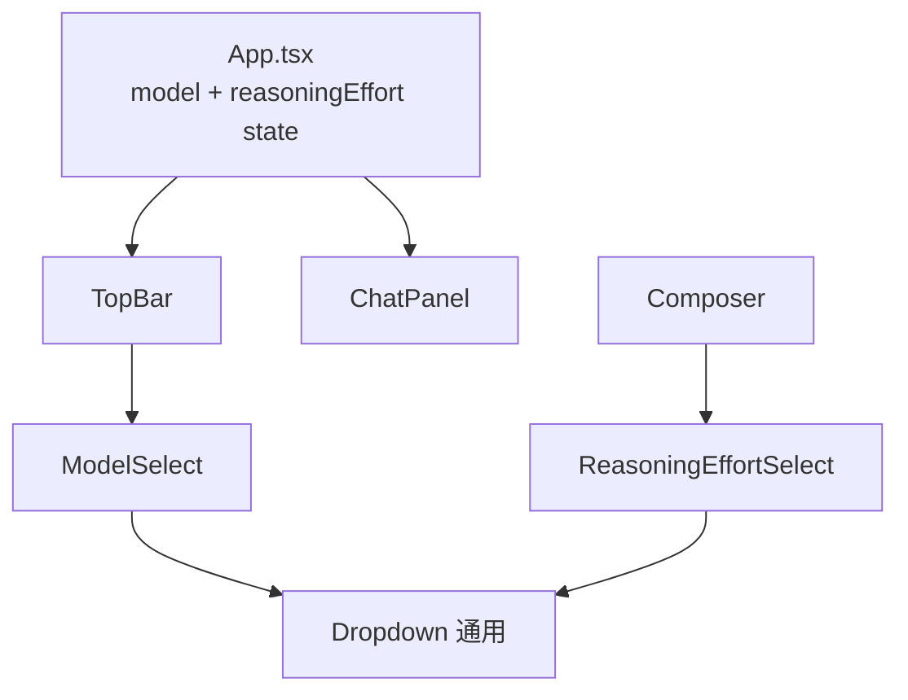

# 模型 + 思考强度下拉（add-models-dropdown-v0）

> **状态**: add-models-dropdown-v0 已落地（v0.1 简化版）。
>
> **v0.2 起已由 `add-provider-catalog-abstract` 升级为分层 provider 目录**（两层菜单 + `ModelSelection` + provider 推断）。
> **本文档保留 v0.1 设计记录**，描述已不再对应当前实现的部分见下方「v0.2 变更摘要」；
> 当前实现请看 [`provider-catalog.md`](./provider-catalog.md)。

## 0. v0.2 变更摘要（add-provider-catalog-abstract）

| 本文档描述的 v0.1 行为 | v0.2 现状 |
|----------------------|-----------|
| `ModelsResponse.models[]` 平铺 | `ModelsResponse.providers[]` 嵌套（**BREAKING**，平铺字段已移除） |
| `ModelEntry.reasoningEfforts: string[]` | `ModelEntry.reasoningEfforts: ReasoningEffort[]`（`{id,name,description?}`） |
| localStorage `{model, reasoningEffort}` | `{provider, model, reasoningEffort}`（旧格式读到 provider 为空串 → 前缀推断） |
| 单层模型下拉 | `ModelSelect` 两层菜单（左 provider / 右 model + 内联 effort chip） |
| `ReasoningEffortSelect` prop `model: ModelEntry` | prop `options: ReasoningEffort[]` |
| `/model <model>` 白名单 | `/model <provider>/<model>` 完整路径 + 别名 + 前缀推断简写 |

> 下文内容为 v0.1 设计记录，未逐条改写。

## 1. 目标

让前端用户通过下拉框切换模型（`deepseek-chat` / `deepseek-reasoner` / `o1` / `o3-mini` 等）和思考强度（`low` / `medium` / `high`），对齐 DeepSeek Harness `dsh web` 的 `ModelSelect` 体验（简化版，不引入完整 provider 分层）。

## 2. 核心决策

| 项 | 决策 |
|---|---|
| **数据形态** | `ModelsResponse.models[]` 平铺；每个 model 含 `reasoningEfforts: string[]` |
| **会话级状态** | `{model, reasoningEffort}` 持久化到 `localStorage["agent-demo:model-selection"]`，新会话沿用上次值 |
| **切换时机** | send 前选好即可；流中不切（与 dsh web 一致；中途切需 Provider 状态机配合，v0.2 再做） |
| **下拉位置** | 模型下拉：TopBar 右上角；思考强度下拉：Composer 状态栏（仅当前 model `supportsReasoning=true` 时显示） |
| **UI 风格** | 自定义下拉（`lucide-react` `ChevronDown` + 弹出列表 + 键盘 ↑↓ Enter Esc 导航），不引入 Radix UI |
| **流式接入** | 模型切换：影响下一轮 `ChatRequest.model`（沿用 `AgentLoop.setModel` volatile 字段）<br>思考强度切换：影响下一轮 `ChatRequest.extra.reasoning_effort`（`AgentLoop.toRequest()` 写入） |

## 3. 数据流



## 4. 三 Provider 适配表

| Provider | 接收 reasoning_effort? | 折算 / 透传 |
|---|---|---|
| **OpenAI o1 / o3 / o4** | ✅ 是 | 透传到请求 body 的 `reasoning_effort` 字段；用户未传时 fallback `medium`（add-reasoning-thinking-streaming 老行为） |
| **Anthropic claude-4 thinking** | ✅ 是 | 折算为 `thinking.budget_tokens`：<br>`low → 1024` / `medium → 4096` / `high → 16384` |
| **DeepSeek reasoner** | ❌ 否（DeepSeek API 不接该参数） | 通过 `extra` 透传后被上游忽略；DeepSeek 自己的 `reasoning_content` 流式透传照常工作 |

## 5. Anthropic budget_tokens 折算表

| 思考强度 | budget_tokens | 适用场景 |
|---|---|---|
| `low` | 1024 | 轻量思考，响应快 |
| `medium` | 4096 | 中等深度（默认；与 add-reasoning-thinking-streaming 老行为兼容） |
| `high` | 16384 | 深度推理（长链思考） |

折算常量在 `AnthropicProvider.EFFORT_BUDGET_TOKENS` 私有静态 Map。

## 6. 前端组件结构



| 组件 | 路径 | 职责 |
|---|---|---|
| `Dropdown` | `agent-web/frontend/src/components/Dropdown.tsx` | 通用下拉：trigger + 弹出列表 + 键盘导航 |
| `ModelSelect` | `agent-web/frontend/src/components/ModelSelect.tsx` | 拉 `/api/chat/models`，渲染模型列表，触发 onChange |
| `ReasoningEffortSelect` | `agent-web/frontend/src/components/ReasoningEffortSelect.tsx` | 仅 `supportsReasoning=true` 时渲染；接收 `options: ReasoningEffort[]` |
| `TopBar` | `agent-web/frontend/src/components/TopBar.tsx` | 集成 `ModelSelect` |
| `Composer` | `agent-web/frontend/src/components/Composer.tsx` | 集成 `ReasoningEffortSelect`（状态栏） |
| `ChatPanel` | `agent-web/frontend/src/components/ChatPanel.tsx` | 接收 `model/reasoningEffort/onReasoningEffortChange` props，send 时透传 |
| `App.tsx` | `agent-web/frontend/src/App.tsx` | 持有 model/effort state + localStorage 持久化 + 跨组件回调 |

## 7. API 变更

### `POST /api/chat/send`

`SendRequest` 新增字段：

```json
{
  "content": "...",
  "session_id": "...",
  "permission_mode": "read_only",
  "workspace": "agent-demo",
  "model": "deepseek-reasoner",       // 已有（add-reasoning-thinking-streaming）
  "reasoning_effort": "high"          // 新增（add-models-dropdown-v0）
}
```

`reasoning_effort` 可选；`null`/缺省 = 不切换，沿用 Provider 默认（OAI `medium`、Anthropic `4096` token）。

### `GET /api/chat/models`

响应 `models[]` 每个元素新增 `reasoningEfforts` 字段：

```json
{
  "models": [
    {
      "id": "deepseek-chat",
      "name": "DeepSeek Chat",
      "supportsReasoning": false,
      "reasoningEfforts": []
    },
    {
      "id": "deepseek-reasoner",
      "name": "DeepSeek Reasoner",
      "supportsReasoning": true,
      "reasoningEfforts": ["low", "medium", "high"]
    }
  ]
}
```

`reasoningEfforts` 数组：

| 条件 | 返回值 |
|---|---|
| `supportsReasoning=true` | `["low", "medium", "high"]`（v0.1 固定三档） |
| `supportsReasoning=false` | `[]` |

## 8. CLI 变更

`/effort <low|medium|high>` 命令（v0.1 新增）：

```bash
/effort high    # 切换到 high，下次 send 生效
/effort medium  # 切回 medium
/effort extreme # 非法值，不切换，提示 "思考强度必须是 low / medium / high, 当前未变"
/effort         # 无参数，列出可用档位
```

`/model` 命令保留（向后兼容；`/model reasoning` / `/model chat` 别名不变）。

## 9. dsh web 兼容性说明

`dsh web` 的 `ModelSelection` 接口：

```typescript
interface ModelSelection {
  provider: string;
  model: string;
  reasoningEffort?: string;
}
```

agent-demo v0.1（本 change）：

- ❌ **不含** `provider` 字段（v0.1 全部 model 都在同一 `deepseek` provider 下，简化）
- ✅ `model` 字段已对齐
- ✅ `reasoningEffort` 字段已对齐（命名一致）

`add-provider-catalog-abstract`（v0.2 change）升级到完整 dsh `ModelSelection` 形态：把 `models[]` 平铺升级为 `providers[]` 分层目录，三 Provider 都接受 `provider` 参数，CLI `/model` 支持 `<provider>/<model>` 完整路径。

## 10. 已知限制 / 未来工作

| 项 | 状态 |
|---|---|
| 流中切换 model / effort | ❌ v0.1 不支持（仅下次 send 生效） |
| Provider 分层目录 | ❌ v0.1 不支持（change `add-provider-catalog-abstract` 升级） |
| 按 provider 动态化 effort 等级 | ❌ v0.1 固定三档（v0.2+ 升级） |
| Anthropic claude-4 thinking 模型自定义 budget_tokens 配置 | ❌ v0.1 硬编码 1024/4096/16384 |
| reasoning_effort 持久化到 JSONL message header | ❌ v0.1 不写（Q9 决策：effort 是会话配置，非消息属性） |

## 11. 相关 Change

- `add-reasoning-thinking-streaming`（已 archive）：基础 reasoning 流式解析 + `/model` slash 命令 + `ModelsController` 初版
- `add-models-dropdown-v0`（本 change）：前端 UI 下拉 + 后端 reasoningEffort 透传
- `add-provider-catalog-abstract`（未开始）：v0.2 升级为完整 provider 分层目录

---

**修订记录**：

- v0.1（2026-09-13）：初版（add-models-dropdown-v0）