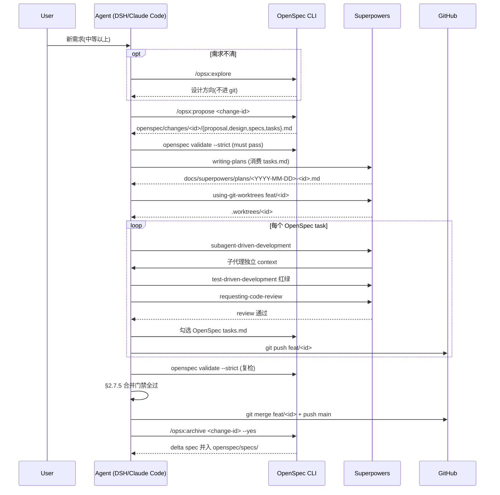

# OpenSpec + Superpowers 双流协作桥接（agent-demo）

> **状态**: add-superpowers-bridge-doc 已落地（2026-09-13 v0.1）
> **适用范围**: agent-demo 项目所有"中等以上"复杂度的 OpenSpec change
> **维护责任**: 每次 change review 时检查本文档与 `openspec/specs/process/spec.md` 是否漂移

## 1. 一句话边界

> **OpenSpec 出合同,Superpowers 出施工队**。

| 流程步骤 | OpenSpec（合同） | Superpowers（施工） |
|---|---|---|
| 需求探索 | `/opsx:explore` 出方向 | —（避免重复 brainstorm） |
| 提案 | `/opsx:propose` 出 proposal/design/specs/tasks | — |
| 计划 | — | `writing-plans` 把 OpenSpec tasks 拆 2-5 分钟微任务，落 `docs/superpowers/plans/<plan>.md` |
| 隔离 | — | `using-git-worktrees` 开 `feat/<change-id>` |
| 实施 | `/opsx:apply-change` | `subagent-driven-development` + `test-driven-development` + `requesting-code-review` |
| 验证 | `openspec validate --strict` | `verification-before-completion`（可选） |
| 归档 | `/opsx:archive`（合并 delta 到 `openspec/specs/`） | `finishing-a-development-branch`（出 PR/合并） |

**禁止两边各做一遍需求调研和设计**。

## 2. 标准命令时序（中等以上 change）



## 3. 手动组合（不装桥接包）

社区有 `openspec-superpowers` 桥接包（`npx openspec-superpowers`），**但只支持 Claude Code**（把命令装到 `.claude/commands/`）。DSH / Cursor / 其他 harness 看不到 `/opsx:write-plan` `/opsx:executing-plans` 命令。

**agent-demo 项目的桥接方案 = 手动组合**：

```bash
# 1) OpenSpec 出合同
openspec new change add-<id>
# 写 proposal.md / design.md / specs/<cap>/spec.md / tasks.md
openspec validate add-<id> --strict

# 2) Superpowers writing-plans 消费 OpenSpec tasks.md
# （手动跑 writing-plans skill 或读 docs/superpowers/plans/2026-08-26-agent-cli-v0.1.md 学习格式）
# 输出 docs/superpowers/plans/<YYYY-MM-DD>-<id>.md

# 3) 隔离 + 实施
git worktree add .worktrees/<id> -b feat/<id>
cd .worktrees/<id>
# 逐 plan task 派子代理（或 inline），每 task 完成后：
git add <path>...
git commit -m "..."
git push origin feat/<id>
# 回写 OpenSpec tasks.md 勾选（任务间一致性靠 spec scenario 校验）

# 4) 验证 + 归档
cd E:/claude-projects/agent-demo
git merge feat/<id>  # §2.7.5 门禁全过才合并
mvn -pl agent-core,agent-web -am test -DskipNpm=true  # main 复验
git push origin main
openspec validate add-<id> --strict  # 复检
openspec archive add-<id> --yes
```

## 5. 防冲突规则（必守）

| 场景 | 主 | 副（不要做） | 冲突时回写 |
|---|---|---|---|
| 需求探索 / 边界澄清 | OpenSpec explore | Superpowers brainstorming | OpenSpec proposal 引用 brainstorming 输出 |
| 设计 / 验收契约 | OpenSpec propose | — | — |
| 实施 / TDD / 子代理 | Superpowers executing-plans | OpenSpec apply-change 直接实施 | plan 引用 OpenSpec task id |
| 验证 / 归档 | OpenSpec archive | Superpowers verification-before-completion | — |
| 实施中发现需求盲区 | OpenSpec delta spec | Superpowers 另起 design 文档 | `/opsx:sync-specs <id>` 回写 |
| 出 PR / 合并 | Superpowers finishing-a-development-branch | OpenSpec 手动 merge | — |

**核心**：**两边不重复劳动**。OpenSpec 出规格 → Superpowers 按规格施工 → Superpowers 实施中发现新需求 → **回写** OpenSpec delta（不另起 design）。

## 6. 降级路径

**当 Superpowers 工具不可用时**（agent 无 writing-plans / subagent-driven-development / TDD 技能），按以下降级：

| 缺失能力 | 降级做法 |
|---|---|
| 无 `writing-plans` | agent 自己读 OpenSpec tasks.md，每个 task 直接实施（保留 OpenSpec 契约，无 Superpowers 微任务拆分） |
| 无 `subagent-driven-development` | inline 实施（同一 session 内串行 task，不派子代理） |
| 无 `test-driven-development` | 先实现后补测试（违反 TDD 但保留测试覆盖） |
| 无 `finishing-a-development-branch` | 手动 `git merge` + `git push`（§2.7.5 合并门禁照走） |

**降级时仍走 OpenSpec 四阶段**（explore → propose → apply → archive），仅丢失 Superpowers 的执行纪律。

## 7. 平台与依赖前提

| 平台 | 桥接能力 | 注意事项 |
|---|---|---|
| **Claude Code** | 完整（装 `openspec-superpowers` 后） | `.claude/commands/opsx/{write-plan,executing-plans}.md` 可用 |
| **DSH / 其他** | 纯文档桥接（本文档） | agent 手动跑 OpenSpec CLI + 维护 `docs/superpowers/plans/` |
| **纯 inline 执行** | 无 Superpowers | 降级到 `/opsx:apply` |

**agent-demo 项目当前状态**：DSH 环境，**走手动组合**（§3）。Claude Code 用户可选择装桥接包。

## 8. 适用边界

| 场景 | 走双流？ |
|---|---|
| **简单 bug 修复 / 两行改动** | ❌ 直接 `/opsx:apply` 即可，套 full Superpowers 多花数倍 token |
| **中等 change（10-30 task，跨多文件）** | ✅ 推荐双流 |
| **大型 change（> 30 task 或单 task > 4h）** | ✅ 强制双流（OpenSpec task > 4h 违规会被 archive 拒绝） |
| **纯文档 / typo 注释** | ❌ 直接 commit（AGENTS.md §2.5.5 豁免） |
| **CI / 工程脚本** | ❌ 直接 commit |

## 9. 与 AGENTS.md §2.5/§2.7 的衔接

本文档是 AGENTS.md 的**补充**，**不覆盖**已有规则：

| AGENTS.md 章节 | 本文档衔接 |
|---|---|
| §2.5 OpenSpec 四阶段 | 保持不变，本文档只是把 apply 阶段展开为"Superpowers 实施 + OpenSpec 归档" |
| §2.6 测试四件套 | 保持不变，本文档不涉及测试文档组织 |
| §2.7 分支隔离 | 保持不变，Superpowers `using-git-worktrees` 与 §2.7 是同源纪律 |
| §2.5.5 适用豁免 | 本文档§8 进一步细化"中等以下走 OpenSpec-only" |
| §2.7.5 合并门禁 | 保持不变，本文档只是强调"Superpowers finishing-a-development-branch 不替代 §2.7.5" |

**后续维护**：本文档由 `openspec/specs/process/spec.md` 的"标准命令时序"Requirement 强约束，漂移时通过 `MODIFIED Requirements` 回写。

---

**修订记录**：

- v0.1（2026-09-13）：初版（add-superpowers-bridge-doc）