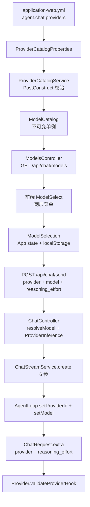

# Provider 目录（Provider Catalog）

> 本文档描述 agent-demo v0.2 起的分层 Provider/Model 目录设计（OpenSpec change `add-provider-catalog-abstract`）。
>
> v0.1 的平铺模型下拉设计见 `model-and-effort-dropdown.md`。

## 1. 背景

v0.1（change `add-models-dropdown-v0`）只有**平铺模型列表**：`agent.chat.supported-models` 是一个字符串数组，前端只选「模型」，没有 provider 概念。后端 `ChatController` 硬编码 `DEEPSEEK_API_KEY`，所有请求都发给 DeepSeek。

v0.2 引入**分层目录**，对齐 dsh web 的 `ModelProviderGroup` / `ModelSelection` 数据形态：

- **Provider（供应商）** 分组：DeepSeek / OpenAI / Anthropic / MiniMax
- 每个 provider 下挂多个 **Model**
- 每个 model 声明是否支持 **reasoning**，以及可选的 **reasoningEffort 档位**

## 2. 数据形态

### 2.1 后端 record（`agent-web/.../api/dto/`）

| record | 字段 | 说明 |
|--------|------|------|
| `ProviderGroup` | `id` / `name` / `models: List<ModelEntry>` | 两层菜单外层 |
| `ModelEntry` | `id` / `name` / `supportsReasoning` / `reasoningEfforts: List<ReasoningEffort>` | provider 下的模型 |
| `ReasoningEffort` | `id` / `name` / `description?` | 档位；`description` 为 null 时 Jackson 不输出 |
| `ModelsResponse` | `providers: List<ProviderGroup>` | `GET /api/chat/models` 响应 |

### 2.2 前端 TS 类型（`agent-web/frontend/src/api/chat.ts`）

与后端一一对应；另有选择三元组：

```ts
export interface ModelSelection {
  provider: string;
  model: string;
  reasoningEffort?: string;
}
```

`ModelSelection` 是前端持有的**唯一权威状态**（App.tsx），下发给 TopBar（完整三元组）与 ChatPanel / Composer（拆开的字段）。

## 3. 数据流



## 4. 配置

`agent-web/src/main/resources/application-web.yml`：

```yaml
agent:
  chat:
    providers:
      - id: deepseek
        name: DeepSeek
        models:
          - id: deepseek-v4-flash
            name: DeepSeek-V4-Flash
            supports-reasoning: false
            reasoning-efforts: []
          - id: deepseek-reasoner
            name: DeepSeek Reasoner
            supports-reasoning: true
            reasoning-efforts:
              - { id: low,    name: Low }
              - { id: medium, name: Medium }
              - { id: high,   name: High }
    default-provider: deepseek
    default-model: deepseek-v4-flash
```

**启动校验**（`ProviderCatalogService.init()`，失败抛 `IllegalStateException` 阻止启动）：

- `supportsReasoning=false` 时 `reasoningEfforts` 必须为空数组
- `supportsReasoning=true` 时 `reasoningEfforts` 至少一档
- `defaultProvider` / `defaultModel` 必须能在目录里匹配到

## 5. Provider 推断

`ProviderInference.inferProvider(model)`（agent-core）按模型名前缀静态推断：

| 前缀 | provider |
|------|----------|
| `o1` / `o3` / `o4` / `gpt-` | `openai` |
| `claude-` | `anthropic` |
| `deepseek-` | `deepseek` |
| 其他 | `null`（调用方回退 `default-provider`） |

前端 `chat.ts` 有等价实现 `inferProvider`，用于**旧格式 localStorage**（v0.1 只存 `{model, reasoningEffort}`，无 provider）的 fallback。

## 6. Provider 校验（providerId 一致性）

多 provider 共存时，前端选的 provider 必须与 AgentLoop 实际路由的一致。链路：

1. `ChatController` 推断 provider → `ChatStreamService.create(providerId, ...)`
2. `ChatStreamService` → `AgentLoop.setProviderId(providerId)`
3. `AgentLoop.toRequest()` 写入 `ChatRequest.extra["provider"]`
4. 各 Provider 的 `validateProviderHook(req)` 校验 `extra.provider == 自己的 PROVIDER_ID`，不匹配抛 `IllegalArgumentException`

**向后兼容**：`extra` 为 null 或不含 `provider` 字段时跳过校验（v0.1 调用方不受影响）。

| Provider | PROVIDER_ID | 校验方式 |
|----------|-------------|---------|
| `DeepSeekProvider` | `deepseek` | override `validateProviderHook` |
| `MiniMaxProvider` | `minimax` | override `validateProviderHook` |
| `AnthropicProvider` | `anthropic` | 静态 `validateProvider`（streamChat 入口调用） |
| `OpenAiCompatibleProvider` | —（抽象基类） | hook 默认放过 |

## 7. CLI `/model`

v0.2 扩展 `SlashCommand`：

| 写法 | 行为 |
|------|------|
| `/model` | 列出当前 model + 支持的简写 + provider 列表 + 别名 |
| `/model <provider>/<model>` | 完整路径；provider 必须在白名单（deepseek/openai/anthropic/minimax），大小写不敏感 |
| `/model chat` | v0.1 别名 → `deepseek/deepseek-chat` |
| `/model reasoning` | v0.1 别名 → `deepseek/deepseek-reasoner` |
| `/model <model>` | 简写；`ProviderInference` 按前缀推断，推断失败且不在白名单 → 拒绝 |

`ChatCommand` 通过 `slash.setOnSelection((provider, model) -> { loop.setProviderId(p); loop.setModel(m); })` 注入复合回调；未注入时退回 v0.1 的单 model 回调。

**行为变更提示**：`/model gpt-99` 在 v0.1 被拒绝，v0.2 因 `gpt-` 前缀推断为 `openai` 而**被接受**（`SlashCommandTest` 的旧断言已改用 `gemini-99`）。

## 8. 前端两层菜单

`ModelSelect.tsx`（v0.2 重写）：

- **trigger**：显示 `provider 名 · model 名` + reasoningEffort 徽标
- **面板**：左栏 provider 列表，右栏当前 provider 的 model 列表
- **effort 联动**：当前 model 支持 reasoning 时，其行下方内联 effort chip
- **关闭**：点外部 / Esc / 选中非 reasoning 模型
- **effort 保留策略**：切换 model 时若原 effort 仍在新 model 档位内则保留，否则取第一档

`ReasoningEffortSelect.tsx`（v0.2 prop 升级）：`model: ModelEntry` → `options: ReasoningEffort[]`；空数组时返回 `null`。

## 9. 迁移路径（v0.1 → v0.2）

| 项 | v0.1 | v0.2 | 兼容性 |
|----|------|------|--------|
| `/api/chat/models` 响应 | `{models: [...]}` 平铺 | `{providers: [...]}` 嵌套 | **BREAKING**（过渡期曾同时输出两套字段，task 8 后移除平铺字段） |
| localStorage | `{model, reasoningEffort}` | `{provider, model, reasoningEffort}` | 旧格式读到时 provider 为空串 → `inferProvider` 推断 |
| `SendRequest` | model + reasoning_effort | + `provider`（可选） | 向后兼容（缺省后端推断） |
| `/model` | `<model>` 白名单 | `<provider>/<model>` / 别名 / 简写推断 | 别名保留；`gpt-*` 简写由拒绝变接受 |
| `ReasoningEffortSelect` prop | `model: ModelEntry` | `options: ReasoningEffort[]` | **BREAKING**（组件内部改动） |
| `ModelSelect` prop | `value: string` | `value: ModelSelection` | **BREAKING**（组件内部改动） |

## 10. 已知限制 / 后续工作

- **单 provider 路由**：v0.1 的 `WebAgentRuntime.createLoop` 仍注入单一 provider bean（DeepSeek）；`providerId` 目前只用于 `validateProviderHook` 校验与 `extra` 透传，**不改变实际 HTTP 路由**。真正的多 provider 路由（按 providerId 选 bean）留 v0.2/v0.3。
- **`AgentLoop.defaultProvider` 兜底未生效**：`SlashCommand.SUPPORTED_PROVIDERS` 白名单内模型均有可识别前缀，`setDefaultProvider` 目前是预留钩子。
- **`ProviderCatalogService` 已完成**（task 2），但 `ChatController` 仍通过 `ModelRegistry`（读 `agent.chat.supported-models`）做模型校验，未切到 `ModelCatalog`。两套并存属过渡态。
