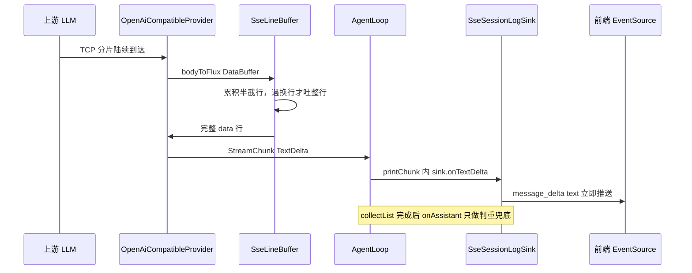

# 流式架构（Streaming Architecture）

> 适用范围：`agent-core` 的 Provider 流式解析 + `agent-web` 的 SSE 编排。
> 相关代码：`OpenAiCompatibleProvider`、`SseLineBuffer`、`AgentLoop`、`SessionLogSink`、`SseSessionLogSink`、`ChatStreamService`。
> 变更来源：OpenSpec change `add-true-streaming`。

---

## 1. 结论速览

一次「真流式」要同时穿过四层，任何一层攒批都会让前端看到「一坨出来」：

| 层 | 组件 | 职责 | 攒批的表现 |
|:--:|------|------|-----------|
| L1 | `OpenAiCompatibleProvider` | HTTP 层边收边解析 SSE | 用 `bodyToMono` 时 TTFT 等于总响应时长 |
| L2 | `SseLineBuffer` | 跨 TCP 帧重组 SSE 行 | 缺它时半截 JSON 解析失败或整块丢弃 |
| L3 | `AgentLoop` | 把每个 chunk 实时转发给 sink | 只在 `collectList()` 后回调时正文攒批 |
| L4 | `SseSessionLogSink` | 转成 SSE `message_delta` | 只整段 emit 时前端一次渲染完 |

---

## 2. v0.1 的假流式根因

### 2.1 HTTP 层攒批

`OpenAiCompatibleProvider.streamChat` 用 `bodyToMono(String.class)`，必须等上游整个响应体接收完毕才返回，之后才按行切分。实测（WireMock `withFixedDelay(800)`）首 emit 发生在 837ms，等于上游延迟加开销，而不是首字节时间。

### 2.2 编排层攒批

`AgentLoop` 的模型调用链是：

```java
provider.streamChat(toRequest())
    .doOnNext(this::printChunk)   // 逐 chunk
    .collectList()                // 攒完整轮
    .flatMapMany(chunks -> {
        Message.Assistant assistant = extractAssistant(chunks);
        sink.onAssistant(assistant, assistant.reasoning());  // 整段回调
        ...
    });
```

`SseSessionLogSink.onAssistant` 里才 emit 正文，所以即使 L1 已经逐 chunk 到达，正文仍然只在这一刻整段推出。

### 2.3 被证伪的两个嫌疑点

排查过程中曾怀疑另外两处，实测均不成立，**已明确不改**：

- `ChatStreamService` 的 `Sinks.many().replay().all()`：replay 只影响「订阅发生在 emit 之后」的场景；正常时序（POST /send 返回 streamId 后立即 GET /stream）订阅早于首次 emit。反证是 `onThinkingDelta` 走的正是同一个 sink，其逐 token 输出一直是正常的。此外 replay 是 `spec §resume` / `Last-Event-ID` 重连的实现基础。
- `ChatStreamService.start` 的 `.block(Duration.ofMinutes(30))`：它阻塞的是 `Executors.newCachedThreadPool()` 里的 executor 线程，HTTP handler 线程早已返回；SSE emit 发生在 Netty 事件循环线程上。改成 `.subscribe()` 只省一个线程，不影响 TTFT。

---

## 3. 目标架构



要点：

1. L1 用 `bodyToFlux(DataBuffer.class)`，每段 TCP 数据到达即向下游 emit。
2. L2 用 `concatMap` 串行处理有状态的行缓冲（`flatMap` 会乱序拼行）。
3. L3 在 `collectList()` **之前**把 `TextDelta` 转发给 sink。
4. L4 每个增量立即 emit，并在整轮结束时判重，避免同一段正文被渲染两遍。

---

## 4. 关键实现细节

### 4.1 行重组必须串行

`SseLineBuffer.lines` 用 `Flux.defer` 保证行缓冲按订阅隔离，内部用 `concatMap` 而非 `flatMap`：

```java
public static Flux<String> lines(Flux<DataBuffer> source) {
    return Flux.defer(() -> {
        StringBuilder pending = new StringBuilder();
        return source
            .concatMap(buf -> {
                try { pending.append(buf.toString(StandardCharsets.UTF_8)); }
                finally { DataBufferUtils.release(buf); }
                List<String> complete = new ArrayList<>();
                int idx;
                while ((idx = pending.indexOf("\n")) >= 0) {
                    complete.add(pending.substring(0, idx));
                    pending.delete(0, idx + 1);
                }
                return Flux.fromIterable(complete);
            })
            .concatWith(Flux.defer(() ->
                pending.length() == 0 ? Flux.empty() : Flux.just(pending.toString())));
    });
}
```

- `buf.toString(UTF_8)` 读完整可读区间，随后立刻 `DataBufferUtils.release` 归还（对非池化 buffer 是空操作）。
- 源结束时残留的半行补吐一次，避免上游截断导致最后一条事件丢失。

### 4.2 整行交给 `parseSseLine`，不要预先剥前缀

`OpenAiCompatibleMapper.parseSseLine` 自己会判断并剥掉 `data: ` 前缀、跳过 `[DONE]` 与空行。调用方若先 `substring("data: ".length())`，它就会因为不满足 `startsWith("data: ")` 而**对每一行都返回 empty**——表现为「HTTP 收到数据但一个 chunk 都解析不出来」。

正确写法：

```java
.bodyToFlux(DataBuffer.class)
.transform(SseLineBuffer::lines)
.filter(line -> line.startsWith("data: "))
.map(mapper::parseSseLine)
.filter(Optional::isPresent)
.map(Optional::get)
```

### 4.3 正文增量与整段兜底去重

`SseSessionLogSink` 用 `AtomicBoolean textStreamed` 做逐轮判重：

| 阶段 | 行为 |
|------|------|
| `onTextDelta(text)` | 置位并立即 emit `message_delta(text)` |
| `onAssistant(...)` | `getAndSet(false)` 读取并清零；已推过增量则跳过正文，否则兜底 emit 全文 |

清零发生在 `onAssistant`，因此判重是**每个模型轮次独立**的：工具调用场景下多个模型轮次互不干扰。

### 4.4 复合 sink 必须转发增量回调

web 路径在存在落盘录制器时，`WebAgentRuntime.sinkFor` 返回 `CompositeSessionLogSink`。增量回调是接口 `default` 空方法，**复合 sink 不显式转发就会被静默吞掉**。`onTextDelta` 与 `onThinkingDelta` 都必须在 `CompositeSessionLogSink` 中转发。

---

## 5. 超时语义的变化

`responseTimeout` 在 Reactor Netty 中是「两次网络读之间的最大间隔」（由 `ReadTimeoutHandler` 实现），也就是读空闲超时：

- v0.1（`bodyToMono`）期间没有中间读操作，该值近似整体响应上限，长回答容易被误杀。
- 现在（`bodyToFlux`）只要上游持续吐字就不会触发，上游静默超过 60s 才判定连接僵死。

`MAX_IN_MEMORY_BYTES`（16MB）现在只兜住 4xx/5xx 错误体（`WebClientResponseException` 需要把错误体读成字符串），正常响应走逐段消费不受该上限约束。

---

## 6. 回归防线

| 测试 | 守住的约束 |
|------|-----------|
| `SseLineBufferTest` | 跨帧拼行、逐字符滴灌、残留半行、订阅隔离、CRLF 保留 |
| `OpenAiCompatibleProviderE2ETest` | 分段响应下 TTFT 小于 300ms 且首 emit 早于整体完成 200ms 以上 |
| `ChatStreamServiceStreamingTest` | 正文逐条到达、无整段重发、无增量时兜底、判重逐轮重置 |
| `ChatStreamServiceConcurrencyTest` | 4 条流并发时事件不串台 |
| `CompositeSessionLogSinkTest` | 增量回调经复合 sink 转发 |

> 注意：用 WireMock 验证 TTFT 必须用 `withChunkedDribbleDelay`。`withFixedDelay` 会把整个响应体延迟到指定时刻才发，真流式也只能等到那一刻，测不出差异。
