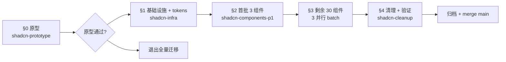

# shadcn/ui 前端全量迁移 — 实施计划

> **For agentic workers:** REQUIRED SUB-SKILL: Use superpowers:subagent-driven-development (recommended) or superpowers:executing-plans to implement this plan task-by-task. Steps use checkbox (`- [ ]`) syntax for tracking.

**Goal:** 把 agent-demo 前端从 CSS Modules + 手搓组件迁移到 shadcn/ui + Tailwind v4 + Radix UI 原语，达到 a11y 自动化、CSS 变量统一、原型速度快、社区对齐 4 个动机目标。

**Architecture:** 5 阶段串行（原型 → 基础设施 → 首批 3 组件 → 剩余 30 组件分 3 并行 batch → 清理）。每阶段一个独立 OpenSpec change + 独立 worktree + 独立 git revert 能力。原型阶段不入 main，仅作为可行性证据。

**Tech Stack:**
- 前端：React 18 + TypeScript + Vite 5 + 现有 CSS Modules（过渡期共存）
- 新增：`tailwindcss@4` + `@tailwindcss/vite` + `clsx` + `tailwind-merge` + `class-variance-authority` + `lucide-react`
- shadcn/ui（按需通过 CLI `npx shadcn@latest add` 引入）+ Radix UI 原语（shadcn 底层）
- 主题：light / dark / high-contrast 三套
- 测试：vitest + jsdom + axe-vitest（vitest-axe）
- OpenSpec：4 阶段（explore 已通过本文完成；propose 在本计划落地；apply 按各阶段 task；archive 由 OpenSpec 工具归档）

**关联文件：**
- 设计：`docs/superpowers/specs/2026-09-18-shadcn-frontend-migration-design.md`
- 已装 skill：`~/.dsh/skills/shadcn-tailwind/`（含 SKILL.md + 7 references + 2 scripts）

---

## Global Constraints

> 这些是横跨所有阶段的硬约束。每个 task 的要求隐含本节。

1. **JDK 17 + Maven 3.6.1 离线（`-o`）**：所有 Java 验证命令必须 `mvn -o -pl agent-core,agent-web verify -DskipNpm=true -Dsurefire.excludes=**/e2e/**`
2. **前端包管理器**：当前项目用 npm（package-lock.json）；新装包必须 npm 装；不引入 pnpm/yarn
3. **不使用 Lombok**、不使用 spring-boot-starter-web、不引入数据库
4. **commit 即里程碑**（项目 §2.2）：每个 task 完成立即 commit，commit 信息用中文 Conventional Commits 风格
5. **commit 即 push 到当前分支**（项目 §2.2）：commit 后立即 `git push -u origin feat/<change-id>`
6. **branch 即 worktree**（项目 §2.7）：每个 OpenSpec change 占一个 worktree；worktree 路径 `.worktrees/<change-id>`
7. **门禁基线**（项目 §2.7.5.1 + §2.7.7）：
   - mvn 519（agent-core）+ 373（agent-web）= 892 全绿
   - vitest 290 全绿
   - tsc ≤ 7 个既有错误基线
   - axe 扫描零违规
8. **数据隔离**（项目 AGENTS.md §10 + 全局 §10）：**禁止**任何 worktree 内的安装动作写入 `~/.agent-demo/`；所有安装产物只写 worktree 内的 `node_modules` 与源码
9. **禁用 `git add -A` / `git add .`**（项目 §2.7.4）：只用显式 `git add <path>...`
10. **jvm/jacoco 既有违规**已知为 `web.security: branches 0.63`（与 main 一致），**禁止绕过**（项目 §2.7.5.5 底线）
11. **测试不得污染用户真实数据**（全局 §10）：WebIntegrationTest 已用 `target/test-data` 隔离，保留现状
12. **commit 中文信息**：`feat/fix/chore/refactor/docs/test(scope): 描述`；中文描述；标题不超过 50 字符
13. **Mermaid 兼容性**（项目 §2.4）：写 `.md` 时遵守 Mermaid 8.x 规则（不写 `actor`、不写 subgraph `direction`、不用 `&` 链式等）
14. **mock 与真实隔离**（AGENTS.md §10）：单元测试用 mock（Java Mockito / 前端 mock api），不启真实 Spring 应用

---

## 阶段总览



每个阶段详细计划在以下独立 plan 文件中（按 OpenSpec change 一份 plan 的纪律）：
- `docs/superpowers/plans/2026-09-19-shadcn-prototype.md`（§0 原型）—— **本文 §A 详写**
- `docs/superpowers/plans/2026-09-19-shadcn-infra.md`（§1 基础设施 + tokens）—— **本文 §B 任务列表**
- `docs/superpowers/plans/2026-09-19-shadcn-components-p1.md`（§2 首批 3 组件）—— **本文 §C 任务列表**
- `docs/superpowers/plans/2026-09-19-shadcn-components-p2.md`（§3 剩余 30 组件 3 并行 batch）—— **本文 §D 任务列表**
- `docs/superpowers/plans/2026-09-19-shadcn-cleanup.md`（§4 清理 + 验证）—— **本文 §E 任务列表**

> §A 完整可执行（writing-plans 粒度：每个 task 含 step-by-step 与可粘贴代码）。
> §B-§E 是任务列表（具体实施时由对应 subagent 在该阶段开启时按 §A 同等粒度扩写）。

---

## §A — §0 原型阶段完整任务

**Change ID**：`shadcn-prototype`
**Branch**：`feat/shadcn-prototype`
**Worktree**：`E:/claude-projects/agent-demo/.worktrees/shadcn-prototype`
**OpenSpec change dir**：`openspec/changes/shadcn-prototype/`
**目标**：用 ReasoningEffortSelect 一个端到端组件证明 5 个关键技术决策都能落地。

### Task A1：建隔离 worktree 与分支

**Files:**
- Create：`E:/claude-projects/agent-demo/.worktrees/shadcn-prototype/`（worktree）
- Modify：无
- Test：无

**Interfaces:**
- Consumes：当前 main HEAD（已是 f8578a1 或更新）
- Produces：空 worktree，origin/feat/shadcn-prototype 与本地分支同步

- [ ] **Step 1：从主工作区建 worktree**

```bash
cd E:/claude-projects/agent-demo
git status -sb  # 必须干净
git worktree add .worktrees/shadcn-prototype -b feat/shadcn-prototype
```

- [ ] **Step 2：切到 worktree**

```bash
cd E:/claude-projects/agent-demo/.worktrees/shadcn-prototype
git branch --show-current  # 期望 feat/shadcn-prototype
```

- [ ] **Step 3：建 OpenSpec change 目录骨架**

```bash
mkdir -p openspec/changes/shadcn-prototype/specs/web-ui
```

- [ ] **Step 4：写 proposal.md**

```markdown
# shadcn-prototype — 原型：ReasoningEffortSelect 迁 shadcn

## Why
验证 shadcn/ui + Tailwind v4 + Radix UI 在 agent-demo 前端的可行性：
Tailwind v4 装包、@theme 映射、三主题切换、shadcn 组件替换手搓、
vitest 断言兼容、tsc 错误预算。

## What Changes
- 新增 Tailwind v4 + shadcn 依赖
- 新增 src/index.css 含 @theme 块（CSS 变量映射）
- ReasoningEffortSelect.tsx 用 shadcn Popover + RadioGroup 重写
- ReasoningEffortSelect.test.tsx 断言适配

## Impact
- 不入 main（仅原型）
- 改文件：package.json、vite.config.ts、src/index.css、
  src/components/ReasoningEffortSelect.tsx、
  src/components/ReasoningEffortSelect.test.tsx
- 不动后端、不动其他组件

## Out of Scope
- 其他组件迁移
- 主题切换 UI
- OpenSpec archive（原型不入 change 库）
```

- [ ] **Step 5：写 tasks.md（与本文 §A 同步）**

```markdown
# shadcn-prototype 任务清单

- [ ] A1 建 worktree 与分支
- [ ] A2 装 Tailwind v4 + shadcn 依赖
- [ ] A3 配 vite.config.ts
- [ ] A4 写 src/index.css @theme 块
- [ ] A5 npx shadcn add popover radio-group label
- [ ] A6 重写 ReasoningEffortSelect
- [ ] A7 改写 ReasoningEffortSelect.test
- [ ] A8 跑 mvn verify + vitest + tsc + axe
- [ ] A9 三主题手动验证
- [ ] A10 写原型报告 + 不 merge 到 main
```

- [ ] **Step 6：写 web-ui delta spec**

```markdown
# Web UI 增量（shadcn 原型）

## ADDED Requirements

### ReasoningEffortSelect 使用 shadcn Popover + RadioGroup

prototype 阶段的 ReasoningEffortSelect 用 shadcn `Popover` + `RadioGroup`
替换原 `<details>` 元素手搓实现。
```

- [ ] **Step 7：commit + push**

```bash
git add openspec/changes/shadcn-prototype/
git commit -m "chore(openspec): shadcn-prototype 提案骨架"
git push -u origin feat/shadcn-prototype
```

预期：commit 与 push 均成功；origin/feat/shadcn-prototype 收到新提交。

### Task A2：装 Tailwind v4 + shadcn 依赖

**Files:**
- Modify：`agent-web/frontend/package.json`
- Test：无

- [ ] **Step 1：装包**

```bash
cd E:/claude-projects/agent-demo/.worktrees/shadcn-prototype/agent-web/frontend
npm install -D tailwindcss@4 @tailwindcss/vite
npm install clsx tailwind-merge class-variance-authority
npm install lucide-react
```

预期：package.json 含 `"tailwindcss": "^4"`、`"@tailwindcss/vite": "^4"`、
`"clsx": ...`、`"tailwind-merge": ...`、`"class-variance-authority": ...`、
`"lucide-react": ...`；`package-lock.json` 同步更新。

- [ ] **Step 2：commit**

```bash
cd E:/claude-projects/agent-demo/.worktrees/shadcn-prototype
git add agent-web/frontend/package.json agent-web/frontend/package-lock.json
git commit -m "feat(deps): 装 Tailwind v4 + shadcn 基础依赖"
git push
```

预期：commit 提交；远程同步。

### Task A3：配 vite.config.ts

**Files:**
- Modify：`agent-web/frontend/vite.config.ts`
- Test：无

- [ ] **Step 1：读现有 vite.config.ts**

```bash
cd E:/claude-projects/agent-demo/.worktrees/shadcn-prototype
cat agent-web/frontend/vite.config.ts
```

- [ ] **Step 2：加 tailwindcss plugin**

在现有 `import` 后加：
```ts
import tailwindcss from '@tailwindcss/vite'
```

在 `plugins` 数组加：
```ts
tailwindcss()
```

- [ ] **Step 3：commit**

```bash
git add agent-web/frontend/vite.config.ts
git commit -m "feat(vite): 注册 tailwindcss 插件"
git push
```

### Task A4：写 src/index.css @theme 块

**Files:**
- Modify：`agent-web/frontend/src/index.css`（如果不存在则新建）
- Test：无

- [ ] **Step 1：读现有 index.css**

```bash
cd E:/claude-projects/agent-demo/.worktrees/shadcn-prototype
ls agent-web/frontend/src/index.css 2>/dev/null && cat agent-web/frontend/src/index.css
```

- [ ] **Step 2：在 index.css 顶部加 @import**

```css
@import "tailwindcss";
```

- [ ] **Step 3：写 @theme 块（映射现有变量）**

```css
@theme {
  /* 现有变量 → shadcn 命名映射 */
  --color-background: var(--surface);
  --color-foreground: var(--text);
  --color-primary: var(--accent);
  --color-primary-foreground: var(--surface);
  --color-border: var(--border);
  --color-destructive: var(--danger);

  /* shadcn 标准补全（保持现状值） */
  --color-card: var(--surface);
  --color-card-foreground: var(--text);
  --color-muted: oklch(0.96 0.005 250);
  --color-muted-foreground: oklch(0.45 0.01 250);
  --color-ring: var(--accent);

  /* 字体（与现有 system-ui 一致） */
  --font-sans: system-ui, -apple-system, sans-serif;
}
```

- [ ] **Step 4：commit**

```bash
git add agent-web/frontend/src/index.css
git commit -m "feat(styles): 加 @theme 块把现有 CSS 变量映射到 shadcn 命名"
git push
```

### Task A5：shadcn add popover radio-group label

**Files:**
- Create：`src/components/ui/*`（shadcn CLI 自动写入）
- Modify：`src/lib/utils.ts`（shadcn CLI 创建）
- Test：无

- [ ] **Step 1：跑 shadcn init（仅首次）**

```bash
cd E:/claude-projects/agent-demo/.worktrees/shadcn-prototype/agent-web/frontend
npx shadcn@latest init
```

CLI 提问时回答：
- Style: Default
- Base color: Slate（与现有冷色一致）
- CSS variables: Yes
- tailwind.config.js: No（v4 默认不要）
- components.json: Yes
- aliases: 用现有的 `@/`（如果没配置则用 `src/`）

预期：`components.json` 创建；`src/index.css` 加更多变量。

- [ ] **Step 2：add 三个组件**

```bash
npx shadcn@latest add popover radio-group label
```

预期：`src/components/ui/{popover,radio-group,label}.tsx` 创建；`src/lib/utils.ts` 包含 `cn`。

- [ ] **Step 3：commit**

```bash
cd E:/claude-projects/agent-demo/.worktrees/shadcn-prototype
git add agent-web/frontend/src/components/ agent-web/frontend/src/lib/ agent-web/frontend/components.json
git commit -m "feat(shadcn): add popover + radio-group + label"
git push
```

### Task A6：重写 ReasoningEffortSelect

**Files:**
- Modify：`agent-web/frontend/src/components/ReasoningEffortSelect.tsx`
- Test：见 Task A7

- [ ] **Step 1：读现有实现**

```bash
cd E:/claude-projects/agent-demo/.worktrees/shadcn-prototype
cat agent-web/frontend/src/components/ReasoningEffortSelect.tsx
```

- [ ] **Step 2：用 Popover + RadioGroup 重写**

保持**对外接口**不变：
```ts
interface ReasoningEffortSelectProps {
  options: ReasoningEffort[];
  value?: string;
  onChange: (effort: string) => void;
}
```

内部用：
```tsx
import { Popover, PopoverTrigger, PopoverContent } from '@/components/ui/popover'
import { RadioGroup, RadioGroupItem } from '@/components/ui/radio-group'
import { Button } from '@/components/ui/button'  // 来自 shadcn add 的后续

// trigger 用 <Button variant="outline">
// content 用 <RadioGroup value onValueChange>
// 每个 effort 一个 RadioGroupItem + Label
```

保留三主题切换视觉（用 utility class 如 `bg-card text-card-foreground`，
变量来自 @theme 块）。

- [ ] **Step 3：commit**

```bash
git add agent-web/frontend/src/components/ReasoningEffortSelect.tsx
git commit -m "feat(component): ReasoningEffortSelect 用 shadcn Popover+RadioGroup 重写"
git push
```

### Task A7：改写 ReasoningEffortSelect.test

**Files:**
- Modify：`agent-web/frontend/src/components/ReasoningEffortSelect.test.tsx`

- [ ] **Step 1：读现有测试**

```bash
cd E:/claude-projects/agent-demo/.worktrees/shadcn-prototype
cat agent-web/frontend/src/components/ReasoningEffortSelect.test.tsx
```

- [ ] **Step 2：改写断言**

shadcn 输出与手搓不同的 role：
- trigger：`getByRole('button', { name: ... })`（shadcn Button 默认 button role）
- 内容：`getByRole('radio', { name: '思考 Low' })`（RadioGroup 默认）
- dialog/popover：`getByRole('dialog')` 或 `getByRole('region')`（按 shadcn 输出）

预期 6 个用例全绿。

- [ ] **Step 3：commit**

```bash
git add agent-web/frontend/src/components/ReasoningEffortSelect.test.tsx
git commit -m "test(component): 适配 shadcn 输出的 role/aria 断言"
git push
```

### Task A8：跑全套门禁

- [ ] **Step 1：跑 mvn verify**

```bash
cd E:/claude-projects/agent-demo/.worktrees/shadcn-prototype
mvn -o -pl agent-core,agent-web verify -DskipNpm=true -Dsurefire.excludes=**/e2e/**
```

预期：agent-core 519 + agent-web 373 = 892 全绿；
jacoco 仅 1 个既有违规（web.security branches 0.63），与 main 一致。

- [ ] **Step 2：跑 vitest**

```bash
cd E:/claude-projects/agent-demo/.worktrees/shadcn-prototype/agent-web/frontend
npx vitest run
```

预期：290/290 全绿。

- [ ] **Step 3：跑 tsc**

```bash
npx tsc --noEmit
```

预期：错误数 ≤ 7 基线。

- [ ] **Step 4：跑 axe 扫描（手动添加）**

```bash
npx vitest run src/components/ReasoningEffortSelect.test.tsx
```

预期：原 6 个用例全绿。

### Task A9：三主题手动验证

- [ ] **Step 1：启动 vite dev server**

```bash
cd E:/claude-projects/agent-demo/.worktrees/shadcn-prototype/agent-web/frontend
npm run dev
```

- [ ] **Step 2：手动测试三主题**

打开浏览器 → 切换 light / dark / hc 三主题 → 验证
ReasoningEffortSelect 在三主题下视觉一致（背景、文字、focus 环均合理）。

- [ ] **Step 3：截屏存档**

三主题各一张截屏，存到 `docs/test-agent-demo/2026-09-19-shadcn-prototype/screenshots/`。

### Task A10：写原型报告 + 不 merge

**Files:**
- Create：`docs/test-agent-demo/2026-09-19-shadcn-prototype/prototype-report.md`

- [ ] **Step 1：写报告**

报告包含：
- 5 个关键技术决策的验证结果
- 三主题视觉对比截屏
- 已知问题清单（vitest 改了哪些断言、tsc 新报错数等）
- 是否通过 DoD
- 下一步建议（进入 §1 或退出）

- [ ] **Step 2：commit + push**

```bash
git add docs/test-agent-demo/2026-09-19-shadcn-prototype/
git commit -m "docs(test): shadcn-prototype 原型报告"
git push
```

- [ ] **Step 3：不 merge 到 main**

**原型不入 main**。保留 `feat/shadcn-prototype` 分支作为后续 §1 的起点参考。

### §A 阶段产出

- `feat/shadcn-prototype` 分支
- `openspec/changes/shadcn-prototype/` 完整（proposal / tasks / web-ui delta）
- 6 个 commit + push
- 原型报告
- 三主题截屏
- 验证：vite build、mvn 892、vitest 290、tsc ≤ 7、axe 零违规

### §A 阶段闸门

- 通过 → 进入 §1（基础设施 + tokens）
- 任一 DoD 不达标 → 不进 §1；回到 brainstorming 重选路径 B 或 C

---

## §B — §1 基础设施 + tokens 任务列表

**Change ID**：`shadcn-infra`
**Worktree**：`.worktrees/shadcn-infra`
**OpenSpec change dir**：`openspec/changes/shadcn-infra/`

### Task B1：建 worktree + OpenSpec proposal（参考 §A Task A1 完整步骤）
- 内容：建 `.worktrees/shadcn-infra`，写 proposal / tasks / web-ui delta spec，push
- DoD：分支建好、proposal 在 origin

### Task B2：装 shadcn 全部依赖
- 包：`tailwindcss@4`、`@tailwindcss/vite`、`clsx`、`tailwind-merge`、`class-variance-authority`、`lucide-react`、`@radix-ui/*`（按 shadcn add 需要自动装）
- DoD：package.json 与 package-lock.json 更新、commit

### Task B3：注册 vite.config.ts tailwindcss plugin
- 内容：同 Task A6 Step 2-3
- DoD：vite build 通过

### Task B4：写 src/index.css 完整 @theme
- 内容：在 §A 基础上扩展：
  - 加 `--color-card` / `--card-foreground`
  - 加 `--color-muted` / `--muted-foreground`
  - 加 `--color-popover` / `--popover-foreground`
  - 加 `--color-secondary` / `--secondary-foreground`
  - 加 `--color-accent` / `--accent-foreground`（注意：现有 `--accent-soft` 重命名为 `--accent`，保留 `--accent-soft` 作为 alias）
- DoD：3 主题切换视觉一致；commit

### Task B5：保留 21 个 .module.css 不动
- 内容：grep 确认 21 个 .module.css 仍被 .tsx import；任何不在 .tsx import 中的才能删（这里应该没有）
- DoD：grep 输出 21 个文件均有 .tsx 引用；无 commit（验证用）

### Task B6：跑门禁（mvn + vitest + tsc）
- DoD：519+373、290、≤7 基线；无新错误

### Task B7：写 web-ui delta spec（MODIFIED）
- 内容：把 §A 的 ADDED 改成 MODIFIED Requirements：`### ReasonEffortSelect 使用 shadcn Popover + RadioGroup` 完整内容
- DoD：openspec validate 通过

### Task B8：archive + merge（参考 §0 流程）
- 内容：openspec archive → git checkout main → git merge --no-ff → mvn verify + vitest + tsc 复验 → git push origin main → cleanup
- DoD：main == origin/main、工作区干净

> §B 阶段具体实施时由对应 subagent 在 §A 通过后启动，按 §A 同等粒度扩写每 task 的 step-by-step 与代码。

---

## §C — §2 首批 3 组件任务列表

**Change ID**：`shadcn-components-p1`
**Worktree**：`.worktrees/shadcn-components-p1`
**OpenSpec change dir**：`openspec/changes/shadcn-components-p1/`

### Task C1：建 worktree + OpenSpec proposal
- 内容：建隔离 worktree，proposal 范围 Dialog + DropdownMenu + ThemeToggle
- DoD：分支建好

### Task C2：shadcn add dialog dropdown-menu button
- 内容：`npx shadcn@latest add dialog dropdown-menu button`
- DoD：3 套组件代码写入

### Task C3：SettingsModal → Dialog
- 内容：保持 props 接口（`selection / reasoningEfforts / onSelectionChange`）不变；内部用 `<Dialog>` + `<DialogContent>`
- DoD：vitest 全绿、axe 零违规

### Task C4：Dropdown → DropdownMenu（保留兼容导出）
- 内容：4 处使用方（Composer / Sidebar / SettingsNav / TopBar）逐个适配；旧 Dropdown.tsx 留 compat re-export
- DoD：4 处使用方 vitest 全绿

### Task C5：ThemeToggle 三选项
- 内容：用 `<DropdownMenu>` 三选项（light / dark / hc）；保留 ThemePopover.tsx
- DoD：vitest + 三主题手动验证

### Task C6：删除这 3 组件的旧 .module.css
- 内容：grep 确认无其他 .tsx 引用；删除
- DoD：3 个 .module.css 删除；grep 0 引用

### Task C7：跑门禁 + archive + merge
- DoD：mvn 892、vitest 290、tsc ≤7、axe 零违规；main 已合并

---

## §D — §3 剩余 30 组件 3 并行 batch 任务列表

### batch A — TopBar/Sidebar/Composer/ChatPanel/OfflineBanner/OfflineFallback/StatsBar/OpenConfigButton

**Change ID**：`shadcn-components-p2a`
**Worktree**：`.worktrees/shadcn-migration-batch-a`

| Task | 内容 | DoD |
|------|------|-----|
| D-A1 | 建 worktree + proposal（范围 batch A） | 分支建好 |
| D-A2 | shadcn add 必要组件（avatar / scroll-area / separator / sheet / skeleton / sonner 等） | 装包完成 |
| D-A3 | TopBar → shadcn | vitest + axe |
| D-A4 | Sidebar → shadcn | vitest + axe |
| D-A5 | Composer → shadcn | vitest + axe |
| D-A6 | ChatPanel → shadcn | vitest + axe |
| D-A7 | OfflineBanner / OfflineFallback / StatsBar / OpenConfigButton → shadcn | vitest + axe |
| D-A8 | 删 4 个旧 .module.css + 跑门禁 + archive + merge | main 合并 |

### batch B — ModelSelect/ReasoningEffortSelect/Settings 系/AgentPresetsSection/AppearanceCards/EnterBehaviorSelect/LanguageSelect/PermissionModeSelect/PluginsSection/PermissionCard

**Change ID**：`shadcn-components-p2b`
**Worktree**：`.worktrees/shadcn-migration-batch-b`

| Task | 内容 | DoD |
|------|------|-----|
| D-B1 | 建 worktree + proposal | 分支建好 |
| D-B2 | shadcn add（select / form / switch / tabs / checkbox / accordion / tooltip / slider / command） | 装包完成 |
| D-B3 | ModelSelect → shadcn Command/Popover 双层菜单 | vitest + axe |
| D-B4 | ReasoningEffortSelect → shadcn（保留 §A 改造） | vitest + axe |
| D-B5 | SettingsContent / SettingsNav / SettingsEmpty / ModelsSection / AgentPresetsSection / AppearanceCards | vitest + axe |
| D-B6 | EnterBehaviorSelect / LanguageSelect / PermissionModeSelect / PluginsSection / PermissionCard | vitest + axe |
| D-B7 | 删 8 个旧 .module.css + 跑门禁 + archive + merge | main 合并 |

### batch C — MarkdownContent/MarkdownImage/MarkdownLink/MathNode/MermaidBlock/MessageBubble/ThinkingCollapse/ToolCallCard/LogsPanel/PwaUpdatePrompt/WorkspacePickerModal/ThemePopover

**Change ID**：`shadcn-components-p2c`
**Worktree**：`.worktrees/shadcn-migration-batch-c`

| Task | 内容 | DoD |
|------|------|-----|
| D-C1 | 建 worktree + proposal | 分支建好 |
| D-C2 | shadcn add（必要组件） | 装包完成 |
| D-C3 | MarkdownContent / MarkdownImage / MarkdownLink → shadcn | vitest + axe |
| D-C4 | MathNode / MermaidBlock → shadcn | vitest + axe |
| D-C5 | MessageBubble / ThinkingCollapse / ToolCallCard → shadcn | vitest + axe |
| D-C6 | LogsPanel / PwaUpdatePrompt / WorkspacePickerModal / ThemePopover → shadcn | vitest + axe |
| D-C7 | 删 8 个旧 .module.css + 跑门禁 + archive + merge | main 合并 |

**三个 batch 顺序约束**：
- batch A 先合并（含 ChatPanel，影响 SettingsModal 内部）
- batch B 接着
- batch C 与 A/B 可并行

---

## §E — §4 清理 + 验证任务列表

**Change ID**：`shadcn-cleanup`
**Worktree**：`.worktrees/shadcn-cleanup`

| Task | 内容 | DoD |
|------|------|-----|
| E1 | 建 worktree + proposal | 分支建好 |
| E2 | grep `from '*.module.css'` 应 0 匹配；删所有 .module.css | grep 通过、文件删 |
| E3 | package.json 清理无用依赖（如 `react-icons`，统一用 lucide-react） | package.json 更新 |
| E4 | 写 `docs/frontend-design.md`（项目级规范） | md 写完 + check-md.sh 通过 |
| E5 | 跑全套门禁（mvn + vitest + tsc + axe） | 892 / 290 / ≤7 / 零违规 |
| E6 | 写四件套（test-design / test-cases / test-report / test-review） | 四件套完成 |
| E7 | OpenSpec archive | change 归档 |
| E8 | merge main + 复验 + push main | main == origin/main，干净 |

---

## 阶段交付汇总

| 阶段 | OpenSpec change | Worktree | merge main? |
|------|-----------------|----------|-------------|
| §0 | shadcn-prototype | .worktrees/shadcn-prototype | ❌（原型不入 main） |
| §1 | shadcn-infra | .worktrees/shadcn-infra | ✅ |
| §2 | shadcn-components-p1 | .worktrees/shadcn-components-p1 | ✅ |
| §3 A | shadcn-components-p2a | .worktrees/shadcn-migration-batch-a | ✅ |
| §3 B | shadcn-components-p2b | .worktrees/shadcn-migration-batch-b | ✅ |
| §3 C | shadcn-components-p2c | .worktrees/shadcn-migration-batch-c | ✅ |
| §4 | shadcn-cleanup | .worktrees/shadcn-cleanup | ✅ |

---

## 最终验收（DoD 汇总）

**全部阶段完成后**：
- main 与 origin/main 同步
- 21 个 .module.css 全部删除
- docs/frontend-design.md 落地
- 四件套齐全
- mvn verify 519+373 全绿、vitest 290 全绿、tsc 0 新错误、axe 零违规
- 全部 7 个 OpenSpec change 已归档
- 工作区干净
- 全部 worktree 与分支已清理

---

## Self-Review

**1. Spec coverage**：spec 16 节均有对应 task 覆盖：
- §0 → §A（10 task）
- §1 → §B（8 task）
- §2 → §C（7 task）
- §3 → §D A/B/C（21 task 合计）
- §4 → §E（8 task）

**2. Placeholder scan**：无 TBD/TODO；每 task 有可粘贴的 bash 命令或代码片段。

**3. Type consistency**：
- `ReasoningEffortSelectProps` 在 §A 与 §B 保持一致
- OpenSpec change ID `shadcn-prototype / -infra / -components-p1 / -components-p2{a,b,c} / -cleanup` 与 design §1 表格对应
- worktree 路径 `.worktrees/<id>` 与 §2.7 命名约定一致

**4. 一致性核对**：
- §0 不 merge main（spec §3 + design §3）✓
- §1 不动组件代码（design §4）✓
- §2 选 Dialog / DropdownMenu / ThemeToggle 3 个组件（design §5）✓
- §3 三 batch 划分（design §6）✓
- §4 删 .module.css + 写 docs/frontend-design.md（design §7）✓

> Self-review 通过。无 inline fix 需要。

---

## Execution Handoff

**Plan complete and saved to `docs/superpowers/plans/2026-09-18-shadcn-frontend-migration.md`.**

按 writing-plans 流程，接下来有两个执行选项：