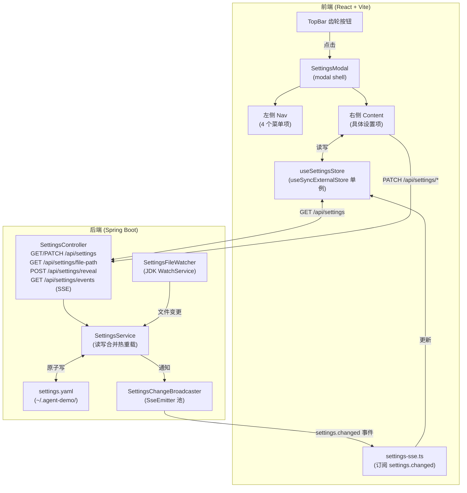
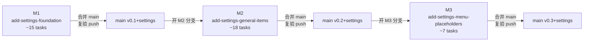

# 设置菜单（仿 dsh web 设计）— brainstorming 设计稿

**日期**：2026-09-15
**作者**：MiniMax-M3（与用户多轮 brainstorm）
**状态**：待用户 review
**关联**：将作为 OpenSpec change `add-settings-foundation` / `add-settings-general-items` / `add-settings-menu-placeholders` 的总设计输入

---

## 1. 背景与动机

agent-demo 当前在 `TopBar` 已经预留了「设置」齿轮按钮（lucide `Settings`），但 `App.tsx` 用 `alert("设置 v0.2 接入")` 占位。本次需求是把占位替换为**真正可用的设置面板**，UI 仿造 `deepseek-harness` 项目的 dsh web 设置界面（settings-chrome 截图）。

具体参照：

| 截图区域 | dsh 实现 | agent-demo 现状 |
|---------|---------|-----------------|
| 触发按钮 | `SettingsRoot.tsx` 的 `css.trigger` | TopBar 第 26 行 `<button>` 已存在 |
| 居中 modal | `SettingsRoot.tsx:62` overlay/mask/panel 三层 | 无 |
| 左侧 nav | `SettingsRoot.tsx:65` 4 个 navCell | 无 |
| 右侧 content | `SettingsRoot.tsx:82` + GeneralSection | 无 |
| 三卡片外观 | `AppearanceRow.tsx:46-58` cubeRow | ThemeToggle 是 toggle 二态 |
| 关闭路径 | ESC + mask + X（`SettingsRoot.tsx:51/63/86`） | 无 |

dsh 用了 slot + SettingsScope 的复杂体系；agent-demo 走简化路线：**模块级单例 store + `useSyncExternalStore` + 复用 SSE**。

---

## 2. 目标与成功标准

**目标**：让用户能在 Web UI 的设置面板里**读写**以下设置项，并立即生效。

| 项 | 写入路径 | 即时生效 |
|----|---------|---------|
| 外观（浅/深/跟随） | `~/.agent-demo/settings.yaml` | 是（CSS 变量切换） |
| 权限模式 | `~/.agent-demo/settings.yaml` | **前端 store 立即更新**；下个新会话生效（session 创建时读 mode 属于另一 change，M2 不动） |
| 语言（中/英） | `localStorage`（仅 UI 占位） | 否（v0.2 不接 i18n） |
| Enter 键行为 | `~/.agent-demo/settings.yaml` | 是（Composer 立即切换） |
| 默认模型 / 默认 reasoning effort | `localStorage`（M3 与 TopBar 一致） | 是（写入 store） |

**成功标准**（DoD）：

1. 三段 change 都按 §2.7.5 门禁合并到 main；`mvn verify` + `npx vitest run` + `npx tsc --noEmit` 全部基线内（tsc 错误数 ≤ 7）
2. 用户能在 modal 里切换外观、权限、Enter 行为；刷新页面后设置保留
3. 多 tab 同时打开设置面板时，任一 tab 修改 → 其他 tab 1 秒内同步（SSE 热重载）
4. Playwright e2e 跑完整流程（开 modal → 改 4 项 → 关 → 重开 → 校验持久化）

---

## 3. 范围

### 3.1 In Scope（三段 change）

**M1 = `add-settings-foundation`**（基础设施）

- 后端：`SettingsService` 读写 `~/.agent-demo/settings.yaml` + `SettingsController` REST/SSE 端点 + `SettingsFileWatcher`（JDK WatchService）+ `SettingsChangeBroadcaster`（复用现有 chat SSE 池）
- 前端：`useSettingsStore`（模块级单例 + `useSyncExternalStore`）+ `SettingsModal` shell + `SettingsNav` 4 项路由 + `api/settings.ts` REST 客户端 + `settings-sse.ts` SSE 订阅封装
- 替换 `App.tsx:197` 的 `alert` 占位 → 真正打开 modal

**M2 = `add-settings-general-items`**（通用设置项 + reveal）

- 4 个设置项：`AppearanceCards` / `PermissionModeSelect` / `LanguageSelect` / `EnterBehaviorSelect`
- 重构 `ThemeToggle` 为壳子，内部用 `AppearanceCards` + `useThemeApplication`
- `Composer` 接入 Enter 行为三种分支 + 内存 queue 简化实现
- 「在文件管理器中显示」按钮 + 「复制路径」dropdown
- 后端 `SettingsValidator` 增加三字段枚举校验 + `/api/settings/file-path` + `/api/settings/reveal`（限定白名单路径）

**M3 = `add-settings-menu-placeholders`**（菜单占位）

- 左侧"模型"菜单：复刻 `ModelSelect` + `ReasoningEffortSelect`（共享 store，不动 TopBar）
- 左侧"插件"菜单：占位（`Plug` 图标 + "将在后续版本接入"）
- 左侧"Agent 预设"菜单：占位（`User` 图标 + "将在后续版本接入"）

### 3.2 Out of Scope

- 真正的 Agent 预设功能（独立 change；本次只留菜单占位）
- 插件市场设置面板（独立 change）
- i18n 框架引入（language 项仅本地状态）
- settings.yaml 的 schema migration（v1 单版本）
- 模型下拉项的「默认模型设置」独立页（M3 复用 TopBar，不另起）
- 数据迁移 / 旧配置文件导入
- 「重置为默认」「导入/导出配置」按钮（YAGNI）
- 设置项的 tooltip 详细说明（YAGNI）

---

## 4. 架构总览



**关键设计原则**：

- **单向数据流**：UI → PATCH → 后端 → 广播 SSE → store → UI
- **后端是 source of truth**：localStorage 只用于 language 偏好；其他都走 settings.yaml
- **错误不破坏现有值**：PATCH 校验失败 → 400 + 旧值保留 + UI 行内错误

---

## 5. 三段 change 的依赖与合并节奏



每段合并前都必须跑 §2.7.5.1 门禁 1（mvn verify + vitest + tsc ≤7 + jacoco ≥80/70）。

---

## 6. M1 设计：设置基础设施

### 6.1 settings.yaml schema（v1）

```yaml
# ~/.agent-demo/settings.yaml
version: 1

general:
  appearance:
    preference: system   # light | dark | system
  permission:
    mode: ask            # plan | ask | danger-full | dontAsk
  language:
    preference: zh       # zh | en（先本地，后端不解析；M2 仅前端写 localStorage）
  enterBehavior:
    mode: send           # send | queue | newSession
```

- `version: 1` 用于未来 schema 迁移（M3 之前不写 migration 逻辑）
- 注释会被 Jackson YAML 保留；不识别的字段保留（向后兼容）
- M1 阶段该文件可为空但**必须存在**（`SettingsService.read()` 找不到文件时回默认值 + 自动创建）

### 6.2 REST API

| 方法 | 路径 | 请求体 | 响应 | 用途 |
|------|------|--------|------|------|
| GET | `/api/settings` | — | `200 SettingsView` | 完整读 |
| PATCH | `/api/settings/general/appearance/preference` | `{"value":"dark","revision":7}` | `200 SettingsView` | 单字段更新 |
| PATCH | `/api/settings/general/permission/mode` | `{"value":"plan","revision":7}` | `200 SettingsView` | 单字段更新 |
| PATCH | `/api/settings/general/enterBehavior/mode` | `{"value":"queue","revision":7}` | `200 SettingsView` | 单字段更新 |
| GET | `/api/settings/file-path` | — | `200 {path}` | 「打开配置文件」按钮显示/复制用 |
| POST | `/api/settings/reveal` | — | `200 {revealed: true}` | 「在文件管理器中显示」用（M2 接入） |
| GET | `/api/settings/events` (SSE) | — | `event: settings.changed` | 热重载推送 |

**SettingsView schema（响应）**：

```json
{
  "version": 1,
  "general": {
    "appearance": {"preference": "system"},
    "permission": {"mode": "ask"},
    "enterBehavior": {"mode": "send"}
  },
  "revision": 7
}
```

`language` 不进 SettingsView（仅 localStorage）。

**revision 乐观锁**：客户端 GET 时记录 revision；PATCH 时回传 revision；后端若 revision 与磁盘不一致 → 409 + 最新 snapshot。

### 6.3 后端模块布局

```
agent-core/src/main/java/com/example/agent/settings/
├── SettingsService.java            # 读写 + revision 维护 + 原子替换
├── SettingsFile.java               # ~/.agent-demo/settings.yaml 路径解析
├── SettingsFileWatcher.java        # JDK WatchService
├── SettingsChangeBroadcaster.java  # SseEmitter 注册表
├── SettingsValidator.java          # 字段枚举校验
└── exception/
    ├── SettingsNotFoundException.java   # → 404
    ├── SettingsValidationException.java # → 400
    └── SettingsConflictException.java   # → 409

agent-web/src/main/java/com/example/agent/web/
├── SettingsController.java
├── SettingsSseController.java      # SSE 端点（独立类便于 SSRF 测试）
├── SettingsRevealController.java   # reveal 端点（M2 新增）
└── dto/
    ├── SettingsView.java
    ├── SettingsPatchRequest.java
    └── SettingsErrorResponse.java
```

### 6.4 前端模块布局

```
agent-web/frontend/src/
├── components/
│   ├── SettingsModal.tsx              # modal shell（M1 引入，M2 接入内容）
│   ├── SettingsModal.module.css
│   ├── SettingsNav.tsx                # 4 个 nav 按钮
│   ├── SettingsContent.tsx            # 内容路由（按 active id 渲染对应组件）
│   └── SettingsEmpty.tsx              # M3 占位
├── hooks/
│   └── useSettingsStore.ts            # 模块级单例
├── api/
│   └── settings.ts                    # REST 客户端
└── lib/
    └── settings-sse.ts                # SSE 订阅封装
```

### 6.5 useSettingsStore 设计

```typescript
// 单例 store，模块级实例 + EventTarget 通知
type Status = "idle" | "loading" | "ready" | "error";

interface SettingsStore {
  snapshot: SettingsView | null;
  status: Status;
  error: SettingsError | null;
  patch(path: string, value: unknown): Promise<SettingsView>;
  refresh(): Promise<void>;
  subscribe(listener: () => void): () => void; // 返回 unsubscribe
}

// 暴露为 React hook
export function useSettingsStore<T>(selector: (s: SettingsStore) => T): T;
```

**实现关键点**：
- 模块级 `let store: SettingsStore | null = null`（懒初始化）
- 用 `EventTarget` 派发变化；`useSyncExternalStore` 订阅（避免引 Zustand）
- 初始化流程：组件首次调 `useSettingsStore(s => s.snapshot)` → 触发 GET /api/settings + 订阅 SSE
- 写入流程：`patch("general.appearance.preference", "dark")` → PATCH → 成功后用服务端返回的最新 snapshot 全量替换本地 snapshot → 通知订阅者
- 接收 SSE：`settings.changed` 事件 → `refresh()` → 全量同步
- 错误：网络错误 → 保留旧值 + error 字段；校验错误（400）→ error 字段 + 行内显示；冲突（409）→ 自动 refresh 后重试一次

### 6.6 SettingsModal 设计

参考 dsh `SettingsRoot.tsx:62-96`，简化版：

```tsx
<div className="overlay" role="presentation">
  <div className="mask" aria-hidden="true" onClick={onClose} />
  <div className="panel" role="dialog" aria-modal="true" aria-labelledby={titleId}>
    <nav className="nav">
      <h2 id={titleId} className="navTitle">设置</h2>
      {navItems.map(item => (
        <button
          key={item.id}
          type="button"
          className={clsx("navCell", item.id === active && "active")}
          aria-current={item.id === active ? "true" : undefined}
          onClick={() => setActive(item.id)}
        >
          <Icon />
          <span>{item.label}</span>
        </button>
      ))}
    </nav>
    <div className="content">
      <div className="header">
        <div className="actions">{/* M2: 打开配置文件按钮 */}</div>
        <button className="close" onClick={onClose} aria-label="关闭">
          <X size={14} />
        </button>
      </div>
      <div className="options">
        <SettingsContent activeId={active} onClose={onClose} />
      </div>
    </div>
  </div>
</div>
```

**关闭路径**：ESC 键（document keydown）+ mask click + X 按钮

**焦点管理**（参考 dsh `SettingsRoot.tsx:58-59`）：打开时焦点跳到 closeButton；关闭时用 `useRef` 记住触发元素，焦点回到 TopBar 齿轮按钮

### 6.7 M1 tasks（~15 个）

| # | 任务 | 时长 | 测试先行 | commit 信息 |
|---|------|------|---------|------------|
| T1 | SettingsFile 路径解析（~/.agent-demo/） | 1h | `SettingsFileTest.testResolveOnWin/testResolveOnLinux/testCreateIfMissing` | `feat(settings): 文件路径解析` |
| T2 | SettingsService 读 YAML | 2h | `SettingsServiceTest.testReadExisting/testReadDefaultIfMissing/testPreservesUnknownFields` | `feat(settings): 读 settings.yaml` |
| T3 | SettingsService 写 YAML + 原子替换 | 2h | `SettingsServiceTest.testWriteAtomically/testWritePreservesComments` | `feat(settings): 原子写 settings.yaml` |
| T4 | SettingsValidator 字段枚举校验 | 2h | `SettingsValidatorTest.testAppearanceValid/testAppearanceInvalid/testPermissionValid/...` (每字段 ×3) | `feat(settings): 字段校验` |
| T5 | SettingsFileWatcher（WatchService） | 2h | `SettingsFileWatcherTest.testDetectExternalChange/testDebounce` | `feat(settings): 文件监听` |
| T6 | SettingsChangeBroadcaster（SSE 注册表） | 2h | `SettingsChangeBroadcasterTest.testRegisterUnregister/testBroadcastToMultiple/testRemoveOnDisconnect` | `feat(settings): 变更广播` |
| T7 | SettingsController REST GET + PATCH | 3h | `SettingsControllerTest.testGet/testPatch ×4/test400/test404` | `feat(settings): REST 端点` |
| T8 | SettingsSseController SSE 端点 | 2h | `SettingsSseControllerTest.testSubscribeReceivesEvent/testMultipleSubscribers` | `feat(settings): SSE 端点` |
| T9 | api/settings.ts REST 客户端 | 1h | `settings.test.ts (testGetSettings/testPatchSettings/testHandleConflict)` | `feat(web): settings API client` |
| T10 | useSettingsStore hook + useSyncExternalStore | 2h | `useSettingsStore.test.ts (testInit/testPatchSuccess/testPatchError/testSseUpdate)` | `feat(web): settings store` |
| T11 | settings-sse.ts SSE 订阅 + 重连 | 1h | `settings-sse.test.ts (testSubscribe/testReconnectOnDisconnect)` | `feat(web): settings sse` |
| T12 | SettingsModal shell + CSS module | 2h | `SettingsModal.test.tsx (testOpen/testCloseOnEscape/testCloseOnMask/testCloseOnX/testFocusTrap)` | `feat(web): SettingsModal shell` |
| T13 | SettingsNav 4 项菜单 + aria-current | 1h | `SettingsNav.test.tsx (testRender/testClick/testActiveState)` | `feat(web): SettingsNav` |
| T14 | App.tsx 替换 alert 占位 → 接 SettingsModal | 1h | `App.test.tsx (testOpenSettingsOnClick/testFocusReturnOnClose)` | `feat(web): onOpenSettings 接入` |
| T15 | 集成测试：e2e（打开 modal → 关 → 再开） | 2h | `tests/e2e/settings-modal-v0-1.spec.ts` | `test(settings): modal e2e` |

**M1 验收门禁**：mvn verify 全绿 + npx vitest run 全绿 + npx tsc --noEmit 错误数 ≤ 7 + Jacoco LINE ≥ 80% / BRANCH ≥ 70%

---

## 7. M2 设计：通用设置项 + reveal

### 7.1 四个设置项的 UI 与数据流

| 项 | 控件 | 选项 | 持久化 | 即时生效 |
|----|------|------|--------|---------|
| 外观 | 三卡片 | 浅色 / 深色 / 跟随系统 | settings.yaml | 是（CSS 变量切换） |
| 权限模式 | 下拉 | plan / ask / danger-full / dontAsk | settings.yaml | 是（store 更新） |
| 语言 | 下拉 | 中文 / English | localStorage | **否**（v0.2 不接 i18n） |
| Enter 行为 | 下拉 | 发送 / 排队发送 / 新建会话 | settings.yaml | 是（Composer 立即切换） |

### 7.2 外观项

**复用 ThemeToggle**：M2 把 `ThemeToggle.tsx` 改造为壳子：

```tsx
// ThemeToggle.tsx 改造后
export function ThemeToggle() {
  const preference = useSettingsStore(s => s.snapshot?.general.appearance.preference ?? "system");
  return <AppearanceCards value={preference} onChange={...} compact />;
}
```

新增 `AppearanceCards.tsx` 渲染三卡片（lucide `Sun/Moon/Monitor` 图标），可被 SettingsModal 复用（compact 模式不带标题，正常模式带标题）。

新增 `useThemeApplication.ts` 监听 preference 变化：

```typescript
function useThemeApplication() {
  const preference = useSettingsStore(s => s.snapshot?.general.appearance.preference);
  useEffect(() => {
    const resolved = preference === "system"
      ? (matchMedia("(prefers-color-scheme: dark)").matches ? "dark" : "light")
      : preference ?? "system";
    document.documentElement.setAttribute("data-theme", resolved);
  }, [preference]);
}
```

### 7.3 权限模式项

**注意命名区分**：现有 `PermissionCard.tsx` 是 agent 工具调用时的权限请求卡片（不删）；M2 新增 `PermissionModeSelect.tsx` 是设置项的下拉控件。

**数据流**：
- 后端 `general.permission.mode` 是**默认值**
- 每个 session 启动时由后端读 → 复制到 session 级 metadata（属于另一个 change；M2 仅前端接入设置面板）
- M2 写时：PATCH → store 更新 → TopBar 与 SettingsModal 都从同一 store 读

### 7.4 语言项

```tsx
<LanguageSelect
  value={localPref}                                     // 读 localStorage
  onChange={(v) => localStorage.setItem("agent-demo:language-preference", v)}
/>
<p className="hint">语言切换将在后续版本启用完整 i18n 支持</p>
```

### 7.5 Enter 行为项 + Composer 改造

**行为映射**：

| preference | 空闲时 Enter | 繁忙时 Enter |
|-----------|------------|-------------|
| `send` | 立即发送 | 丢弃 + Toast 提示「agent 还在跑」 |
| `queue` | 立即发送 | 加入内存 queue；agent 跑完自动 dequeue 发送 |
| `newSession` | 立即发送 | 弹确认 → 调 `api.createSession` → 在新会话发送 |

**Composer 改造 scope 边界**：

- **仅做"读 preference" + 行为分支**：~150 行 Composer 改动
- **queue 实现**：用 useState 数组，agent 跑完事件触发 dequeue（订阅现有 chat SSE 的 `done` 事件）
- **不做**：跨会话 queue 持久化（YAGNI）
- **M2 T14 强制 6 用例**：`send × idle/busy` + `queue × idle/busy` + `newSession × idle/busy`

### 7.6 打开配置文件按钮（M2 接入）

按钮形态（M2 设计决策）：

```
┌─────────────────────────────┐ ┌──┐
│ 在文件管理器中显示          │ │ ▾ │  ← dropdown
└─────────────────────────────┘ └──┘
                                  │
                                  └─ → 「复制路径」
```

- **主按钮**：调 `POST /api/settings/reveal` → 后端用 `ProcessBuilder` 调 OS reveal 命令（Win: `explorer.exe /select,<path>`；Mac: `open -R <path>`；Linux: `xdg-open <dir>`）
- **reveal 安全**：后端硬编码命令白名单 + path 限定为 settings.yaml 所在目录（防注入）；用单测覆盖三平台 + 注入测试
- **复制路径 dropdown 项**：调 `GET /api/settings/file-path` → `navigator.clipboard.writeText(path)` + Toast

### 7.7 M2 tasks（~18 个）

| # | 任务 | 时长 | 测试 | commit |
|---|------|------|------|--------|
| T1 | SettingsValidator 增加 appearance/permission/enterBehavior 枚举 | 2h | `SettingsValidatorTest.testAppearance{Valid,Invalid}/testPermission{Valid,Invalid}/testEnterBehavior{Valid,Invalid}` | `feat(settings): 增加三字段校验` |
| T2 | SettingsController 增加 4 个 PATCH 端点 | 2h | `SettingsControllerTest (扩展 PATCH ×3 + 400 + 404 + 409)` | `feat(settings): PATCH 端点扩展` |
| T3 | PATCH 路径支持 dot notation | 1h | `SettingsPathTest.testParseValid/testParseInvalid/testRejectEmpty` | `feat(settings): PATCH dot notation` |
| T4 | revision 乐观锁 + 409 | 2h | `SettingsServiceTest.testConcurrentPatchConflict/testPatchOlderRevision` | `feat(settings): revision 乐观锁` |
| T5 | file-path 端点 | 0.5h | `SettingsControllerTest.testFilePath` | `feat(settings): file-path 端点` |
| T6 | SettingsRevealController + 跨平台命令 | 2h | `SettingsRevealControllerTest.testRevealWin/testRevealMac/testRevealLinux/testRejectPathTraversal` | `feat(settings): reveal 端点` |
| T7 | api/settings.ts 增加 patch / file-path / reveal 客户端 | 1h | `settings.test.ts (扩展)` | `feat(web): settings 客户端扩展` |
| T8 | AppearanceCards 组件 + CSS | 2h | `AppearanceCards.test.tsx (3 卡片 + 图标 + 选中态 + compact 模式)` | `feat(web): AppearanceCards` |
| T9 | useThemeApplication hook | 1h | `useThemeApplication.test.ts (light/dark/system × prefersDarkSchemes)` | `feat(web): useThemeApplication` |
| T10 | ThemeToggle 改造为壳子 | 1h | 更新 ThemeToggle.test.tsx | `refactor(web): ThemeToggle 接入 store` |
| T11 | PermissionModeSelect 组件 + CSS | 2h | `PermissionModeSelect.test.tsx (4 选项 + 选中态 + onChange)` | `feat(web): PermissionModeSelect` |
| T12 | LanguageSelect 组件 + 行内提示 | 1h | `LanguageSelect.test.tsx (2 选项 + localStorage 写入 + 提示渲染)` | `feat(web): LanguageSelect placeholder` |
| T13 | EnterBehaviorSelect 组件 | 1h | `EnterBehaviorSelect.test.tsx (3 选项 + 选中态)` | `feat(web): EnterBehaviorSelect` |
| T14 | 把 4 组件接入 SettingsModal 内容区 | 2h | `SettingsModal.test.tsx (扩展 4 组件渲染 + 修改 store)` | `feat(web): 4 设置项接入 modal` |
| T15 | Composer 读 preference + 三种行为分支 | 3h | `Composer.test.tsx (3 mode × 2 state = 6 用例)` | `feat(web): Composer 三种 Enter 行为` |
| T16 | Composer 内部 queue 简化实现 | 2h | `useQueue.test.ts (入队 / 出队 / agent 完成后 dequeue)` | `feat(web): Composer queue` |
| T17 | 「打开配置文件」按钮 + dropdown + clipboard + Toast | 1h | `OpenConfigButton.test.tsx (主按钮 + dropdown + clipboard fallback)` | `feat(web): 打开配置文件按钮` |
| T18 | e2e：完整改 4 项 → 关 → 重开 → 校验持久化 | 2h | `tests/e2e/settings-modal-v0-2.spec.ts` | `test(settings): v0.2 e2e` |

**M2 验收门禁**：mvn verify 全绿 + npx vitest run 全绿 + npx tsc ≤ 7 + Jacoco ≥ 80/70 + Playwright e2e 全绿

---

## 8. M3 设计：菜单占位

### 8.1 三个菜单的占位

```tsx
// SettingsEmpty.tsx
function SettingsEmpty({ icon: Icon, title, description }) {
  return (
    <div className="empty">
      <Icon size={32} />
      <h3>{title}</h3>
      <p>{description}</p>
      <p className="hint">将在后续版本接入</p>
    </div>
  );
}
```

| 菜单 | 图标 | 标题 | 描述 |
|------|------|------|------|
| 模型 | `Box` | 模型设置 | 配置默认模型、参数 |
| 插件 | `Plug` | 插件 | 安装与管理 MCP 插件 |
| Agent 预设 | `User` | Agent 预设 | 预设常用配置组合 |

### 8.2 「模型」菜单扩展（M3 用户决策）

**复刻** TopBar 的 `ModelSelect` + `ReasoningEffortSelect`，不挪位置：

```tsx
function ModelsSection() {
  const model = useAppStore(s => s.model);
  const effort = useAppStore(s => s.reasoningEffort);
  const entry = useAppStore(s => s.currentModelEntry);
  return (
    <>
      <Row label="默认模型">
        <ModelSelect api={api} value={model} onChange={onModelChange} />
      </Row>
      <Row label="默认推理强度">
        <ReasoningEffortSelect value={effort} options={entry?.reasoningEfforts ?? []} onChange={onEffortChange} />
      </Row>
    </>
  );
}
```

注意：

- **不是占位**：是真正的功能接入
- **不持久化到 settings.yaml**：M3 阶段仍走 localStorage（与 TopBar 现状一致）
- **未来**：M3 后另起 change 把默认模型写入 settings.yaml，后端在新会话创建时读取

### 8.3 M3 tasks（~7 个）

| # | 任务 | 时长 | 测试 | commit |
|---|------|------|------|--------|
| T1 | SettingsEmpty 通用占位组件 + CSS | 1h | `SettingsEmpty.test.tsx (props 渲染 + 图标)` | `feat(web): SettingsEmpty 占位` |
| T2 | ModelsSection 复刻 ModelSelect + ReasoningEffortSelect | 2h | `ModelsSection.test.tsx (2 行 + onChange 调用)` | `feat(web): 模型设置接入` |
| T3 | PluginsSection 占位页 | 1h | `SettingsContent.test.tsx (路由到 PluginsSection)` | `feat(web): 插件菜单占位` |
| T4 | AgentPresetsSection 占位页 | 1h | `SettingsContent.test.tsx (路由到 AgentPresetsSection)` | `feat(web): Agent 预设菜单占位` |
| T5 | SettingsNav aria-current + 4 项路由完整 | 1h | `SettingsNav.test.tsx (active 切换 + 4 项 aria-current)` | `feat(web): nav 完整路由` |
| T6 | SettingsContent 路由表 | 1h | `SettingsContent.test.tsx (4 active id → 4 组件)` | `feat(web): SettingsContent 路由` |
| T7 | e2e：4 菜单切换 + 默认模型修改 | 1h | `tests/e2e/settings-modal-v0-3.spec.ts` | `test(settings): v0.3 e2e` |

**M3 验收门禁**：mvn verify 全绿 + npx vitest run 全绿 + npx tsc ≤ 7 + Jacoco ≥ 80/70 + Playwright e2e 全绿

---

## 9. 风险登记

| # | 风险 | 等级 | 缓解 |
|---|------|------|------|
| R1 | WIP `add-provider-catalog-abstract` 在 main 上阻塞 | 中 | worktree 隔离 + §2.7.5.1 门禁 4（与 main 同步后重跑门禁） |
| R2 | Composer 改造改用户快捷键，回归风险高 | **高** | M2 T15 强制 6 用例 + e2e 兜底；queue 实现保留 v0.2 简化版 |
| R3 | settings.yaml 写并发（多 tab 修改） | 中 | 单写者写锁 + revision 乐观锁 + T4 单测覆盖 |
| R4 | SSE 断线重连，丢失变更通知 | 中 | M1 T11 实现自动重连（重连后调 GET 全量同步） |
| R5 | 现有 ThemeToggle 测试因改造而失败 | 中 | M2 T10 同步更新测试 + 与 M2 同 PR |
| R6 | npx tsc 基线被新代码突破（>7 错） | 中 | 每个 PR 必跑 tsc --noEmit；超过即标记"扩展基线" |
| R7 | M1 modal 是空壳，reviewer 觉得啥也没干 | 低 | proposal.md 写清楚 M2/M3 续作 |
| R8 | 后端 settings.yaml 路径在 Windows 下解析错 | 低 | M1 T1 路径解析单测覆盖 Win/Linux/Mac |
| R9 | reveal 跨平台命令缺失或被路径注入 | 中 | 后端硬编码命令 + path 白名单 + T6 注入测试 |
| R10 | i18n placeholder 被误以为已实现 | 低 | M2 T12 显式行内提示 |
| R11 | useSyncExternalStore + 模块级单例在 React 18 strict mode 下双调用问题 | 低 | M1 T10 单测覆盖 strict mode |

---

## 10. 测试策略汇总

| 层级 | 覆盖 | 工具 | 时机 |
|------|------|------|------|
| 单元测试 | Service / Validator / Controller / Hook / Component | JUnit 5 + Vitest + @testing-library/react | 每个 task 内（红→绿） |
| 集成测试 | SettingsController 全链路 + Reveal 跨平台 | @WebMvcTest + MockMvc + 真进程测试 | M1 / M2 收尾 |
| E2E | Playwright 跑 modal 完整流程 | Playwright | 每段收尾 |
| jacoco 门禁 | LINE ≥ 80% / BRANCH ≥ 70% | mvn verify | 每段收尾 |
| tsc 门禁 | 错误数 ≤ 7（基线） | npx tsc --noEmit | 每段收尾 |

**每个 task 的测试先行**（参见 §6.7 / §7.7 / §8.3 的"测试"列）：每个 task 第一步是写失败的单测，第二步是实现使其转绿，第三步是 refactor。

---

## 11. 文档产出

每个 change 都要产出的文档：

| 文件 | 位置 |
|------|------|
| `proposal.md` | `openspec/changes/<id>/proposal.md` |
| `design.md` | `openspec/changes/<id>/design.md`（本设计稿精简 + 链接） |
| `tasks.md` | `openspec/changes/<id>/tasks.md`（复制本文 §6.7/§7.7/§8.3） |
| `specs/settings/spec.md` | `openspec/changes/<id>/specs/settings/spec.md`（delta spec） |
| 测试四件套 | `docs/test-agent-demo/<日期>-<批次名>/`（M2/M3） |
| `test-guide.md` 登记 | `docs/test-agent-demo/test-guide.md` |

---

## 12. YAGNI 清单（本次明确不做）

- ❌ 不引 Zustand/Jotai/Redux（用 useSyncExternalStore + 模块级单例）
- ❌ 不引 i18n 框架（language 仅本地）
- ❌ 不引 schema validation 库（用 Jackson 默认 + 手写枚举校验）
- ❌ 不做 settings.yaml 的 schema migration（v1 单版本）
- ❌ 不做「重置为默认」按钮
- ❌ 不做「导入/导出配置」按钮
- ❌ 不做设置项的 tooltip 详细说明
- ❌ 不做 Agent 预设的实质功能（独立 change）
- ❌ 不做插件市场设置（独立 change）
- ❌ 不做「默认模型写入 settings.yaml」（M3 之后另起 change；目前 localStorage）

---

## 13. 待用户 review 的开放问题

1. **架构**是否对齐你的预期？（store 单例 + SSE 热重载 + modal shell）
2. **三段拆的依赖与合并节奏**是否合理？
3. **M3 扩展「模型」菜单**接受度？还是要保持纯占位？
4. **Composer 改造**是否拆出 M2.5？目前 M2 内消化，T15/T16 占 5h，scope 偏大。
5. **reveal 跨平台实现**接受度？是否担心 ProcessBuilder 风险？
6. **风险登记**有没有需要补充的？
7. **YAGNI 清单**有没有需要移出的？

请 review 后给绿灯（或提出修改意见）。
