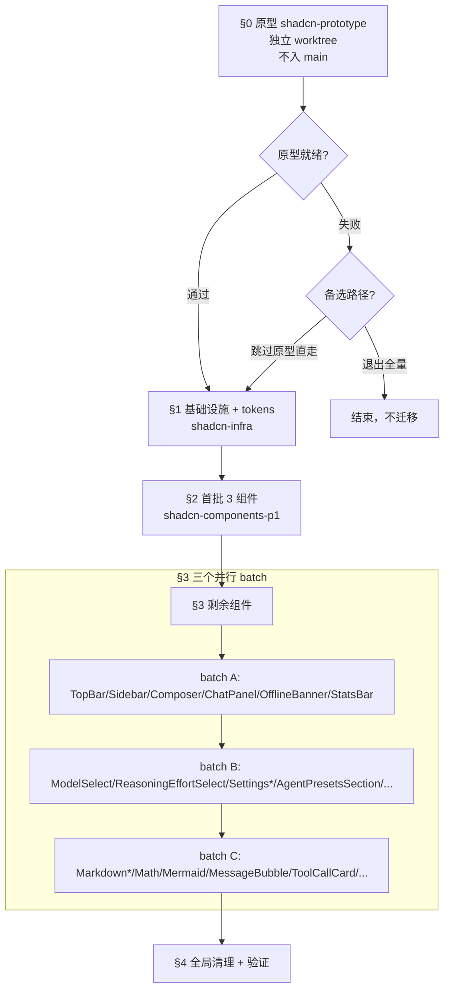

# shadcn/ui 前端全量迁移 — 设计文档

> 起草日期：2026-09-18
> 作者：Agent（与用户协作）
> 关联：`shadcn-tailwind` skill（已装到 `~/.dsh/skills/shadcn-tailwind/`）
> 状态：设计已通过用户的逐节批准；待生成 OpenSpec proposal

## 0. 上下文与动机

当前 agent-demo 前端使用 **CSS Modules + 手搓组件 + 自定义 CSS 变量**（`--surface`/`--accent`/`--border`/`--text`/`--danger`），共 21 个 `.module.css`、33 个组件文件（不含测试）。

迁移到 **shadcn/ui + Tailwind v4 + Radix UI 原语** 的动机：

1. **a11y 自动化**：当前 `Dropdown.tsx` 不做 focus 还原；`SettingsModal` 不做 focus trap；菜单的 `aria-*` 不一致。shadcn 组件底层是 Radix，键盘导航 / ARIA / Esc / 外点击 / focus 全部默认处理好。
2. **CSS 变量统一**：现有 `--surface`/`--accent` 与 shadcn 体系 `--background`/`--primary` 命名不同，新组件常常需要重新映射；统一后变量集收敛。
3. **原型速度**：加一个组件从 `.tsx + .module.css + .test.tsx` 三件降为 `.tsx + .test.tsx` 两件。
4. **社区对齐**：与开源模板、招聘库、技术博客一致；新人上手快。

## 1. 拆分策略

按层拆为 **5 阶段**（含原型）。每个阶段是独立 OpenSpec change，可独立 ship、独立 `git revert`：

| 阶段 | change ID | 范围 | 估算工作量 |
|------|-----------|------|-----------|
| §0 原型 | `shadcn-prototype` | ReasoningEffortSelect 单独迁，作为可行性证据；不入 main | 0.5-1 天 |
| §1 基础设施 + tokens | `shadcn-infra` | 装 Tailwind v4 + shadcn 依赖；写 `@theme` 把现有 CSS 变量映射到 shadcn 命名；不动组件代码 | 1-2 天 |
| §2 首批高价值组件 | `shadcn-components-p1` | Dialog 替换 SettingsModal；DropdownMenu 替换 Dropdown；ThemeToggle 三主题 | 2-3 天 |
| §3 剩余组件 | `shadcn-components-p2a` / `-p2b` / `-p2c` | 30 个组件按耦合度分 3 个并行 worktree | 5-8 天 |
| §4 清理 + 验证 | `shadcn-cleanup` | 删 .module.css；清理依赖；写 docs/frontend-design.md；axe 扫描 | 1-2 天 |

**总计**：约 10-16 天（含 OpenSpec 流程开销）。中途任何阶段失败可暂停重新评估。

## 2. 阶段依赖与并行



**关键约束**：
- §2 必须先于 §3（SettingsModal 的 Dialog 是后续 settings 子组件的入口）
- §3 三个 batch 在真实执行上是**并行**的（各自占一个 worktree），流程图用单线串行表达仅为可读性，不表示串行依赖
- 原型失败不进入 §1；回到路径 B 或 C 重新评估

## 3. 阶段 §0 — 原型

**目的**：用一个真实的端到端组件证明 5 个关键技术决策都能落地：
1. Tailwind v4 + `@tailwindcss/vite` 能装上且 `vite build` 通过
2. 现有 CSS 变量映射到 shadcn 命名后 light/dark/high-contrast 三主题视觉一致
3. shadcn Popover + RadioGroup 能替换手搓 ReasoningEffortSelect
4. vitest 断言改写后能跑通
5. tsc 0 新错误

**隔离**：`E:/claude-projects/agent-demo/.worktrees/shadcn-prototype`

**做法**：
1. 建分支 `feat/shadcn-prototype`
2. 装 `tailwindcss` + `@tailwindcss/vite` + `clsx` + `tailwind-merge` + `class-variance-authority` + `lucide-react`
3. `vite.config.ts` 加 `tailwindcss()` plugin
4. `src/index.css` 加 `@import "tailwindcss";` 与 `@theme` 块
5. `npx shadcn@latest add popover radio-group label`
6. 重写 `ReasoningEffortSelect.tsx` 用 `<Popover>` + `<RadioGroup>`
7. 改写 `ReasoningEffortSelect.test.tsx`（断言适配）
8. 跑 `mvn verify` + `vitest run` + `tsc --noEmit`
9. 手动验证三主题切换

**不做**：不改其他组件；不 merge 到 main。

**DoD**：
- vite build 通过
- mvn 519+373、vitest 290/290、tsc ≤ 7
- axe 零违规
- 三主题切换视觉与现状一致（手动截图对比）

**失败处理**：失败则不进 §1，回到 brainstorming 重选路径 B 或 C。

## 4. 阶段 §1 — 基础设施 + tokens

**change ID**：`shadcn-infra`

**做**：
- `package.json` 加 shadcn 全部依赖
- `vite.config.ts` 注册 `tailwindcss()`
- `src/index.css` 加 `@import "tailwindcss";` 与完整 `@theme` 块
- `@theme` 映射表：

| 现状变量 | shadcn 命名 | 含义 |
|----------|------------|------|
| `--surface` | `--background` | 容器背景 |
| `--text` | `--foreground` | 默认文字色 |
| `--accent` | `--primary` | 主色 |
| `--border` | `--border` | 边框 |
| `--danger` | `--destructive` | 危险/警示 |
| `--accent-soft` | `--accent` | 次强调 |
| （新增） | `--card` / `--card-foreground` | 卡片 |
| （新增） | `--muted` / `--muted-foreground` | 次要文本 |
| （新增） | `--ring` | 焦点环 |

**不做**：
- 不删任何 `.module.css`
- 不动任何 .tsx
- 不跑 `npx shadcn add`（组件代码下个阶段引入）
- 不改后端 DTO

**DoD**：
- vite build 通过
- mvn 519+373、vitest 290/290、tsc ≤ 7
- 现有 21 个 .module.css 仍工作（未删、未改）
- 三主题切换视觉一致

## 5. 阶段 §2 — 首批高价值组件

**change ID**：`shadcn-components-p1`

**选 3 个组件**：
1. **SettingsModal** → `<Dialog>` + `<DialogContent>` + `<DialogTitle>` 等子件
2. **Dropdown** → `<DropdownMenu>`（保留兼容导出；4 处使用方：Composer / Sidebar / SettingsNav / TopBar）
3. **ThemeToggle** → `<DropdownMenu>` 三选项（light / dark / high-contrast）

**做**：
- `npx shadcn@latest add dialog dropdown-menu button`
- 改写 3 个 .tsx
- 保留 ThemePopover.tsx（不删，留回退）
- 现有 `.module.css` 中仅与这三个组件相关的可改为 Tailwind utility

**props 接口不变**：SettingsModal 的 `selection / reasoningEfforts / onSelectionChange` 等外部接口签名保留；vitest 断言可改（role/aria/testid 适配 shadcn 输出）。

**DoD**：
- mvn + vitest + tsc + axe 全绿
- 手动验证：SettingsModal 打开/关闭/focus trap 正常；Dropdown 外点击关闭 + Esc + focus 还原；ThemeToggle 三主题切换正常

## 6. 阶段 §3 — 剩余 30 个组件

**change ID**：3 个并行 `shadcn-components-p2{a,b,c}`

### 6.1 batch A — 顶部与布局（8 个）

`TopBar` / `Sidebar` / `Composer` / `ChatPanel` / `OfflineBanner` / `OfflineFallback` / `StatsBar` / `OpenConfigButton`

依赖：以 ChatPanel 的 selection 模型为中线；TopBar / Sidebar / Composer 都消费它。

### 6.2 batch B — 设置与表单（12 个）

`ModelSelect` / `ReasoningEffortSelect` / `ModelsSection` / `SettingsContent` / `SettingsNav` / `SettingsEmpty` / `AgentPresetsSection` / `AppearanceCards` / `EnterBehaviorSelect` / `LanguageSelect` / `PermissionModeSelect` / `PluginsSection` / `PermissionCard`

依赖：SettingsModal 的 Dialog 容器；统一 Select / Form / Switch / Tabs。

### 6.3 batch C — 渲染与杂项（12 个）

`MarkdownContent` / `MarkdownImage` / `MarkdownLink` / `MathNode` / `MermaidBlock` / `MessageBubble` / `ThinkingCollapse` / `ToolCallCard` / `LogsPanel` / `PwaUpdatePrompt` / `WorkspacePickerModal` / `ThemePopover`

耦合度低，可独立。

**每个组件的 DoD**：
- mvn + vitest + tsc + axe 全绿
- 该组件的旧 `.module.css` 删除（迁移为 utility）
- 删前 grep 确认无其他 .tsx 仍引用

**worktree**：3 个独立 `.worktrees/shadcn-migration-batch-{a,b,c}`，并行跑。

## 7. 阶段 §4 — 清理 + 验证

**change ID**：`shadcn-cleanup`

**做**：
- 确认 21 个 `.module.css` 0 引用：`grep -r "from.*\.module\.css" agent-web/frontend/src` 应无 .tsx 匹配
- 删除全部 `.module.css`
- `package.json` 清理无用依赖（如 `react-icons`，统一用 `lucide-react`）
- 写 `docs/frontend-design.md`（项目级规范）
- 跑全套门禁 + axe 扫描
- 写四件套（test-design / test-cases / test-report / test-review）
- OpenSpec archive

**不做**：不引入新组件；不改后端。

**DoD**：
- main == origin/main
- 21 个 `.module.css` 全删（保留 `index.css`、`vite-env.d.ts`）
- `mvn verify` 全绿、vitest 全绿、tsc 0 新错误、axe 零违规
- 工作区干净
- OpenSpec archive 完成

## 8. 主题系统

3 套主题：**light** / **dark** / **high-contrast**（HC）。

```css
:root {
  --background: ...;
  --foreground: ...;
}

[data-theme="dark"] {
  /* dark 覆盖 */
}

[data-theme="hc"] {
  /* 高对比度覆盖 */
}
```

`useThemeApplication()`（已存在）继续负责 `data-theme` 写到 `<html>`。

ThemeToggle.tsx 三选项从 `ThemePopover` 迁过来后保留 popover 形态（或合并到 DropdownMenu）。

## 9. 前后端 DTO 对齐

**不变**：后端 Java record（`ProviderGroup`、`ModelEntry`、`ModelsResponse`、`ModelSelection`）不变；REST 端点不变。

**前端 TS 类型**（`src/api/chat.ts`）：保留现命名（`provider` / `model` / `reasoningEffort`）。

**shadcn 变量名**（`--background` / `--primary` 等）**仅是 UI 主题层**，与数据契约无关——两者在体系上不同维度（一个是颜色 token，一个是模型识别符），不强行「同构」。

## 10. 测试策略

**原则**：现有 290 个 vitest 断言保留 + 仅必要补充。

**断言兼容性**：
- shadcn 组件的 role/aria 与手搓的可能不同（如 `<Dialog>` 的 role 是 `dialog` 而手搓可能是 `region`）；逐用例适配
- 文本断言尽量保留（文案不变）；class 名断言改为通过 utility（`toHaveClass('bg-primary')` 替代 `toHaveClass(styles.button)`）
- focus 还原断言补充：键盘 Esc 关闭后 `expect(trigger).toHaveFocus()`

**axe 自动扫描**：vitest-axe 集成，覆盖以下交互：
- Dialog 打开后焦点在内部
- Dropdown 外点击关闭 + focus 还原
- 表单 label 与 input 关联

## 11. 数据隔离（§10 + AGENTS.md §10）

**禁止**：任何 worktree 内的安装动作写入 `~/.agent-demo/`。

**所有安装产物**：
- `.worktrees/<id>/agent-web/frontend/node_modules/`
- `.worktrees/<id>/agent-web/frontend/src/components/ui/`（shadcn 写入）
- `.worktrees/<id>/agent-web/frontend/src/index.css`、`src/lib/utils.ts`

**WebIntegrationTest**：已在 `target/test-data` 隔离；现状已合规。

**污染检测**：每阶段结尾 grep `~/.agent-demo/` 与 build 时间戳不符的文件，如有违反删除并审计。

## 12. 并发与冲突

**与并行 agent 的边界**：
- `.worktrees/align-dsh-workspace`、`picker-jna`、`rewrite-permission-mode-dsh` 改的是其他路径
- 本项目路径：`agent-web/frontend/src/**`，与他们的工作区清晰分开
- 各自的 `target/` 不同目录，互不干扰

**§3 三 batch 并行约束**：
- 三个 worktree 互不冲突（改不同 .tsx）
- 各自的 vite/tsx/tsc 不同 worktree 目录
- 合并顺序按 §2 → batch A → batch B → batch C → §4

**目标冲突**：
- `agent-web/frontend/src/index.css` 在 §1 写一次；§4 不再改；中间阶段不碰
- `tailwind.config.js` 不存在（v4 用 `@theme`）；不存在争抢
- `package.json` 在 §1、§3 各加一次（互不冲突）

## 13. 风险与回退

| 风险 | 触发条件 | 回退方式 |
|------|----------|---------|
| 原型失败 | §0 任何 DoD 不达标 | 不进入 §1；回到路径 B 或 C |
| Tailwind v4 与 vite 版本冲突 | build 失败 | 改用 v3；或回退到 CSS Modules |
| shadcn 组件与现有 props 不兼容 | vitest 大面积失败 | 仅迁组件外壳，保留现有 props；或保留手搓 |
| tsc 新错误 > 7 基线 | 任何阶段 | 暂停合并；降级范围；改 test 断言 |
| axe 扫描发现 a11y 退步 | 任何阶段 | 暂停；分析根因；调整组件替换顺序 |
| 主题不一致 | 任何主题切换 | 回退到上一阶段，保留旧 .module.css |
| 数据污染 | `~/.agent-demo/` 有非隔离写入 | 删除 + 审计 CSV + 修改安装命令 |

**底线**（沿用 §2.7.5.5）：
- 同一 change 连续 3 次合并复验失败 → 停止合并，把证据整理给用户决定
- 不许跳过门禁、注释测试、放宽 jacoco 阈值

## 14. 沟通节奏

- 每个阶段完成 → 给用户看 worktree HEAD（不是 push main）+ 测试截图 + axe 报告
- 用户点头后才合并到 main
- 原型阶段失败 → 不进 §1，回到路径 B 或 C 讨论

## 15. 验收（DoD 汇总）

**最终 ship**：
- main == origin/main，ahead origin 0
- mvn verify 519+373 全绿、vitest 290 全绿、tsc 0 新错误、axe 零违规
- 21 个 .module.css 全删
- docs/frontend-design.md 落地
- 四件套完成
- OpenSpec archive 全部完成

## 16. 后续参考

- 已装 skill：`~/.dsh/skills/shadcn-tailwind/`（10 个文件）
- skill references：`shadcn-components.md` / `shadcn-theming.md` / `shadcn-accessibility.md` / `tailwind-utilities.md` / `tailwind-responsive.md` / `tailwind-customization.md` / `canvas-design-system.md`
- 官方文档：[ui.shadcn.com](https://ui.shadcn.com) / [tailwindcss.com](https://tailwindcss.com) / [radix-ui.com](https://radix-ui.com)

---

> 修订记录：
> - v0.1（2026-09-18）：初版设计；经用户逐节批准 §0-§6