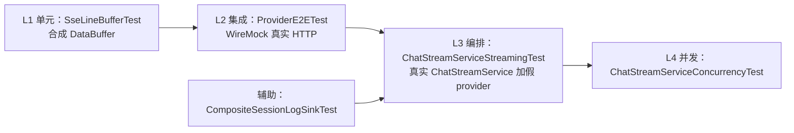

# test-design — add-true-streaming 真流式改造

> 批次：`2026-09-04-true-streaming`
> 对应 change：`openspec/changes/add-true-streaming`（spec capability：`web-ui`）
> 测试执行起始日：2026-09-04

---

## 1. 测试范围与目标

### 1.1 背景

agent-demo v0.1 的 SSE 流式实测为「假流式」，存在两条独立成因：

1. **HTTP 层**：`OpenAiCompatibleProvider.streamChat` 用 `bodyToMono(String.class)`，等上游整个响应体收完才返回，TTFT 等于总响应时长。
2. **编排层**：`SseSessionLogSink` 只在 `AgentLoop` 的 `collectList()` 之后的 `onAssistant` 里整段 emit 正文。

排查中还发现两处附带缺陷：跨 TCP 帧的 SSE 行未重组；`CompositeSessionLogSink` 未转发 `onThinkingDelta`，导致 web 正常路径下 thinking 增量到不了 SSE。

### 1.2 测试目标

| 编号 | 目标 | 判定依据 |
|:----:|------|---------|
| G1 | Provider 层在分段响应下首 emit 显著早于整体完成 | TTFT 小于 300ms，且首 emit 比完成早 200ms 以上 |
| G2 | 跨 TCP 帧的半截行被正确重组，不丢事件、不拼错行 | 分段响应下 3 个 `TextDelta` 全部解析且顺序正确 |
| G3 | 正文逐 token 到达 SSE，不被攒批 | 3 个增量各产生 1 条 `message_delta(text)`，首条早于 `message_stop` |
| G4 | 同一段正文不被推送两次 | 已推增量时不再整段重发；无增量时兜底；判重逐轮重置 |
| G5 | 增量回调经复合 sink 转发不被吞掉 | 子 sink 收到 `onTextDelta` 与 `onThinkingDelta` |
| G6 | 多流并发不串台 | 4 条流各自只收到自身增量 |
| G7 | 无回归 | agent-core 与 agent-web 既有用例全绿 |

### 1.3 不在范围内

- sink 模式（`replay().all()`）与 `.block()` 的改动：经实测证伪后明确不做（详见 `design.md` D2 / D3）。
- 前端渲染行为：SSE 协议契约未变，前端零改动，不重复测。
- 真实上游 LLM 的端到端联调：用 WireMock 与假 provider 覆盖协议层，不消耗真实配额。

---

## 2. 测试环境

| 项 | 值 |
|----|----|
| JDK | 17 |
| 构建 | Maven 3.9（离线 `mvn -o`） |
| 测试框架 | JUnit 5 + AssertJ + Mockito + reactor-test + WireMock |
| 覆盖率门禁 | jacoco LINE 不低于 80%，BRANCH 不低于 70%（agent-web 为包级） |
| 前端 | vitest（本次无前端改动，仅跑回归） |

---

## 3. 测试策略

### 3.1 分层

- **L1** 用 `DefaultDataBufferFactory` 合成 buffer，精确控制切分位置，是唯一能稳定造出「一行跨两帧」的手段。
- **L2** 用 WireMock 起真实 HTTP 服务，验证「HTTP 层是否真流式」——这是单元测试无法覆盖的部分（v0.1 的单元测试就是「假绿」：`bodyToMono` 拿到完整字符串后内部按行切分，单元测试照样看到 3 个 `TextDelta`）。
- **L3 / L4** 用假 `LlmProvider` 驱动真实 `ChatStreamService`，订阅真实 SSE flux 并解析 JSON 载荷，断言的是对外契约而不是内部方法调用。

### 3.2 关键设计决策

| 决策 | 理由 |
|------|------|
| TTFT 用 `withChunkedDribbleDelay` 而非 `withFixedDelay` | `withFixedDelay(N)` 把整个响应体延迟 N 毫秒才发，真流式也只能等到那一刻，**测不出**差异。原用例正是因此永远失败 |
| 时间断言留冗余（TTFT 小于 300ms 对约 100ms 期望值） | 规避 CI 抖动；同时用「首 emit 比完成早 200ms 以上」作相对断言 |
| L3 断言 SSE JSON 载荷而非 mock 交互 | 防止实现细节变了、契约没变时测试假红；也防止契约破了测试却绿 |
| 订阅先于 `start` | 模拟前端真实时序（POST /send 拿到 streamId 后立即 GET /stream） |

---

## 4. 用例矩阵

完整用例表见 `test-cases.md`（本文件不重复列举）。

| 层 | 测试类 | 用例数 | 覆盖目标 |
|----|--------|:------:|---------|
| L1 | `SseLineBufferTest` | 7 | G2 |
| L2 | `OpenAiCompatibleProviderE2ETest` | 3 | G1、G2 |
| L3 | `ChatStreamServiceStreamingTest` | 4 | G3、G4 |
| L4 | `ChatStreamServiceConcurrencyTest` | 1 | G6 |
| 辅助 | `CompositeSessionLogSinkTest` | 5（新增 1） | G5 |
| 回归 | agent-core 全量 + agent-web 全量 | 见 `test-report.md` | G7 |

---

## 5. 退出标准（DoD）

1. 上表全部用例通过。
2. `mvn -o -pl agent-core,agent-web verify` BUILD SUCCESS（含 jacoco 门禁）。
3. 前端 `npx vitest run` 全绿。
4. 无新增 🔴 级缺陷；已知既有缺陷登记在 `test-report.md`。
5. 四件套齐备并登记到 `test-guide.md`。
