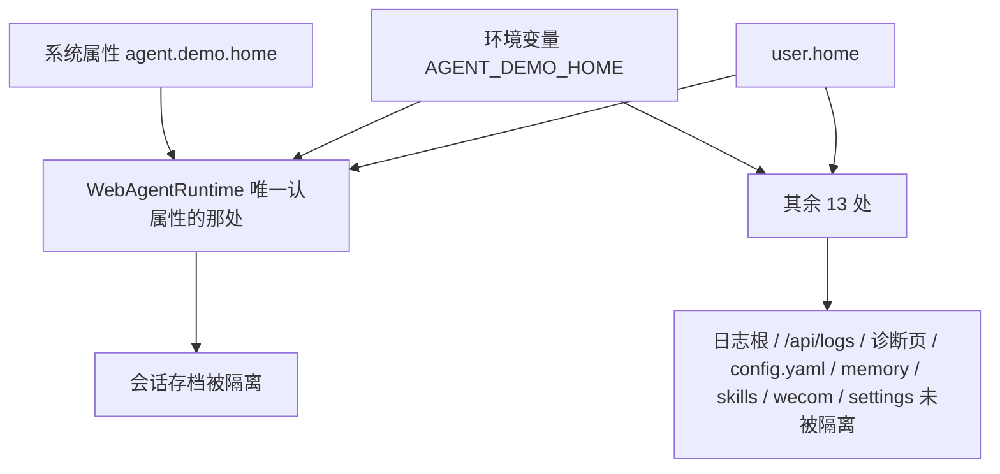

# 测试设计文档 — fix-agent-home-isolation

- 批次目录：`docs/test-agent-demo/2026-09-18-fix-agent-home-isolation/`
- 测试日期：2026-09-18
- 对应 change：`fix-agent-home-isolation`

## 1. 测试范围

### 1.1 被测问题

`openspec/specs/observability` 早有两条 Requirement：

- 「日志根目录稳定且读写一致」
- 「测试日志与运行时日志隔离」——测试运行 SHALL NOT 向 `~/.agent-demo/logs/app.log` 写入

后者长期**不成立**：每次 maven 测试都在真实 `~/.agent-demo/logs/sessions/` 下创建 `sessions/<uuid>/` 目录。2026-09-18 一次修复任务期间实测需手工清理 **22 个**（分 3 批，每批都有 `cwd` 字段佐证归属）。

根因不是某处路径写错，而是**「agent home 在哪」有 14 处各自独立解析**，覆盖链还各不相同：



`@SpringBootTest` **无法设环境变量**，只能设系统属性——所以唯一的隔离开关只被 14 处中的 1 处认，隔离必然漏。

### 1.2 本次覆盖的行为

| # | 行为 | 期望 |
|:--:|------|------|
| B1 | `AgentPaths` 优先级 | 系统属性 > 环境变量 > `user.home`；空白串视为未设置 |
| B2 | 派生目录 | `logs` / `sessions` / `worktrees` 均挂在同一个 home 下 |
| B3 | `AgentConfig` 默认值 | 日志根与工作树基目录跟随覆盖，不再写死 `user.home` |
| B4 | logback 与 Java 侧**同语义** | 设属性时两边落到**同一个**目录（`<base>/.agent-demo/logs`） |
| B5 | 不设属性时行为不变 | 全部路径与改造前逐字一致（回落真实 `~/.agent-demo`） |
| B6 | 测试 JVM 默认隔离 | 未显式设置的测试也不写真实目录 |
| B7 | **跑完测试真实目录不增长** | `logs/sessions` 目录数不变、真实 `app.log` 不新增字节 |

### 1.3 不在范围内

- `HomePathGuard` 的沙箱边界（`/api/fs` 越界防护）——它的界是**用户真实家目录**，语义上不应跟随 agent 数据目录覆盖。
- CLI `--home` flag 的语义调整。
- 历史遗留的真实 `~/.agent-demo/logs/sessions/` 清理（运维动作）。

## 2. 测试目标

1. 证明 B7——即 spec 那条 Requirement 从「纸面」变为「成立」。
2. 证明 B4：logback 与 Java 侧没有各自为政（**这是本次实际抓到的一个自造分叉**，见 §5）。
3. 证明 B5：不设属性时零行为变化（防止「修隔离顺手改了默认路径」）。
4. 全量回归不被破坏。

## 3. 测试环境

| 项 | 值 |
|---|---|
| 构建 | Maven 3.6.1 离线；`mvn -o -pl agent-core,agent-web verify -DskipNpm=true -Dsurefire.excludes=**/e2e/**` |
| 隔离 | worktree `.worktrees/fix-agent-home-isolation`（分支 `fix/fix-agent-home-isolation`） |
| 真实目录基线的取法 | 跑测试**前后各数一次** `~/.agent-demo/logs/sessions` 目录数与 `app.log` 字节数 |

### 3.1 为什么必须「跑前跑后各数一次」

「测试不污染真实数据」这类性质，**单元测试断言不了**——它是整个测试套件运行完之后的统计性质。故验收手段改为**差分测量**：跑之前记录，跑之后比对，差值必须为 0。这比任何 mock 断言都更接近要防的事故。

## 4. 测试策略

| 层次 | 手段 | 覆盖 |
|------|------|------|
| 单元 | `AgentPathsTest` 纯函数重载（`System.getenv` 无法在进程内注入，故 env 分支只能靠重载覆盖） | B1、B2、B3、B5 |
| 探针 | 最小 JVM（单独编译一个只打一条日志的类）验证 logback 属性解析与落点 | B4、B5 |
| 全量 | 跑前后差分测量真实目录 | B6、B7 |
| 回归 | 全量 `mvn verify` + 前端 vitest + tsc | 既有行为 |

### 4.1 为什么 B4 要单独做探针

logback 的 `${name:-default}` 是否递归求值、以及**我把属性当完整 home 还是基目录**，都不是能靠读代码确证的事——本次第一版就写错了（见 §5）。用一个只依赖 agent-core classpath 的最小 JVM 直接跑，能在几秒内给出决定性证据，比跑完整门禁再推断快得多。

## 5. 设计中被实测推翻的一处（自造分叉）

第一版 `logback.xml` 写的是：

```text
${agent.demo.home:-${user.home}/.agent-demo}/logs
```

看起来对（未设置时结果正确），但**设了属性时**结果是 `<base>/logs`，而 Java 侧 `AgentPaths` 给的是 `<base>/.agent-demo/logs`——**差一层目录**。等于把刚要收敛掉的分叉又造了一个。

探针实测证据：设 `-Dagent.demo.home=E:/tmp/lb-base` 后，`<base>/logs/app.log` 存在、`<base>/.agent-demo/logs/app.log` 不存在。修正为 `${agent.demo.home:-${user.home}}/.agent-demo/logs` 后再测，两者位置反转，符合预期。

## 6. 用例矩阵（概览）

详细用例见 `test-cases.md`。

| 用例组 | 数量 | 落地方式 |
|--------|:--:|----------|
| 优先级与派生路径 | 9 | `AgentPathsTest` |
| logback 落点（探针） | 2 | 最小 JVM + 属性/不设属性两跑 |
| 真实目录差分测量 | 2 | 门禁跑前后各数一次 |
| 全量回归 | — | `mvn verify` |

## 7. 退出标准（DoD）

- [ ] `AgentPathsTest` 全绿，且用例数不为 0。
- [ ] 探针证明：设属性 → `<base>/.agent-demo/logs/app.log`；不设属性 → 真实 `~/.agent-demo/logs/app.log`。
- [ ] 门禁跑完 `logs/sessions` 目录数与真实 `app.log` 字节数**均不变**。
- [ ] 隔离目录内确实出现了 `app.log` 与 `sessions/`（证明是「隔离对了」而不是「日志坏了」——两者都会让真实目录不增长，必须能区分）。
- [ ] `mvn verify` 的 jacoco 违规不超过合并前基线（已知 `security` 包 0.63 为既有）。
- [ ] 前端 vitest 全绿、tsc 不超基线。
- [ ] 测试数据同任务内清理并说明判据。
