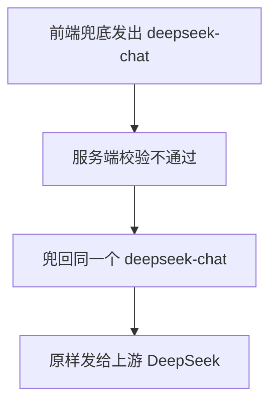

# 测试设计文档 — fix-stale-model-fallback

- 批次目录：`docs/test-agent-demo/2026-09-18-fix-stale-model-fallback/`
- 测试日期：2026-09-18
- 对应 change：`openspec/changes/fix-stale-model-fallback`（已归档后为 `openspec/changes/archive/2026-09-18-fix-stale-model-fallback`）

## 1. 测试范围

### 1.1 被测缺陷

`deepseek-chat` 已被上游于 2026-07-24 停用，且不在 `agent.chat.providers` 目录中，但代码仍有 6 处把它当默认值/兜底值。结果是**服务端最终把该非法 id 原样发给了上游**：

根因不是常量写错，而是**同一件事有两个真源**：前端列表读 `agent.chat.providers`，服务端校验读 `agent.chat.supported-models`（`ModelRegistry` 内的字符串常量）。两者只是碰巧一致。

### 1.2 本次覆盖的行为

| # | 行为 | 期望 |
|:--:|------|------|
| B1 | `POST /api/chat/send` 未指定 `model` | 200，`model` = `agent.chat.default-model`，且该值在目录中 |
| B2 | `POST /api/chat/send` 指定合法 `model` | 200，`model` 原样回显，透传到 `AgentLoop` |
| B3 | `POST /api/chat/send` 指定非法 `model` | 400 `invalid_model`，含 `requested` + `supported`，**不创建流** |
| B4 | `GET /api/chat/models` | 含 `defaultProvider` / `defaultModel`，且 `defaultModel` ∈ `models[]` |
| B5 | 启动期配置校验 | `default-provider` / `default-model` 不在目录中 → 启动失败 |
| B6 | 微信通道默认模型 | 等于 `agent.chat.default-model`，不等于硬编码 id |
| B7 | 成功回合日志 | INFO 含 `stream=` / `session=` / `workspace=` / `model=`，与失败路径同键 |
| B8 | 前端兜底解析 | 返回的 id 只可能来自目录、服务端默认值或空串 |

### 1.3 不在范围内

- CLI 路径的同类残留（`AgentLoop.DEFAULT_MODEL`、`AgentConfig.defaults()`、`SlashCommand` 列表）——用户明确选择本次不带 CLI。
- 多 provider 运行时路由（由并行 change `add-provider-catalog-abstract` 承载）。
- 前端 provider / model 两层菜单交互。

## 2. 测试目标

1. 证明缺陷链条的**每一环**都被切断：前端不再发非法 id、服务端不再静默兜底、非法 id 不再触达上游。
2. 证明「两个真源」已收敛为一个（`ModelCatalog`），且新增的启动期校验能挡住「默认值本身非法」。
3. 证明改动没有破坏既有行为（全量回归）。

## 3. 测试环境

| 项 | 值 |
|---|---|
| JDK | 编译目标 17，运行时 Java 24.0.1 |
| 构建 | Maven 3.6.1（本地仓库 `D:\maven\apache-maven-3.6.1\repository`，离线 `-o`） |
| 后端测试 | JUnit 5 + AssertJ + Mockito；`mvn -o -pl agent-core,agent-web verify -Dsurefire.excludes=**/e2e/**` |
| 前端测试 | vitest 4 + jsdom |
| 类型检查 | `npx tsc --noEmit` |
| 隔离 | worktree `.worktrees/fix-stale-model-fallback`（分支 `fix/stale-model-fallback`） |

### 3.1 数据隔离（全局规则 §10）

启动完整 Spring 上下文的测试通过 `WebAgentRuntime.AGENT_DEMO_HOME_PROPERTY` 系统属性把数据目录指向 `target/test-data`，并显式关闭 `agent.session.auto-archive.enabled`，避免改动 `<user.home>/.agent-demo/sessions` 下的**真实会话存档**（沿用 `LocalKeySendTest` 既有做法）。

## 4. 测试策略

| 层次 | 手段 | 覆盖 |
|------|------|------|
| 单元 | 直接构造对象 + mock 协作者 | B1–B3（`ChatControllerModelResolutionTest`）、B5、B6、B7、B8 |
| 组件 | `ModelCatalog` / `ModelsController` 纯对象 | B4、目录查找与顺序 |
| HTTP 集成 | `@SpringBootTest(RANDOM_PORT)` + `WebTestClient` | B1–B4 的真实 HTTP 语义 + **Spring 装配**（新增构造器依赖能否注入） |
| 回归 | 全量 `mvn verify` + `vitest run` + `tsc` | 既有行为不被破坏 |

### 4.1 为什么要单独做 HTTP 集成层

本次给 `ChatController` / `ModelsController` / `WecomMessageDispatcher` 都加了构造器依赖。单元测试手工 `new` 这些对象，**证明不了 Spring 能装配它们**；只有启动真实上下文才验证得了。同时 400 / 200 的语义差异只有走 HTTP 才看得准。

## 5. 用例矩阵（概览）

详细用例见 `test-cases.md`。分布：

| 用例组 | 数量 | 落地方式 |
|--------|:--:|----------|
| 目录查找（`ModelCatalog`） | 9 | `ModelCatalogTest`（本次新建） |
| 模型端点 + 启动校验 | 12 | `ModelsControllerTest`（既有 7 + 本次新增 5） |
| 模型解析 / 非法拒绝 | 10 | `ChatControllerModelResolutionTest`（本次新建） |
| HTTP 集成 | 4 | `ChatSendModelHttpTest`（本次新建） |
| 成功回合日志 | 2 | `ChatStreamServiceSuccessObservabilityTest`（本次新建） |
| 微信通道模型来源 | 2 | `WecomMessageDispatcherModelTest`（本次新建） |
| 前端兜底解析 | 11 | `model-selection.test.ts`（本次新建） |

## 6. 退出标准（DoD）

- [ ] 上述全部用例通过，且**用例数不为 0**（防止 pattern 写错导致的假绿）。
- [ ] `mvn -o -pl agent-core,agent-web verify -Dsurefire.excludes=**/e2e/**` 全绿。
- [ ] `npx vitest run` 全绿；`npx tsc --noEmit` 错误数不超过合并前 `main` 的基线（实测 2 条既有错误）。
- [ ] jacoco 包级门禁的既有违规项（`config` / `security`）不因本次改动扩大。
- [ ] 缺陷链条每一环都有**反向断言**（断言「不该发生的事没发生」），而非只断言正向结果。
- [ ] 测试产生的数据在同一任务内清理完毕，并在报告中说明「删了什么、依据什么判据、保留了什么」。
