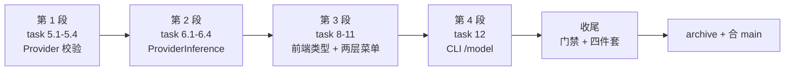

# 测试复盘：add-provider-catalog-abstract

> 批次目录：`docs/test-agent-demo/2026-09-18-provider-catalog/`
> 复盘日期：2026-09-18

## 1. 流程回顾

本次测试分四段执行，与 OpenSpec apply 阶段交错进行：

| 段 | 覆盖 task | 新增用例 | 遇到问题 |
|:--:|----------|:--------:|---------|
| 1 | 5.1 / 5.2 / 5.4 | 12 | D1（基类 final）、D3（Mockito 歧义） |
| 2 | 6.1-6.4 / 7.1-7.4 | 12 | D2（null loop）、D4（default-provider 不可达） |
| 3 | 8 / 9 / 10 / 11 | 30 | D5（重复文案）、D6（effort 保留策略）、D7（新增 prop） |
| 4 | 12.1-12.4 | 15 | D8（行为变更导致旧断言失败） |

## 2. 做得好的

### 2.1 先读现有实现再动手，避免重复劳动

进入 worktree 时先 `git log` + `openspec status`，发现**约 13/62 task 已由前一 session 落地**
（DTO 重构 / ModelCatalog / AgentLoop.setSelection / AnthropicProvider.validateProvider），
因此本次直接从 task 5 开始，没有重做已完成部分。

### 2.2 用「模板方法」替代复制粘贴

给 DeepSeek / MiniMax 两个 OpenAI 兼容 provider 加 provider 校验时，最初想在各自类里
override `streamChat`。发现基类方法是 `final` 后，改为在基类引入 `validateProviderHook`
模板方法（默认放过），子类只覆盖钩子。这样：

- 协议逻辑（body 构建 / SSE 解析）**只有一份**
- 新增 provider 只需实现 `validateProviderHook` + 5 个常量
- 没有为了测试而放宽 `final` 之外的封装

### 2.3 测试暴露了「不可达分支」而非掩盖它

`default-provider` 兜底分支因 `resolveModel` 先做白名单回退而实际不可达（D4）。
没有为了「让测试过」而硬改断言，而是：把测试改为构造可达场景（mock
`supported-models=abab6.5s-chat`），并在 `provider-catalog.md` §10 与测试注释里
**显式记录该分支当前未被走到**，留待白名单加入无固定前缀的 model 时生效。

### 2.4 行为变更该认就认

`/model gpt-99` 从 v0.1 的「拒绝」变成 v0.2 的「接受（推断为 openai）」——这是 task 12.1
前缀推断的**预期结果**。处理方式：改旧断言 + 新增用例 `shorthandGptPrefixIsAcceptedViaInference`
显式记录新行为 + commit message 与文档都写明，而不是偷偷改掉旧测试。

## 3. 可改进的

### 3.1 前后端类型手工对齐，缺自动化守卫

`ModelEntry.reasoningEfforts` 从 `string[]` 改成 `ReasoningEffort[]` 时，前端必须同步改
`chat.ts`。目前只能靠人读后端 record。**建议**：加一个契约测试（如后端 `ModelsControllerTest`
断言 JSON 字段名集合 == 前端 tsc 编译期能推断的字段），或从 Java record 生成 TS 类型。

### 3.2 组件测试的「重复文案」陷阱

`ReasoningEffortSelect` 的 trigger 与下拉项文案相同（都是「思考 Low」），导致
`getByText` 匹配到 2 个元素（D5）。**建议**：新组件测试统一用 `getAllByRole("option")`
定位下拉项，trigger 用 `getByRole("button", { name })`。

### 3.3 `tasks.md` 与实际架构漂移

task 11 原文说「ChatPanel localStorage 升级」，但实际 model state 从 v0.1 起就在
`App.tsx` 持有（为了让 TopBar / ChatPanel 共享）。本次在 App 层完成升级，并在 commit
message 里如实说明偏差。**建议**：propose 阶段写 tasks 时先 `grep` 一次状态归属，
避免 task 描述与代码实际 owner 不符。

### 3.4 E2E 用例长期 deferred

task 9.4（Playwright 两层菜单 E2E）在沙箱内不可跑，与 agent-web 既有 3 个 E2E
同样受阻。**建议**：把 E2E 拆成独立 CI job（有真实浏览器时跑），本地门禁明确排除，
并在 `test-guide.md` 里登记为「需真实环境补跑」。

### 3.5 合并 `main` 时的「面宽代价」（门禁 4 补记）

本 change 在分支上挂了 12 个提交，期间 `main` 被并行 change 推进了 **63 个提交**，
同步时一次性撞出 **4 处代码冲突 + 1 处 spec 冲突**（`ChatController.java`、`api/chat.ts`、
`App.tsx`、`docs/test-agent-demo/test-guide.md`、`openspec/specs/web-ui/spec.md`），
其中 `App.tsx` / `ChatController.java` 的冲突需要重新理解「main 的模型真源单一化」才能解干净
（顺带发现 main 已把 `reasoningEfforts` 加进 `ModelEntry`，本次的两层菜单必须与其共存）。
**建议**：分支寿命控制在 1-2 天内，或每天至少 `git merge main` 一次——冲突成本随
`main` 的前进速度非线性增长；本次能一次解干净，靠的是解冲突时坚持「两边行为都保留、
不丢 main 的校验也不丢本 change 的推断」。

## 4. 交付物

| 类型 | 路径 |
|------|------|
| 测试设计 | `test-design.md` |
| 用例表 | `test-cases.md`（75 用例） |
| 测试报告 | `test-report.md`（含 §1.1 合并 main 后复验） |
| 过程复盘 | `test-review.md`（本文） |
| 功能文档 | `docs/provider-catalog.md` |
| 旧文档升级注记 | `docs/model-and-effort-dropdown.md` §0 |

## 5. 结论

- **75 个新增用例全部落地并通过**；合并 `main` 后复验 **Java 892（519 + 373）+ 前端 290 全绿**
- tsc 合并后 2 个错误 < 基线 7
- 8 个开发期缺陷（D1-D8）全部在提交前修复并补充用例
- 4 项遗留（L1-L4）已归因或明确 deferred，未掩盖；jacoco 既有违规由 3 个收敛为 1 个
- 无用户数据污染（未产生需清理的记录）
