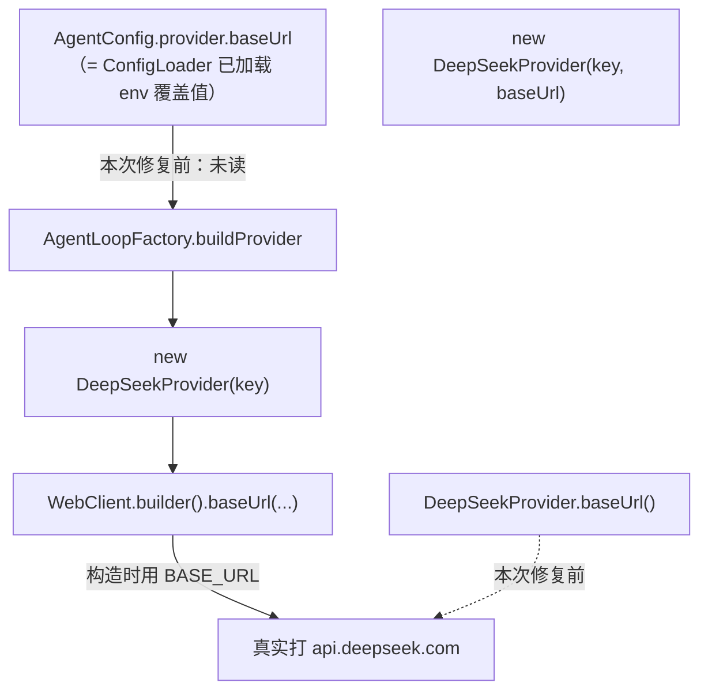

# 测试设计文档 — fix-provider-baseurl

- 批次目录：`docs/test-agent-demo/2026-09-19-fix-provider-baseurl/`
- 测试日期：2026-09-18（合并日 09-19）
- 对应 change：`fix-provider-baseurl`

## 1. 测试范围

### 1.1 被测缺陷

`DEEPSEEK_BASE_URL` 环境变量与 `config.yaml` 的 `provider.baseUrl` 在 CLI/web 上**完全无效**。两层各自为政：

修复后：`buildProvider` 选 1/2 参 ctor；`baseUrl()` 返回构造器值。

### 1.2 覆盖的行为

| # | 行为 | 期望 |
|:--:|------|------|
| B1 | `DeepSeekProvider("k", customUrl)` → `provider.baseUrl()` | 返回 `customUrl` |
| B2 | `DeepSeekProvider("k")`（单参）→ `provider.baseUrl()` | 返回 `https://api.deepseek.com`（默认） |
| B3 | `buildProvider(cfg_with_custom_baseUrl)` → 真实 HTTP 请求 | 打到 `cfg.baseUrl`（既有 WireMock 测试覆盖） |

## 2. 测试策略

`DeepSeekProviderBaseUrlTest` 同包调 protected `baseUrl()` 直接断言（修复前断言失败：customUrl → 拿到 BASE_URL 常量）。

`buildProvider → WireMock` 的端到端覆盖由既有 `DeepSeekProviderTest.streamsTextAndUsage` 间接保证：它构造 `new DeepSeekProvider("test-key", "http://localhost:" + wm.port())` 并断言 SSE chunks 抵达 WireMock——若 2 参 ctor 与 WebClient 任一处断链，这个测试会红。

## 3. DoD

- [ ] 新增 `DeepSeekProviderBaseUrlTest` 2 例全绿
- [ ] agent-core 全量 ≥ 533（分支 533/0 已达）
- [ ] 合并后 main 上 `mvn verify` 全绿（实测 530 core + 379 web + BUILD SUCCESS）
