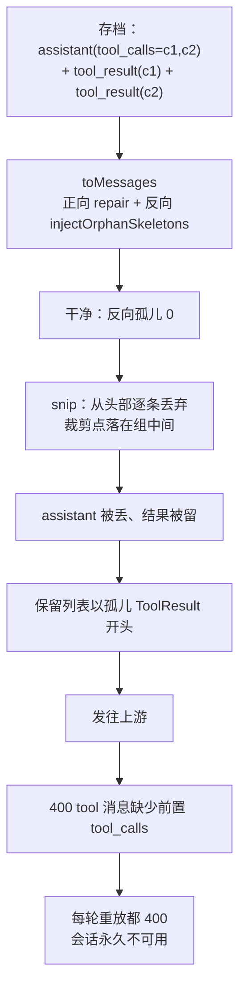
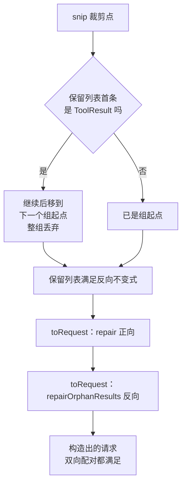

# snip-pairing-repair 测试设计

> 批次目录：`docs/test-agent-demo/2026-09-22-snip-pairing-repair/`
> 对应 OpenSpec change：`snip-pairing-repair`（已归档为 `2026-09-21-snip-pairing-repair`）
> 测试执行日：2026-09-22

---

## 1. 背景与目标

### 1.1 触发缺陷

会话 `2026-09-18T13-34-27-b1569b39` 每轮请求都被 DeepSeek 拒绝：

```text
WARN c.e.a.p.o.OpenAiCompatibleProvider - [400 /v1/chat/completions]
{"error":{"message":"Messages with role 'tool' must be a response to a preceding message with 'tool_calls'"}}
```

该会话此后**永久不可用**——每次重进都走同一条恢复链路，每轮重放都被 400。

### 1.2 根因（探针实测，非推断）

读取该会话真实存档（687194 字节 / 215 行）后逐步执行恢复链路：

| 阶段 | 消息数 | 正向悬挂 | 反向孤儿 | 估算 token |
|------|:------:|:--------:|:--------:|:----------:|
| 盘上存档 → `toMessages` | 204 | 0 | 0 | 201855 |
| → `snip`（上限 100000） | 75 | 0 | **1** | — |

结论：**存档本身是干净的，`snip` 制造了孤儿**。`SessionResumeLoader.snip` 逐条从头部丢弃消息，
裁剪边界可能落在 `assistant(tool_calls)` 与其 `tool_result` **之间**；而反向孤儿修复
（`injectOrphanSkeletons`）只在 `toMessages` 内部执行，即在 `snip` **之前**，此后无人再修。

结构性原因是不对称：

| 方向 | 修复函数 | 执行时机 |
|------|---------|---------|
| 正向（assistant 缺结果） | `ToolCallPairing.repair` | 恢复路径 **+ 请求路径每轮** |
| 反向（结果缺 assistant） | `SessionResumeLoader.injectOrphanSkeletons` | **仅**恢复路径一次 |

### 1.3 测试目标

| 编号 | 目标 | 判定方式 |
|:----:|------|---------|
| G1 | `snip` 裁剪不再制造反向孤儿 | 纯函数用例：边界落在配对组中间时，整组一起丢弃 |
| G2 | 反向孤儿修复可复用、纯函数、幂等 | `ToolCallPairing.repairOrphanResults` 单元用例 |
| G3 | 请求路径对两个方向都自愈 | 捕获真实发出的 `ChatRequest.messages()` 并断言双向配对 |
| G4 | 既有行为不回退 | 全量门禁：`mvn verify` + jacoco + 前端 vitest + tsc |

---

## 2. 测试范围

### 2.1 范围内

- `SessionResumeLoader.snip` 的裁剪点选择（配对组对齐）。
- `ToolCallPairing.repairOrphanResults`（新增纯函数）的全部行为分支。
- `SessionResumeLoader.toMessages` 恢复路径的反向修复回归。
- `AgentLoop.toRequest` 请求路径的双向修复。
- 全量质量门禁（`agent-core` + `agent-web` 单测与 jacoco、前端 vitest、tsc）。

### 2.2 范围外

| 项 | 原因 |
|----|------|
| 已落盘的坏存档迁移改写 | 设计选择「只读不改写存档」；恢复时按需修复即可 |
| 前端任何改动 | 本 change 零前端文件改动（`git diff main...HEAD -- agent-web/frontend` 为空） |
| 真实 DeepSeek 联调 | 需真实 key 与网络；改用 WireMock / 捕获请求的离线方式验证协议形态 |
| 用户真实会话文件 | 按全局规则 §10 禁止用真实数据做夹具；改用等价构造序列 |

---

## 3. 缺陷模型



修复后的目标形态：



---

## 4. 测试策略

采用「纯函数 → 装载器 → 主循环 → 门禁」四层递进，每层都能独立定位失败点：

| 层 | 被测对象 | 用例编号 | 为什么在这一层测 |
|:--:|---------|---------|-----------------|
| L1 | `SessionResumeLoader.snip` | SR-01 ~ SR-04 | 纯函数，可精确构造「裁剪点正好落在组中间」的边界 |
| L2 | `ToolCallPairing.repairOrphanResults` | TCP-01 ~ TCP-07 | 纯函数，逐条覆盖注入、合并、不动、幂等、不改入参 |
| L3 | `SessionResumeLoader.toMessages` | 既有回归 | 确认提取重构后恢复路径行为不变 |
| L4 | `AgentLoop.toRequest` | AL-01 | 端到端捕获真实发出的消息列表，验证「请求路径自愈」 |
| L5 | 全量门禁 | GATE-01 ~ GATE-03 | 确认无回退与覆盖门禁达标 |

### 4.1 关键测试手法

**手法一：把 token 上限反向算出来，精确控制裁剪点。**

`snip` 的裁剪点是 token 估算的函数，直接给一个「差不多」的上限无法保证切在想要的位置。
本批用「先算后设」：把想切的位置之后的消息总量算出来当作上限，使裁剪点**必然**落在指定下标。
口径与 `snip` 内部一致（仅累计 `content` 的 token）。

**手法二：断言「不存在孤儿」而不是断言消息条数。**

断言条数会把实现细节（丢几条）锁死；断言不变式（不存在无前置 `tool_calls` 的 `tool_result`）
才对应协议约束本身，也不会因为后续调整裁剪策略而误报。

**手法三：捕获真实发出的请求。**

`toRequest` 是私有方法。测试通过包装 `LlmProvider.streamChat` 把 `req.messages()` 抓出来，
验证的是「真实发往上游的那个列表」，而不是重新拼一个列表来断言。

**手法四：不动点断言表达幂等。**

对已修复的列表再跑一次修复，断言逐元素相等。这比「调两次比长度」更强，能同时覆盖
「修复不产生冗余消息」与「修复判定稳定」。

---

## 5. 测试环境

| 项 | 值 |
|----|-----|
| 工作区 | `.worktrees/snip-pairing-repair`（worktree 隔离，分支 `fix/snip-pairing-repair`） |
| 基线提交 | `a5f1088`（分支起点）→ 合并 `main` `8b60312` 后重跑 |
| 构建 | `mvn -o -pl agent-core,agent-web verify -DskipNpm=true -Dsurefire.excludes=**/e2e/**` |
| JDK | 编译目标 17，运行时 24.0.1 |
| 前端 | `npx vitest run` / `npx tsc --noEmit` |
| 数据隔离 | surefire 注入 `agent.demo.home=target/test-home`；`static/` 从主工作区拷贝 |

---

## 6. 用例矩阵（概览）

完整步骤与预期见 `test-cases.md`。

| 编号 | 用例名 | 层 | 优先级 |
|:----:|--------|:--:|:------:|
| SR-01 | 裁剪点落在配对组中间不制造孤儿 | L1 | P0 |
| SR-02 | 组对齐后仍在上限内 | L1 | P1 |
| SR-03 | 未超限时不裁剪 | L1 | P1 |
| SR-04 | 裁剪后头部为 `[RESUMED]` 提示 | L1 | P2 |
| TCP-01 | 单个孤儿结果注入骨架 | L2 | P0 |
| TCP-02 | 连续孤儿结果合并为一条骨架 | L2 | P0 |
| TCP-03 | 已有前置调用的结果不受影响 | L2 | P0 |
| TCP-04 | 干净历史逐元素不变 | L2 | P1 |
| TCP-05 | 反向修复幂等 | L2 | P0 |
| TCP-06 | 不修改入参列表 | L2 | P1 |
| TCP-07 | 与正向 repair 组合后双向满足 | L2 | P0 |
| AL-01 | 请求路径同时修复正向与反向 | L4 | P0 |
| GATE-01 | `mvn verify` 全绿 + jacoco 零违规 | L5 | P0 |
| GATE-02 | 前端 vitest 全过 | L5 | P0 |
| GATE-03 | `tsc --noEmit` 不超过基线 | L5 | P1 |

---

## 7. 退出标准（DoD）

| # | 标准 | 达成判据 |
|:--:|------|---------|
| 1 | P0 用例全通过 | SR-01、TCP-01/02/03/05/07、AL-01 全绿 |
| 2 | 无新增回退 | 既有 `SessionResumeLoaderTest` 9 例、`ToolCallPairingTest` 8 例、`AgentLoopToolPairingTest` 1 例全绿 |
| 3 | 质量门禁达标 | `mvn verify` 成功且 jacoco 无违规；前端 vitest 全过；tsc 错误数 ≤ 7 |
| 4 | 每层都先红后绿 | 三个实现步骤均有「红」的实测输出留痕（见 `test-report.md`） |
| 5 | 归档与合并 | OpenSpec change 已归档；delta 已并入 `openspec/specs/testability/spec.md` |
| 6 | 数据不污染 | 未读写用户真实数据目录；临时产物已清理并留审计 |

---

## 8. 风险与对策

| 风险 | 影响 | 对策 |
|------|------|------|
| token 上限没算准，裁剪点不在预期位置 | SR-01 会假绿（边界没被触发） | 上限由目标位置之后的总量反算；并用 SR-02 断言保留量确实 ≤ 上限，双向夹住 |
| 只断言条数，实现换策略后误报 | 用例脆弱 | 断言配对不变式而非条数 |
| 缺少「红」的证据，无法证明测试有效 | 可能是永远绿的假测试 | 每步先跑红并记录 `Tests run` 与失败断言原文 |
| 并行 agent 改动污染归属判断 | 无法区分是谁弄红的 | 记录 `main` 提交号、零前端改动事实、以及对可疑失败的单文件复现 |
| worktree 缺 gitignored 构建产物 | `WebIntegrationTest` 假失败 | 从主工作区拷 `static/` 进 worktree 后再跑门禁 |
