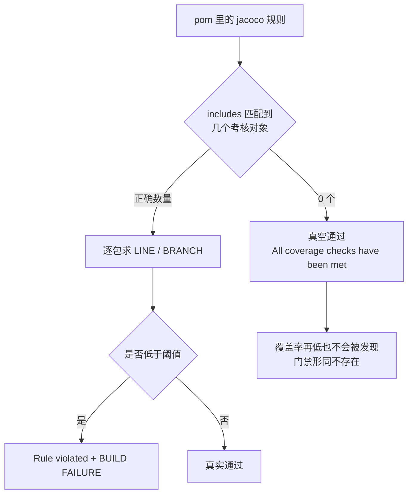

# fix-jacoco-rule 测试设计

> 批次目录：`docs/test-agent-demo/2026-09-23-fix-jacoco-rule/`
> 对应 OpenSpec change：`fix-jacoco-rule`
> 测试执行日：2026-09-23

---

## 1. 背景

### 1.1 被修的东西本身就是一个「测试有效性」问题

`agent-core` 的 jacoco 门禁长期**真空通过**：规则写了 `LINE ≥ 0.80 / BRANCH ≥ 0.70`，但一条也没真正执行。
这不是「覆盖率不够」的问题，而是**门禁的判定本身不成立**——所以本批测试的第一目标是「证明门禁真的会拦」，第二目标才是「把缺口补到达标」。

### 1.2 两个同类陷阱（同一个认知错误的两层）

| 层 | 错误写法 | 为什么失效 | 后果 |
|----|---------|-----------|------|
| `element` 层 | `<element>BUNDLE</element>` + 类名通配 includes | `includes` 过滤的是**被考核元素名**；BUNDLE 元素下即 bundle 名（`agent-core`），类名模式匹配不到 | 0 个考核对象 → 真空通过 |
| 包名层 | 只写 `com.example.agent.tools`，不写 `com.example.agent.tools.*` | `PACKAGE` 元素下 `includes` 过滤**包名**；`X` 只中根包、`X.*` 只中子包 | 子包静默漏检（`tools.file` BRANCH 0.50 也报 met） |

第二层是**实施过程中才发现的**：先把 BUNDLE 改成 PACKAGE + 5 个根包名，门禁确实生效了（阈值抬升实验通过），
但跑完整门禁时发现 `All coverage checks have been met` 与独立复算的 CSV 数值对不上——才意识到子包没被纳入。

同一个错误在一个 change 里出现了两次，因此本批把「**如何证明一条 jacoco 规则真的生效**」本身作为交付物写进了 spec。

---

## 2. 测试目标

| 编号 | 目标 | 判定方式 |
|:----:|------|---------|
| G1 | 证明「阈值抬升实验」能识别真空规则 | 对**修复前**的 BUNDLE 规则做该实验 → 仍 BUILD SUCCESS（证明实验有区分力，不是恒真） |
| G2 | 证明 poms 里的规则真的会拦 | 对修复后的 agent-core / agent-web 规则分别做抬升实验 → 都应 BUILD FAILURE |
| G3 | 证明规则覆盖的包集合符合预期 | 抬升到 0.99 后，违规清单应列出全部 11 个包（5 根包 + 6 子包） |
| G4 | 把被漏掉的包补到达标 | 最终门禁 `All coverage checks have been met`，且独立复算 CSV 逐包 ≥ 0.80 / 0.70 |
| G5 | 无回退 | 全量门禁全绿（agent-core + agent-web + 前端 vitest + tsc） |

---

## 3. 测试范围

### 3.1 范围内

- `agent-core/pom.xml` jacoco 规则的**有效性**（不是配置文本，是「会不会拦」）。
- 规则覆盖的包集合是否与预期一致（含子包）。
- 覆盖率补测：为 7 个未达标包补充测试用例直至达标。
- 全量质量门禁。

### 3.2 范围外

| 项 | 原因 |
|----|------|
| 下调阈值 | 用户明确选择「补到达标」而非「下调标准」 |
| 修 `agent-web` 的 `includes` 漏根包 | 属另一处同类问题，本 change 只记录不修（避免 scope 蔓延） |
| 修 `AnthropicProvider` 的 SSE 缺陷 | 补测过程中发现的真实缺陷，但修它属于 provider 行为变更，超出覆盖率门禁 scope；本批用 characterization 用例固化 |
| 覆盖率「质量」的评估 | 本批只保证阈值达标；`assertTrue(true)` 之类的空测试会通过门禁，但本批逐条自查未加入空测试（见 §8） |

---

## 4. 缺陷模型

识别方法（本批固化）：**把阈值临时改成不可能达到的值**。
真实规则会因此失败；真空规则照样成功。这个实验对「规则是否生效」有完全区分力，
且不需要读 jacoco 源码或猜测语义。

---

## 5. 测试策略

| 层 | 被测对象 | 手段 | 为什么在这一层测 |
|:--:|---------|------|-----------------|
| L1 规则有效性 | `pom.xml` 的 jacoco 规则 | 阈值抬升实验（0.80/0.70 → 0.99） | 直接回答「会不会拦」；不需要理解 jacoco 内部语义 |
| L2 规则覆盖面 | `includes` 的包集合 | 0.99 下比对违规清单 vs 独立复算的 CSV 包清单 | 抓「漏了一整类包」这种静默失败 |
| L3 缺口定位 | 各包的覆盖率 | jacoco CSV 逐类排序 | 数据驱动决定补哪个包，不靠猜 |
| L4 缺口补齐 | 补写的测试用例 | 单类跑绿 → 全量门禁 → 复算 CSV | 确认补测真的提升了对应包的覆盖率 |
| L5 集成门禁 | 全模块 | `mvn verify` + jacoco check + 前端 vitest + tsc | 确认无回退 |

### 5.1 关键测试手法

**手法一：阈值抬升实验。** 判据是「构建失败」，不是「日志里有某行」。这让实验对实现细节免疫。

**手法二：两次抬升形成对照。** 只对修好的规则做实验，无法排除「实验恒真」的可能
（比如阈值属性根本没被读到）。因此对**修复前**的 BUNDLE 规则也做一次，得到「仍成功」的结果作为对照——
两次结果不同，才证明实验有区分力。

**手法三：违规清单 vs 独立复算。** 不只看「是否失败」，还比对「失败时列出的包」与
「用 jacoco.csv 独立聚合出的包」是否一致。这一步才抓出子包漏检。

**手法四：数据驱动补测。** 从 CSV 里按 `LINE_MISSED` / `BRANCH_MISSED` 降序排，先补缺口最大的包；
每补一批就跑门禁复算，避免「补了一堆但没补到点上」。

**手法五：不为凑覆盖率写空测试。** 每条新用例的断言必须对应一个协议行为或不变式
（见 `test-cases.md` 每条的「为什么值得测」列）。

---

## 6. 测试环境

| 项 | 值 |
|----|-----|
| 工作区 | `.worktrees/fix-jacoco-rule`（worktree 隔离，分支 `fix/jacoco-rule`） |
| 基线提交 | `9ad08c1`（分支起点）→ 合并 `origin/main` `cc89d4d` 后重跑 |
| 门禁命令 | `mvn -o -pl agent-core,agent-web verify -DskipNpm=true -Dsurefire.excludes=**/e2e/**` |
| 覆盖率数据 | `<module>/target/site/jacoco/jacoco.csv` |
| JDK | 编译目标 17，运行时 24.0.1 |
| 前端 | `npx vitest run` / `npx tsc --noEmit` |
| 数据隔离 | 本批新增用例全部在内存或 `@TempDir` 中构造；WireMock 用随机端口 |

---

## 7. 用例矩阵（概览）

完整步骤与预期见 `test-cases.md`。

| 编号 | 用例名 | 层 | 优先级 |
|:----:|--------|:--:|:------:|
| RG-01 | 修复前 BUNDLE 规则的抬升实验（对照组，应仍成功） | L1 | P0 |
| RG-02 | 修复后 agent-core 规则的抬升实验（应失败） | L1 | P0 |
| RG-03 | agent-web 规则的抬升实验（对照，应失败） | L1 | P0 |
| RG-04 | 0.99 下违规清单覆盖全部 11 个包 | L2 | P0 |
| CV-01 | `tools.file` 协议面覆盖 | L4 | P0 |
| CV-02 | `provider.minimax` 构造器与元数据覆盖 | L4 | P1 |
| CV-03 | `provider.anthropic` `streamChat` 全链路覆盖 | L4 | P0 |
| CV-04 | `tools.shell` 协议面 + 截断 + 超时覆盖 | L4 | P0 |
| CV-05 | `tools.websearch` 工厂容错分支覆盖 | L4 | P1 |
| CV-06 | `session` 解析与工厂分支覆盖 | L4 | P0 |
| CV-07 | `tools` 注册表与路径守卫分支覆盖 | L4 | P0 |
| GATE-01 | `mvn verify` 全绿 + 两模块 jacoco met | L5 | P0 |
| GATE-02 | 前端 vitest 全过 | L5 | P0 |
| GATE-03 | `tsc --noEmit` 不超过基线 | L5 | P1 |

---

## 8. 退出标准（DoD）

| # | 标准 | 达成判据 |
|:--:|------|---------|
| 1 | P0 用例全通过 | RG-01~04、CV-01/03/04/06/07、GATE-01/02 全绿 |
| 2 | 门禁真的会拦 | 阈值抬升实验对两个模块都得到 BUILD FAILURE |
| 3 | 覆盖面无静默遗漏 | 0.99 违规清单 = 独立复算的包清单（11 个） |
| 4 | 全包达标 | 最终门禁 `All coverage checks have been met` 且逐包复算 ≥ 0.80 / 0.70 |
| 5 | 无空测试 | 每条新用例的断言对应协议行为或不变式；逐条自查（写 `FileToolsProtocolTest` 时删掉过一条无意义断言） |
| 6 | 归档与合并 | change 已归档；delta 已并入 `openspec/specs/testability/spec.md` |
| 7 | 数据不污染 | 用例全在内存/临时目录；未读写真实数据目录 |

---

## 9. 风险与对策

| 风险 | 影响 | 对策 |
|------|------|------|
| 抬升实验恒真（阈值属性没生效，实验无区分力） | 会把真空规则误判为生效 | 对修复前的规则也做一次，形成对照 |
| 只查「是否失败」，不查「考核了哪些包」 | 漏掉子包这类整类遗漏 | 额外比对违规清单与独立复算的包清单 |
| 为达标写空测试 | 门禁绿但测试无价值 | 每条用例写明「为什么值得测」；自查删除无意义断言 |
| 补测改了生产代码 | 覆盖率 change 变成行为 change | 本批**只加测试与 pom**，不改任何 `src/main` 生产代码（diff 可验证） |
| 发现的新缺陷被顺手修掉，scope 蔓延 | 覆盖率 change 难以评审 | 新缺陷只记录 + characterization 用例固化，明确建议单开 change |
| 并行 agent 同时改 `AGENTS.md` | 文档冲突 | 先合并 `origin/main` 再改该文件；只改一行 + 追加一条修订记录 |
