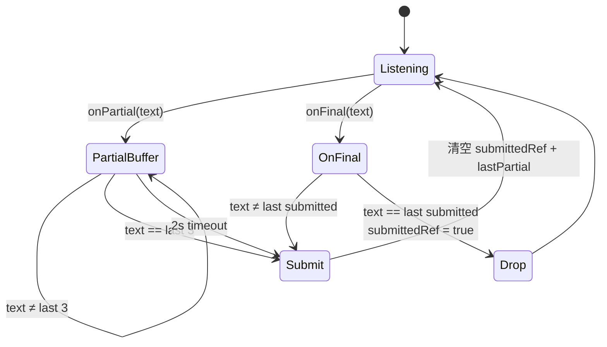
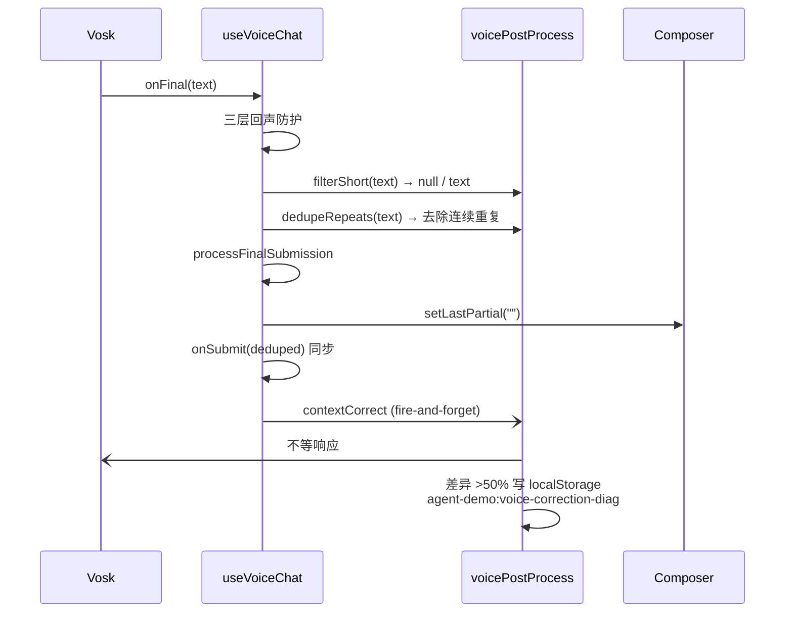
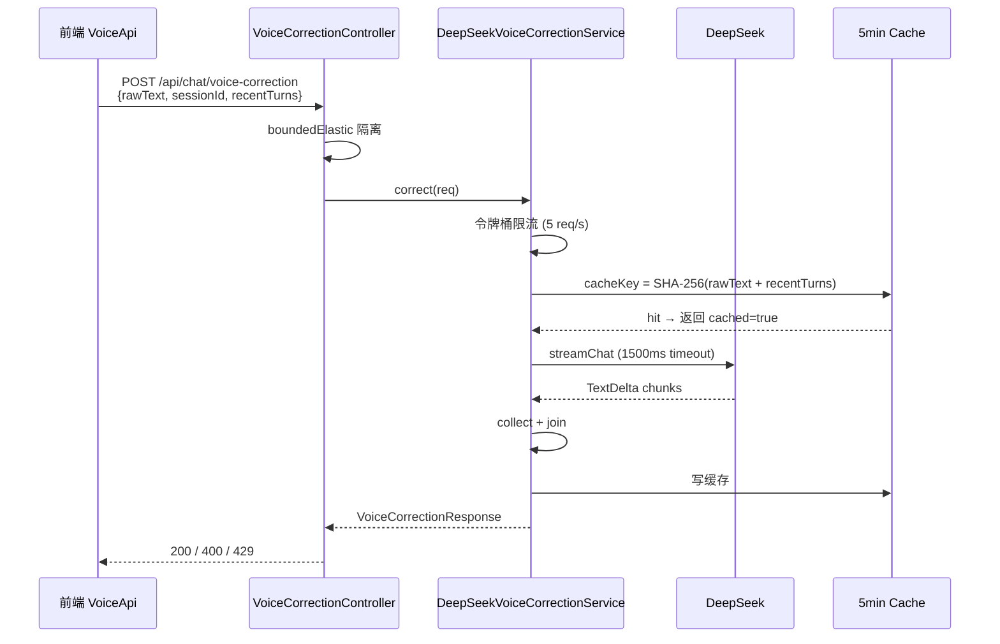

# 语音架构（Voice Architecture）

> 适用范围：`agent-web` 的语音输入链路（Vosk 离线 WASM STT + ASR 后处理 + partial UI）。
> 变更来源：OpenSpec change `improve-voice-accuracy`（improve-voice-accuracy）。
> 相关代码：`useVoiceChat.ts`、`voice.ts`、`stt.ts`、`voicePostProcess.ts`、`VoiceApi.ts`、`Composer.tsx`、`VoiceCorrectionController.java`、`DeepSeekVoiceCorrectionService.java`。

---

## 1. 结论速览

语音输入链路按"前端稳定化 → 后端语义化 → 展示即时化"三段拼接，每段独立可降级：

| 段 | 组件 | 职责 | 降级路径 |
|:--:|------|------|----------|
| 前端稳定化 | `useVoiceChat` + `voice.ts` | 回声防护 + partial 状态机 + dedupeRepeats | 任一环节失败 → 用户提交原文（LLM 仍可识别） |
| 后端语义化 | `VoiceCorrectionController` + `DeepSeekVoiceCorrectionService` | DeepSeek 语义纠错 + 5min 缓存 + sessionId 限流 | 超时/5xx/429 → 返回 `corrected=null`，前端降级 |
| 展示即时化 | `Composer.tsx` partial UI | 半透明斜体显示 partial + 纠错中占位 | 仅展示，无副作用 |

---

## 2. 三层回声防护

Vosk 在播放 TTS 回复时会把回复内容识别成"final"结果，导致用户语音输入被自己的回声污染。三层防护按优先级叠加：

```mermaid
flowchart TD
    A[Vosk final 到达] --> B{距上次 TTS 结束 < ECHO_GUARD_MS = 1500?}
    B -- 是 --> Z[丢弃]
    B -- 否 --> C{TTS 还在播放?<br/>isSpeaking()}
    C -- 是 --> Z
    C -- 否 --> D{字符重合率 > 0.75?<br/>looksLikeEcho}
    D -- 是 --> Z
    D -- 否 --> E[进入 ASR 后处理]
```

| 层级 | 检查 | 实现位置 | 加固项 |
|:--:|------|---------|--------|
| 时序 | `now - lastTtsEnd < ECHO_GUARD_MS` | `useVoiceChat.ts` | 700ms → 1500ms（improve-voice-accuracy T1） |
| 状态 | `tts.isSpeaking()` | `useVoiceChat.ts` | 保留 |
| 内容 | 字符级 `looksLikeEcho` | `voice.ts` | `ECHO_OVERLAP_THRESHOLD` 0.6 → 0.75；`DEFAULT_ECHO_WINDOW_MS` 10000 → 6000（T1） |

---

## 3. partial 状态机

Vosk 在用户说话过程中持续输出 `partialresult`（试探性识别），说话结束输出 `finalresult`。两路都可能触发"提交"动作，需要协调避免重复：



| 触发 | 处理 | 实现位置 |
|------|------|----------|
| 连续 3 次 partial 文本相同 | 视为"说完了"，提交 | `useVoiceChat.ts` partialBufferRef |
| Vosk final 到达 | 检查 `submittedRef` 去重后提交 | `useVoiceChat.ts` submittedRef |
| 2s 超时（无新 partial） | 兜底提交当前 partial | `useVoiceChat.ts` partialTimerRef（PARTIAL_TIMEOUT_MS=2000） |
| 提交完成 | 清空 `lastPartial` + `submittedRef` | `useVoiceChat.ts` processFinalSubmission |

---

## 4. ASR 后处理链路

提交到 LLM 之前 + 提交到 LLM 之后，两段分别处理：

### 4.1 提交前（前端 fire-and-forget 同步链路）



### 4.2 提交后（后端 DeepSeek 异步链路）



---

## 5. 启动门禁与配置

```yaml
# application-web.yml
agent:
  voice:
    post-process:
      enabled: true   # 默认开启；false 时跳过所有后端调用
```

| 配置 | 优先级 | 校验 |
|------|--------|------|
| `agent.voice.post-process.enabled` | yaml | `ConfigLoader.mergeVoice` 解析 |
| DeepSeek key | `DEEPSEEK_API_KEY` env > `agent.provider.api-key` yaml > `~/.agent-demo/config.yaml` | `WebConfig.validateVoiceConfig` 启动校验 |

启动时若 `enabled=true` 但所有 key 源都为空 → 启动失败 + 明确错误信息。

---

## 6. 测试覆盖

| 层 | mock 策略 | 测试数 |
|----|----------|------:|
| 前端 `useVoiceChat` / `voice.ts` | `mockStt((onFinal, onPartial?) => ...)` 直接驱动 | 16 |
| 前端 `voicePostProcess` | `mock fetch` 覆盖正常/超时/5xx/配置关闭 | 15 |
| 前端 `Composer` partial UI | React Testing Library | 5 |
| 后端 `DeepSeekVoiceCorrectionService` | `stubProvider` 返回固定 TextDelta | 20 |
| 后端 `VoiceCorrectionController` | stub service | 5 |
| 后端 `VoiceTestFixtures` | @TempDir + cleanupTargetTmp | 3 |
| 后端 `ConfigLoader` voice 段 | @TempDir + yaml 覆盖 | 3 |
| 后端 `WebConfig` 启动门禁 | MockEnvironment | 5 |
| **合计本 change 新增** | | **72** |

详细测试文档：`docs/test-agent-demo/2026-09-13-improve-voice-accuracy/`。

---

## 7. 已知遗留

- **ChatPanel 接入**：当前 `useVoiceChat` 调用未传 `sessionId` / `recentTurns`，前端 contextCorrect 实际跑起来会因 `recentTurns=null` 走降级路径；后续 P1 任务把 ChatPanel 的 `currentSessionId` + 最近 N 条 items 喂进来
- **真实 DeepSeek 端到端**：所有后端测试用 stub provider；用户配置 key 后在浏览器手测一次才算真实验证
- **AGENTS.md §2.7.7 tsc 基线**：实际基线 9（既有 mermaid 模块引入），描述滞后 7；后续单独 PR 修正