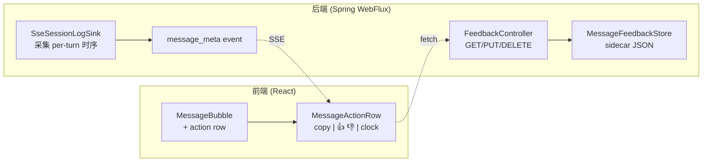
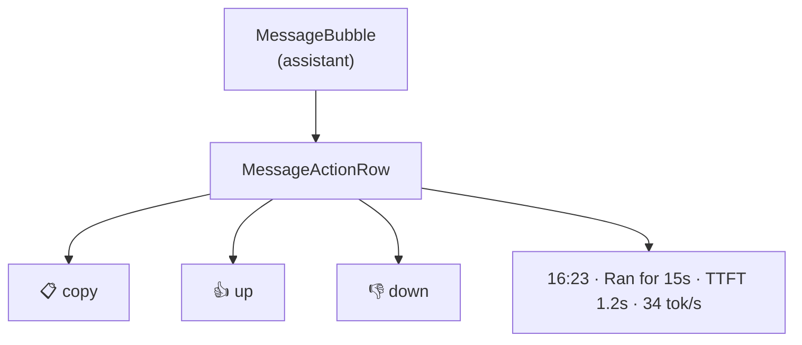

# Design: add-message-actions

## 1. 架构（DSH 对齐）



## 2. D1: message_meta SSE 事件（P2）

**问题**：`TurnStats` 只有会话累计值，无法做 per-message 读数。

**方案**：新增 SSE event，在 assistant finalize 时推送。

```java
// SseEvent.java 新增
record MessageMeta(
        @JsonProperty("type") String type,              // "message_meta"
        @JsonProperty("uuid") String uuid,              // 对应 SessionEntry.uuid
        @JsonProperty("duration_ms") long durationMs,   // turn wall time
        @JsonProperty("ttft_ms") Long ttftMs,           // 首 token 延迟（null = 未记录）
        @JsonProperty("tok_per_sec") Double tokPerSec,  // decode throughput（null = N/A）
        @JsonProperty("timestamp") long timestamp       // 消息时间戳（epoch ms）
) implements SseEvent {
    public MessageMeta(String uuid, long durationMs, Long ttftMs, Double tokPerSec, long timestamp) {
        this("message_meta", uuid, durationMs, ttftMs, tokPerSec, timestamp);
    }
}
```

**采集点**：`SseSessionLogSink.onAssistant()` 里，从 AgentLoop 已收集的 turn 时序计算。

**发送时机**：`message_stop` **之前**（前端先拿到 uuid + 读数，再收 stop）。

**派生的 N/A 语义**：provider 不返回 usage 时 `ttftMs` / `tokPerSec` 为 null → 前端显示 `N/A`（与 add-session-stats-bar 一致）。

## 3. D2: feedback sidecar + CAS（P3）

### 3.1 存储 schema

```jsonc
// ~/.agent-demo/feedback/<sessionId>.json
{
  "version": 1,
  "session_id": "abc-123",
  "items": {
    "<messageUuid>": {
      "rating": "up",              // "up" | "down"
      "version": 3,                // per-item CAS version
      "updated_at": 1736700000000
    }
  }
}
```

**文件权限**：0600（与 session.jsonl 一致）；目录 0700。

### 3.2 REST 端点

| Method | Path | Body | 返回 |
|--------|------|------|------|
| `GET` | `/api/feedback/{sessionId}` | — | `{items: {...}}` |
| `PUT` | `/api/feedback/{sessionId}/{messageId}` | `{rating, ifVersion}` | `{rating, version}` / 409 冲突 |
| `DELETE` | `/api/feedback/{sessionId}/{messageId}` | `{ifVersion}` | 204 / 409 |

**CAS 语义**（DSH 对齐）：
- `ifVersion: null` = 「必须不存在」（首次记录）
- `ifVersion: N` = 「必须等于当前 version N」
- 冲突 → `409 Conflict` + body `{current: {rating, version} | null}`，前端据此调和

### 3.3 Toggle 语义

| 当前状态 | 用户点击 | 行为 |
|---------|---------|------|
| 无 rating | 👍 | `PUT {rating:"up", ifVersion:null}` |
| 👍 | 👍 | `DELETE {ifVersion:N}`（取消） |
| 👍 | 👎 | `PUT {rating:"down", ifVersion:N}`（切换） |
| 👎 | 👍 | `PUT {rating:"up", ifVersion:N}`（切换） |

## 4. D3: action row UI

### 4.1 组件结构



### 4.2 显示时机

| 消息状态 | action row |
|---------|-----------|
| assistant 流式中（`message_delta` 期间） | ❌ 不显示 |
| assistant finalize（`message_stop` 后） | ✅ 显示（含 clock + copy + 赞踩） |
| 已加载历史消息 | ✅ 显示 |
| user 消息 | ✅ **只显示 copy**（无赞踩） |
| tool call 卡片 | ❌ 无 |

判断依据：消息对象有 `uuid` 字段（来自 `message_meta` 或历史加载）才显示完整 row。

### 4.3 copy 实现（DSH 对齐）

DSH 的 `MessageIconActions.onCopy`：
- `writeClipboard(text)` 后 1s 显示 ✓（`IconCheckOutline16`）
- `copyPending` ref 防重入（点击期间不重复写）
- `copyEpoch` ref 防 unmount 后 setState

agent-demo 采用：
```ts
async function onCopy() {
  if (copied || copyPending.current) return;
  copyPending.current = true;
  try {
    await navigator.clipboard.writeText(text);
    setCopied(true);
    setTimeout(() => setCopied(false), 1000);
  } catch {
    // 降级：document.execCommand('copy')
  } finally {
    copyPending.current = false;
  }
}
```

**降级路径**：`navigator.clipboard` 在非 HTTPS / 非 localhost 不可用 → fallback 到隐藏 textarea + `document.execCommand('copy')`。

## 5. 关键决策记录

| # | 决策 | 理由 |
|---|------|------|
| D1 | `message_meta` 独立 event（不改 TurnStats） | 与消息 uuid 直接绑定，前端不用做 turn→message 映射；不动现有 event 契约（向后兼容） |
| D2 | sidecar 独立 JSON（不进 session log） | DSH 对齐：feedback 对模型不可见；避免污染 append-only 会话文件 |
| D3 | per-item version CAS | 多标签页并发时不互相覆盖；DSH 同款语义 |
| D4 | 流式中不显示 action row | 无 uuid（未 finalize）；与 DSH「messageId 缺失则 skip slot」一致 |
| D5 | regenerate 用 surface replacement | 用户明确选择 DSH 对齐；独立 change（本 change 不做） |

## 6. 风险与边界

| 风险 | 缓解 |
|------|------|
| `navigator.clipboard` 不可用（HTTP 非 localhost） | fallback `execCommand('copy')` |
| sidecar 与 session 不同步（session 删除后 sidecar 遗留） | 本次不做清理（follow-up：session 删除时级联删 sidecar） |
| CAS 冲突频繁（多标签页同时点赞） | 冲突返回 `current` 让前端调和；不做重试 |
| `ttftMs` 采集不准（provider 不返回 usage） | 显示 `N/A`（与 add-session-stats-bar 一致） |
| feedback 写失败（磁盘满/权限） | REST 返回 500；前端回滚乐观更新 |