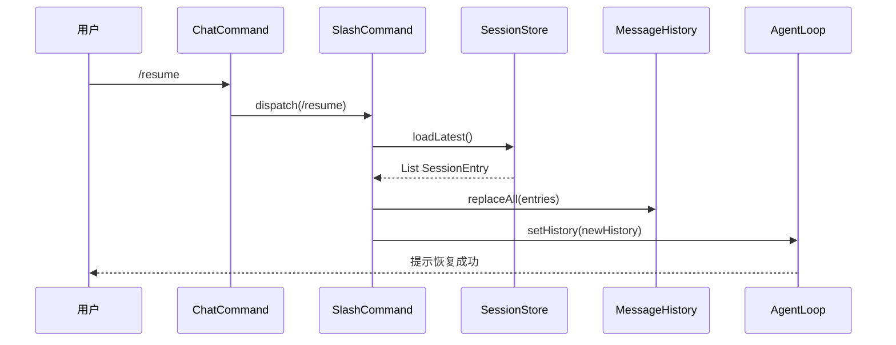

# Design: Add /resume Command

## Architecture

## Files Changed
- `src/main/java/com/example/agent/session/SessionStore.java`: 加 `loadLatest()` 方法
- `src/main/java/com/example/agent/cli/SlashCommand.java`: 加 `/resume` case
- `src/main/java/com/example/agent/core/MessageHistory.java`: 加 `replaceAll(List<Message>)` 方法
- `src/test/java/com/example/agent/session/SessionStoreTest.java`: 加 loadLatest 测试
- `README.md`: 增补 /resume 命令说明

## Key Design Decisions
- **复用现有 SessionStore 反序列化逻辑**（v0.1 已实现 `flush` + `load` 框架）
- **history 替换而非合并**：避免双 session 数据混淆（Q10 决议）
- **mtime 排序**：用文件 mtime 而非文件名（更鲁棒）
