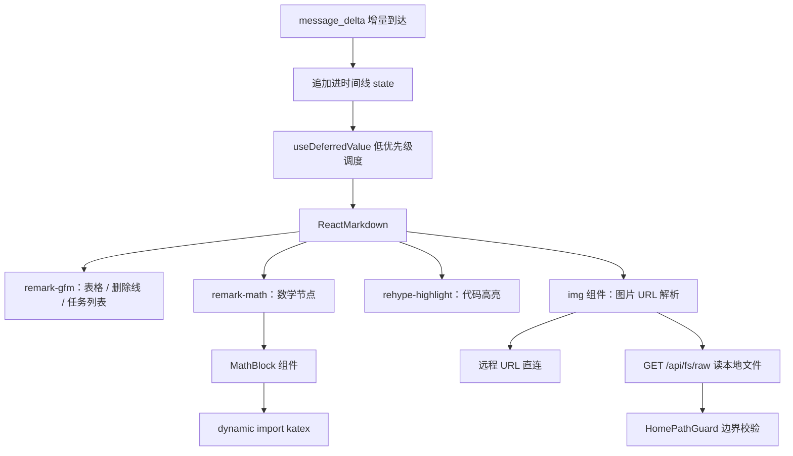

## Context

Web 对话区的正文渲染入口只有一个：`agent-web/frontend/src/components/MessageBubble.tsx`，其中 `<ReactMarkdown>{props.text}</ReactMarkdown>` **未挂任何 remark/rehype 插件**。`react-markdown@10` 默认只实现 CommonMark，因此 GFM 表格、删除线、任务列表、数学公式一律不渲染，代码块无高亮，图片无来源定义。

样式侧同样残缺：`MessageBubble.module.css` 的 `.markdown` 只有 `p / pre / code / ul / ol / a` 六条规则，**没有 `table`、没有 `h1`–`h6`、没有 `img`** —— 即使插上插件，表格也会渲染成没有边框与内边距的一坨。

流式路径是本设计的真正约束：助手文本经 `message_delta` 事件**逐增量**到达（见 `add-true-streaming` 的成果），前端把增量追加进时间线后整条消息重新渲染。Markdown 解析因此会在一次回答中被触发几十到上百次。

后端侧已有 `FsController`（`/api/fs/**`）与 `HomePathGuard.resolveWithinHome`（`toRealPath()` + `$HOME` 子树 + 403），本地图片接口可直接复用这套边界。



## Goals / Non-Goals

**Goals:**

- 助手消息里的 GFM 表格渲染为真正的表格，截图里的竖线原文消失。
- 双美元块与行内 LaTeX 公式渲染为 KaTeX。
- 围栏代码块按语言高亮，且不引入全量语言包。
- 消息里的图片能显示，覆盖远程 URL 与本地文件两种来源。
- 流式追加期间不因反复 Markdown 解析而产生可感知卡顿。
- 在以上全部能力打开的前提下，**不扩大** XSS 攻击面。

**Non-Goals:**

- mermaid 图渲染（另开 `add-mermaid-diagrams`）。
- 内联 `<svg>` 标签渲染（需放开 raw HTML，已明确否决）。
- 数据图表（echarts / chart.js）——需自定义语法并改系统提示词引导模型。
- 后端全站 CSP 下发（独立安全话题，见 Risks）。

## Decisions

### D1 Markdown 方言用 `remark-gfm`，不自研解析器

**选择**：`remarkPlugins={[remarkGfm]}`，由 `react-markdown` 的既有管线（remark-parse → remark-rehype → rehype-react）承载。

**备选与否决理由**：

- 自研表格解析器：需要处理转义竖线、对齐行、单元格内行内代码、流式未闭合等边界，等于重写 GFM 表格规范，维护成本远超收益。
- 换成 `marked` / `markdown-it`：要替换整条渲染管线与既有 6 个组件测试，改动面与风险都大于收益。
- `remark-gfm` 解包仅 0.02 MB，且与 `react-markdown@10` 同属 remark 生态，零适配成本。

### D2 公式用 `remark-math` 解析 + **自建懒加载 KaTeX 组件**，不用 `rehype-katex`

**选择**：

1. `remark-math` 只负责把 `$...$` / `$$...$$` 解析成 mdast 数学节点（插件仅 0.01 MB）。
2. 写一个极小的 rehype 插件把数学节点转成 `<span data-tex="...">` / `<div data-tex="...">`。
3. React 侧 `MathBlock` 组件在 `useEffect` 里 `await import('katex')` 后渲染，同时 `import('katex/dist/katex.min.css')`。

**为什么不用 `rehype-katex`**：`rehype-katex` 在模块顶层 import `katex`，会把 KaTeX 的 JS（压缩后约 270 KB）**焊死进主 bundle** —— 首屏 `index-*.js` 会从 335 KB 涨到 600 KB 级别，而绝大多数回答里根本没有公式。自建组件把这份代价推迟到"真的出现公式时"，且实现只有几十行。

**否决的更重方案**：MathJax —— 体积与启动开销都远大于 KaTeX，且不支持 SSR 友好的字符串渲染。

### D3 代码高亮用 `rehype-highlight` 的**默认** `common` 语言集

**选择**：`rehypePlugins={[rehypeHighlight, ...]}`，**不传** `languages` 选项，用其默认的 `common`（34 个语言：bash / c / cpp / csharp / css / diff / go / graphql / ini / java / javascript / json / kotlin / less / lua / makefile / markdown / objectivec / perl / php / plaintext / python / r / ruby / rust / scss / shell / sql / swift / typescript / vbnet / wasm / xml / yaml + arduino）。

**否决"自选语言子集"（原方案，2026-09-13 实测推翻）**：本设计最初打算只注册 14 个常用语言以控制体积。实测发现这个前提**不成立**：

```text
rehype-highlight/lib/index.js
  import {common, createLowlight} from 'lowlight'     ← common 在模块顶层被静态 import
lowlight/index.js
  export {grammars as common} from './lib/common.js'  ← 34 个语言无条件进包
内部实现：createLowlight(options.languages ?? common) ← 引用关系真实存在，Rollup 摇不掉
```

也就是说传不传 `languages`，`common` 的 34 个语言都在包里。自选子集不但不省体积，反而**净减功能**（go / rust / c / cpp / php / ruby 明明已在包内却不高亮），还额外需要一条 `highlight.js/lib/languages/*` 的通配类型声明来绕过 TS7016。

实测两种写法的产物对比（同一份代码，仅差 `languages` 选项）：

| 写法 | 主 bundle | gzip |
|---|---:|---:|
| 传 `languages`（14 个自选） | 612.87 kB | 188.57 kB |
| 不传（默认 `common`，34 个） | **561.31 kB** | **173.61 kB** |

**默认写法反而小了 51 kB**，且语言更多、代码更简单。故采纳默认写法。

**已知缺口**：`common` 不含 `dockerfile` 与 `properties`（Maven / Spring 项目偶有 `application.properties`）。二者在本 change 之前同样没有高亮，故非回退；若后续要补，做法是 `import {common} from "lowlight"` 后 `{...common, dockerfile, properties}`，代价是 lowlight 提为直接依赖 + 恢复那条通配类型声明 + 约 10 kB。

**否决的更重方案**：`highlight.js` 全量（解包 5.25 MB，190+ 语言）；`shiki`（着色最好，但依赖 wasm 与主题体系，复杂度与体积都上一个台阶）。

### D4 图片来源：远程直连 + 本地经新接口

**选择**：

- `http(s)://` 绝对 URL → 直接作为 ``。
- 本地绝对路径（含 `file://`）→ 转成 `/api/fs/raw?path=<encodeURIComponent(path)>`。
- 相对路径 → 视为相对于当前工作区解析后同上。

**为什么不由前端直接读文件**：浏览器无法读任意本地路径（`file://` 在 http 页面被禁止），必须经后端。

**否决的方案**：把图片 base64 内联进消息（受消息体积与 context 双重限制）；用现有 `GET /api/fs/list` 拼路径（只返回元数据，不返回字节）。

### D5 保持 raw HTML 关闭，**不引入 `rehype-raw`**

**选择**：不挂 `rehype-raw`。消息里的 `<script>`、`` 等一律按纯文本转义显示。

**这是本 change 的安全底线**。理由链：

1. agent-demo 具备 `ReadFileTool`、`WebSearchTool`、`ShellTool`、`McpTool`，**攻击者可控内容必然进入模型上下文**（网页、仓库文件、MCP 返回）。
2. 提示注入可让模型在回答里输出 ``。
3. 一旦挂上 `rehype-raw`，这段就会在用户浏览器里执行。
4. **后端目前没有任何 CSP**，这道防线一旦撤掉就没有兜底。

**这就是否决"内联 SVG"的技术原因**：内联 `<svg>` 必须走 raw HTML。用户需要"显示 SVG 架构图"时，`` 经 `` 引用即可满足，且浏览器在 `` 上下文里**不执行** SVG 内的脚本。

### D6 流式时序用 `useDeferredValue`，而非手写 150 ms 定时器

**选择**：文本 state 每次增量即时写入（保证"逐帧可见"），Markdown 解析走 `useDeferredValue` 的低优先级渲染。

**与需求的关系**：用户要求"150 ms 防抖"。`useDeferredValue` 在效果上满足该诉求（相邻增量之间不产生可感知延迟），且优于定时器的三点：

- React 18 内建，无需在流式结束/组件卸载时清理 timer，不引入竞态。
- 定时器会让"文本追加"本身也延迟，`useDeferredValue` **只降级解析**，文本即时可见。
- 后续 C2 的 mermaid 需要"围栏闭合才渲染"的硬门禁，两者叠加时不需要两套时间机制。

### D7 `GET /api/fs/raw` 用类型白名单 + 响应头加固

**选择**：

| 项 | 取值 |
|---|---|
| 边界 | 复用 `HomePathGuard.resolveWithinHome`（`toRealPath()` + `$HOME` 子树 + 403），trusted-host 校验在前 |
| 类型 | 仅图片白名单（png/jpeg/gif/webp/avif/bmp/x-icon/svg+xml），其余返回 415 |
| 大小 | 上限 16 MiB，超出返回 413 且不整体读入内存 |
| 响应头 | `X-Content-Type-Options: nosniff`、`Content-Disposition: inline; filename=...` |
| SVG 专属 | 额外带 `Content-Security-Policy: sandbox` |

**为什么必须做类型白名单**：该端点在**应用同源**下返回字节。若允许任意扩展名，家目录里一个攻击者可控的 `.html` 就会被以 `text/html` 打开 —— 这是同源存储型 XSS，比 `rehype-raw` 那条链更直接。

**为什么 SVG 要带 `sandbox`**：`image/svg+xml` 作为图片嵌入时脚本不执行，但**用户直接访问该 URL** 时 SVG 内的 `<script>` 会在同源下执行。`Content-Security-Policy: sandbox` 正是为这种"不可信 SVG"设计的，且不影响 `` 渲染。

### D8 测试策略：真渲染 + DOM 断言，不做模块 mock

**选择**：在 jsdom 里真跑 `react-markdown` + 全部插件，断言产出的 DOM 结构（`getByRole('table')`、`<del>`、`<pre><code class="hljs">`、``、`javascript:` 不产生 `<a>`）。

**理由**：本 change 的价值全在"渲染结果对不对"，mock 掉插件等于没测。KaTeX 是懒加载，测试里用 `await waitFor` 等动态 import 落地。

**注意**：worktree 内没有 `node_modules`，实现前需先在该 worktree 的 `frontend/` 下 `npm install`（新依赖也必须在此安装）。

## Risks / Trade-offs

| 风险 | 缓解 |
|---|---|
| 提示注入 → XSS | D5 保持 raw HTML 关闭；D7 白名单 + nosniff；新增端点不返回非图片类型。**未做**全站 CSP，仅为本端点加了 scoped `sandbox` |
| 主 bundle 体积增长 | D2 把 KaTeX 移出主包；D3 只注册语言子集；T5 实测并记录增量，超标则改懒加载 |
| KaTeX 字体增大构建产物（约 1 MB woff2） | 查证 `vite.config.ts`：`generateSW` 模式下 `injectManifest.globPatterns` 不生效，默认只预缓存 js/css/html，**字体不进安装包**，走 `/assets/` 运行时 CacheFirst（30 天）。仅 CSS 约 +23 KB |
| 流式期间未闭合表格/公式抖动 | 未闭合的表格语法不成立，按段落文本渲染（spec 已固化为用例）；公式懒加载组件在注释挂载前渲染占位，避免布局跳动 |
| 本地图片路径含空格/中文/反斜杠 | 统一 `encodeURIComponent` 后拼接，测试用例覆盖中文目录与 Windows 反斜杠 |
| 前端改动对用户不可见 | 遵守既有 `web-build` 约定：改完必须重新构建 `static/` 并同步 `target/classes`，否则浏览器仍拿旧 bundle |
| 新依赖改变锁文件，与并行 agent 冲突 | 本 change 在独立 worktree 内完成；合并前按 AGENTS.md §2.7.5 门禁 4 同步 `main` 后重跑 |

## Migration Plan

1. 在本 worktree 的 `agent-web/frontend/` 执行 `npm install` 安装新增依赖（worktree 无 `node_modules`）。
2. 按 tasks.md 的 TDD 顺序实现（每项：测试先红 → 实现 → 转绿 → commit → push 到 `feat/add-rich-markdown-rendering`）。
3. 重新构建 `static/` 产物并把变更同步到 `target/classes`，确认浏览器实际加载的是新 bundle（沿用本项目既有的自检手法：在产物里 grep 新代码特征串）。
4. 跑 AGENTS.md §2.7.5.1 的五条合并门禁。
5. 合并回 `main` 后在 `main` 上复验，通过才 push。

**回滚策略**：`static/` 是构建产物、不进 git，整体 revert 本 change 的提交后重新构建即可回到旧行为；后端新增端点独立，回滚不影响既有 `/api/fs/**`。

## Open Questions

1. **KaTeX 字体是否要子集化**：当前方案是全量字体进 `dist/assets/`（约 1 MB），运行时按需下载、不进预缓存。若后续觉得构建产物过大，可只保留 latin 字体子集，但会牺牲符号覆盖度。
2. **主 bundle 增量的最终账**（T5 已实测，结论：接受）：基线 `index.js` 335,446 B → 561,310 B（**+226 kB**，gzip 173.61 kB）。构成拆解——`lowlight` + `common` 34 语言约 200 kB（**不可摇**，见 D3）、`remark-gfm` + `remark-math` 约 40 kB、其余为本 change 新增组件。KaTeX 已成功拆为独立懒加载块（`katex-*.js` 261.76 kB / gzip 77.92 kB，`katex-*.css` 30.25 kB），不计入主包。若后续认为首屏过重，把 `rehypeHighlight` 也改成 D2 同款懒加载即可回落约 200 kB，代价是代码块首帧无高亮。
3. **`injectManifest.globPatterns` 是死配置**：`vite.config.ts` 声明了 `strategies: 'generateSW'`，该字段只在 `injectManifest` 策略下生效 —— 属既有问题，不属本 change 范围，但记录在此以免后续误解预缓存行为。
4. **`/api/fs/raw` 是否要加 ETag / 磁盘缓存**：当前每次请求都读盘，本地场景可接受；若后续消息里图片变多再评估。
