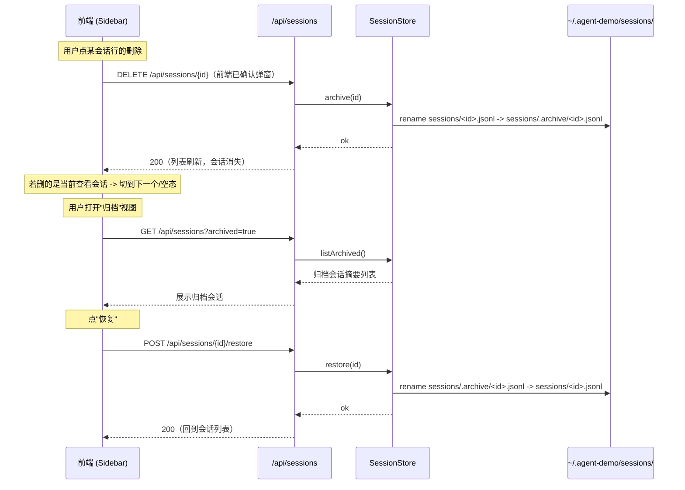

# 设计：历史会话折叠与删除（add-session-management）

## 背景

侧栏已有会话列表（`add-session-switch`）：`GET /api/sessions` 返回
`SessionSummaryDto{id,title,preview,workspace}`，`Sidebar` 渲染每个会话"标题+预览"。
本次为「折叠」+「软删除/归档」+「恢复」。

## 数据流

## 组件改动

### agent-core

1. `SessionStore.archive(Path sessionsDir, String id)`
   - 校验 id 非空/不越界（仅 `[A-Za-z0-9_-]`，防空字符与会话穿越）。
   - `sessions/<id>.jsonl` 存在 → `Files.move` 到 `sessions/.archive/<id>.jsonl`（创建 `.archive` 目录）。
   - 不存在 → 返回 false / 抛 SessionNotFound。
   - 目标已存在 → 覆盖或 409（建议覆盖旧归档，幂等归档）。
2. `SessionStore.restore(Path sessionsDir, String id)`：反向 rename（`.archive` → `sessions`）。
3. `SessionStore.listArchived(Path sessionsDir)`：扫 `sessions/.archive/*.jsonl` 返回 id 列表。
4. `SessionStore.listSessions`（已有）：默认只扫 `sessions/*.jsonl`（`.archive` 天然排除）。

### agent-web

5. `WebAgentRuntime`：新增 `archiveSession(id)` / `restoreSession(id)` / `archivedIds()`
   （调 `SessionStore`），并清理对应 `sessionHistories`/`sessionRecorders` 内存缓存（删除时）。
6. `SessionController`：
   - `DELETE /api/sessions/{id}` → `archive`，`200` 或无会话 `404`。
   - `POST /api/sessions/{id}/restore` → `restore`，`200`/`404`。
   - `GET /api/sessions?archived=true` → `listArchived` 摘要（复用 title/preview 推导）。
   - `list()` 保持只列未归档（默认）。
7. `SessionSummaryDto` 增加 `time`（最后活动时间戳，供前端显示相对时间），复用 `workspace`。

### 前端（对齐参考侧栏）

8. **「⊕ 新会话」按钮移到侧栏顶部**（从 TopBar 挪过来，占满一行）。
9. **每工作区默认展示最近 5 个会话**，其余收进"展开其余 N 个会话"；点击切换展开/收起全部。
10. **会话行为紧凑单行**：小图标 + 标题 + 相对时间（`7分钟 / 1小时 / 1天`），选中态高亮；行尾悬浮删除按钮。
11. 归档视图：侧栏顶部或菜单加「归档」入口，列出已归档会话 + 每个"恢复"按钮（`?archived=true`）。
12. 折叠/展开状态 `localStorage` 持久化（记录每工作区是否已展开全部）。

## 边界与取舍

- **软删除只动 JSONL 文件**：不碰结构化日志目录（`sessions/<id>/`）与内存里的其他状态，避免误删日志。
- **内存缓存清理**：删除会话时要从 `sessionHistories` / `sessionRecorders` 移除对应实例，防止恢复后读取到旧内存状态。
- **恢复语义**：幂等（恢复到已存在亦视为 ok）；恢复后由前端重新拉 `GET /api/sessions`。
- **路径安全**：所有 id 先做白名单校验（文件系统后端按 id 拼接路径，需防 `../`）。
- **相对时间基准**：用 `session.jsonl` 的 mtime（=最后活动），免去解析最后一条消息。
