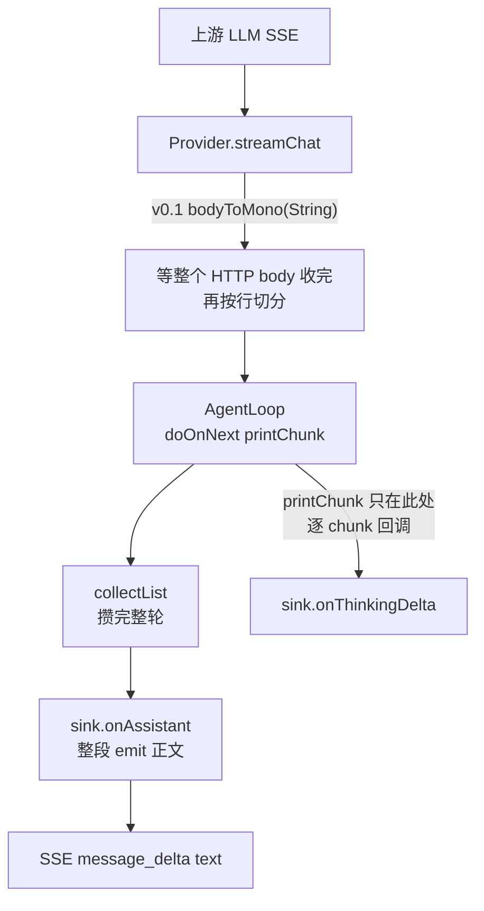

## Context

agent-demo v0.1 的「SSE 流式」实测是**假流式**。三处嫌疑点里只有一处是真瓶颈，另外两处经实测证伪。



两条独立的「假流式」成因：

1. **HTTP 层**：`bodyToMono(String.class)` 必须等上游整个响应结束才返回，TTFT 等于总响应时长。实测：上游延迟 800ms 时首 emit 在 837ms。
2. **编排层**：`SseSessionLogSink` 只在 `onAssistant`（即 `collectList()` 之后）整段 emit 正文，所以即使 HTTP 层逐 chunk 到达，前端看到的正文也是一次性出现。

## Goals / Non-Goals

**Goals：**

- HTTP 层真流式：边收边解析、边 emit，首 token 小于 300ms。
- 跨 TCP 帧的 SSE 行正确重组（一个 `data:` 行可能被切成两个 `DataBuffer`）。
- 正文逐 token 透传到 SSE，且不与整段兜底重复推送。
- 多流并发不串台。

**Non-Goals：**

- 不换 WebSocket，不改 SSE 协议契约（事件类型与字段不变）。
- 不动前端。
- 不改 sink 模式与 `.block()`（理由见 D2 / D3）。

## Decisions

### D1：`bodyToMono` 改 `bodyToFlux(DataBuffer)` 加行重组（采纳）

**理由**：`bodyToMono` 会等待响应体结束，无法产生 TTFT。`bodyToFlux(DataBuffer.class)` 每收到一段 TCP 数据就下发。

**实现要点**：

- 行边界由 `SseLineBuffer.lines(Flux<DataBuffer>) -> Flux<String>` 维护：累积未闭合的行，遇到换行才吐完整行；源结束时补吐残留半行。
- 必须用 `concatMap` 而不是 `flatMap`：行缓冲是有状态的，并发处理会让后到的 buffer 先写入，拼出错行。
- 行缓冲状态放在 `Flux.defer` 里，保证每个订阅独立。
- **整行（含 `data: ` 前缀）交给 `parseSseLine`**——它自己会剥前缀并处理 `[DONE]` 与空行。调用方再剥一次会导致它认不出该行而全部返回 empty（本次调试踩过的坑）。

```java
client.post()
    .uri(chatEndpoint())
    .contentType(MediaType.APPLICATION_JSON)
    .bodyValue(body)
    .retrieve()
    .bodyToFlux(DataBuffer.class)
    .transform(SseLineBuffer::lines)
    .filter(line -> line.startsWith("data: "))
    .map(mapper::parseSseLine)
    .filter(Optional::isPresent)
    .map(Optional::get)
    .onErrorResume(WebClientResponseException.class, /* 包成 [HTTP xxx] {body} */);
```

### D2：`replay().all()` 改 `unicast().onBackpressureBuffer()`（**否决**）

原判断是「replay 让新订阅者立即收到全部历史，所以前端看到一坨」。实测不成立：

- `onThinkingDelta` 就是通过**同一个** replay sink 逐 token 到达前端的（`printChunk` 在 `collectList()` 之前被 `doOnNext` 逐 chunk 调用），thinking 折叠区的实时输出即为反证。
- replay 只影响**订阅发生在 emit 之后**的场景，正常时序（POST /send 返回 streamId 后立即 GET /stream）订阅早于首次 emit。
- replay 是 spec §resume / Last-Event-ID 重连的实现基础，改成 unicast 会破坏该语义（unicast 只允许一个订阅者，且订阅者取消后无法再接）。

**结论**：保留 `replay().all()`。前端「一坨出来」的真正原因在 D4。

### D3：`.block()` 改 `.subscribe()`（**否决**）

原判断是「`.block()` 阻塞导致 TTFT 高」。实测不成立：`.block(Duration)` 阻塞的是 `Executors.newCachedThreadPool()` 里的一个 executor 线程，HTTP handler 线程早已返回；SSE emit 发生在 Netty 事件循环线程上，与是否 block 无关。

`processTurn` 返回的 `Mono` 由 IO 事件驱动，`.subscribe()` 之后控制流仍在同一线程继续，收益仅为每个活动流少占一个线程。属独立的资源优化，不在本 change 范围（可另开 change 评估）。

### D4：正文逐 token 透传且不重复（采纳）

`SessionLogSink` 增加 `default void onTextDelta(String text) {}`；`SseSessionLogSink` 实现为立即 emit `MessageDelta("text", text)`。

**去重**：`SseSessionLogSink` 维护 `AtomicBoolean textStreamed`。`onTextDelta` 置位并立即 emit；`onAssistant` 用 `getAndSet(false)` 读取并清零——已推过增量就不整段重发（否则前端把同一段正文渲染两遍），整轮没增量才兜底发全文（兼容非流式 provider）。每轮 `onAssistant` 都会清零，因此逐轮判重独立。

### D5：`AgentLoop.printChunk` 正文转发 sink（采纳）

```java
if (chunk instanceof StreamChunk.TextDelta t) {
    printer.onTextDelta(t.text());   // 保留 stdout
    sink.onTextDelta(t.text());      // 新增：走 SSE 透传
}
```

与既有的 `onThinkingDelta` 转发对称。

### D6：`CompositeSessionLogSink` 补转发增量回调（采纳，附带修复）

web 路径在有落盘录制器时返回的是复合 sink。此前 `CompositeSessionLogSink` 未覆盖 `onThinkingDelta`，被接口默认实现吞掉，导致 thinking 增量在正常 web 路径下**根本到不了 SSE**。本 change 一并补上 `onThinkingDelta` 与 `onTextDelta` 的转发。

### D7：测试策略

- `SseLineBufferTest`：合成 `DataBuffer`，覆盖跨帧拼行、逐字符滴灌、残留半行、订阅隔离。
- `OpenAiCompatibleProviderE2ETest`：WireMock `withChunkedDribbleDelay` 造真实分段响应，断言 TTFT 小于 300ms 且首 emit 早于整体完成 200ms 以上。
  - 原用例用 `withFixedDelay(800)` 是**测不出**的：该 stub 把整个响应体延迟 800ms 才发，真流式也只能等到 800ms。
- `ChatStreamServiceStreamingTest`：订阅真实 `ChatStreamService` 的 SSE，断言正文增量逐条到达、无整段重发、无增量时兜底、判重逐轮重置。
- `ChatStreamServiceConcurrencyTest`：4 条流同时跑，各自只收到自身增量。

## Risks / Trade-offs

### R1：正文去重依赖 `onTextDelta` 先于 `onAssistant`

调用顺序由 `AgentLoop` 保证（`doOnNext` 在 `collectList()` 之前）。若未来有 sink 打乱该顺序，`onAssistant` 的兜底会把全文再发一次。缓解：`ChatStreamServiceStreamingTest` 的重复用例会红。

### R2：`DataBuffer` 需要释放

`bodyToFlux(DataBuffer.class)` 下 buffer 由本算子负责归还。`SseLineBuffer` 在读取后立即 `DataBufferUtils.release`，并对非池化 buffer 是空操作，不会重复释放。

### R3：`responseTimeout` 语义随真流式改变

Reactor Netty 的 `responseTimeout` 是「两次读之间的最大间隔」（`ReadTimeoutHandler`），即读空闲超时。v0.1 下它近似整体响应上限（因为 `bodyToMono` 期间没有数据读）；改成 `bodyToFlux` 后，只要上游持续吐字，长回答不会被 60s 误杀，反过来上游静默超过 60s 即判连接僵死——语义更正确。

## Migration Plan

无破坏性变更：SSE 事件类型与字段不变，前端零改动。回滚为单 commit revert（恢复 `bodyToMono` 与 `onAssistant` 整段 emit 即回到 v0.1 行为）。

## Open Questions

无。
