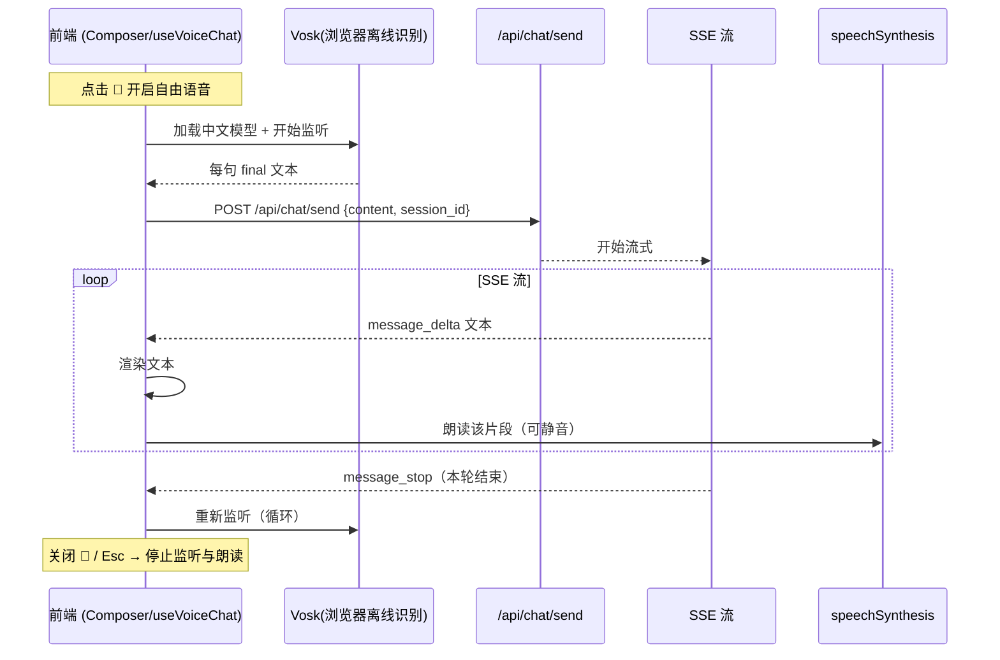

# 设计：语音输入与播放及自由语音对话（add-voice-interaction）

## 背景

agent-demo 前端为 React (Vite) + WebFlux(SSE)。对话链路：前端文本 → `POST /api/chat/send` →
SSE 流（`message_delta`/`message_stop`）→ 渲染。语音在链路两端加"听"（STT）与"说"（TTS），
不改 LLM（DeepSeek 纯文本）。选浏览器离线方案（Vosk + speechSynthesis），零后端改动、免费、国内可用。

## 数据流（自由语音对话）

## 组件改动（前端）

1. **`lib/vosk.ts`**：封装 Vosk 加载与识别。
   - `loadModel(url)`：从 `static/` 或运行时 CDN 加载中文模型，返回 Promise；显示加载状态。
   - `createRecognizer`：创建识别器，`onresult(interim/final)` 回调。
   - 麦克风授权被拒 → 抛可提示的错误。
2. **`lib/stt.ts`**：高层 STT 接口，`start(cb)` / `stop()`；内部用 Vosk，仅在需要时加载模型。
3. **`lib/voice.ts` / `useVoiceChat`**：自由语音循环 hook。
   - 状态机：`idle` → `listening` → (final) → `sending` → `reading` → `listening` …。
   - 每句 final 通过 `ChatApi.send({content, session_id})` 提交（复用当前会话）；`session_id` 来自
     ChatPanel 的 `sessionIdRef`/`currentSessionId`。
   - 读取 SSE 片段并用 `speechSynthesis` 朗读（`speechSynthesis.cancel()` 可打断/静音）。
   - `start()`/`stop()`：`🎤` 开关切换；`Esc` 停止。
4. **`Composer`**：输入框加 `🎤`（自由语音开关）与 `🔊`（朗读静音）按钮；展示 Vosk 加载/监听状态。
5. **静态资源**：Vosk 中文模型 `vosk-model-small-cn` 作为 `static/vosk-model/`，或运行时从一个可配置
   URL/CDN 加载（推荐避免把 ~40MB 进 git/jar）。

## 边界与取舍

- **模型加载**：推荐运行时从 CDN 加载（git/jar 不含 40MB）；首次开语音有加载耗时，前端显示进度/占位。
- **每句 final 提交**：SpeechRecognition/Vosk 的 final 结果即提交，响应快；可能把长句拆成多条，属可接受。
- **朗读**：只读助手文本，不读用户语音转写；`🔊` 静音用 `speechSynthesis.cancel()`。
- **前端无状态冲突**：语音模式下仍走现有 `/api/chat/send` 与会话选择，不改后端；打字在语音循环时仍可手动发送。
- **降级**：Vosk 模型加载失败 / 麦克风拒绝 / 浏览器不支持 → 提示并回退到纯文本。