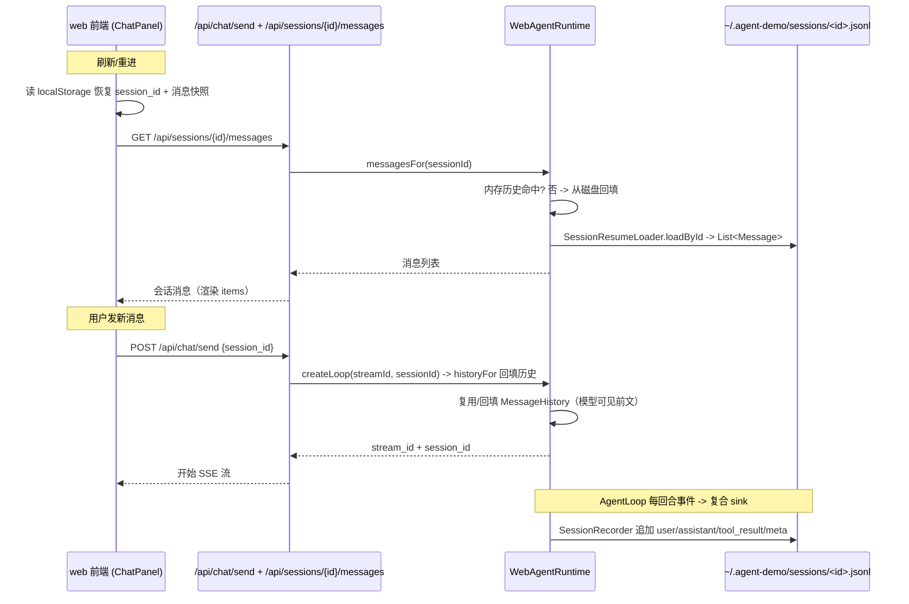

# 设计：Web 会话重进恢复（add-web-session-restore）

## 背景

LLM 对话的"记忆"= 能送给模型的上下文（消息历史 `MessageHistory`）。CLI 已把每条会话持久化到
`~/.agent-demo/sessions/<id>.jsonl`（`SessionStore` append-only），并支持 `/resume`。web 目前只在
服务端内存缓存历史，重启即失。

参考 DeepSeek Harness 的模型：
- 会话是**事件日志**，持久化在磁盘（真相源）。
- 客户端持久化"当前会话 id"（浏览器 localStorage）。
- （重）连接 / 打开会话时，从磁盘日志**回填**历史到模型上下文，并渲染到界面。

## 目标原则

- web 与 CLI 复用同一份 `SessionStore` / `SessionRecorder` 格式，共用 `~/.agent-demo/sessions/<id>.jsonl`。
- 只在客户端提供了已知 `session_id` 时才回填；否则全新会话（向后兼容）。
- 写盘失败不阻断对话（降级为不落盘）。

## 数据流（重进恢复）

## 组件改动

### agent-core

1. `SessionStore.loadById(Path sessionsDir, String sessionId)`
   - 读 `sessions/<sessionId>.jsonl` 反序列化为 `List<SessionEntry>`；不存在/异常返回空 list。
   - 抽取公共 `readEntries(Path)` 复用 `loadLatest`。
2. `SessionResumeLoader.loadById(Path sessionsDir, String sessionId)`
   - 复用 `loadById` 的 `SessionStore` + 抽取的 `toMessages(List<SessionEntry>)`；缺失时返回空。
   - `load(sessionsDir)`（最近的）改为复用 `toMessages`。
3. `CompositeSessionLogSink`（`SessionLogSink` 复合实现）
   - 持有有序 `List<SessionLogSink>`，逐回调转发；空列表时等同 NOOP。

### agent-web

4. `WebAgentRuntime`
   - `historyFor(sessionId)`：已缓存则返回；否则用 `SessionResumeLoader.loadById` 回填成
     `MessageHistory`（超限时 `SessionResumeLoader.snip`）。
   - 新增 `recorderFor(sessionId)`：按会话懒创建 `SessionRecorder`（`SessionLogger` + `SessionStore`
     绑 `sessions/<id>.jsonl`），缓存复用；失败降级为 null。
   - 新增 `sinkFor(sessionId, SessionLogSink sse)`：`new CompositeSessionLogSink(sse, recorderFor(sessionId))`。
   - `messagesFor(sessionId)`：返回内存历史（若活动）或磁盘回填；供 history 端点用。
5. `ChatStreamService.create`：用 `runtime.sinkFor(sessionId, sseSink)` 作为 agent loop 的 sink（SSE + 落盘）。
6. history 端点 `GET /api/sessions/{sessionId}/messages`：
   - 返回 `{session_id, messages:[{role,content,toolCalls?,toolCallId?,isError?}]}`。
   - 404 当无此会话。

### 前端

7. `ChatPanel`
   - `session_id` 与渲染的消息快照写入 localStorage（key 前缀 `agent-demo.web.`）。
   - 挂载时若 localStorage 有 `session_id`：恢复 ref + items，并 `api.history(session_id)` 用服务端最新历史
     刷新（服务端重启后也能拿到）。
   - `/clear` 清空 localStorage 对应 key。

## 边界与取舍

- 回填只能重建"用户/助手/工具"消息，无法还原流式中间态（delta、thinking 时序）——渲染为稳定消息。
- 同一 `session_id` 并发多 tab 写盘：`SessionStore` 单写者 + append-only，多 turn 顺序追加。
- `SessionStore` 异步写盘（flush 间隔 200ms）：history 端点读磁盘可能落后瞬间；活动会话优先读内存历史。
