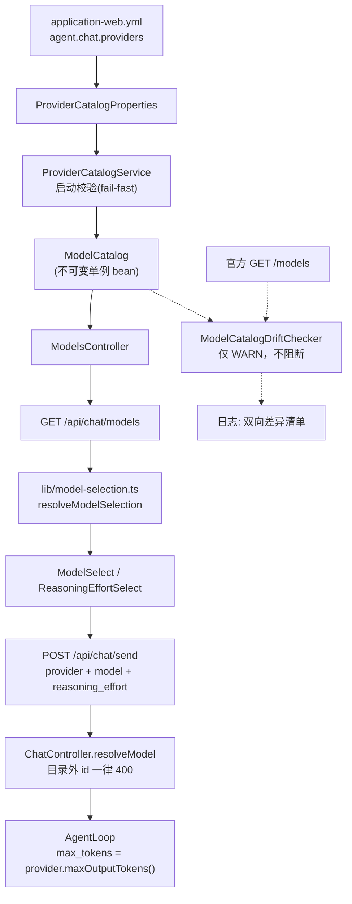

# align-model-catalog — 技术设计

## 1. 真源与数据流

模型信息的真源仍是**项目内的静态基线** `application-web.yml`（`agent.chat.providers`），
官方 `GET /models` **只用于启动期自检告警**，不参与运行时决策。



**为什么不用官方 `/models` 当运行时真源**：上游 `/models` 不保证可用性（离线 / 限流 /
企业代理会挡），一旦当运行时真源，拉不到就等于服务不可用；且它只给 id / 上下文 / 输出上限 /
模态 / 档位，**不给显示名以外的目录语义**，也无法表达本项目将来要加的能力标记。静态基线 +
启动自检是「可控 + 能发现漂移」的组合。

## 2. 目标目录数据（2026-09-23 实测官方响应）

```yaml
agent:
  chat:
    providers:
      - id: deepseek
        name: DeepSeek
        models:
          - id: deepseek-flash
            name: DeepSeek-V4.1-Flash
            supports-reasoning: true
            default-reasoning-effort: high
            reasoning-efforts:
              - { id: low, name: Low }
              - { id: high, name: High }
              - { id: max, name: Max }
          - id: deepseek-v4-pro
            name: DeepSeek-V4-Pro
            supports-reasoning: true
            default-reasoning-effort: high
            reasoning-efforts:
              - { id: low, name: Low }
              - { id: high, name: High }
              - { id: max, name: Max }
    default-provider: deepseek
    default-model: deepseek-flash
```

`default-model` 取 `deepseek-flash`：官方两个模型能力同档，flash 是官方列表首项、也是
`DeepSeek-V4.1-Flash` 这一世代的通用默认；`deepseek-v4-pro` 留给用户显式选择。

## 3. 决策

### D1 只修数据与常量，不动选择器结构

前端两层菜单（provider → model）与档位下拉已经存在并消费 `GET /api/chat/models` 的
`providers[]`。漂移发生在**数据**，不在控件结构，因此不重写 UI，只改数据与默认值。

### D2 新增 `default-reasoning-effort` 字段

官方 `/models` 给出 `effort.default_level = high`，而项目当前没有任何「默认档位」概念：
`ModelSelect.pickModel` 换模型时取 `model.reasoningEfforts[0].id`。若沿用该逻辑，档位列表
是 `[low, high, max]` 时会默认成 `low`，与官方默认 `high` 不符。

因此给 `ModelEntry` 加第 5 个字段 `defaultReasoningEffort`（yaml: `default-reasoning-effort`）：

- 消费点 1：`ModelSelect.pickModel` 换模型时优先用 `defaultReasoningEffort`，缺失才退回
  `reasoningEfforts[0].id`
- 消费点 2：`lib/model-selection.ts` 的 `resolveModelSelection` 历史选择无效时用
  `defaultReasoningEffort` 兜底，而不是 `reasoningEfforts[0].id`
- 校验：非空时必须是本模型 `reasoning-efforts` 中的某个 id

> 这与「不改前端」不冲突：改的是它读的一个字段与两处兜底表达式，控件结构不变。

### D3 校验分两类，处置不同

用户确认的「仅 WARN，不阻断」针对的是**上游漂移**。本地配置内部自相矛盾仍按项目既有的
Fail-Closed 风格 fail-fast——两者性质不同：

| 校验 | 触发条件 | 处置 |
|---|---|---|
| 本地配置自洽（既有 + 本次扩展） | `supports-reasoning=false` 但档位非空；档位 id 为空；`default-reasoning-effort` 不在档位内；`default-provider` / `default-model` 匹配不到 | **fail-fast**（`IllegalStateException`，启动失败） |
| 上游漂移（本次新增） | 官方 `/models` 的 id 集合或档位与本地目录不一致 | **仅 WARN**，打印双向差异后继续启动 |
| 上游不可达（本次新增） | 无 API key、超时、非 2xx、解析失败 | **静默跳过**（DEBUG 日志），不告警不阻断 |

理由：本地配置写错了，启动即失败能立刻暴露且修复成本极低；上游漂移是**外部世界变了**，
把启动卡死等于把「上游抖动」升级成「本地服务不可用」。

### D4 上下文 / 输出上限与每轮 `max_tokens`

`ContextCompressor` 的阈值为：

$$
threshold = contextWindow - maxOutputTokens - autoCompactBuffer
$$

它读的是 `LlmProvider.contextWindow()` / `maxOutputTokens()`，因此**只改
`DeepSeekProvider` 的两个常量即可**，压缩阈值自动重新基准。

`AgentLoop.DEFAULT_MAX_TOKENS = 8192` 是每轮 `ChatRequest.maxTokens` 的唯一来源，
改为读注入的 `provider.maxOutputTokens()`：

- 好处：常量只留一份（在 provider 里），换 provider / 换模型自动跟随
- 不再有 `AgentLoop` 里的 8192 这个「第二真源」
- 风险：每轮声明 384K 输出上限。若上游对超限 `max_tokens` 返回 400，则**所有请求失败**，
  因此 tasks 里把「真实 API 冒烟」列为完成前置

`AgentConfig.Provider.maxOutputTokens`（默认 8192）**不改**：它只被
`WebSearchProviderFactory` 用来限制搜索总结长度，与对话每轮 `max_tokens` 无关；把它抬到
384K 只会让每次搜索总结无限膨胀。

### D5 旧名彻底删除，测试夹具例外

用户选择「彻底删旧名」。删除范围限定为**生产代码里作为真源出现的旧名**：

| 位置 | 处置 |
|---|---|
| `application-web.yml` 的三个旧条目 | 删除（被 2 个官方 id 取代） |
| `AgentConfig.defaults().provider().model()` | `deepseek-v4-flash` → `deepseek-flash` |
| `AgentLoop.DEFAULT_MODEL` | 同上 |
| `SlashCommand.MODEL_ALIASES` | **整表删除**：`chat → deepseek-chat`、`reasoning → deepseek-reasoner` 两个目标 id 官方都不存在，保留别名等于保留死链。`/model chat` 改为报「未知模型 + 列出可用模型」 |
| `SlashCommand` 的 supported-models 列表 | 换成两个官方 id |
| `SlashCommand.SUPPORTED_EFFORTS` | `low/medium/high` → `low/high/max` |
| `DeepSeekVoiceCorrectionService.DEFAULT_MODEL` | `deepseek-v4-flash` → `deepseek-flash` |
| `DeepSeekWebSearchProvider.DEFAULT_MODEL` | 同上 |
| `ChatCommand` 帮助文本 | 同步 |
| 注释 / javadoc 中作为「真实模型」引用的旧名 | 同步 |

**明确不做**：测试夹具里用 `deepseek-chat` 之类字符串当**不透明占位符**的约 200 处
（`AgentLoopToolReplayTest`、`MemoryRetrieverTest`、`SlashCommandTest` 等）不逐个改名。
它们是任意字符串参数，不构成真源，全量重命名只会制造巨大 diff 与无谓回归风险。
**但**凡是断言「目录内容 / 默认模型 / 档位 / 别名解析结果」的测试必须改。

### D6 删别名的兼容性影响

`/model chat` / `/model reasoning` 是 v0.1 文档化的别名。删除后用户敲这两个词会得到错误提示。
选择删除而非重定向的理由：`reasoning` 这个语义在新目录里**没有对应物**（两个模型都支持
reasoning），把 `reasoning` 硬指向 `deepseek-v4-pro` 是在发明一个官方没有的语义。
错误提示会列出两个合法 id，用户一步即可改对。

## 4. 漂移自检实现

新增 `agent-web/.../api/catalog/ModelCatalogDriftChecker.java`：

- `java.net.http.HttpClient`（JDK 17 内置，与 `WecomClient` 同法；**不引入新依赖**）
- 触发点：`ApplicationReadyEvent`（此时 catalog 已加载、key 已解析）
- 配置：`agent.chat.drift-check.enabled`（默认 `true`）、`.base-url`（默认
  `https://api.deepseek.com`）、`.timeout-ms`（默认 `3000`）
- key 来源与 `WebRuntimeConfig` 同一优先级链：`DEEPSEEK_API_KEY` →
  `agent.provider.api-key` → `~/.agent-demo/config.yaml` 的 `provider.apiKey`
- 比对内容：本地 `ModelCatalog.modelIds()` 与上游 `data[].id` 的**双向差集**；以及每个共有
  模型的档位 id 集合
- 输出：一条 WARN，含「本地有官方无」「官方有本地无」「档位不一致」三段
- 可测性：包级构造器注入 `HttpClient` + `baseUrl`（`WecomClient` 同款），测试用 WireMock
  起假上游

**启动耗时代价**：最坏情况阻塞 `timeout-ms`（默认 3s）。取 3s 而非 30s 正是因为这是
「锦上添花」的检查；`enabled: false` 可整体关闭。

**不缓存、不持久化**：每次启动重新拉。理由是不引入状态文件，也就没有「快照过期」这个新
漂移源。

## 5. 边界与失败模式

| 场景 | 期望行为 |
|---|---|
| 无 API key | 跳过自检，DEBUG 一行，正常启动 |
| 上游 401 / 403 | 跳过自检，DEBUG（不 WARN——key 失效由 `HealthController` 负责报） |
| 上游 5xx / 超时 / DNS 失败 | 跳过自检，DEBUG，正常启动 |
| 上游返回非法 JSON | 跳过自检，WARN 一行（说明结构变了） |
| 上游 id 集合与本地不同 | WARN 列差异，**正常启动** |
| 本地配置自相矛盾 | fail-fast，启动失败 |
| 请求带旧 id（`deepseek-reasoner`） | 400 + `available_models` 列表（既有逻辑） |
| 前端 localStorage 存旧 id | `resolveModelSelection` 规整到 `defaultModel` |

## 6. 与项目铁律的一致性

- JDK 17 + Spring Boot 3.2：只用 `java.net.http.HttpClient` 与现有 Jackson，无新依赖
- 无 Lombok：`ModelEntry` 保持 record，新增字段仍是 record 组件
- Fail-Closed：目录外模型仍 400；本地配置错误仍启动失败
- 日志：WARN 走既有 logback；不在 stdout 打印目录内容
- 隔离：不需要沙箱 / 会话存储 / 网络写操作；自检是纯 GET
