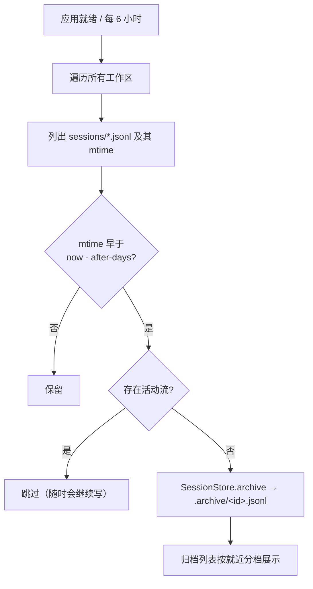

## Context

## Goals / Non-Goals

**Goals：**

- 超过保留期未活动的会话自动归档，无需人工干预。
- 保留期、开关、调度间隔可配置。
- 归档列表按「上周 / 本月 / 更早」分档归类。
- 不误伤正在进行的会话；归档仍可恢复。

**Non-Goals：**

- 不做**删除**（自动删除不可逆，风险远高于收益；归档已是软删除）。
- 不改归档文件布局（仍在扁平 `.archive/`，避免迁移既有归档与改动恢复/读取路径）。
- 不做跨工作区聚合视图（各工作区独立归档，保持现有语义）。

## Decisions

### D1：保留期按**最后活动时间**（文件 mtime）判定

**理由**：会话文件的 mtime 就是最后一条记录写入时间，即"最后活动"。用创建时间判定会把"昨天刚聊过但创建于三周前"的活跃会话误归档，与"超过一周没动"的用户直觉不符。

### D2：调度放在 agent-web，不放进 agent-core

**理由**：agent-core 是被 CLI 与 web 共用的内核，不应绑定时钟/调度框架；CLI 是短生命周期进程，也不需要后台定时。web 是长驻服务，且已有 `WebApplication` 作为装配点。

**调度实现**：`@EnableScheduling` + `@Scheduled(fixedDelayString = "${agent.session.auto-archive.interval-ms:21600000}")`，另在 `ApplicationReadyEvent` 上跑一次（否则刚启动的 6 小时内不整理，用户看不到效果）。用 `fixedDelay` 而非 `fixedRate`：整理是低频 IO，串行更安全。

### D3：跳过"存在活动流"的会话

**理由**：正在对话的会话 mtime 本来就会很新，通常不会被判定为过期；但边界情况（用户开着页面放置超过 7 天）下，若在其流仍活着时把文件移走，后续写入会落到旧路径或报错。因此显式跳过，判据由 `ChatStreamService` 提供。

### D4：分档用**相对天数**而非自然周/月

**理由**：归档阈值是"7 天"。若分档用自然周/自然月，会出现"10 天前的会话（落在上个月）与半年前的会话同档"的断裂。相对天数与阈值同源、边界连续：

| 档 | 区间（距今） |
|----|------|
| `recent` | < 7 天 |
| `last_week` | 7–14 天 |
| `within_month` | 14–30 天 |
| `earlier` | ≥ 30 天 |

**为什么多出 `recent` 档**：手动归档随时可发生（用户刚聊完就归档）。若不设该档，这类会话只能塞进 `last_week`，显示"上周"却明明是今天，语义错误。

### D5：分档在**后端**计算并随列表返回

**理由**：分档是与归档策略同源的产品语义，"7 天阈值"与"7–14 天档"必须一致。放在后端可用 Java 单测锁定边界（含时区/跨年），前端只负责按字段分组渲染，避免两处各写一套阈值而漂移。

### D6：`SessionAutoArchiver` 接收 `nowMillis` 而非自己取系统时间

**理由**：可测试性。保留期判定是全功能的正确性核心，必须能在测试里精确构造"7 天前 / 8 天前"的边界，不能依赖真实时钟。

## Risks / Trade-offs

### R1：刚启动就跑一次会把"很久没打开的会话"一次性搬走

[Accepted] 这正是期望行为；日志会记录扫描数与归档 id 列表，便于核对。用户仍可在归档视图逐个恢复。

### R2：多工作区并发扫描

[Accepted] 遍历串行执行；单工作区失败只记日志、继续下一个。整理是低频操作，不需要并行。

### R3：文件系统 mtime 精度与时钟漂移

[Accepted] 判定用 `now - afterDays*24h` 与 mtime 比较，边界用例在测试里用固定 `nowMillis` 覆盖；真实环境的分钟级漂移对"7 天"无影响。

### R4：`fixedDelayString` 在配置缺失时的行为

[Accepted] 用 `${...:默认值}` 形式，缺配置时回落默认；`enabled=false` 时整个方法直接返回，不产生调度副作用。

## Migration Plan

1. 加 agent-core 的归档器与分档（含单测）。
2. 加 agent-web 的调度服务、配置默认值与 `bucket` 字段。
3. 前端归档视图按档分组。
4. 验证：`mvn -o -pl agent-core,agent-web verify` + 前端 vitest；手工确认启动即整理且正在进行的会话未被搬走。

回滚：单 commit revert（已归档的文件不会自动恢复原位，需手动恢复或 `git`-外的手工移动——文档中注明）。

## Open Questions

无。
