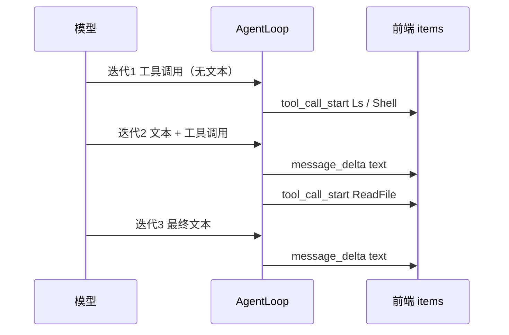

## Context

一次助手回合由多次模型迭代组成，每次迭代的到达顺序是：该迭代的文本增量 → 该迭代的 `tool_call_start` → `tool_call_end`。SSE 层顺序正确（`AgentLoop.printChunk` 实时转发文本，`SseSessionLogSink.onAssistant` 再发工具开始）。

问题只出在前端把「文本」和「工具」合并进同一个 item 后，渲染顺序被固定成 `text` 在 `tools` 之前。

## Goals / Non-Goals

**Goals：**

- 工具卡出现在其调用发生的**时间线位置**，不再全部堆到底部。
- 刷新会话后与实时渲染结果一致（不重复、不出现字面量 `tool` 名称）。
- 视觉（卡片样式、状态文案）保持不变。

**Non-Goals：**

- 不改卡片视觉与交互（用户明确选择"只改排序，视觉不动"）。
- 不改后端事件顺序与协议。
- 不引入 parts 时间线的大重构（用「何时新建 item」这一最小手段达成同样效果）。

## Decisions

### D1：以「最后一条 assistant 文本项是否已挂载工具」作为新建 item 的判据

**理由**：不改数据结构就能恢复时间线。规则是——追加文本/思考时，若目标 item 已有工具，则**新建** item。

推演一遍（一次 4 迭代的回合）：

| 事件 | 结果 |
|------|------|
| iter1 `tool_call_start Ls` | 无 assistant 文本项 → 新建 A1{text:"", tools:[Ls]} |
| iter1 `tool_call_start Shell` | 追加到 A1.tools |
| iter2 `message_delta "让我看看"` | A1 有工具 → **新建 A2{text:"让我看看"}** |
| iter2 `tool_call_start ReadFile` | 追加到 A2.tools（渲染：文本在上、卡在下，正是该迭代的真实顺序）|
| iter3 `tool_call_start Ls` | 追加到 A2.tools？→ **否**：iter3 无文本，工具应落在 A2 之后 |

第三行与第五行暴露一个细节：**判据要落在"追加工具"这一侧，而不是只在追加文本时**。若 iter3 无文本而直接来工具，工具会被追加到 A2（上一迭代的 item），视觉上提前。因此新增工具时同样需要判断：**最后一条 assistant item 是否已经"收尾"过（即其后已经出现过别的事件）**。

**采用的最小实现**：`addToolToLastAssistant` 只在「最后一个 item 就是 assistant 文本项」时追加，否则新建——即工具只追加到**当前最新**的 assistant item。配合"文本遇到带工具的 item 就新建"，两个方向都对齐时间线。

**考虑过**：引入 `parts: Part[]` 时间线模型。否决（本次）：能更彻底地表达交错，但要改 `MessageBubble` 渲染与多个既有测试；当前需求（内联位置正确）用最小手段即可满足，视觉也保持不变。

### D2：历史重建按 `toolCallId` 合并，而不是各出一张卡

**理由**：服务端历史里工具结果以独立 `role: "tool"` 消息存在，但界面上同一次调用只应有一张卡。按 id 合并到对应 assistant item 的内联工具，避免重复卡与字面量 `tool` 名称；匹配不到的（孤儿结果，例如历史被裁剪）才退化为独立卡。

### D3：`thinking` 与 `text` 用同一判据

**理由**：推理模型在一次迭代里先流 thinking 再流 text，二者应落在同一个 item（thinking 渲染在文本上方）。用同一条「目标 item 已有工具就新建」规则即可自然满足。

## Risks / Trade-offs

### R1：一次迭代内「文本 → 工具 → 文本」无法表达

[Accepted] 当前模型下，同一迭代若模型先文本、后工具、再文本，后段文本会新建 item 落到工具卡之后——与真实顺序（工具卡在中间）有偏差。实际模型极少在一次响应里这样交错（工具调用通常在全段文本之后），可接受；若将来需要精确表达，再上 D1 里被否决的 parts 模型。

### R2：历史重建的合并依赖 id 一致

[Accepted] 服务端已在 `MessageHistory.appendToolResults` 用真实 `tool_call_id` 覆盖占位 id（见既有的 `stampCallId` 设计），因此 id 可匹配。

## Migration Plan

纯前端渲染顺序调整，无数据迁移、无接口变更。回滚为单 commit revert。

## Open Questions

无。
