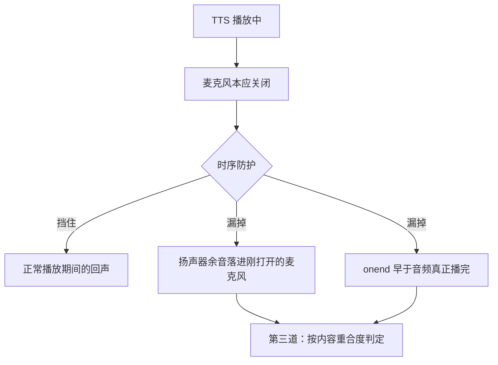

## Context

回声有三层来源，只做时序防护不够：



用户实测的漏网样本（Vosk 对回声的转写，残缺且错字）：

```text
再正常不过了一段时间凶手升级说稿费的那接下来想干干线杀水解了解些要过上和也一说
```

其中「再正常不过了」「那接下来想干」正是助手前一条回复里的原文。

## Goals / Non-Goals

**Goals：**

- 前端改动**确实生效**（构建产物是最容易被忽略的一环）。
- 语速明显更快。
- 回声在"时序挡不住"的情况下也能被识别丢弃。
- 不误杀用户真实输入的短句。

**Non-Goals：**

- 不改 TTS 引擎（保持浏览器 `speechSynthesis`）。
- 不做声学回声消除（AEC）——浏览器已开 `echoCancellation`，但效果有限，且不是我们能调的。
- 不恢复"语音打断助手"能力（与消除自激冲突，见 R3）。

## Decisions

### D1：按**字符重合率**判定回声，而不是整句相等

**理由**：语音识别对回声的转写是残缺、错字的（见 Context 的真实样本），整句比对必然失败。改判「识别结果里的实义字符有多少比例出现在我们刚朗读过的文本中」：样本中的烂字（"凶手升级说稿费""干线杀水解"）不在朗读文本里，但整体重合率仍能过阈值。

**实现**：归一化（去空白/标点/符号）→ 对朗读文本建字符计数（多重集合，避免重复字被高估）→ 统计命中比例 → ≥ 0.6 判为回声。

**阈值取舍**：0.6 偏保守（宁可漏判也不误杀）。实测样本与真实用户语句（"帮我把昨天那个日志文件清一下"）在 0.6 下都能正确分类，已用单测锁定。

### D2：回看窗口 10 秒

**理由**：回声只可能发生在"刚说完"之后。窗口太短会漏掉长句播完后的余音，太长会让"用户隔了一会儿复述助手的话"被误杀。10 秒覆盖一个自然停顿。

### D3：语速 1.5 + 聚合阈值提到 24/120

**理由**：用户明确反馈"依然很慢"。慢有两个来源——`rate` 与**合成间的停顿**。后者常被忽略：每个 utterance 之间浏览器有可感知空隙，`MIN=12` 会把一句话切成好几段。提到 24（约半句）后段数显著减少。rate 取 1.5（浏览器允许 0.1–10，中文音色在 1.5 仍自然）。

### D4：静音余量 400ms → 700ms

**理由**：用户反馈 400ms 仍能听到回声。余量要覆盖扬声器物理余音 + `onend` 与音频真正播完的时间差，长句时后者可达数百毫秒。

### D5：把"前端改动需重新构建"写进 README

**理由**：本次最大的成本不是写代码，而是**不知道改动没生效**——排查方向被完全带偏（先是怀疑时序防护不够，又怀疑阈值）。`static/` 是构建产物这一点必须显式写在验证/构建章节里。

## Risks / Trade-offs

### R1：重合率误杀用户真实输入

[Mitigation] 0.6 阈值 + 最少 6 个实义字符 + 只回看 10 秒；短句（"好的""嗯"）不参与判定。误杀的代价是"这一句被忽略"，用户再说一次即可，远轻于回声造成的自激循环。

### R2：回声样本千变万化

[Accepted] 非声学 AEC，不可能 100%。三重防护（时序 / 播放状态 / 内容重合）叠加后，实测样本已能被拦下；若仍漏，下一步是降低阈值或引入"说话人相似度"（成本高，暂不做）。

### R3：朗读期间麦克风关闭 ⇒ 无法语音打断

[Accepted] 与消除自激直接冲突。需要打断时点停止按钮。

### R4：浏览器缓存导致"新代码没生效"再次发生

[Mitigation] 资源带内容 hash，`index.html` 用 NetworkFirst；新 bundle 会以新 URL 被 SW 重新 precache。README 说明 + 提供标记串自查方法（在被服务的 bundle 里搜 `waitUntilIdle` 等）。

## Migration Plan

1. 改代码 + 补测试。
2. `npm run build` 重建 `static/`，同步 `target/classes`。
3. 验证：新 bundle 含全部标记；`index.html` 指向新 hash；SW precache 含新 bundle。
4. 用户侧：重启应用 + 硬刷新浏览器。

回滚：单 commit revert + 重建产物。

## Open Questions

无。
