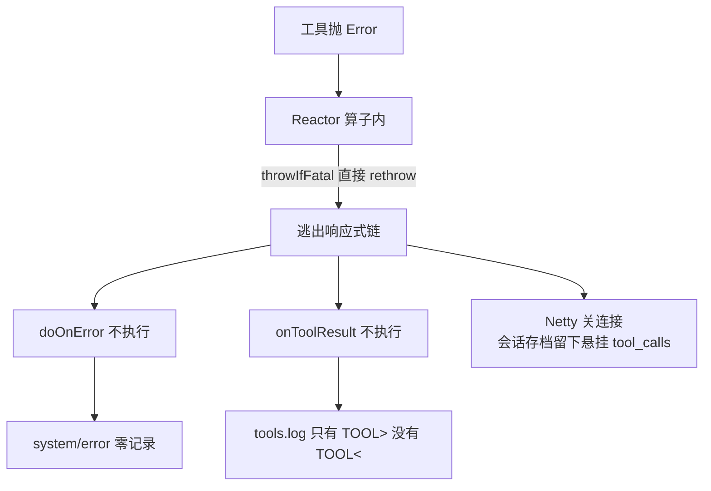

## Context

可观测性本身是有的（`SessionLogSink` 11 个回调、per-session 的 `chat.log` / `tools.log` / `thinking.log` / `session.jsonl`、`system/error` 通道、`/api/logs*` 查看接口）。问题不在"缺埋点"，而在**接线位置**与**路径一致性**：

## Goals / Non-Goals

**Goals：**

- 任何工具/回合失败都留下**可检索**的记录（含关联 id），且不依赖会被绕过的接缝。
- 工具调用必须有始有终。
- 日志写与读同一个目录，位置稳定。
- 一条命令查出不完整会话。

**Non-Goals：**

- 不引入外部可观测性栈（OpenTelemetry / metrics server 等）。
- 不改 SSE 协议、不改前端。
- 不做日志聚合/远程上报。

## Decisions

### D1：报错边界必须在 Reactor **之外**

**理由**：`Exceptions.throwIfFatal` 会把 `LinkageError` 原样 rethrow，意味着**所有** Reactor 错误算子（`doOnError` / `onErrorResume` / `onErrorMap`）对这类失败都不可见。任何挂在算子上的上报都必然漏。唯一可靠的位置是**订阅者那一侧**——`ChatStreamService.start` 的 executor 任务、CLI REPL 的 turn 循环，那里 `catch (Throwable)` 拿得到。

**实现**：新增 `com.example.agent.core.Throwables.reraiseIfJvmFatal(Throwable)`——`VirtualMachineError` / `ThreadDeath` 原样抛出，其余（含 `LinkageError`）交给调用方降级上报。两个边界都用它。

**考虑过**：给 Reactor 装 `Hooks.onOperatorError`。否决：hook 无法阻止 `throwIfFatal` 的 rethrow，语义不匹配，且是全局副作用。

### D2：工具调用收口由 turn 边界负责，而不是靠工具自身

**理由**：`Error` 可能在 `tool.execute` 返回的 Mono 内部抛出（那时已在我们交给 Reactor 的代码之外），从工具侧无法保证收口。改为**记录在途集合 + 在边界统一收口**：`executeOne` 开始执行时把 `toolCallId` 放入 `pendingToolCalls`，产生结果时移除；`closePendingToolCalls(reason)` 对残留项补 `sink.onToolResult(err)`。

这样一次操作同时达成三件事：`tools.log` 闭合（`TOOL<` 由 `onToolResult` 产生）、history 不再留悬挂 `tool_calls`、日志里出现一行明确的 ERROR。

`closePendingToolCalls` 幂等，且被多处调用：`processTurn` 的 `doOnError` / `doFinally`，以及外部边界（`ChatStreamService` 的 catch 分支）。

### D3：日志根统一到 `~/.agent-demo/logs`

**理由**：`InitCommand` 已经创建 `~/.agent-demo/{memory,sessions,cache,logs}`，`LogController` 也读这里——**写入方是唯一的异类**。实测 `~/.agent-demo/logs/app.log` 停在 9/2，而真实日志跑到了三个随 CWD 变化的地方，`/api/logs*` 等于长期读空。

统一后：位置稳定、CLI 与 Web 同源、查看接口真正可用。

**考虑过**：给日志根加环境变量覆盖。否决（本次）：增加配置面但解决不了不一致；如将来需要，在 `AgentConfig` 里加 `logging.dir` 显式配置即可。

### D4：测试日志隔离用 `logback-test.xml`

**理由**：测试没有单独配置就回落主配置，把单测的堆栈写进运行时 `app.log`（实测 78 行 junit 噪音），真实故障证据被淹。`logback-test.xml` 走 `target/test-logs/`，且 `target/` 本就被忽略。

### D5：诊断入口做成纯函数 + HTTP 端点

**理由**：把本次手写 PowerShell 的排查逻辑固化成 `SessionDiagnostics.scan(sessionsDir)`（纯函数，好测），再由 `GET /api/diagnostics` 暴露。CLI 侧将来可复用同一函数加 `/diag` 命令。

**复用**：配对扫描逻辑与 `ToolCallPairing` 同源，抽出 `ToolCallPairing.danglingCallIds(messages)` 供两边共用，避免两套判定漂移。

## Risks / Trade-offs

### R1：日志根变更会让"老日志"留在旧目录

[Accepted] 旧目录（`${user.dir}/logs`、`agent-core/logs`、`agent-web/logs`）不再写入，历史内容保留在原地供人工查阅。文档里写明新位置。

### R2：`catch (Throwable)` 可能掩盖环境性故障

[Accepted] 与 `harden-tool-error-boundary` 同一取舍：`LinkageError` 降级会让"环境坏了"表现为"某个工具坏了"。缓解：降级时 ERROR 日志带完整堆栈 + 明确写"类加载/链接失败"，运维信号由日志承担。

### R3：`/api/diagnostics` 需要扫描全部会话文件

[Accepted] 会话数量级很小（本机 40+），单次扫描毫秒级。将来若变多可加缓存或限制条数。

## Migration Plan

1. 统一日志根（4 处配置 + 文档）。
2. 加测试日志隔离配置。
3. 加报错边界与工具收口。
4. 加诊断入口。
5. 验证：`mvn -o -pl agent-core,agent-web verify` + 前端 vitest；手动确认新日志落在 `~/.agent-demo/logs`。

回滚：单 commit revert。

## Open Questions

无。
