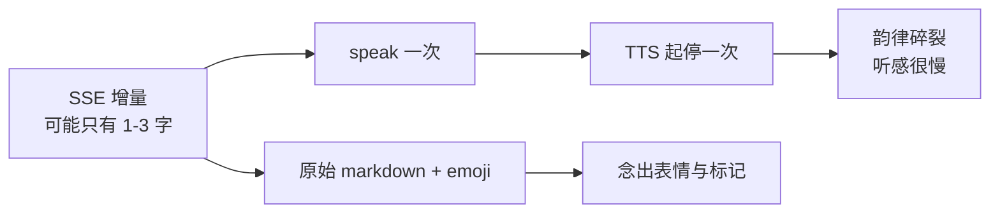

## Context

自由语音的朗读链路是「SSE 文本增量 → `useVoiceChat.onAssistantDelta` → `voice.speak` → `speechSynthesis`」。当前 `speak` 是一次增量一次调用：

```ts
const u = new SpeechSynthesisUtterance(text); // text 可能只有几个字甚至一个字
u.lang = "zh-CN";
synth.speak(u);
```



## Goals / Non-Goals

**Goals：**

- 朗读听感连贯：按完整句子朗读，而不是按流式增量。
- 不念 emoji、markdown 标记、代码、URL、表格符号。
- 语速与音色可控，优先中文音色。
- 本轮结束后不丢尾巴。

**Non-Goals：**

- 不引入云端 TTS（保持浏览器 `speechSynthesis`，离线可用、零成本）。
- 不改 STT（语音输入）侧。
- 不做"只念结论、跳过过程叙述"的语义筛选（用户本次未选）。

## Decisions

### D1：句子缓冲放在 `voice.ts` 内，而不是 `useVoiceChat`

**理由**：`VoiceReader` 是朗读能力的边界（`speak` / `cancel` / `muted` / `setMuted`）。把「增量 → 句子」的聚合收在朗读器内部，调用方仍然是"给一段文本"，`useVoiceChat` 与 `ChatPanel` 无需理解分句；测试也能直接对朗读器断言。

### D2：清洗在**分句之前**做，且句子边界只用清洗后的文本判断

**理由**：markdown 里含有大量标点（`。` 出现在代码注释、URL 里的 `.` 等）。先清洗再分句可避免"在代码块中途断句"与"把 URL 当句子念"。清洗后统一空白（把换行折叠为句末边界）。

### D3：分句规则 = 句末标点 或 长度上限

**理由**：只按标点分句会让长段落里没有标点的句子（模型偶尔会有一长串）憋很久；加一个长度上限（约 60 字）保证及时开口。反过来，过短的片段（如"好的。"）不必单独起停，可与后续合并到上限内。

实现：按句末标点切分，累加时若超过上限就立即产出，否则等下一个标点或 `flush()`。

### D4：`flush()` 显式暴露，由 `onTurnEnd` 调用

**理由**：流式结束后缓冲里通常还剩最后半句（模型最后一段可能没有句末标点）。不 flush 就会漏念最后一句——比"慢"更糟。是否 flush 是调用方的语义（一轮结束），故不作为 `speak` 的隐式行为。

### D5：音色选择与语速

**理由**：`speechSynthesis.getVoices()` 在部分浏览器首次调用返回空、需要等 `voiceschanged`；因此选择逻辑要"能选就选、选不到就用默认"，不能阻塞朗读。语速默认略快（1.1）以缓解听感拖沓，作为常量便于调整。

## Risks / Trade-offs

### R1：清洗可能误删有意义的符号

[Accepted] 例如数学表达式里的 `*`、路径里的反斜杠。取舍是"朗读是辅助，宁可少念也不要念噪音"；界面上的原文不受影响（只影响朗读输入）。

### R2：分句引入延迟（要等到句末才开口）

[Accepted] 用长度上限兜底（约 60 字），最坏延迟约一句的长度；相比逐字起停带来的整体拖慢，听感明显更好。

### R3：`getVoices()` 时序差异

[Accepted] 音色只在可选时选用；`voiceschanged` 后再 `speak` 仍会走同一条选择逻辑，不做额外等待。

## Migration Plan

纯前端行为调整，无数据/接口变更。回滚为单 commit revert。

## Open Questions

无。
