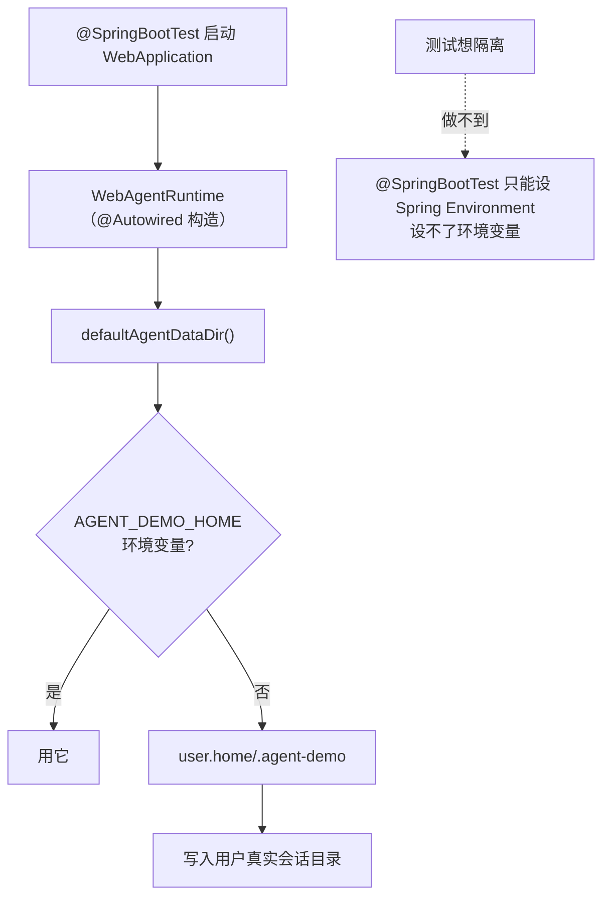

## Context

测试与运行时共用同一个数据目录解析，导致集成测试把**真实会话**写进用户的历史：

## Goals / Non-Goals

**Goals：**

- 让测试**有能力**把数据目录指向临时位置。
- 保持既有 `AGENT_DEMO_HOME` 语义不变（不破坏现有部署）。
- 数据目录与配置文件解析同源。

**Non-Goals：**

- 不改默认数据目录位置（仍是 `~/.agent-demo`）。
- 不引入新的配置框架（不把数据目录搬进 `AgentConfig`）。

## Decisions

### D1：新增系统属性 `agent.demo.home`，优先级高于环境变量

**理由**：`@SpringBootTest(properties = …)` 只能写 Spring 的 `Environment`，**无法设置环境变量**；而 `System.setProperty` 在测试类初始化时可用。把它排在环境变量之前，使测试能压过任何环境配置。

**考虑过**：把数据目录做成 Spring 配置项（`@Value`）注入。否决：`WebAgentRuntime` 的 `@Autowired` 构造器已是既有点，改成配置注入要动 bean 装配与多处调用点；系统属性改动最小且与既有的环境变量支持同构。

**考虑过**：测试里改用可注入构造器（`new WebAgentRuntime(provider, tools, estimator, tmpDir, cfg)`）。否决：`@SpringBootTest` 装配的是 `@Autowired` 那个 bean，测试拿不到替换入口。

### D2：`config.yaml` 也从解析结果出发

**理由**：此前 config 恒取 `user.home/.agent-demo/config.yaml`，与数据目录解析**不同源**。一旦数据目录被覆盖，测试仍会读到用户**真实配置**（其中可能含真实 API key 与本地路径），隔离就不彻底。改为 `<数据目录>/config.yaml`。

**兼容性**：默认路径不变（`user.home` 未被覆盖时结果相同）。

### D3：测试在**类初始化**时设置属性，而不是 `@BeforeAll`

**理由**：属性必须在 **Spring 上下文创建之前**生效。`@BeforeAll` 由 `SpringExtension` 调度，而上下文创建也挂在同一扩展上，顺序依赖脆弱；`static {}` 块在类初始化时执行，确有保障（测试实例构造先于上下文准备）。

## Risks / Trade-offs

### R1：属性残留影响同 JVM 内其它测试

[Accepted] 属性只在测试类初始化时设置，且值指向 `target/test-data`；即便泄漏，也只是把后续测试的数据也导向临时目录——比写进用户真实目录安全。另有 `WebAgentRuntimeDataDirTest` 用 `@AfterEach` 恢复属性，避免自身污染其它用例。

### R2：`AGENT_DEMO_HOME` 的语义容易被误解

[Accepted] 它表示「用户主目录」而非「数据目录本身」（其下会拼 `.agent-demo`）。新属性沿用同一语义以保持一致，并在 Javadoc 里写明。

### R3：已产生的污染需要一次性清理

[已处理] 清理 173 个测试会话（live 60 + archive 113），保留 23 个真实会话；被删对象导出为 CSV 供审计。判据见全局规则 §10：内容指纹（`hi`/`go`/`你是谁`/空白）优先，辅助规模特征（< 2 KB）。

## Migration Plan

1. 加系统属性解析 + 同源 config 路径。
2. 两个集成测试加 `static {}` 隔离。
3. 补单测锁定优先级与回退。
4. 验证：跑这两个集成测试，断言真实数据目录的会话数不变、产物落在 `target/test-data`。
5. 清理既有污染（已完成）。

回滚：单 commit revert（清理掉的测试会话无法恢复，但无价值）。

## Open Questions

无。
