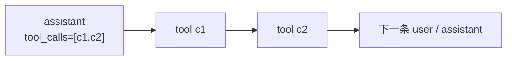

## Context

会话历史有两个方向的配对不变式，两者都必须成立：

- 正向：`assistant.tool_calls` 的**每一个** id，都必须在其后、下一条非 tool 消息之前，有对应的 `tool` 消息。
- 反向：任何 `tool` 消息都必须有前置的 `assistant.tool_calls` 包含它的 id。

`SessionResumeLoader.injectOrphanSkeletons` 已处理反向；正向缺处理，导致一旦某轮在「assistant 已落盘、tool_result 未落盘」之间被打断，该存档就永久不可用。

## Goals / Non-Goals

**Goals：**

- 恢复历史时自愈：悬挂的 `assistant.tool_calls` 自动补合成错误结果。
- 同一进程内也自愈：请求前不留空洞。
- 幂等、非破坏：正常历史零改动；存档文件不被改写。

**Non-Goals：**

- 不修复「为什么会中断」的上游原因（`LinkageError` 逃逸已由 `harden-tool-error-boundary` 单独修）。
- 不改 SSE 协议、不改前端。
- 不做存档文件的离线批量修复脚本（自愈已覆盖；文件保持 append-only）。

## Decisions

### D1：补合成 `tool_result`，而不是删掉悬挂的 `assistant`

**理由**：删掉 assistant 会让模型「忘记」自己刚决定要做什么，且会让后续历史失去因果；补一条明确的错误结果，既满足协议，又如实告诉模型「这个工具调用没完成」，它会自行换策略重试。这与正向孤儿注入（`injectOrphanSkeletons` 补合成 assistant）在思路上对称。

### D2：插在「既有结果之后、下一条非 tool 消息之前」

**理由**：DeepSeek 要求 `tool` 消息**紧邻**其 `assistant.tool_calls`。若插到后面（比如追加到历史末尾），中间的 user 消息会打断配对关系，依然 400。多个调用只回答了一部分时，也要按 `tool_calls` 的顺序补齐剩余 id。

### D3：放在 `core` 包并被 `session` 复用

**理由**：`SessionResumeLoader`（`session` 包）本来就 import `com.example.agent.core.Message`，依赖方向已是 `session → core`；`AgentLoop` 也在 `core`。放 `core` 不引入新的反向依赖。

### D4：同时在请求前调用

**理由**：只修恢复路径的话，**同一进程内**某轮被打断后，下一轮仍会 400（历史在内存里就带着空洞），必须等重启才恢复。在 `AgentLoop.toRequest` 里对将要发送的消息列表调用一次（幂等、只作用于请求副本），可让进程内也自愈。

## Risks / Trade-offs

### R1：合成结果可能掩盖上游缺陷

[Accepted] 补的是 `isError=true` 且文案明确写「未完成 / 历史修复」，不会伪装成成功；同时 `log.warn` 记录补齐了几个 id，运维侧仍可见。相比「整个会话永久不可用」，这是明显更优的降级。

### R2：请求副本与内存历史不一致

[Accepted] `toRequest` 里补的结果只作用于本次请求的消息列表，内存与存档仍是原样。因为修复是幂等的纯函数，每轮补出来的内容完全一致，模型看到的历史稳定。

### R3：合成 `tool_result` 的 content 会进 token 计数

[Accepted] 文案刻意短（一行），成本可忽略。

## Migration Plan

无破坏性变更；既有污染存档在下次恢复时自动可用，无需人工介入。

回滚：单 commit revert（回滚后旧存档重新变为不可用）。

## Open Questions

无。
