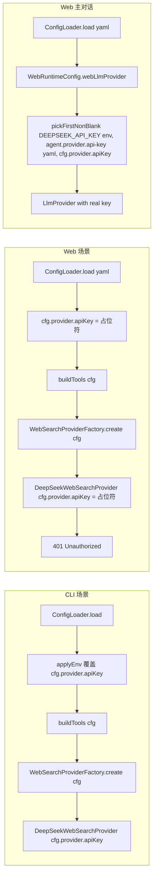
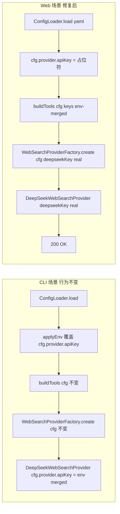

# Design: fix-websearch-key-priority

## 1. 当前架构（问题）



## 2. 修复后架构



## 3. 接口设计

### 3.1 `WebSearchProviderFactory` 新增重载

```java
public static WebSearchProvider create(AgentConfig cfg);                              // CLI 不变
public static WebSearchProvider create(
    AgentConfig cfg,
    String deepseekApiKey,                                                            // null → 用 cfg.provider().apiKey()
    String tavilyApiKey,                                                              // null → 用 System.getenv(TAVILY_API_KEY)
    String deepseekBaseUrl                                                            // null → 用 System.getenv(DEEPSEEK_SEARCH_BASE_URL)
);
```

兼容性：原 `create(cfg)` 重载内部委托 `create(cfg, null, null, null)`，CLI 行为字节级一致。

### 3.2 `AgentLoopFactory.buildTools` 新增重载

```java
public static ToolRegistry buildTools(AgentConfig cfg);                              // CLI 不变
public static ToolRegistry buildTools(
    AgentConfig cfg,
    String deepseekApiKey,
    String tavilyApiKey,
    String deepseekBaseUrl
);
```

兼容性：原 `buildTools(cfg)` 重载内部委托 `buildTools(cfg, null, null, null)`。

### 3.3 `WebRuntimeConfig.webToolRegistry()` 改造

```java
@Bean
public ToolRegistry webToolRegistry() {
    String deepseekKey = pickFirstNonBlank(
        env.getProperty("DEEPSEEK_API_KEY"),
        env.getProperty("agent.provider.api-key"),
        cfg.provider().apiKey());
    String tavilyKey = env.getProperty("TAVILY_API_KEY");      // 可空
    String baseUrl = env.getProperty("DEEPSEEK_SEARCH_BASE_URL"); // 可空
    return AgentLoopFactory.buildTools(cfg, deepseekKey, tavilyKey, baseUrl);
}
```

## 4. 线程与作用域

- 重载方法都是纯 static，与原方法同一线程模型
- WebRuntimeConfig 是 `@Configuration` 单例 bean；webLlmProvider 与 webToolRegistry 共享 `pickFirstNonBlank` 逻辑
- 不引入新依赖

## 5. 测试覆盖

| 用例 | 描述 |
|------|------|
| TC-1 | CLI 场景 create(cfg) 重载走 cfg.provider().apiKey()（行为不变） |
| TC-2 | CLI 场景 create(cfg, "explicit") 优先用 explicit key（不读 cfg） |
| TC-3 | Web 场景 buildTools(cfg, "web-key") 把 web-key 传给 DeepSeekWebSearchProvider |
| TC-4 | Web 场景 buildTools(cfg, null, null, "https://...") 把 baseUrl 传给 provider |
| TC-5 | AgentLoopFactory.buildTools(cfg, keys) 返回的 ToolRegistry 包含 web_search tool |

测试 mock 不发真实 HTTP：stub `LlmProvider` 思路不适用（web_search provider 用真实 WebClient）；改测：构造工厂参数，断言 provider 类的 instanceOf 和构造参数（用反射读 provider 的 apiKey 字段）。

但实际上当前 `DeepSeekWebSearchProvider.apiKey` 是 `private final`。需要改 package-private 或加 getter 给测试用，**或** 测试只断言返回类型（DeepSeekWebSearchProvider / TavilyWebSearchProvider），key 是否正确由端到端验证（保留为已知限制，与 add-web-search-tool 时一致）。