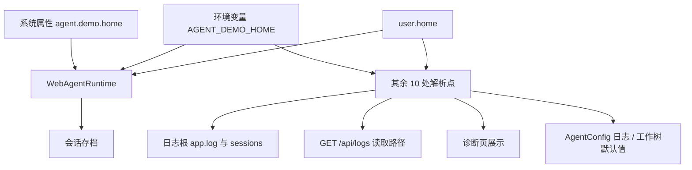

# fix-agent-home-isolation — 技术设计

## 1. 根因

「agent home 在哪」被 11 处独立实现，覆盖链还各不相同。唯一的测试隔离开关只被其中一处认。



只有 `war` 认 `sysprop`，所以测试里设置它只能隔离会话存档；`logs` / `apilogs` / `diag` / `cfgdef` 全部继续指向真实 `~/.agent-demo`。

## 2. 决策

### D1 单一解析入口 `AgentPaths`

```java
public final class AgentPaths {
    public static final String HOME_PROPERTY = "agent.demo.home";   // 与旧常量同值
    public static final String HOME_ENV = "AGENT_DEMO_HOME";
    public static Path agentHome();     // → <override>/.agent-demo
    public static String logsDir();     // → <agentHome>/logs
    public static String sessionsDir(); // → <agentHome>/sessions
    public static String worktreesDir();// → <agentHome>/worktrees
}
```

优先级：系统属性 → 环境变量 → `user.home`；空白串一律视为未设置（与 `WebAgentRuntimeDataDirTest` 既有断言一致）。

不选「让每个调用点各自补一个系统属性判断」：那只是把同一个分叉再复制 10 份，下次加一处数据目录照样会漏。

### D2 `logback.xml` 走同一属性

```xml
<property name="AGENT_LOGS_DIR" value="${agent.demo.home:-${user.home}/.agent-demo}/logs"/>
```

logback 的 `${name:-default}` 会先查 logback 上下文、再查系统属性、最后环境变量，因此测试里 `System.setProperty("agent.demo.home", "target/test-home")` 能让 app.log 落到隔离目录。

**这一点必须实测确认**：嵌套的 `${user.home}` 默认值是否被递归求值，取决于 logback 版本行为，不能靠猜。若实测不成立，改为在 surefire 里同时显式设一个 `agent.logs.dir` 属性并让 logback 直接读它。

### D3 测试 JVM 默认隔离（surefire）

```xml
<systemPropertyVariables>
  <agent.demo.home>${project.build.directory}/test-home</agent.demo.home>
</systemPropertyVariables>
```

理由：现在有 3 个测试各自记得设这个属性，其余测试不设就写真实目录——把正确性寄托在「每个新测试作者都记得」，必然重演。设为默认后，忘记反而是安全的。

副作用检查：`WebAgentRuntimeDataDirTest` 会 `System.clearProperty` 后断言回落到 `user.home/.agent-demo`——clearProperty 仍然有效，不受 surefire 默认值影响。

### D4 `AgentPaths` 与旧常量并存

`WebAgentRuntime.AGENT_DEMO_HOME_PROPERTY` 保持不变（值为 `agent.demo.home`），内部改为委托 `AgentPaths`，避免改动既有测试的引用。

## 3. 改造点清单

| # | 位置 | 现状 | 改为 |
|:--:|------|------|------|
| 1 | `WebAgentRuntime.resolveDataDir()` | 自带三元链 | 委托 `AgentPaths.agentHome()` |
| 2 | `AgentConfig.defaults()` 的 `Logging.dir` | `user.home + "/.agent-demo/logs/"` | `AgentPaths.logsDir()` |
| 3 | `AgentConfig.defaults()` 的 `Worktree.baseDir` | `user.home + "/.agent-demo/worktrees"` | `AgentPaths.worktreesDir()` |
| 4 | `AgentLoopFactory:112` / `:166`（userHome 解析） | env → user.home | `AgentPaths` |
| 5 | `AgentLoopFactory:366`（logs 缺省） | user.home | `AgentPaths.logsDir()` |
| 6 | `ChatCommand:142` / `:292` / `:327` | env / user.home | `AgentPaths` |
| 7 | `InitCommand:96` | env → user.home | `AgentPaths` |
| 8 | `SettingsFile:43` | env → user.home | `AgentPaths` |
| 9 | `SettingsConfig:44` | user.home | `AgentPaths` |
| 10 | `WecomBeans:32` | user.home | `AgentPaths` |
| 11 | `LogController:69` | user.home + logs | `AgentPaths.logsDir()` |
| 12 | `DiagnosticsController:43` | user.home | `AgentPaths` |
| 13 | `SkillsPlugin:69` | env → user.home | `AgentPaths` |
| 14 | `logback.xml:8,11` | `${user.home}/.agent-demo/logs` | `${agent.demo.home:-${user.home}/.agent-demo}/logs` |

## 4. 风险

| 风险 | 说明 | 处置 |
|------|------|------|
| 默认行为改变 | 若某处原本忽略 env，改后 env 生效会是行为变化 | 未设属性/env 时结果与现在完全一致；env 生效属修正（其本意就是覆盖） |
| surefire 默认值影响面 | 所有测试的 agent 路径被重定向 | 先只改 agent-core/agent-web 两模块；跑全量门禁验证；`WebAgentRuntimeDataDirTest` 已在副作用检查清单内 |
| logback 嵌套默认值不生效 | 见 D2 | 实测确认，不成立则回退到显式 `agent.logs.dir` 属性 |
| 真实遗留目录 | 用户真实 `~/.agent-demo/logs/sessions/` 下已有历史测试垃圾 | 不在代码范围；本次报告里给出清单与判据，由用户决定 |

## 5. Open Questions

1. `SettingsConfig` / `WecomBeans` / `DiagnosticsController` 是否**应当**跟随 `agent.demo.home`？从语义看应当（它们读的都是 agent 数据）。若其中某个的语义其实是「用户的真实家目录」（如 `HomePathGuard` 的沙箱边界就是 `user.home`），则**不应**改。`DiagnosticsController:43` 需逐一确认后再动——它可能是在展示「用户家目录」而非「agent 数据目录」。
