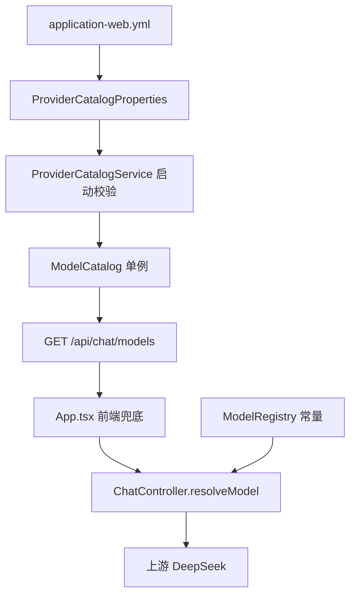

# fix-stale-model-fallback — 技术设计

## 1. 根因定位

不是「某个常量写错了」，而是**同一件事有两个真源**。`/api/chat/models` 的列表来自 yaml `agent.chat.providers`（经 `ProviderCatalogService` 构造 `ModelCatalog` 单例），而 `ChatController.resolveModel` 的校验读的是另一个 key `agent.chat.supported-models`（`ModelRegistry.DEFAULT_MODELS` 字符串常量）。



`fe` 与 `cc` 各自独立产生「兜底模型」：前者硬编码 `deepseek-chat`，后者把校验不过的值**再兜回同一个** `deepseek-chat`。两个非法值首尾相接，最终原样送给上游。

`agent.chat.supported-models` 在 `application-web.yml` 里**已经不存在**（只剩一行注释说它由 System property 兜底），也就是说这个 key 实际上是死的，`ModelRegistry` 只会返回自己的常量。

## 2. 决策

### D1 单一真源：`ModelCatalog`

服务端校验与前端列表都读 `ModelCatalog`。删除 `ModelRegistry`（它的存在本身就是第二个真源），`agent.chat.supported-models` 不再被任何代码读取。

不选「让 `ModelRegistry` 也读 yaml」：那需要它自己绑定 `agent.chat.providers` 嵌套结构，等于把 `ProviderCatalogProperties` 的职责复制一份，仍是两个真源。

### D2 非法模型 fail-closed（400）

区分两种「没有可用模型」：

| 输入 | 语义 | 处置 |
|------|------|------|
| `null` / 空白 | 调用方未指定 | 用 `defaultModel` |
| 命中目录 | 合法 | 原样透传，`SendResponse.model` 回显 |
| 非空且未命中 | **调用方发错了** | `400 invalid_model`，附 `requested` 与合法 `supported` 列表，**不创建流** |

不选「静默兜回默认值 + WARN」：静默降级正是本 bug 潜伏至今的原因——前端发错模型没有任何人会发现。项目 §3 已定「Fail-Closed 默认」。

### D3 默认值必须在目录内（启动期 fail-fast）

`ProviderCatalogService.init()` 除了原有的 `supportsReasoning` / effort 校验外，新增两条：

- `defaultProvider` 必须能在目录中匹配到某个 provider；
- `defaultModel` 必须能在目录中匹配到某个 model。

**为什么这条是必需的**：本次修复把兜底值从常量改成 `defaultModel`。如果不校验，`default-model` 配错就等于**把同一个 bug 从 `ChatController` 搬到 `ProviderCatalogService`**——兜底值本身非法，仍然会被送给上游。`ProviderCatalogService` 的类注释早就写了「`defaultProvider` 与 `defaultModel` 必须能匹配到 `ModelCatalog`」，但代码里从来没检查过，这里补上。

### D4 前端零硬编码：响应带 `defaultModel`

`GET /api/chat/models` 顶层新增 `defaultProvider` / `defaultModel`（驼峰，与既有 `supportsReasoning` / `reasoningEfforts` 一致）。

不选「前端取 `models[0].id`」：语义上「列表第一个」不等于「配置的默认值」，且依赖 yaml 的书写顺序——换个顺序默认值就变了。

前端 `App.tsx` 的四处硬编码统一改为：

```text
savedModel 初值 = ""（空字符串 = 由服务端默认值决定）
fallbackModel  = resp.defaultModel || resp.models[0]?.id || ""
finalModel     = 目录命中 savedModel ? savedModel : fallbackModel
```

`""` 发给服务端时命中「未指定」分支 → 走 `defaultModel`。这样即使 `/api/chat/models` 请求失败（`.catch` 分支），前端也不会发出任何非法 id。

### D5 微信通道同源

`WecomMessageDispatcher.DEFAULT_MODEL` 常量（第 6 处硬编码）改为注入 `ProviderCatalogProperties`，用 `defaultModel()`。微信通道没有「用户指定模型」的概念，只走默认值。

### D6 成功回合补日志

`ChatStreamService.start` 在 `processTurn().block()` 正常返回后补一条 INFO：

```text
turn completed stream={} session={} workspace={} model={}
```

与既有的失败路径 `turn failed stream={} session={} workspace={} model={} error={}` 字段一一对称。**动机**：本次排查中「前端显示什么 vs 实际请求什么」无法靠日志对照，因为成功回合不落 model，只能靠浏览器抓包。补上后这类分歧可直接查日志定死。

## 3. 接口签名变更

| 位置 | 变更 |
|------|------|
| `ModelCatalog` | 新增 `Optional<ModelEntry> modelById(String)`、`List<String> modelIds()` |
| `ProviderCatalogService.validate` | 签名加 `defaultProvider` / `defaultModel` 入参 + 两条新校验 |
| `ChatController` 构造器 | `(ChatStreamService, Environment)` → `(ChatStreamService, Environment, ModelCatalog, ProviderCatalogProperties)` |
| `ChatController.resolveModel` | 由「永不失败、返回兜底」改为「可返回 400」 |
| `ModelsResponse` | record 加 `defaultProvider` / `defaultModel` 两个组件 |
| `ModelsController` | 构造器加 `ProviderCatalogProperties` |
| `WecomMessageDispatcher` 构造器 | 加 `ProviderCatalogProperties` |
| `ChatStreamService.start` | 无签名变更，仅加日志 |
| `ModelRegistry` | **删除** |

## 4. 边界与不做的事

- **不做** CLI 路径的同类残留（`AgentLoop.DEFAULT_MODEL`、`AgentConfig.defaults()`、`SlashCommand` 列表）。用户明确选择不带 CLI，避免回归面扩大到 `agent-core`。
- **不做** `AgentLoop` 层的 `model == null → DEFAULT_MODEL` 兜底改造。修复后 web 路径的 `model` 永不为 `null`，该分支在 web 路径不可达。
- `AgentConfig.defaults()` 里 provider 默认模型仍是 `deepseek-chat`，属 CLI 配置默认值，本次不动。

## 5. 风险

| 风险 | 说明 | 处置 |
|------|------|------|
| 破坏性变更 | 非法 `model` 由 200 变 400 | 前端已同步；本地 `localStorage` 的历史 `deepseek-chat` 由目录校验覆盖；`localStorage` 读不到时走空串 → 服务端默认值 |
| 与并行 change 重叠 | `add-provider-catalog-abstract` 同时改 `ChatController` 与 `ChatStreamService` | 按 §2.7.5.1 门禁 4，合并前先并入其分支并重跑门禁 |
| 别人的测试断言冲突 | 该 change 工作区下 `ChatControllerProviderInferenceTest` 第 7 例断言「非法 model 静默兜回 deepseek-chat」，与本 change 直接矛盾 | 见 Open Questions |
| jacoco 门禁 | 新增 `modelById` / `modelIds` / 两个 400 分支需测试覆盖 | 每个分支各有对应用例 |

## 6. Open Questions

1. **`ChatControllerProviderInferenceTest` 第 7 例**（并行 change 的未跟踪文件）断言 `invalidModelFallsBackToDeepSeekChatThenInfersDeepSeek`，即在 mock `agent.chat.supported-models=deepseek-chat` 下断言非法 model 被兜回。本 change 下该断言必然要反转成「非法 model → 400」，属**语义变更**而非参数适配，合并时需用户确认由谁改、怎么改。
2. 该 change 的 tasks.md 3.3 计划让 `ProviderCatalogService` 兼容旧 key `agent.chat.supported-models`。本 change 删掉 `ModelRegistry` 后，该 key 当前无任何读取方；若其 3.3 落地，兼容逻辑应实现在 `ProviderCatalogService` 内（与其自身 tasks.md 一致），不冲突。
