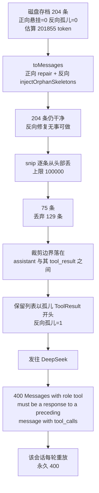

# snip-pairing-repair — 技术设计

## 1. 根因

### 1.1 两个配对不变式与各自唯一的修复点

| 方向 | 不变式 | 唯一修复点 | 执行时机 |
|------|--------|-----------|---------|
| 正向 | assistant 的每个 `tool_calls[].id` 必须在其后、下一条非 tool 消息之前有结果 | `ToolCallPairing.repair` | `SessionResumeLoader.toMessages` + `AgentLoop.toRequest`（**每请求**） |
| 反向 | 任何 `tool` 结果必须有前置的 `assistant.tool_calls` 含其 id | `SessionResumeLoader.injectOrphanSkeletons`（私有） | **仅** `SessionResumeLoader.toMessages` |

正向在请求路径上**每轮都会重跑**，所以内存历史被弄脏也能自愈；反向只在恢复路径跑一次，此后无人兜底。这条不对称就是缺陷的结构性原因。

### 1.2 污染链路（真实会话实测）



### 1.3 为什么是「组」而不是「条」

配对约束的作用域是 `assistant(tool_calls=[...])` 加上紧随其后的连续 `tool_result` 这一整块。裁剪以单条消息为单位时，边界可以落在这块内部。因此**裁剪的最小单位必须是这一整块**。

## 2. 方案

### D1 `snip` 裁剪点按配对组对齐

```java
int drop = 0;
while (drop < all.size() && estimate(all.subList(drop, all.size()), estimator) > maxTokens) {
    drop++;
}
// 组对齐：若保留列表会以孤儿 tool_result 开头，说明切在了
// assistant(tool_calls) 与其结果之间 —— 把该组剩下的结果一并丢弃。
while (drop < all.size() && all.get(drop) instanceof Message.ToolResult) {
    drop++;
}
if (drop == 0) return all;
```

正确性论证：

- 丢弃的永远是**前缀**，所以任何「assistant 被保留」的情形，其结果（位置在其后）也一定被保留 → 正向不变式不被破坏。
- 唯一可能被破坏的是**前缀的第一个位置**：若 `all.get(drop)` 是 `Message.ToolResult`，说明其父 assistant 位于 `drop-1`（已被丢弃）→ 孤儿。循环把它推到第一条非 `ToolResult` 的消息，前缀起点即为一个「组起点」→ 反向不变式不被破坏。
- 对齐只让 `drop` 单调不减 → 保留量只减不增 → token 上限仍然满足（不需要重跑 token 循环）。

**取向说明**：对齐选择**向后丢**（`drop` 增大）而非向前退（保留整组）。理由是 `snip` 的契约是「保证不超过上限」，向前退可能为了保住一个超大的 tool 结果而重新越界。

### D2 反向孤儿修复提取为纯函数并进入请求路径

把 `injectOrphanSkeletons` 从 `SessionResumeLoader` 私有方法搬到 `ToolCallPairing`，与 `repair` 并列，改为**纯函数**（返回新列表，不改入参），并把连续的孤儿结果合并进**一个**合成 assistant（还原「一次 assistant 的并行 `tool_calls`」语义，也避免每个结果插一条骨架把历史切碎）。

```java
public static List<Message> repairOrphanResults(List<Message> messages) {
    List<Message> out = new ArrayList<>(messages);
    for (int i = 0; i < out.size(); i++) {
        if (!(out.get(i) instanceof Message.ToolResult)) continue;
        // 收集从 i 开始、连续且缺前置 tool_calls 的 tool_result
        List<ToolCall> orphans = new ArrayList<>();
        int j = i;
        while (j < out.size() && out.get(j) instanceof Message.ToolResult tr) {
            if (hasMatchingCall(out, i, tr.toolCallId())) break; // 有前置的，属于前一组，停
            orphans.add(new ToolCall(tr.toolCallId(), ORPHAN_CALL_NAME, "{}"));
            j++;
        }
        if (orphans.isEmpty()) continue;
        out.add(i, new Message.Assistant("", List.copyOf(orphans)));
        i = j; // 跳过插入的骨架 + 这一组结果
    }
    return out;
}
```

`AgentLoop.toRequest` 的修复链改为「先正向、后反向」：

```java
List<Message> msgs = ToolCallPairing.repairOrphanResults(
        ToolCallPairing.repair(history.all()));
```

顺序理由：`repair` 只在「assistant 的结果块末尾」插入合成结果，插出来的结果天然有其前置 assistant，不会成为孤儿；反过来先做反向修复则会先插骨架，虽也正确但没有必要。两者都幂等。

**为什么不写回内存历史**：修复只作用于「将要发送的列表」，与 `repair` 现有语义一致（现有代码也没有写回）。好处是内存历史保持「存档的原样」，幂等性容易论证；且避免在请求组装路径上对共享可变状态加写操作。

### D3 幂等性

| 函数 | 幂等论证 |
|------|---------|
| `repair` | 补的结果立刻被下一轮扫描视为「已答复」（`i = at - 1` 跳过），二次调用注入 0 条 |
| `repairOrphanResults` | 合成 assistant 携带该结果的 id，二次调用 `hasMatchingCall` 命中 → 不注入 |
| `repair ∘ repairOrphanResults` | 两个方向互不制造对方的问题：正向补的结果必有父 assistant；反向补的骨架恰好满足其结果 |

## 3. 接口签名变化

| 类/方法 | 改前 | 改后 |
|---|---|---|
| `ToolCallPairing.repairOrphanResults` | 不存在 | 新增 `public static List<Message> repairOrphanResults(List<Message>)`（纯函数） |
| `SessionResumeLoader.injectOrphanSkeletons` | `private static void`（原地改） | 删除，改调 `ToolCallPairing.repairOrphanResults` |
| `SessionResumeLoader.snip` | 逐条裁剪 | 裁剪点按配对组对齐（签名不变） |
| `AgentLoop.toRequest` | 仅 `repair` | `repair` + `repairOrphanResults` |

`snip` 与 `toMessages` 签名不变 → CLI / web 两个调用点无需改动。

## 4. 风险

| 风险 | 处置 |
|------|------|
| 组对齐后保留的消息变少，可能丢更多上下文 | 只在「边界恰好在组内」时多丢该组剩余结果（通常 1-2 条），且这些结果本就失去了父 assistant、对模型无意义 |
| 每请求多跑一次反向扫描 | `repairOrphanResults` 是 O(n) 且 n 为消息条数（≤ 数百），相对一次 LLM 调用可忽略 |
| 合并连续孤儿结果改变了既有行为 | 现有测试 `injectsOrphanSkeletonForOrphanToolResult` 只有单个孤儿，不受影响；新增测试覆盖多孤儿合并 |
| 合成骨架让模型看到「凭空出现的工具调用」 | 骨架名 `resumed_tool`、参数 `{}`，与既有实现一致；这是恢复协议合法性的最小代价，且正常情况下不应触发（源头已被 D1 修掉） |

## 5. 测试策略

| 层次 | 用例 |
|------|------|
| `snip` 纯函数 | 边界落在 assistant ↔ tool_result 组中间 → 对齐后无孤儿；未超限不裁剪；对齐后仍 ≤ 上限；头部 `[RESUMED]` 提示 |
| `ToolCallPairing.repairOrphanResults` | 单孤儿注入；连续多孤儿合并为一个骨架；有前置的不动；幂等；已干净历史逐元素不变 |
| `SessionResumeLoader` | 恢复路径仍注入骨架（既有用例回归）；`snip` 后列表反向孤儿数为 0 |
| `AgentLoop.toRequest` | 内存历史同时含悬挂 `tool_calls` 与孤儿 `tool_result` → 请求列表双向配对都满足；连续两次请求长度一致；内存历史条数不变 |

判定「是否满足配对」复用 `ToolCallPairing.danglingCallIds`（正向）与一个新增的反向扫描断言（测试侧实现，不引入生产代码）。

**夹具来源**：不使用用户真实会话文件；按探针观察到的形状（`assistant(tool_calls=[c1,c2])` + 两条结果，裁剪点落在两者之间）构造等价序列。
